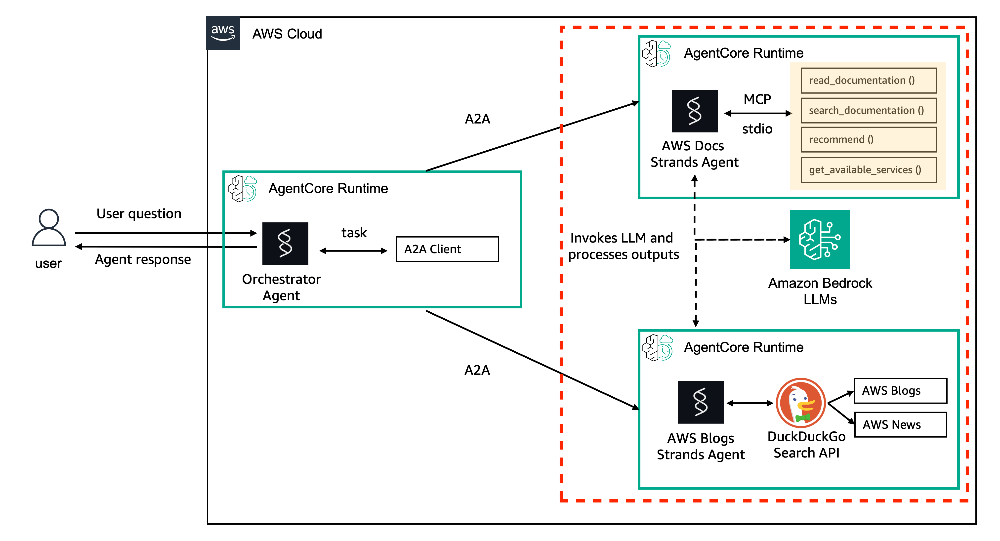

# Hosting Agents with A2A Protocol

## Overview

The [Agent-to-Agent (A2A)](https://github.com/google/A2A) protocol enables agents to discover and communicate with each other through standardized agent cards and task-based orchestration. AgentCore runtime supports A2A natively — set `serverProtocol` to `A2A` when creating your runtime.

## Architecture



An orchestrator agent (running in its own AgentCore runtime) routes user questions via A2A tasks to specialist worker agents. Each worker publishes an agent card at `/.well-known/agent.json` describing its capabilities. The orchestrator discovers workers through their agent cards and delegates subtasks, collecting results to produce a final answer.

## How A2A Works on AgentCore runtime

```
┌──────────────┐    A2A task     ┌──────────────────────┐
│ Orchestrator │ ───────────────▶│  AgentCore runtime   │
│   Agent      │◀─────────────── │  (A2A protocol)      │
│              │   task result   │  ┌────────────────┐   │
└──────────────┘                 │  │  Worker Agent   │   │
                                 │  └────────────────┘   │
                                 └──────────────────────┘
```

1. **Agent Card** — each A2A agent publishes a JSON card at `/.well-known/agent.json` describing its capabilities
2. **Task Submission** — clients send tasks via `POST /invocations` using JSON-RPC format
3. **Task Execution** — the agent processes the task and returns results
4. **Multi-Agent** — an orchestrator agent can discover and delegate to sub-agents

## What Changes vs HTTP Protocol

The deployment is almost identical to HTTP. Two things change:

### 1. Protocol configuration

```python
# HTTP agent:
protocolConfiguration={"serverProtocol": "HTTP"}

# A2A agent:
protocolConfiguration={"serverProtocol": "A2A"}
```

That's the only change in the `create_agent_runtime` call.

### 2. Agent code — needs an agent card and A2A message format

A2A agents need to serve an agent card and handle A2A task format. Since `BedrockAgentCoreApp` doesn't handle A2A natively, we use FastAPI:

```python
from fastapi import FastAPI

app = FastAPI()

# Agent card — describes capabilities for discovery
AGENT_CARD = {
    "name": "Documentation Assistant",
    "description": "Searches and summarizes technical docs",
    "version": "1.0.0",
    "capabilities": {"streaming": False},
    "skills": [{"id": "doc-search", "name": "Documentation Search"}],
}

@app.get("/.well-known/agent.json")
async def agent_card():
    """A2A discovery endpoint."""
    return AGENT_CARD

@app.post("/invocations")
async def invocations(request: Request):
    """Handle A2A task requests."""
    body = await request.json()

    # Extract user message from A2A format
    parts = body["params"]["message"]["parts"]
    prompt = next(p["text"] for p in parts if p["type"] == "text")

    # Run your agent
    result = agent(prompt)

    # Return in A2A task result format
    return {
        "result": {
            "status": "completed",
            "parts": [{"type": "text", "text": result}],
        }
    }

@app.get("/ping")
async def ping():
    return {"status": "ok"}
```

### Invoking an A2A agent

The client sends A2A JSON-RPC messages through `invoke_agent_runtime`. The payload is passed through directly:

```python
import uuid

a2a_payload = {
    "jsonrpc": "2.0",
    "method": "tasks/send",
    "id": str(uuid.uuid4()),
    "params": {
        "id": str(uuid.uuid4()),
        "message": {
            "role": "user",
            "parts": [{"type": "text", "text": "How do I set up S3 versioning?"}],
        },
    },
}

response = client.invoke_agent_runtime(
    agentRuntimeArn=arn,
    payload=json.dumps(a2a_payload).encode(),
)
```

## Key Differences from HTTP Protocol

| Aspect | HTTP | A2A |
|:-------|:-----|:----|
| `protocolConfiguration` | `serverProtocol: 'HTTP'` | `serverProtocol: 'A2A'` |
| Discovery | None | Agent card at `/.well-known/agent.json` |
| Request format | Free-form JSON | A2A JSON-RPC (`tasks/send`) |
| Response format | Free-form JSON | A2A task result with `parts` |
| Multi-agent | Manual via tool calls | Built-in task-based orchestration |

## Authentication

A2A agents support two authentication modes:

- **IAM / SigV4** (default) — standard AWS authentication
- **JWT / Cognito** — add `authorizerConfiguration` with `customJWTAuthorizer` when creating the runtime

## Files

| File | Description |
|:-----|:------------|
| `agent.py` | FastAPI app with agent card, A2A task handling, and Strands agent |
| `requirements.txt` | Adds `fastapi`, `uvicorn` to dependencies |
| `deploy.py` | Same as HTTP but with `serverProtocol='A2A'` |
| `invoke.py` | Sends A2A JSON-RPC tasks via `invoke_agent_runtime` |
| `cleanup.py` | Same cleanup pattern |

## Quick Start

```bash
python deploy.py     # Deploy with A2A protocol
python invoke.py     # Send A2A tasks
python cleanup.py    # Clean up
```
