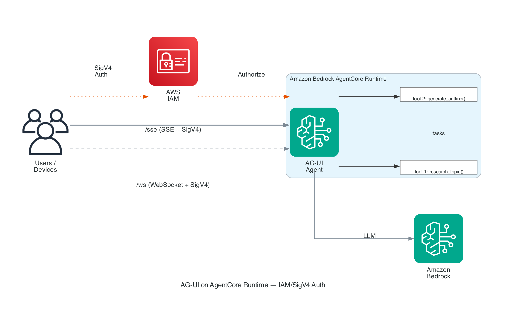
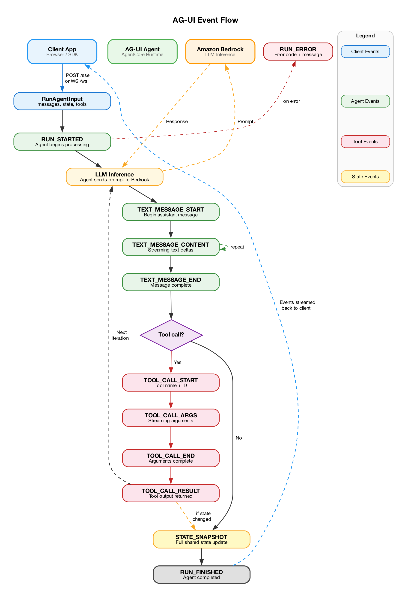
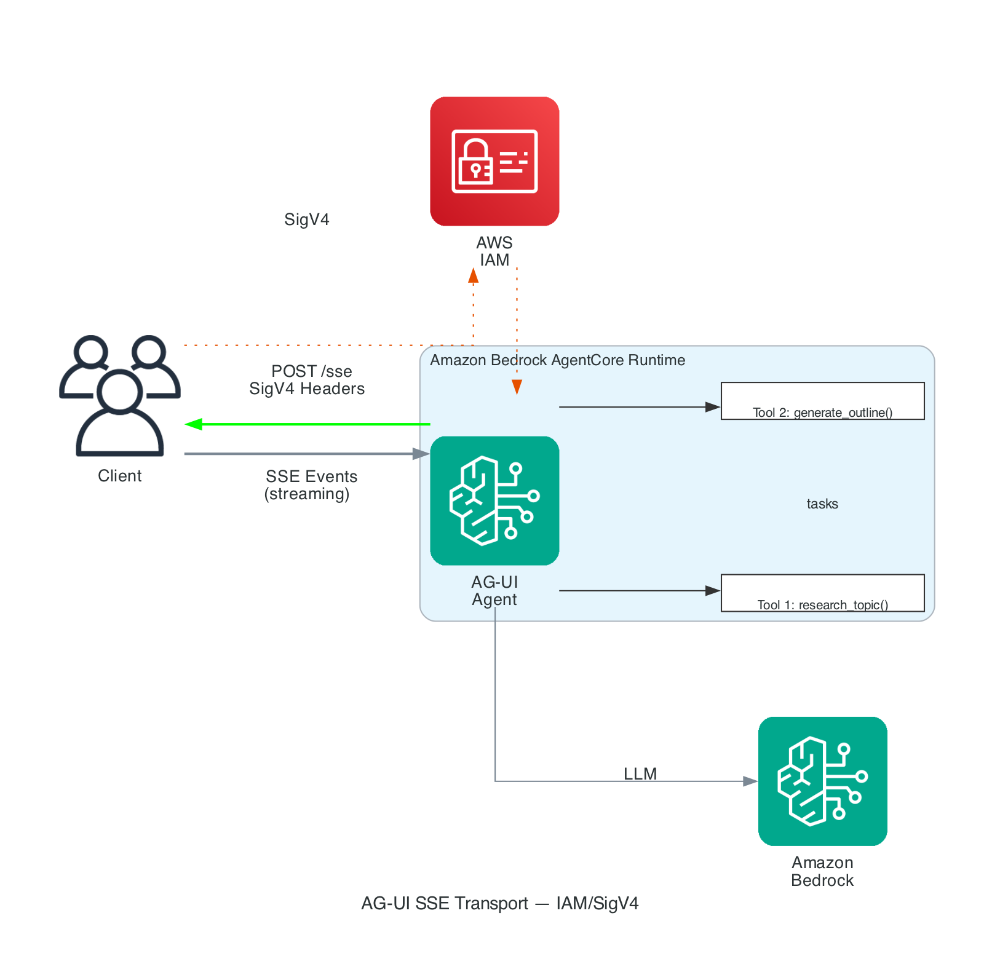
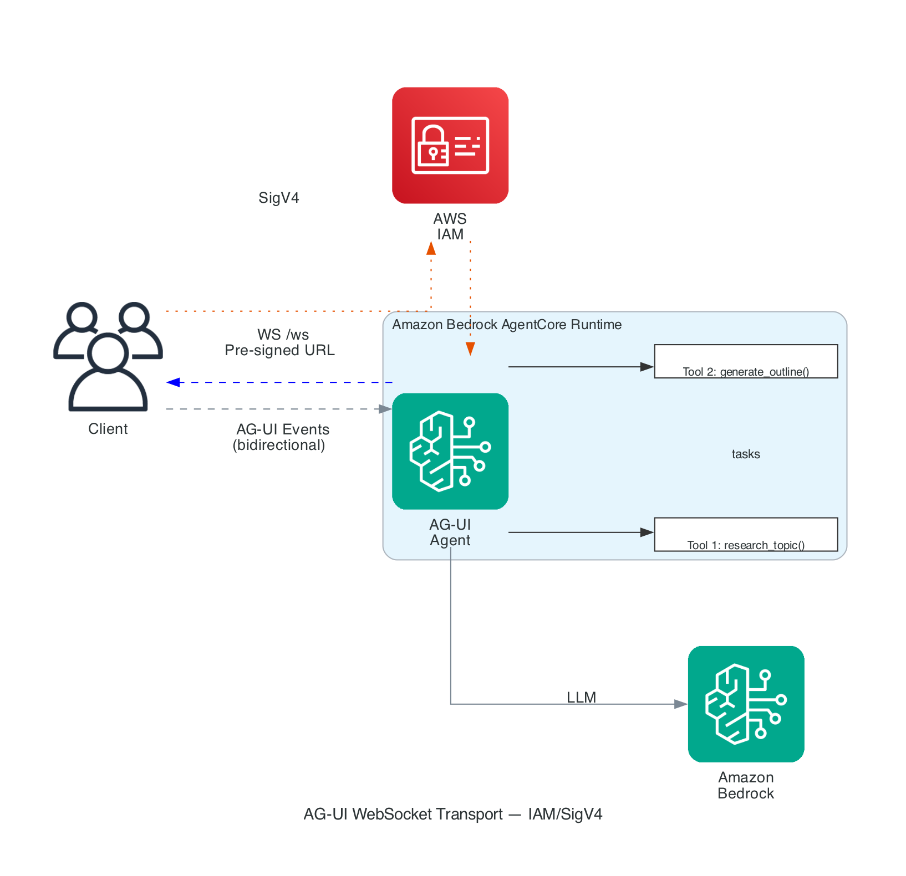

# Hosting Agents with AG-UI Protocol

## Overview

[AG-UI (Agent-User Interface)](https://docs.ag-ui.com) is an open, event-based protocol for connecting AI agents to user-facing applications. Unlike request-response protocols, AG-UI streams events as the agent works — tool invocations, state changes, and text generation arrive incrementally so users can watch progress in real time.

AgentCore runtime supports AG-UI natively with both **SSE** and **WebSocket** transports.

## Architecture



## Event Flow



## How AG-UI Differs from HTTP and A2A

| Protocol | Pattern | Best For |
|:---------|:--------|:---------|
| HTTP | Request → Response | Backend services, APIs |
| A2A | Task → Result | Agent-to-agent orchestration |
| **AG-UI** | Request → Event Stream | Interactive user interfaces |

## AG-UI Event Types

During execution, the agent emits a stream of typed events:

| Event | Purpose | Example |
|:------|:--------|:--------|
| `RUN_STARTED` | Agent begins processing | `{"type": "RUN_STARTED", "runId": "..."}` |
| `TEXT_MESSAGE_START` | Begin assistant message | `{"type": "TEXT_MESSAGE_START", "messageId": "..."}` |
| `TEXT_MESSAGE_CONTENT` | Streaming text delta | `{"type": "TEXT_MESSAGE_CONTENT", "delta": "Here is"}` |
| `TEXT_MESSAGE_END` | Message complete | `{"type": "TEXT_MESSAGE_END"}` |
| `TOOL_CALL_START` | Tool invoked | `{"type": "TOOL_CALL_START", "toolCallName": "research"}` |
| `TOOL_CALL_ARGS` | Tool arguments (streaming) | `{"type": "TOOL_CALL_ARGS", "delta": "{\"query\":"}` |
| `TOOL_CALL_END` | Arguments complete | `{"type": "TOOL_CALL_END"}` |
| `TOOL_CALL_RESULT` | Tool output | `{"type": "TOOL_CALL_RESULT", "result": "..."}` |
| `STATE_SNAPSHOT` | Full shared state update | `{"type": "STATE_SNAPSHOT", "snapshot": {...}}` |
| `RUN_FINISHED` | Agent completed | `{"type": "RUN_FINISHED"}` |

## What Changes vs HTTP Protocol

### 1. Protocol configuration

```python
# HTTP:
protocolConfiguration={"serverProtocol": "HTTP"}

# AG-UI:
protocolConfiguration={"serverProtocol": "AGUI"}
```

### 2. Agent code — needs FastAPI with SSE/WebSocket

AG-UI requires streaming events, so we use FastAPI instead of `BedrockAgentCoreApp`:

```python
from fastapi import FastAPI
from fastapi.responses import StreamingResponse
from ag_ui.core import RunAgentInput
from ag_ui.encoder import EventEncoder

app = FastAPI()

@app.post("/invocations")
async def invocations(input_data: dict, request: Request):
    """SSE transport — streams AG-UI events."""
    encoder = EventEncoder(accept=request.headers.get("accept"))

    async def event_generator():
        run_input = RunAgentInput(**input_data)
        async for event in agent.run(run_input):
            yield encoder.encode(event)

    return StreamingResponse(event_generator(), media_type=encoder.get_content_type())

@app.websocket("/ws")
async def websocket_endpoint(websocket: WebSocket):
    """WebSocket transport — bidirectional AG-UI events."""
    await websocket.accept()
    while True:
        data = await websocket.receive_json()
        async for event in agent.run(RunAgentInput(**data)):
            await websocket.send_json(event.model_dump())
```

The `ag-ui-strands` package provides `StrandsAgent` which wraps a Strands agent to emit AG-UI events automatically.

### 3. Invocation — read SSE stream

```python
response = client.invoke_agent_runtime(
    agentRuntimeArn=arn,
    payload=json.dumps(agui_payload).encode(),
    accept="text/event-stream",  # ← request SSE
)

for line in response["response"].iter_lines():
    decoded = line.decode("utf-8")
    if decoded.startswith("data:"):
        event = json.loads(decoded[5:])
        print(f"[{event['type']}]", end=" ")
        if event["type"] == "TEXT_MESSAGE_CONTENT":
            print(event["delta"], end="")
```

## Transports

### SSE (Server-Sent Events)



- Endpoint: `POST /invocations`
- One-directional: client sends request, server streams events
- Primary transport for most use cases

### WebSocket



- Endpoint: `GET /ws` (upgrade to WebSocket)
- Bidirectional: full-duplex streaming
- Useful for long-running sessions and real-time collaboration

Both transports stream the same AG-UI events.

## Authentication

AG-UI agents support both IAM/SigV4 and JWT/Cognito authentication. To add Cognito JWT auth:

```python
control.create_agent_runtime(
    # ... other params ...
    protocolConfiguration={"serverProtocol": "AGUI"},
    authorizerConfiguration={
        "customJWTAuthorizer": {
            "discoveryUrl": "https://cognito-idp.REGION.amazonaws.com/POOL_ID/.well-known/openid-configuration",
            "allowedClients": ["CLIENT_ID"],
        }
    },
)
```

## Files

| File | Description |
|:-----|:------------|
| `agent.py` | Document co-authoring agent with AG-UI events (FastAPI + Strands + ag-ui-strands) |
| `requirements.txt` | Adds `fastapi`, `uvicorn`, `ag-ui-core`, `ag-ui-encoder`, `ag-ui-strands` |
| `deploy.py` | Same deployment pattern with `serverProtocol='AGUI'` |
| `invoke.py` | Sends AG-UI request and displays streamed events |
| `cleanup.py` | Same cleanup pattern |

## Quick Start

```bash
python deploy.py     # Deploy with AGUI protocol
python invoke.py     # Send a request and stream AG-UI events
python cleanup.py    # Clean up
```
