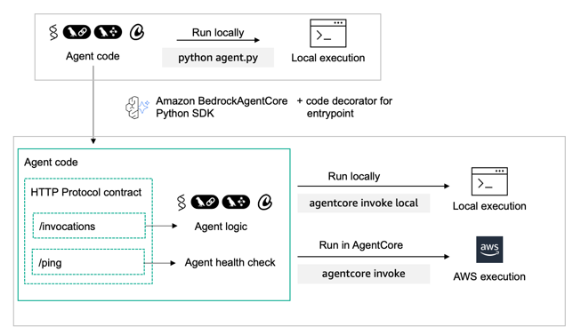

# Hosting Agents on AgentCore runtime

## Overview

AgentCore runtime hosts your agents as HTTP services running in isolated microVMs. You write your agent logic, zip it with a `requirements.txt`, and deploy using boto3 — the runtime handles scaling, session isolation, dependency installation, and infrastructure.

AgentCore runtime is **framework and model agnostic**. This section demonstrates hosting agents across:

- **Multiple frameworks** — Strands Agents, LangGraph, CrewAI
- **Multiple models** — Amazon Bedrock (Claude), OpenAI (GPT-4)
- **Multiple protocols** — HTTP, A2A (Agent-to-Agent), AG-UI (Agent-User Interface)

## How Agent Hosting Works

### The `bedrock-agentcore` SDK



The SDK wraps your agent function into a standardized HTTP service:

```python
from bedrock_agentcore.runtime import BedrockAgentCoreApp

app = BedrockAgentCoreApp()

@app.entrypoint
def my_agent(payload: dict) -> str:
    # payload is the JSON body from the client
    return "response"

if __name__ == "__main__":
    app.run()  # Starts HTTP server on port 8080
```

This creates two endpoints automatically:
- **`POST /invocations`** — routes to your `@app.entrypoint` function
- **`GET /ping`** — returns 200 (health check, handled by the SDK)

### The Deployment Flow

Every example follows the same 5-step flow using two boto3 clients:

```
┌─────────────────────────────────────────────────────────────────────┐
│  Control Plane (bedrock-agentcore-control)                          │
│                                                                     │
│  1. create_agent_runtime()     → registers your code with AgentCore │
│  2. get_agent_runtime()        → poll until status = READY          │
│  3. create_agent_runtime_endpoint() → creates a traffic endpoint    │
│  4. list_agent_runtime_endpoints()  → poll until status = READY     │
└─────────────────────────────────────────────────────────────────────┘

┌─────────────────────────────────────────────────────────────────────┐
│  Data Plane (bedrock-agentcore)                                     │
│                                                                     │
│  5. invoke_agent_runtime()     → sends requests to your agent       │
└─────────────────────────────────────────────────────────────────────┘
```

### What `create_agent_runtime` Needs

| Parameter | What It Does |
|:----------|:-------------|
| `agentRuntimeName` | Unique name for your runtime |
| `agentRuntimeArtifact` | Your code — either `codeConfiguration` (zip on S3) or `containerConfiguration` (Docker on ECR) |
| `roleArn` | IAM role that AgentCore assumes — needs model access + logging permissions |
| `networkConfiguration` | `PUBLIC` (accessible via AWS APIs) or `VPC` (private subnets) |
| `protocolConfiguration` | Which protocol: `HTTP`, `MCP`, `A2A`, or `AGUI` |
| `environmentVariables` | Key-value pairs set in the runtime environment (e.g., API keys) |
| `lifecycleConfiguration` | Session timeouts — `idleRuntimeSessionTimeout` (default 900s), `maxLifetime` (default 28800s) |

## Tutorials

### By Protocol

| Protocol | Tutorial | What You'll Learn |
|:---------|:---------|:------------------|
| HTTP | [01-http-protocol/](01-http-protocol/) | Standard request/response — **start here** |
| A2A | [02-a2a-protocol/](02-a2a-protocol/) | Agent cards, task-based communication, multi-agent orchestration |
| AG-UI | [03-ag-ui-protocol/](03-ag-ui-protocol/) | Real-time event streaming to UIs (SSE + WebSocket) |

### By Framework (HTTP Protocol)

| Framework | Model | Tutorial | Focus |
|:----------|:------|:---------|:------|
| Strands Agents | Amazon Bedrock | [01-strands-bedrock/](01-http-protocol/01-strands-bedrock/) | Full API walkthrough — every parameter explained |
| LangGraph | Amazon Bedrock | [02-langgraph-bedrock/](01-http-protocol/02-langgraph-bedrock/) | Framework agnosticism — same deploy, different agent |
| Strands Agents | OpenAI | [03-strands-openai/](01-http-protocol/03-strands-openai/) | External models — environment variables, IAM differences |

## Protocol Comparison

| Aspect | HTTP | A2A | AG-UI |
|:-------|:-----|:----|:------|
| `serverProtocol` | `HTTP` | `A2A` | `AGUI` |
| Agent listens on | Port 8080 | Port 8080 | Port 8080 |
| Request format | Free-form JSON | A2A JSON-RPC | AG-UI RunAgentInput |
| Response format | JSON or SSE | A2A task result | AG-UI event stream |
| Discovery | None | Agent card at `/.well-known/agent.json` | None |
| Best for | Backend services | Agent-to-agent | Interactive UIs |
| SDK helper | `BedrockAgentCoreApp` | FastAPI (custom) | FastAPI + `ag-ui-strands` |
