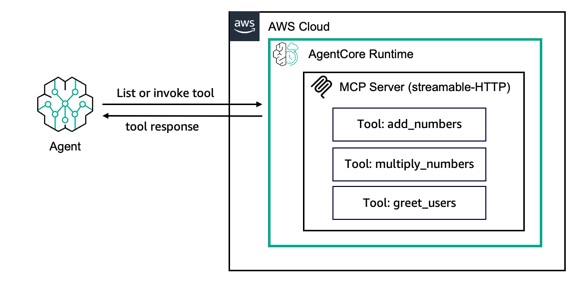

# MCP Server Basics

## Overview

Create and deploy a basic MCP server with tools to AgentCore runtime. Once deployed, any MCP-compatible client (Claude Desktop, Cursor, Kiro, or your own agent) can discover and call your tools.



```
┌─────────────┐   MCP RPC (JSON-RPC)   ┌──────────────────────────┐
│  MCP Client  │ ──────────────────────▶│  AgentCore runtime       │
│  (any MCP    │◀────────────────────── │  (MCP protocol)          │
│   client)    │   tool results         │  ┌──────────────────┐    │
└─────────────┘                         │  │  MCP Server      │    │
                                        │  │  (FastMCP)       │    │
                                        │  └──────────────────┘    │
                                        └──────────────────────────┘
```

## Step 1: Write the MCP Server (`mcp_server.py`)

Use the `mcp` Python SDK's `FastMCP` class to define tools. The `bedrock-agentcore` SDK wraps it for AgentCore runtime:

```python
from bedrock_agentcore.runtime import BedrockAgentCoreApp
from mcp.server.fastmcp import FastMCP

# Create the MCP server
mcp = FastMCP("basic-tools")

@mcp.tool()
def add_numbers(a: float, b: float) -> float:
    """Add two numbers together."""
    return a + b

@mcp.tool()
def greet(name: str, language: str = "english") -> str:
    """Generate a greeting message."""
    greetings = {"english": f"Hello, {name}!", "spanish": f"¡Hola, {name}!"}
    return greetings.get(language, f"Hello, {name}!")

# Wrap with AgentCore SDK
app = BedrockAgentCoreApp()
app.mcp_app = mcp  # ← assign the MCP server to the app

if __name__ == "__main__":
    app.run()
```

Key differences from hosting an agent:
- Use `app.mcp_app = mcp` instead of `@app.entrypoint`
- The MCP server listens on port **8000** at path `/mcp` (not port 8080)
- Communication uses **JSON-RPC** (MCP protocol), not free-form JSON

## Step 2: Deploy with MCP Protocol

The deployment is the same as agents, with one key difference — `serverProtocol` is `MCP`:

```python
control.create_agent_runtime(
    agentRuntimeName="basic-mcp-server",
    agentRuntimeArtifact={
        "codeConfiguration": {
            "code": {"s3": {"bucket": bucket, "prefix": "basic-mcp-server/code.zip"}},
            "runtime": "PYTHON_3_12",
            "entryPoint": ["mcp_server.py"],  # ← your MCP server file
        }
    },
    roleArn=role_arn,
    networkConfiguration={"networkMode": "PUBLIC"},
    protocolConfiguration={"serverProtocol": "MCP"},  # ← MCP protocol
)
```

> **IAM note**: MCP tool servers typically don't call Bedrock models, so the IAM role only needs CloudWatch logging permissions. If your tools call AWS services (DynamoDB, S3, etc.), add those permissions too.

## Step 3: Invoke with MCP JSON-RPC Messages

MCP uses [JSON-RPC 2.0](https://www.jsonrpc.org/specification). The `invoke_agent_runtime` payload is passed through directly to your MCP server. Here's the typical flow:

### Initialize the session

```python
client = boto3.client("bedrock-agentcore")

# Every MCP session starts with an initialize handshake
init_msg = {
    "jsonrpc": "2.0",
    "method": "initialize",
    "id": 1,
    "params": {
        "protocolVersion": "2025-06-18",
        "capabilities": {},
        "clientInfo": {"name": "my-client", "version": "1.0"},
    },
}

response = client.invoke_agent_runtime(
    agentRuntimeArn=arn,
    payload=json.dumps(init_msg).encode(),
    contentType="application/json",
    accept="application/json",
)
# Returns server info and capabilities
```

### List available tools

```python
list_msg = {"jsonrpc": "2.0", "method": "tools/list", "id": 2, "params": {}}

response = client.invoke_agent_runtime(
    agentRuntimeArn=arn,
    payload=json.dumps(list_msg).encode(),
)
# Returns: {"result": {"tools": [{"name": "add_numbers", "description": "...", "inputSchema": {...}}, ...]}}
```

### Call a tool

```python
call_msg = {
    "jsonrpc": "2.0",
    "method": "tools/call",
    "id": 3,
    "params": {
        "name": "add_numbers",
        "arguments": {"a": 5, "b": 3},
    },
}

response = client.invoke_agent_runtime(
    agentRuntimeArn=arn,
    payload=json.dumps(call_msg).encode(),
)
# Returns: {"result": {"content": [{"type": "text", "text": "8.0"}]}}
```

### MCP Methods Reference

| Method | Purpose | Params |
|:-------|:--------|:-------|
| `initialize` | Start session, exchange capabilities | `protocolVersion`, `capabilities`, `clientInfo` |
| `tools/list` | Discover available tools | (none) |
| `tools/call` | Execute a tool | `name`, `arguments` |
| `resources/list` | List available resources | (none) |
| `resources/read` | Read a resource | `uri` |
| `prompts/list` | List available prompts | (none) |
| `prompts/get` | Get a prompt template | `name`, `arguments` |

## Files

| File | Description |
|:-----|:------------|
| `mcp_server.py` | MCP server with `add_numbers`, `multiply_numbers`, and `greet` tools |
| `requirements.txt` | `mcp`, `boto3`, `bedrock-agentcore` |
| `deploy.py` | Zips code, uploads to S3, creates runtime with `serverProtocol='MCP'` |
| `invoke.py` | Sends MCP JSON-RPC messages (`initialize`, `tools/list`, `tools/call`) |
| `cleanup.py` | Deletes runtime, endpoint, S3 artifact, IAM role |

## Quick Start

```bash
pip install -r requirements.txt

# Test locally
python mcp_server.py
curl -X POST http://localhost:8000/mcp \
  -H "Content-Type: application/json" \
  -d '{"jsonrpc": "2.0", "method": "tools/list", "id": 1}'

# Deploy and invoke
python deploy.py
python invoke.py
python cleanup.py
```
