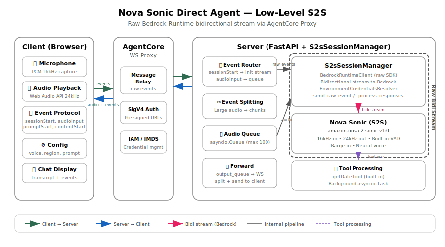

# Nova Sonic Direct Agent (Low-Level S2S)

A bidirectional voice agent using the **Nova Sonic S2S API directly** via the AWS Bedrock runtime SDK. Unlike the Strands agent (which uses the `BidiAgent` abstraction) or the LangChain agent (sandwich pipeline), this agent manages the raw bidirectional stream, event protocol, and session lifecycle manually.

## Deploy to AgentCore

```bash
# Navigate to the bidirectional streaming tutorial root
cd 06-workshops/01-AgentCore-runtime/06-bi-directional-streaming

# Create and activate a virtual environment
python3 -m venv .venv
source .venv/bin/activate        # macOS/Linux
# .venv\Scripts\activate         # Windows

# Install deployment dependencies
pip install -r utils/requirements.txt

# Set your AWS account ID
export ACCOUNT_ID=123456789012

# Set AWS credentials (Option A: environment variables)
export AWS_ACCESS_KEY_ID=your-access-key
export AWS_SECRET_ACCESS_KEY=your-secret-key
export AWS_REGION=us-east-1

# Set AWS credentials (Option B: named profile)
export AWS_PROFILE=your-profile
export AWS_REGION=us-east-1

# Deploy
python utils/deploy.py 01-bedrock-sonic-ws

# Start the web client
./utils/start_client.sh 01-bedrock-sonic-ws
```

### Try It Out

- Speak naturally — the agent responds in real time
- Interrupt the agent mid-response (barge-in)
- Use text input for testing
- Ask "What's the date today?" to test tool integration

### Cleanup

```bash
python ./utils/cleanup.py 01-bedrock-sonic-ws
```

## Local Testing

No external dependencies beyond AWS credentials — the Sonic agent talks directly to Bedrock with no MCP Gateways.

```bash
# 1. Install server dependencies
pip install -r 01-bedrock-sonic-ws/websocket/requirements.txt

# 2. Set AWS credentials
export AWS_ACCESS_KEY_ID=your-access-key
export AWS_SECRET_ACCESS_KEY=your-secret-key
export AWS_REGION=us-east-1

# 3. Start the server (port 8080)
cd 01-bedrock-sonic-ws/websocket
python server.py

# 4. In another terminal, start the client (port 8000, opens browser)
cd 01-bedrock-sonic-ws/client
pip install -r requirements.txt
python client.py --ws-url ws://localhost:8080/ws
```

The client serves `sonic-client.html` on `http://localhost:8000` and connects to the local WebSocket server directly (no SigV4 signing needed).

## Architecture



The client sends Nova Sonic protocol events (sessionStart, promptStart, audioInput, etc.) directly over WebSocket. The server acts as a thin relay — it opens a bidirectional stream to Bedrock, forwards client events in, and forwards Bedrock responses out. There is no agent framework involved.

## Key Components

| File | Purpose |
|------|---------|
| `websocket/server.py` | FastAPI server, IMDS credentials, WebSocket endpoint, large event splitting, response forwarding |
| `websocket/s2s_session_manager.py` | Manages the raw bidirectional stream to Bedrock — sends events, processes responses, handles tool use |
| `websocket/s2s_events.py` | Event factory for the Nova Sonic protocol (sessionStart, promptStart, audioInput, toolResult, etc.) |
| `client/client.py` | HTTP server that serves the HTML client with optional SigV4 presigned URL generation |
| `client/sonic-client.html` | Browser-based voice client that speaks the Nova Sonic event protocol directly |

## How It Works

### Session Lifecycle

1. Client connects via WebSocket and sends a `sessionStart` event
2. Server creates an `S2sSessionManager` which opens a bidirectional stream to `amazon.nova-2-sonic-v1:0` via `BedrockRuntimeClient`
3. Client sends the full event sequence: `promptStart` → `contentStart` (system prompt) → `textInput` → `contentEnd` → `contentStart` (audio) → streaming `audioInput` chunks
4. Server forwards all events to Bedrock and relays responses back to the client
5. Client sends `sessionEnd` to close the session

### Audio Processing

- Input: 16kHz PCM, 16-bit, mono (client captures and downsamples from browser's native rate)
- Output: 24kHz PCM, 16-bit, mono (Nova Sonic's neural voice output)
- Audio input is queued (`asyncio.Queue`, max 100 chunks) to handle backpressure — chunks are dropped if the queue fills
- Large audio output events (>10KB) are split into smaller chunks at base64 boundaries before forwarding to the client

### Tool Use

The agent includes a simple `getDateTool` that returns the current UTC date/time. Tool processing flow:

1. Bedrock sends a `toolUse` event with the tool name and ID
2. `S2sSessionManager` processes the tool in a background `asyncio.Task` (non-blocking)
3. The result is sent back as `contentStart` (TOOL) → `toolResult` → `contentEnd`
4. Tool events are also forwarded to the client for display

### Large Event Splitting

The `split_large_event` function in `server.py` handles oversized Bedrock responses:

- Events >10KB are split by dividing the `content` field into chunks
- Audio events (`audioOutput`) are aligned to 4-character base64 boundaries to avoid decoding corruption
- Each chunk preserves the original event structure with only the content field changed

## Nova Sonic Event Protocol

This agent speaks the raw Nova Sonic bidirectional streaming protocol. Events are JSON objects with an `event` wrapper.

### Client → Bedrock (via server relay)

| Event | Purpose |
|-------|---------|
| `sessionStart` | Initialize session with inference config (maxTokens, temperature, topP) |
| `promptStart` | Begin a prompt with audio/text output config and tool definitions |
| `contentStart` | Start a content block (TEXT for system prompt, AUDIO for user speech) |
| `textInput` | System prompt text content |
| `audioInput` | Base64-encoded PCM audio chunk from the microphone |
| `contentEnd` | End a content block |
| `promptEnd` | End the prompt |
| `sessionEnd` | Close the session |

### Bedrock → Client (via server relay)

| Event | Purpose |
|-------|---------|
| `audioOutput` | Base64-encoded PCM audio response from Nova Sonic |
| `textOutput` | Text transcript of the agent's speech |
| `toolUse` | Tool invocation request with tool name, ID, and parameters |
| `contentStart` / `contentEnd` | Content block boundaries with type and role metadata |

## Credential Management

The server supports two modes:

- **Local mode**: Uses `AWS_ACCESS_KEY_ID` and `AWS_SECRET_ACCESS_KEY` from environment variables
- **EC2 mode**: Fetches credentials from IMDS (IMDSv2 preferred, falls back to IMDSv1) with automatic background refresh before expiration

The `S2sSessionManager` uses `EnvironmentCredentialsResolver` from the AWS SDK, which reads credentials from environment variables that the server keeps up to date.
