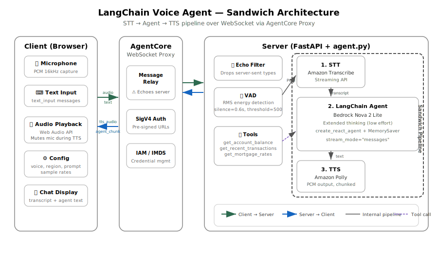

# LangChain Voice Agent (Sandwich Architecture)

A bidirectional voice agent using the "sandwich" pattern: **STT → Agent → TTS**. Built with LangChain + Bedrock Nova 2 Lite, deployed on Amazon Bedrock AgentCore.

## Deploy to AgentCore

```bash
# Navigate to the bidirectional streaming tutorial root
cd 06-workshops/01-AgentCore-runtime/06-bi-directional-streaming

# Create and activate a virtual environment
python3 -m venv .venv
source .venv/bin/activate        # macOS/Linux
# .venv\Scripts\activate         # Windows

# Install deployment dependencies
pip install -r utils/requirements.txt

# Set your AWS account ID
export ACCOUNT_ID=123456789012

# Set AWS credentials (Option A: environment variables)
export AWS_ACCESS_KEY_ID=your-access-key
export AWS_SECRET_ACCESS_KEY=your-secret-key
export AWS_REGION=us-east-1

# Set AWS credentials (Option B: named profile)
export AWS_PROFILE=your-profile
export AWS_REGION=us-east-1

# Deploy
python utils/deploy.py 03-langchain-transcribe-polly-ws

# Start the web client
./utils/start_client.sh 03-langchain-transcribe-polly-ws
```

### Cleanup

```bash
python utils/cleanup.py 03-langchain-transcribe-polly-ws
```

## Local Testing

The LangChain agent requires MCP Gateways for tool access (same as the Strands agent). To run locally, you need deployed gateways and AWS credentials.

```bash
# 1. Install server dependencies
pip install -r 03-langchain-transcribe-polly-ws/websocket/requirements.txt

# 2. Set AWS credentials
export AWS_ACCESS_KEY_ID=your-access-key
export AWS_SECRET_ACCESS_KEY=your-secret-key
export AWS_REGION=us-east-1

# 3. Set MCP gateway config (from a prior `python utils/deploy.py 03-langchain-transcribe-polly-ws` run)
export MCP_GATEWAY_ARNS='["arn:aws:bedrock-agentcore:us-east-1:123456789012:gateway/gw-1", ...]'
export MCP_GATEWAY_URLS='["https://gateway-1.endpoint.example.com", ...]'

# 4. Start the server (port 8080)
cd 03-langchain-transcribe-polly-ws/websocket
python server.py

# 5. In another terminal, start the client (port 8000, opens browser)
cd 03-langchain-transcribe-polly-ws/client
pip install -r requirements.txt
python client.py --ws-url ws://localhost:8080/ws
```

The client serves `langchain-client.html` on `http://localhost:8000` and connects to the local WebSocket server directly (no SigV4 signing needed).

## Architecture



Unlike the Strands agent which uses Nova Sonic's native bidirectional audio model, this agent implements voice as a pipeline around a text-based LLM. The client sends audio/text over WebSocket through AgentCore's proxy to the server, which runs the sandwich pipeline: Amazon Transcribe (STT) → LangChain Agent (Bedrock Nova 2 Lite) → Amazon Polly (TTS).

## Key Components

| File | Purpose |
|------|---------|
| `websocket/server.py` | FastAPI server, IMDS credentials, WebSocket endpoint |
| `websocket/agent.py` | Session handler, LangChain agent, STT/TTS pipeline, VAD |
| `client/client.py` | HTTP server that serves the HTML client |
| `client/langchain-client.html` | Browser-based voice/text client |

## Voice Activity Detection (VAD)

LangChain has no built-in VAD. This agent uses custom energy-based silence detection on the server side:

1. Each incoming audio chunk's RMS energy is computed from 16-bit PCM samples
2. If energy < `RMS_SILENCE_THRESHOLD` (500), a silence counter increments
3. If energy >= threshold, the counter resets
4. When silence persists for `SILENCE_THRESHOLD_SECS` (0.6s) and the audio buffer > 3200 bytes, the buffer is sent to Transcribe

Tunable parameters in `agent.py`:

| Parameter | Default | Effect |
|-----------|---------|--------|
| `SILENCE_THRESHOLD_SECS` | 0.6 | Seconds of silence before triggering STT. Lower = faster response, higher = fewer false triggers |
| `RMS_SILENCE_THRESHOLD` | 500 | Energy level below which audio is considered silence. Lower = less sensitive to quiet speech |
| `CHUNK_INTERVAL_SECS` | 0.085 | Expected interval between audio chunks from the client |

## AgentCore WebSocket Proxy Considerations

When deployed to AgentCore, the WebSocket connection goes through a proxy layer that behaves differently from a direct localhost connection:

- **Message echo**: The proxy echoes server-sent messages back to the server. The agent filters these out by ignoring message types it sends (`tts_audio`, `agent_chunk`, `transcript`, `system`, `error`).
- **TTS feedback loop**: Extra latency through the proxy can defeat the browser's built-in echo cancellation. The client mutes the microphone while TTS audio is playing to prevent the agent's voice from being picked up, transcribed, and fed back as new input.

These issues don't occur on localhost because FastAPI's WebSocket is a direct point-to-point connection with no message echoing.

## Strands vs LangChain Comparison

| Aspect | Strands (Nova Sonic) | LangChain (Sandwich) |
|--------|---------------------|---------------------|
| Audio model | Native bidirectional (Nova Sonic) | Text LLM + STT/TTS pipeline |
| VAD | Handled by Nova Sonic model | Custom RMS energy detection |
| Proxy echo handling | Built into BidiAgent (separate I/O channels) | Explicit message type filtering |
| Latency | Lower (single model call) | Higher (STT + LLM + TTS sequential) |
| Voice quality | Neural (model-native) | Amazon Polly |

## Voice Agent Event Definitions

This agent defines a custom event system for the sandwich pipeline. Events flow through the stages: STT → Agent → TTS.

### Pipeline Events (server-side, defined in `agent.py`)

These are internal Python events used within the server's async pipeline stages:

| Event Class | Type String | Payload | Description |
|-------------|-------------|---------|-------------|
| `VoiceAgentEvent` | (base class) | `type: str` | Base event for the pipeline |
| `STTChunkEvent` | `stt_chunk` | `transcript: str` | Partial/interim transcript from STT |
| `STTOutputEvent` | `stt_output` | `transcript: str` | Final transcript, triggers agent processing |
| `AgentChunkEvent` | `agent_chunk` | `text: str` | Streamed text chunk from the LangChain agent |
| `TTSChunkEvent` | `tts_chunk` | `audio: bytes` | Raw PCM audio chunk from TTS |

### WebSocket Messages (client ↔ server)

Messages sent over the WebSocket as JSON:

#### Client → Server

| Type | Fields | Description |
|------|--------|-------------|
| `config` | `voice`, `region`, `input_sample_rate`, `output_sample_rate`, `system_prompt`, `gateway_arns` | Initial session configuration (must be first message) |
| `text_input` | `text` | Text message to send to the agent |
| `audio_input` | `audio` (base64), `format`, `sample_rate`, `channels` | PCM audio chunk from the microphone |

#### Server → Client

| Type | Fields | Description |
|------|--------|-------------|
| `system` | `message` | Status/info messages (e.g., "agent ready") |
| `transcript` | `text` | Final STT transcript of user speech |
| `agent_chunk` | `text` | Agent's text response |
| `tts_audio` | `audio` (base64), `sample_rate` | Synthesized speech audio chunk |
| `error` | `message` | Error details |

## LangChain Official Documentation

LangChain provides an official guide for building voice agents using the sandwich architecture:

- [Build a voice agent with LangChain](https://docs.langchain.com/oss/python/langchain/voice-agent) — covers the STT → Agent → TTS pipeline pattern, async streaming with `RunnableGenerator`, and how to compose the pipeline stages. The official guide uses AssemblyAI for STT and Cartesia for TTS; this implementation substitutes Amazon Transcribe and Amazon Polly respectively.

The core event model in the official docs (`stt_chunk`, `stt_output`, `agent_chunk`, `tts_chunk`) matches the event types defined in this agent's `VoiceAgentEvent` classes.

## Limitations

### No Barge-In Support

This agent does not support barge-in (interrupting the agent while it's speaking). The mic is muted during TTS playback to prevent feedback loops, and the server processes responses sequentially — `run_agent_and_respond` completes the full agent → TTS cycle before returning to the message loop.

By contrast, Nova Sonic (Strands agent) handles barge-in natively because input and output audio share a single bidirectional stream within the model.

### How to Add Barge-In

Adding barge-in to the sandwich architecture requires changes at both client and server:

**Client:**
1. Keep the mic active during TTS playback (replace the mute approach with acoustic echo cancellation, or accept some echo risk)
2. Run VAD on the client side to detect speech while audio is playing
3. When speech is detected during playback, send a `barge_in` event over the WebSocket and immediately stop audio playback (`source.stop()`, clear the `nextPlayTime` queue)

**Server:**
1. Handle the `barge_in` message type in the main loop
2. Use an `asyncio.Event` or cancellation token to abort the in-progress `run_agent_and_respond` — this needs to cancel the agent stream (`agent.astream`) and skip any pending Polly TTS calls
3. Clear the server-side audio buffer and silence counter
4. Begin processing the new audio input that triggered the barge-in

The main challenge is threading cancellation through the sequential pipeline. Each stage (agent streaming, Polly synthesis, WebSocket send) needs to check a cancellation flag before proceeding. A pattern like this works:

```python
cancel_event = asyncio.Event()

async def run_agent_and_respond(text: str):
    # ... agent streaming ...
    async for msg, metadata in stream:
        if cancel_event.is_set():
            break  # Abort response
        # process chunk...

    if cancel_event.is_set():
        return  # Skip TTS

    # ... TTS synthesis and sending ...
    for i in range(0, len(audio_bytes), TTS_CHUNK_SIZE):
        if cancel_event.is_set():
            break
        # send chunk...
```

### Higher Latency Than S2S

The sandwich architecture is inherently higher latency than speech-to-speech models because it runs three sequential stages (STT → LLM → TTS). Each stage adds its own processing time and network round-trip. The VAD silence threshold (currently 0.6s) adds further delay before processing begins. Nova Sonic processes audio end-to-end in a single model call, avoiding this overhead.
