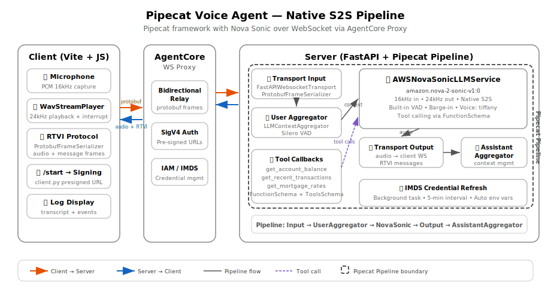

# Pipecat Voice Agent (Nova Sonic)

A bidirectional voice agent using the [Pipecat](https://github.com/pipecat-ai/pipecat) framework with Amazon Nova Sonic for native speech-to-speech. Deployed on Amazon Bedrock AgentCore runtime using the `bedrock-agentcore` SDK.

## Deploy to AgentCore

```bash
# Navigate to the bidirectional streaming tutorial root
cd 06-workshops/01-AgentCore-runtime/06-bi-directional-streaming

# Create and activate a virtual environment
python3 -m venv .venv
source .venv/bin/activate        # macOS/Linux
# .venv\Scripts\activate         # Windows

# Install deployment dependencies
pip install -r utils/requirements.txt

# Set your AWS account ID
export ACCOUNT_ID=123456789012

# Set AWS credentials (Option A: environment variables)
export AWS_ACCESS_KEY_ID=your-access-key
export AWS_SECRET_ACCESS_KEY=your-secret-key
export AWS_REGION=us-east-1

# Set AWS credentials (Option B: named profile)
export AWS_PROFILE=your-profile
export AWS_REGION=us-east-1

# Deploy to AgentCore
python utils/deploy.py 04-pipecat-sonic-ws

# Start the web client
./utils/start_client.sh 04-pipecat-sonic-ws
```

### Cleanup

```bash
python utils/cleanup.py 04-pipecat-sonic-ws
```

## Local Testing

No MCP Gateways required — Pipecat tools are defined inline in the server code.

```bash
# 1. Install server dependencies
pip install -r 04-pipecat-sonic-ws/websocket/requirements.txt

# 2. Set AWS credentials
export AWS_ACCESS_KEY_ID=your-access-key
export AWS_SECRET_ACCESS_KEY=your-secret-key
export AWS_REGION=us-east-1

# 3. Start the server (port 8081)
cd 04-pipecat-sonic-ws/websocket
python server.py

# 4. In another terminal, install and start the client
cd 04-pipecat-sonic-ws/client
npm install
npm run dev
```

Open the URL shown by Vite (usually `http://localhost:5173`), then click Connect.

## Architecture



Unlike the sandwich architecture (STT → LLM → TTS), Nova Sonic handles audio input and output natively in a single model call.

## Key Components

| File | Purpose |
|------|---------|
| `websocket/server.py` | Pipecat pipeline with `AWSNovaSonicLLMService`, FastAPI + IMDS credentials |
| `client/index.html` | Vite app entry point |
| `client/src/app.js` | Browser client using `@pipecat-ai/client-js` + `WebSocketTransport` |
| `client/client.py` | Lightweight signing server — generates SigV4 presigned URLs for AgentCore |


## AgentCore Authentication

When deployed to AgentCore, the browser can't do SigV4 signing. A lightweight Python signing server (`client.py`) generates presigned `wss://` URLs. The Vite dev server proxies `/start` to it.

`start_client.sh 04-pipecat-sonic-ws` handles this automatically — it starts both the signing server and Vite.

To run manually:

```bash
# Terminal 1: signing server (port 8081)
cd 04-pipecat-sonic-ws/client
python client.py --runtime-arn arn:aws:bedrock-agentcore:us-east-1:123456789012:runtime/your-runtime-id

# Terminal 2: Vite dev server
cd 04-pipecat-sonic-ws/client
npm run dev
```

The client fetches `/start` → Vite proxies to signing server → returns presigned `wss://` URL → client connects directly to AgentCore.