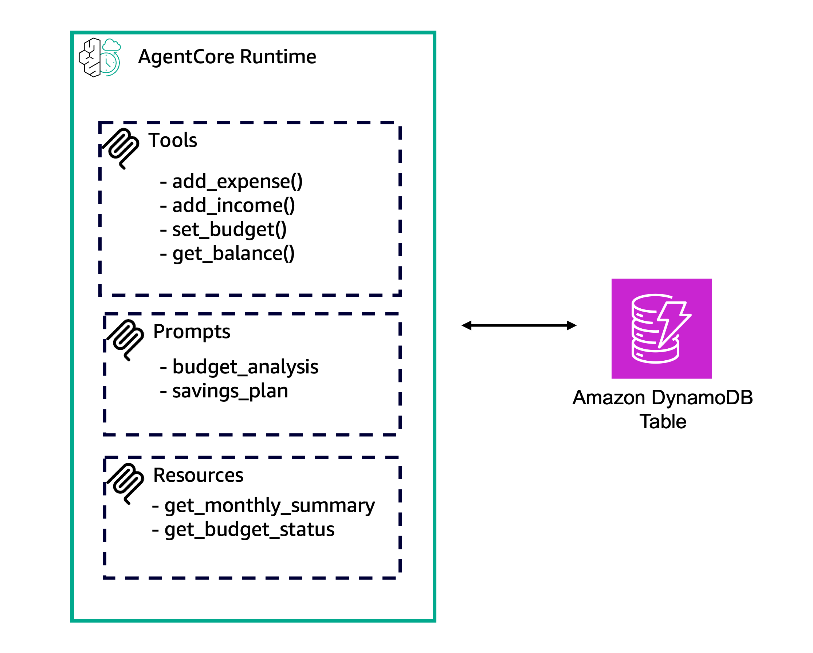

# Full Example of MCP Stateless Server

## Overview

This tutorial demonstrates how to build a complete MCP (Model Context Protocol) server with all three core capabilities and deploy it to Amazon Bedrock AgentCore runtime.

The [MCP spec](https://modelcontextprotocol.io/specification/2025-11-25/server) defines the building blocks for adding context to language models via MCP. These enable rich interactions between clients, servers, and language models:
- **Prompts** — Pre-defined templates that guide language model interactions
- **Resources** — Structured data that provides additional context to the model
- **Tools** — Functions that allow models to perform actions or retrieve information

## Prerequisites

- AWS CLI configured with appropriate permissions
- Python 3.13+
- Access to Amazon Bedrock AgentCore runtime

## Getting Started

```bash
python deploy.py    # Creates DynamoDB table, IAM role, uploads code, deploys runtime
python invoke.py    # Sends JSON-RPC messages to test tools, resources, and prompts
python cleanup.py   # Deletes runtime, IAM role, S3 object, and DynamoDB table
```

## What You'll Learn

- How to create an MCP server with tools, prompts, and resources
- How to deploy to AgentCore runtime using zip-to-S3 code deployment
- How to invoke your deployed server with JSON-RPC messages

### Tutorial Details

| Detail              | Value                                                     |
|:--------------------|:----------------------------------------------------------|
| Tutorial type       | Hosting Tools, Prompts and Resources on runtime           |
| Tool type           | MCP server                                                |
| Components          | AgentCore runtime, MCP server, DynamoDB                   |
| Complexity          | Medium                                                    |
| SDK                 | boto3 (`bedrock-agentcore-control`, `bedrock-agentcore`)  |

### Architecture



The MCP server is deployed to AgentCore runtime with tools for expense tracking (add_expense, add_income, set_budget, get_balance), resources for monthly summaries and budget status, and prompts for budget analysis and savings plans. DynamoDB provides persistent storage.

### Key Features

* Hosting a complete MCP server (stateless mode)
* Using Tools, Resources, and Prompts from the MCP spec
* DynamoDB-backed finance tracking example
