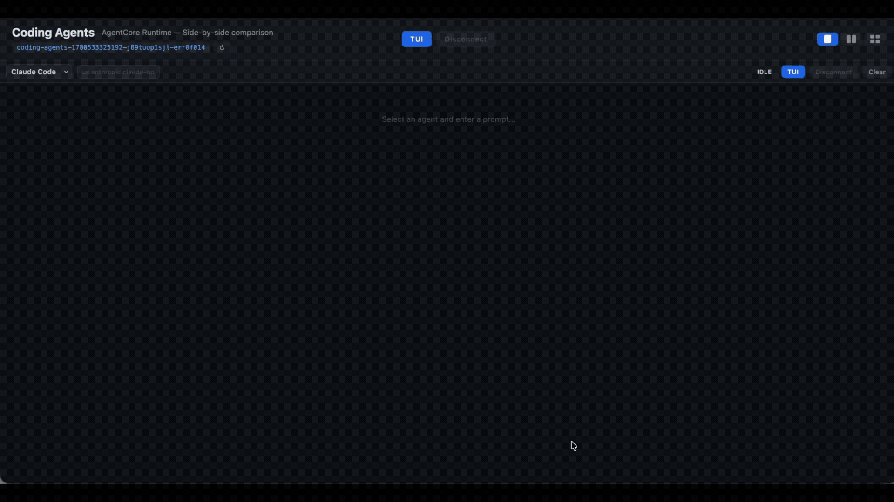

# Coding Agents on Amazon Bedrock AgentCore

Deploy coding agents (Claude Code, Kiro, Codex, Cursor, Hermes, OpenCode) on AWS Bedrock AgentCore with a shared GitHub MCP Gateway, interactive TUI sessions, and a local comparison frontend.

### Claude Code on Runtime



### Side-by-side agent comparison (Frontend)


## Architecture Diagram

```
┌─────────────────────────────────────────────────────────────────────────────────────┐
│                                 AWS Account                                         │
│                                                                                     │
│  ┌─────────────────────────────────────────────────────────────────────────────┐    │
│  │                        Amazon Bedrock AgentCore                             │    │
│  │                                                                             │    │
│  │  ┌───────────────────────┐       ┌────────────────────────────────────┐     │    │
│  │  │   AgentCore Gateway   │       │       AgentCore Runtimes           │     │    │
│  │  │   (IAM-Authenticated) │       │       (WebSocket Shell)            │     │    │
│  │  │                       │       │                                    │     │    │
│  │  │  ┌─────────────────┐  │       │  ┌──────────┐  ┌──────────┐        │     │    │
│  │  │  │  GitHub MCP     │  │◄──────┤  │  Claude  │  │   Kiro   │        │     │    │
│  │  │  │  Server         │  │  MCP  │  │  Code    │  │          │        │     │    │
│  │  │  │  (FastMCP)      │  │ calls │  └──────────┘  └──────────┘        │     │    │
│  │  │  └─────────────────┘  │       │  ┌──────────┐  ┌──────────┐        │     │    │
│  │  │          │            │       │  │  Codex   │  │  Cursor  │        │     │    │
│  │  │          ▼            │       │  │          │  │          │        │     │    │
│  │  │  ┌─────────────────┐  │       │  └──────────┘  └──────────┘        │     │    │
│  │  │  │  GitHub API     │  │       │  ┌──────────┐  ┌──────────┐        │     │    │
│  │  │  │  (via App)      │  │       │  │  Hermes  │  │ OpenCode │        │     │    │
│  │  │  └─────────────────┘  │       │  │          │  │          │        │     │    │
│  │  └───────────────────────┘       │  └──────────┘  └──────────┘        │     │    │
│  │                                  └──────────┬─────────────────────────┘     │    │
│  └─────────────────────────────────────────────┼───────────────────────────────┘    │
│                                                │                                    │
│                                                │ mount                              │
│                                                ▼                                    │
│  ┌──────────────────────────────┐   ┌──────────────────────────────────────┐        │
│  │      Amazon Bedrock          │   │        S3 Files + S3 Bucket          │        │
│  │   (Model Inference)          │   │                                      │        │
│  │                              │   │  /mnt/s3files/mcp/                   │        │
│  │  - Claude Sonnet 4.5         │   │    ├── index.js (gateway proxy)      │        │
│  │  - Claude Opus 4.6           │   │    └── node_modules/                 │        │
│  │  - Claude Haiku 4.5          │   │  /mnt/s3files/skills/                │        │
│  │  - GPT 5.5                   │   │    └── github-mcp.md                 │        │
|  |  - ...                       |   |                                      |        |
│  └──────────────────────────────┘   └──────────────────────────────────────┘        │
│                                                                                     │
│  ┌──────────────────────────────────────────────────────────────────────────┐       │
│  │                      VPC (Private Subnets)                               │       │
│  │  - NAT Gateway (outbound internet)                                       │       │
│  │  - Security Group (NFS port 2049)                                        │       │
│  │  - S3 Files Mount Targets                                                │       │
│  └──────────────────────────────────────────────────────────────────────────┘       │
└─────────────────────────────────────────────────────────────────────────────────────┘

┌─────────────────────────────────────────────────────────────────────────────────────┐
│                            Local Machine                                            │
│                                                                                     │
│  ┌──────────────────────────────┐   ┌──────────────────────────────────────┐        │
│  │   Frontend (Flask + xterm.js)│   │   connect.py (per agent)             │        │
│  │   http://127.0.0.1:5050      │   │   WebSocket Shell → PTY              │        │
│  │                              │   │                                      │        │
│  │   - 2/4 panel comparison     │   │   python connect.py                  │        │
│  │   - Agent selection          │   │   python connect.py --prompt "..."   │        │
│  │   - TUI mode (interactive)   │   │   python connect.py --cmd "ls"       │        │
│  └──────────────────────────────┘   └──────────────────────────────────────┘        │
└─────────────────────────────────────────────────────────────────────────────────────┘
```

### Data Flow

1. **Local** → `connect.py` opens a SigV4-signed WebSocket to the AgentCore Runtime
2. **Runtime** → Launches the coding agent inside a microVM container
3. **Agent** → Uses Bedrock for model inference (IAM role, no API keys for Claude/Hermes/OpenCode)
4. **Agent** → Connects to GitHub MCP tools natively via the MCP Gateway Proxy (`/mnt/s3files/mcp/index.js`)
5. **MCP Proxy** → SigV4-signs requests and forwards them to the AgentCore Gateway
6. **MCP Server** → Authenticates with GitHub API via GitHub App credentials (Secrets Manager)

### Folder Structure

```
gateway_mcp/                   # GitHub MCP server + AgentCore Gateway (deploy first)
├── app/                       # MCP server container (FastMCP + GitHub API)
└── sample-project/            # Example repo with intentional bugs

coding_agents/                 # Coding agents on AgentCore Runtime
├── infra/                     # Shared VPC + S3 Files (deploy once)
├── claude-code/               # Claude Code (Bedrock native)
├── kiro/                      # Kiro (Token Vault API key)
├── codex/                     # Codex (Token Vault API key)
├── cursor/                    # Cursor (Token Vault API key)
├── hermes/                    # Hermes (Bedrock native)
├── open-code/                 # OpenCode (Bedrock native)
└── frontend/                  # Local comparison UI (Flask + xterm.js)

git_mcp_skill/                 # MCP Gateway Proxy (stdio-to-HTTP bridge with SigV4)
```

---

## Prerequisites

- AWS CLI v2 configured with valid credentials
- Docker running locally (with `buildx` for arm64)
- Python 3.10+
- `jq` installed
- `gh` CLI installed and authenticated (`gh auth login`)
- `awscurl` for testing: `pip install awscurl`

Install Python dependencies:

```bash
pip install -r coding_agents/requirements.txt
```

---

## Step-by-Step Deployment

### Part 1: Gateway MCP (GitHub MCP Server)

The gateway provides GitHub access (issues, branches, PRs) to all coding agents via an IAM-authenticated AgentCore Gateway.

#### 1.1 Create a GitHub App

1. Go to https://github.com/settings/apps and click **"New GitHub App"**
2. Fill in:
   - **Name**: `AgentCore GitHub MCP` (or any unique name)
   - **Homepage URL**: `http://localhost`
   - **Webhook**: uncheck "Active"
3. Grant **Repository permissions**:
   - Contents: Read & Write
   - Issues: Read & Write
   - Pull requests: Read & Write
   - Metadata: Read-only
4. Under "Where can this GitHub App be installed?" select **"Only on this account"**
5. Click **"Create GitHub App"**
6. Note the **App ID** from the top of the app page
7. Under **"Private keys"**, click **"Generate a private key"** (a `.pem` file downloads)
8. Go to **"Install App"** in the sidebar and install it on your target repo

#### 1.2 Create a sample repository (optional)

```bash
gh repo create my-task-manager --private --clone
cd my-task-manager
cp -r ../gateway_mcp/sample-project/* .
git add . && git commit -m "Initial commit" && git push -u origin main
cd ..
```

#### 1.3 Seed bug issues (optional)

```bash
cd gateway_mcp
./seed-issues.sh YOUR_GITHUB_USER my-task-manager
```

This creates 9 issues in your repo, one for each intentional bug in the sample project.

#### 1.4 Deploy the Gateway

```bash
cd gateway_mcp

# Export GitHub App credentials
export GITHUB_APP_ID="123456"
export GITHUB_APP_PRIVATE_KEY_FILE="/path/to/your-app.private-key.pem"
export GITHUB_APP_INSTALLATION_ID="78901234"

# (Optional) Override region
export AWS_REGION="us-west-2"

# Deploy everything (credential + runtime + gateway)
./deploy-all.sh
```

This will:
1. Store the GitHub App credentials in AWS Secrets Manager
2. Build and push the MCP server container to ECR
3. Create an IAM role with required permissions
4. Create the AgentCore Runtime (MCP protocol)
5. Create the AgentCore Gateway (IAM-authenticated)

The gateway URL is saved to `.deployed-state.json` and will be automatically picked up by the coding agents.

#### 1.5 Verify the Gateway

```bash
GATEWAY_URL=$(jq -r '.gateway_url' .deployed-state.json)

# List available MCP tools
awscurl --service bedrock-agentcore \
  --region "$AWS_REGION" \
  -X POST "$GATEWAY_URL" \
  -H "Content-Type: application/json" \
  -d '{"jsonrpc":"2.0","method":"tools/list","id":1,"params":{}}'
```

---

### Part 2: Coding Agents

#### 2.1 Deploy shared infrastructure (once)

```bash
cd coding_agents/infra
./setup.sh us-west-2
```

This creates:
- An S3 bucket for shared files
- A VPC with private subnets
- An S3 Files access point (mounted at `/mnt/s3files/` in all runtimes)
- Uploads the MCP Gateway Proxy (`index.js` + `node_modules/`) to S3
- Uploads shared skill files to S3

Output is saved to `coding_agents/infra.config`, used by all agents.

#### 2.2 Deploy all agents (one command)

```bash
cd coding_agents
./deploy_all.sh
```

This runs `setup.sh` + `deploy.py` for each agent in sequence. Or deploy individually:

Each agent folder follows the same pattern: `setup.sh` (build image) then `deploy.py` (create runtime).

##### Claude Code (claude-code)

```bash
cd coding_agents/claude-code
./setup.sh
python deploy.py
```

##### Kiro (with Identity/Token Vault)

Kiro uses AgentCore Identity to store its API key encrypted in Secrets Manager:

```bash
cd coding_agents/kiro

# Option A: Interactive (prompts for key)
./setup.sh

# Option B: Non-interactive
KIRO_API_KEY=xxx ./setup.sh

# Option C: Build image only, skip identity
./setup.sh --skip-identity

# Then deploy
python deploy.py
```

The `setup.sh` creates:
1. ECR repo + pushes the Docker image
2. Workload Identity: `kiro-coding-agent`
3. Credential Provider: `kiro-api-key` (encrypted via KMS)

At runtime, `run.sh` fetches the key on-demand from Token Vault.

##### Codex

```bash
cd coding_agents/codex
./setup.sh
python deploy.py
```

Note: Codex's `setup.sh` does NOT include Identity setup. You must create the workload identity and credential provider manually:

```bash
aws bedrock-agentcore-control create-workload-identity \
  --name "codex-coding-agent" --region us-west-2

OPENAI_API_KEY=sk-xxx aws bedrock-agentcore-control create-api-key-credential-provider \
  --name "openai-api-key" --api-key "$OPENAI_API_KEY" --region us-west-2
```

##### Cursor

```bash
cd coding_agents/cursor
./setup.sh
python deploy.py
```

Same as Codex — requires manual Identity setup:

```bash
aws bedrock-agentcore-control create-workload-identity \
  --name "cursor-coding-agent" --region us-west-2

CURSOR_API_KEY=xxx aws bedrock-agentcore-control create-api-key-credential-provider \
  --name "cursor-api-key" --api-key "$CURSOR_API_KEY" --region us-west-2
```

##### Hermes (Bedrock native — no API key needed)

Hermes uses Bedrock directly via the runtime IAM role. No Token Vault or API key setup required.

```bash
cd coding_agents/hermes
./setup.sh
python deploy.py
```

##### OpenCode (Bedrock native — no API key needed)

OpenCode also uses Bedrock via IAM credentials (fetched from IMDS at startup).

```bash
cd coding_agents/open-code
./setup.sh
python deploy.py
```

#### 2.3 Test an agent interactively

```bash
cd coding_agents/claude-code
python connect.py                          # New interactive session
python connect.py --session <session-id>   # Resume existing session
```

---

### Part 3: Frontend — Local TUI Comparison UI

The frontend runs locally and connects to all deployed agents via WebSocket PTY, showing them side-by-side.

#### 3.1 Install Python dependencies

```bash
cd coding_agents/frontend
pip install -r requirements.txt
```

Dependencies: `flask`, `boto3`, `websocket-client`, `gevent`, `gevent-websocket`

#### 3.2 Run the frontend

```bash
cd coding_agents/frontend
python app.py
```

Open http://127.0.0.1:5050

#### 3.3 Using the UI

- **Layout**: Toggle between 2-panel and 4-panel mode using the icons in the top-right
- **Agent selection**: Each pane has a dropdown to select which agent to connect to
- **Model override**: Each pane has a model input field — leave empty for the agent's default, or type a model ID to override
- **TUI button (top center)**: Connects ALL visible panes to their selected agents at once
- **Disconnect button (top center)**: Disconnects all active TUI sessions
- **Per-pane TUI**: Connect individual panes using the TUI button in each pane header

The frontend reads `runtime_config.json` from each agent folder to get their ARNs. If an agent is not deployed, its dropdown option will show but won't connect.

---

## Teardown

### Remove all agents (one command)

```bash
cd coding_agents
./cleanup_all.sh
```

### Remove an individual agent

```bash
cd coding_agents/kiro
python cleanup.py              # Removes runtime + IAM role + Identity
python cleanup.py --keep-identity  # Keep credentials for reuse
```

### Remove shared infrastructure

```bash
cd coding_agents/infra
./cleanup.sh    # Removes VPC + S3 Files (keeps S3 bucket)
```

### Remove the gateway

```bash
cd gateway_mcp
./delete-all.sh
```

Or individually (order matters):

```bash
./delete-gateway.sh
./delete-credential.sh
./delete-runtime.sh
```

---

## Folder Structure

```
.
├── gateway_mcp/                    # GitHub MCP Gateway (deploy first)
│   ├── app/                        # MCP server source (FastMCP + GitHub)
│   │   ├── main.py
│   │   ├── Dockerfile
│   │   └── pyproject.toml
│   ├── sample-project/             # Example buggy app
│   ├── config.sh                   # Shared config (auto-detects account)
│   ├── deploy-all.sh              # Full deploy
│   ├── deploy-credential.sh       # GitHub secret → Secrets Manager
│   ├── deploy-runtime.sh          # ECR + image + IAM + runtime
│   ├── deploy-gateway.sh          # IAM-auth gateway → runtime
│   ├── delete-all.sh             # Full teardown
│   ├── seed-issues.sh            # Create sample issues
│   └── IDENTITY.md               # Why GitHub App vs AgentCore Identity
├── coding_agents/                  # Coding agents on AgentCore
│   ├── infra/                     # Shared VPC + S3 Files
│   │   ├── cfn-vpc.yaml
│   │   ├── setup.sh
│   │   └── cleanup.sh
│   ├── claude-code/               # Claude Code (Bedrock native)
│   ├── kiro/                      # Kiro (Token Vault + Identity)
│   ├── codex/                     # Codex (Token Vault)
│   ├── cursor/                    # Cursor (Token Vault)
│   ├── hermes/                    # Hermes (Bedrock native)
│   ├── open-code/                 # OpenCode (Bedrock native)
│   ├── frontend/                  # Local Flask UI
│   │   ├── app.py                 # Flask + WebSocket proxy
│   │   ├── requirements.txt
│   │   ├── static/
│   │   │   ├── style.css
│   │   │   └── app.js
│   │   └── templates/
│   │       └── index.html
│   └── requirements.txt           # Shared Python deps (bedrock-agentcore)
├── git_mcp_skill/                  # MCP Gateway Proxy (uploaded to S3 Files)
│   ├── index.js                  # stdio-to-StreamableHTTP bridge with SigV4 signing
│   ├── package.json              # Node.js dependencies (@modelcontextprotocol/sdk, @smithy/*)
│   └── github-mcp.md             # Skill reference documentation
└── images/                         # Screenshots for docs
```
