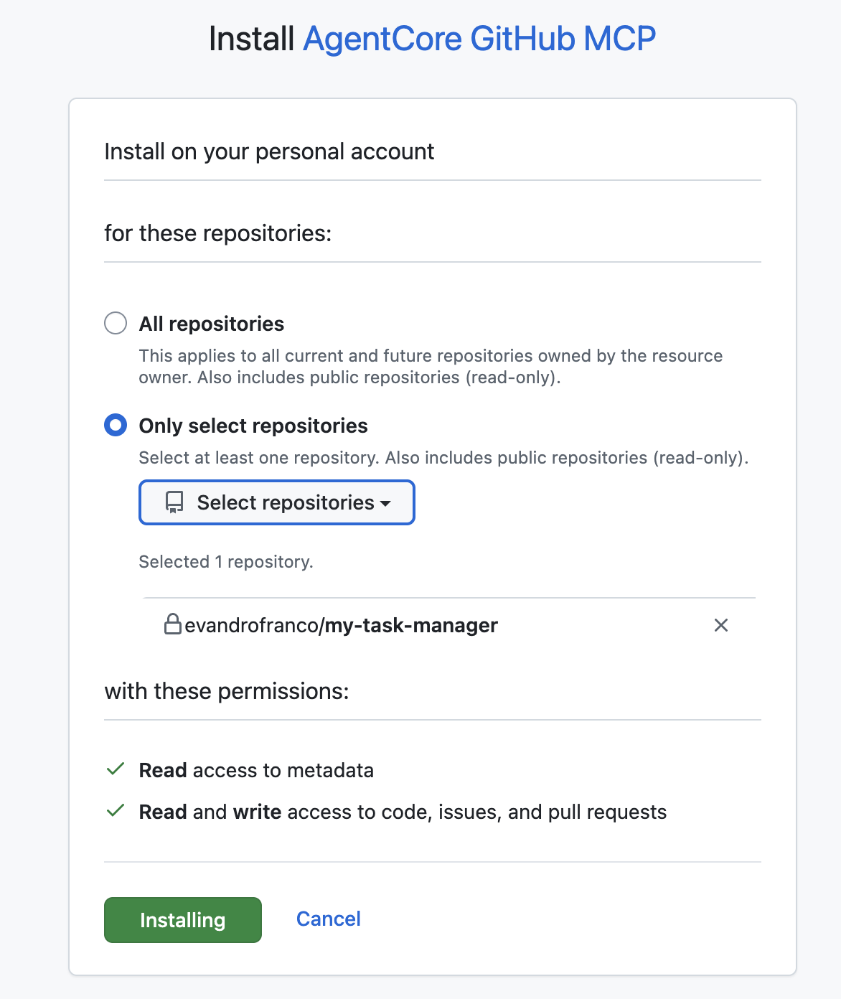

# Gateway MCP — GitHub MCP on AgentCore

Standalone deployment of a GitHub MCP server on Amazon Bedrock AgentCore, fronted by an IAM-authenticated AgentCore Gateway. Includes a sample project with intentional bugs to demonstrate the full flow.

## Architecture

```
Caller (SigV4) ──▶ AgentCore Gateway (IAM inbound)
                        │
                        ▼
                   AgentCore Runtime (MCP protocol)
                        │
                        ▼
                   GitHub API (installation token via Secrets Manager)
```

## Prerequisites

- AWS CLI v2 configured with valid credentials
- Docker running locally
- `jq` installed
- `gh` CLI installed ([install guide](https://github.com/cli/cli#installation)) and authenticated (`gh auth login`)
- `awscurl` for testing SigV4-signed requests: `pip install awscurl`
- A **GitHub App** installed on your target repo/org (see Step 1 below)

## Quick Start

### Step 1: Create a GitHub repo and push the sample project

```bash
# Create a new repo (public or private)
gh repo create my-task-manager --private --clone
cd my-task-manager

# Copy the sample project files
cp -r ../gateway_mcp/sample-project/* .
git add .
git commit -m "Initial commit — task manager with known bugs"
git push -u origin main
```

### Step 2: Create a GitHub App and install it on the repo

1. Go to https://github.com/settings/apps
2. Click **"New GitHub App"**
3. Fill in:
   - **GitHub App name**: `AgentCore GitHub MCP`
   - **Homepage URL**: `http://localhost`
   - **Webhook**: uncheck "Active" (not needed)
4. Under **Repository permissions**, grant:
   | Permission | Access | Used by |
   |------------|--------|---------|
   | Contents | Read & Write | `create_branch`, `put_file` |
   | Issues | Read & Write | `get_issue`, `comment_on_issue`, `assign_issue`, labels |
   | Pull requests | Read & Write | `create_pull_request` |
   | Metadata | Read-only | Required by GitHub for all apps |
5. Under **Organization permissions**: none required
6. Under **Where can this GitHub App be installed?**: select "Only on this account"
7. Click **"Create GitHub App"**
8. Note the **App ID** (shown at the top of the app page)
9. Scroll to **"Private keys"** and click **"Generate a private key"** — a `.pem` file downloads
10. Go to **"Install App"** in the sidebar and install it on the `my-task-manager` repo

    

11. Note the **Installation ID** from the URL: `https://github.com/settings/installations/{INSTALLATION_ID}`

Export them:

```bash
export GITHUB_APP_ID="123456"
export GITHUB_APP_PRIVATE_KEY_FILE="/path/to/your-app.private-key.pem"
export GITHUB_APP_INSTALLATION_ID="78901234"
```

### Step 3: Seed bug issues

```bash
# From the gateway_mcp/ folder
./seed-issues.sh YOUR_GITHUB_USER my-task-manager
```

This creates 9 issues in your repo — one for each intentional bug. You can view them at `https://github.com/YOUR_GITHUB_USER/my-task-manager/issues`.

### Step 4: Deploy to AgentCore

```bash
cd gateway_mcp

# (Optional) Override region — defaults to your AWS CLI configured region
export AWS_REGION="us-west-2"

# Deploy everything
./deploy-all.sh
```

This will:
1. Store the GitHub App credentials in AWS Secrets Manager
2. Create an ECR repository and push the MCP server container image
3. Create an IAM role with AgentCore + Secrets Manager permissions
4. Create the AgentCore Runtime (MCP protocol)
5. Create an IAM-authenticated AgentCore Gateway pointing to the runtime

### Step 5: Test the runtime directly

Test the runtime before testing through the gateway:

```bash
RUNTIME_ID=$(jq -r '.runtime_id' .deployed-state.json)
ACCOUNT_ID=$(aws sts get-caller-identity --query Account --output text)
RUNTIME_URL="https://bedrock-agentcore.${AWS_REGION}.amazonaws.com/runtimes/${RUNTIME_ID}/invocations?qualifier=DEFAULT&accountId=${ACCOUNT_ID}"

# List available MCP tools
awscurl --service bedrock-agentcore \
  --region "$AWS_REGION" \
  -X POST "$RUNTIME_URL" \
  -H "Content-Type: application/json" \
  -H "Accept: application/json, text/event-stream" \
  -d '{"jsonrpc":"2.0","method":"tools/list","id":1,"params":{}}'

# Read an issue
awscurl --service bedrock-agentcore \
  --region "$AWS_REGION" \
  -X POST "$RUNTIME_URL" \
  -H "Content-Type: application/json" \
  -H "Accept: application/json, text/event-stream" \
  -d '{
    "jsonrpc":"2.0",
    "method":"tools/call",
    "id":2,
    "params":{
      "name":"get_issue",
      "arguments":{"owner":"YOUR_USER","repo":"my-task-manager","issue_number":1}
    }
  }'
```

### Step 6: Test through the gateway

```bash
GATEWAY_URL=$(jq -r '.gateway_url' .deployed-state.json)

# List available MCP tools
awscurl --service bedrock-agentcore \
  --region "$AWS_REGION" \
  -X POST "$GATEWAY_URL" \
  -H "Content-Type: application/json" \
  -d '{"jsonrpc":"2.0","method":"tools/list","id":2,"params":{}}'


# Read an issue
awscurl --service bedrock-agentcore \
  --region "$AWS_REGION" \
  -X POST "$GATEWAY_URL" \
  -H "Content-Type: application/json" \
  -H "Accept: application/json, text/event-stream" \
  -d '{
    "jsonrpc":"2.0",
    "method":"tools/call",
    "id":2,
    "params":{
      "name":"GitHubMCP___get_issue",
      "arguments":{"owner":"YOUR_USER","repo":"my-task-manager","issue_number":1}
    }
  }'

```

## Teardown

```bash
# Remove all AgentCore resources
./delete-all.sh
```

Or individually (order matters — gateway first):

```bash
./delete-gateway.sh
./delete-credential.sh
./delete-runtime.sh
```

## Folder Structure

```
gateway_mcp/
├── app/                       # MCP server source code
│   ├── Dockerfile
│   ├── main.py               # FastMCP server with GitHub tools
│   ├── pyproject.toml
│   └── uv.lock
├── sample-project/            # Example app to push to GitHub
│   ├── backend/              # Flask API (Python) — has bugs
│   ├── frontend/             # HTML/JS UI — has bugs
│   └── README.md             # Bug catalog
├── seed-issues.sh             # Creates GitHub issues for each bug
├── config.sh                  # Shared config (auto-detects account/region)
├── deploy-runtime.sh          # ECR + image + IAM + runtime
├── deploy-credential.sh       # GitHub App secret in Secrets Manager
├── deploy-gateway.sh          # IAM-auth gateway → runtime
├── deploy-all.sh              # Full deploy
├── delete-gateway.sh          # Teardown: gateway
├── delete-credential.sh       # Teardown: Secrets Manager secret
├── delete-runtime.sh          # Teardown: runtime + IAM + ECR
└── delete-all.sh              # Teardown: everything
```

## Available MCP Tools

| Tool | Description |
|------|-------------|
| `get_issue` | Fetch issue details (title, body, labels, state) |
| `list_issue_comments` | List all comments on an issue |
| `comment_on_issue` | Post a comment on an issue |
| `update_comment` | Edit an existing comment |
| `assign_issue` | Add assignees to an issue |
| `set_labels` | Replace issue labels |
| `add_labels` | Add labels without removing existing |
| `remove_label` | Remove a single label |
| `create_branch` | Create a new branch |
| `put_file` | Create or update a file on a branch |
| `create_pull_request` | Open a pull request |

## Configuration Reference

| Variable | Default | Description |
|----------|---------|-------------|
| `AWS_REGION` | From `aws configure` | Target AWS region |
| `AWS_ACCOUNT_ID` | From `aws sts get-caller-identity` | Target account |
| `PROJECT_NAME` | `github_mcp` | Prefix for all resource names |
| `GITHUB_APP_ID` | (required) | GitHub App numeric ID |
| `GITHUB_APP_PRIVATE_KEY_FILE` | (required) | Path to the `.pem` private key file |
| `GITHUB_APP_INSTALLATION_ID` | (required) | Installation ID for your repo/org |
| `RUNTIME_IDLE_TIMEOUT` | `360` | Seconds before idle runtime stops |
| `RUNTIME_MAX_LIFETIME` | `520` | Max runtime session lifetime (seconds) |

For details on why we use GitHub App + Secrets Manager instead of AgentCore Identity, see [IDENTITY.md](IDENTITY.md).
