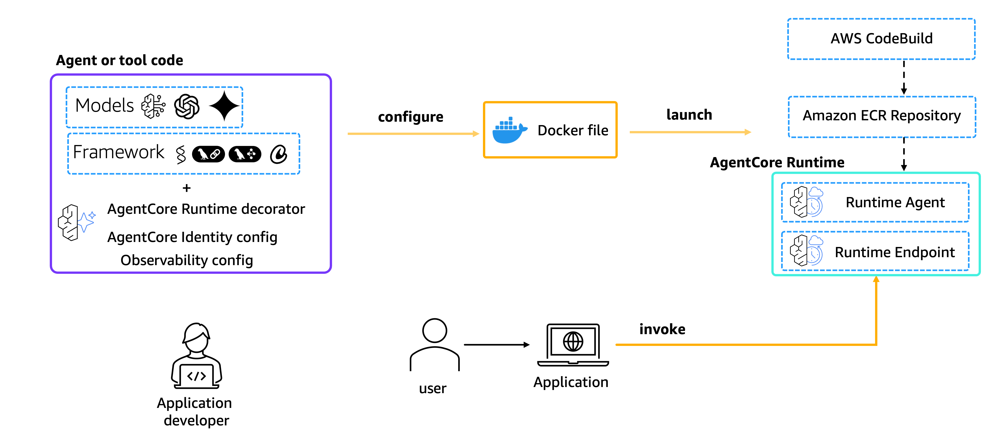
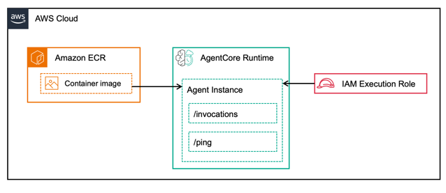

# Amazon Bedrock AgentCore runtime



Amazon Bedrock AgentCore runtime is a secure, serverless hosting environment for deploying and running AI agents and tools at scale.

## Key Capabilities

- **Framework agnostic** — works with Strands Agents, LangGraph, CrewAI, or any custom framework
- **Model flexible** — supports Amazon Bedrock models, OpenAI, Anthropic, Google Gemini, and more
- **Protocol support** — HTTP, MCP (Model Context Protocol), A2A (Agent-to-Agent), and AG-UI
- **Session isolation** — each user session runs in a dedicated microVM with isolated CPU, memory, and filesystem
- **Extended execution** — supports workloads up to 8 hours for complex agent reasoning
- **Built-in auth** — integrates with corporate identity providers (Okta, Entra ID, Cognito)
- **Consumption-based pricing** — charges only for resources actually consumed during active processing

## Tutorials

| Section | Description |
|:--------|:------------|
| [01-hosting-agents](01-hosting-agents/) | Deploy agents using HTTP, A2A, and AG-UI protocols with various frameworks and models |
| [02-hosting-tools](02-hosting-tools/) | Host MCP servers on AgentCore runtime for tools, resources, and prompts |
| [03-advanced](03-advanced/) | Streaming, sessions, async agents, command execution, persistent filesystems, multi-agent, VPC, middleware, MCP auth, and more |

## Prerequisites

- Python 3.12+
- [uv](https://docs.astral.sh/uv/getting-started/installation/) installed (for building arm64 deployment packages)
- AWS account with Bedrock AgentCore access
- AWS CLI configured with credentials
- `boto3` and `bedrock-agentcore` packages

```bash
pip install boto3 bedrock-agentcore
```

## Core Concepts

### Two boto3 Clients

AgentCore runtime is managed through two separate boto3 clients:

| Client | Service Name | Purpose | Key Operations |
|:-------|:-------------|:--------|:---------------|
| **Control plane** | `bedrock-agentcore-control` | Manage infrastructure | `create_agent_runtime`, `create_agent_runtime_endpoint`, `get_agent_runtime`, `delete_agent_runtime` |
| **Data plane** | `bedrock-agentcore` | Interact with agents | `invoke_agent_runtime`, `invoke_agent_runtime_command`, `stop_runtime_session` |

```python
import boto3

# Control plane — create, update, delete runtimes
control = boto3.client('bedrock-agentcore-control', region_name='us-east-1')

# Data plane — invoke agents, run commands
data = boto3.client('bedrock-agentcore', region_name='us-east-1')
```

### Deployment Model

All examples use **direct code deployment** — your Python files are zipped with pre-compiled arm64 dependencies and uploaded to S3. AgentCore runtime runs on Graviton (arm64) microVMs, so the zip must include wheels built for `aarch64-manylinux2014`. We use [uv](https://docs.astral.sh/uv/) to download the correct wheels:

```bash
# Download arm64 wheels into a staging directory
uv pip install \
  --python-platform aarch64-manylinux2014 \
  --python-version 3.13 \
  --target deployment_package \
  --only-binary :all: \
  -r requirements.txt

# Zip dependencies + agent code
cd deployment_package && zip -r ../code.zip . && cd ..
zip code.zip agent.py
```

Each `deploy.py` script automates this. Alternatively, you can deploy Docker containers via ECR using `containerConfiguration`.

### Architecture



### Deployment Lifecycle

```
create_agent_runtime()          →  status: CREATING
    ↓ (poll with get_agent_runtime)
status: READY                   →  runtime exists but has no traffic endpoint
    ↓
create_agent_runtime_endpoint() →  status: CREATING
    ↓ (poll with list_agent_runtime_endpoints)
status: READY                   →  agent is invocable
    ↓
invoke_agent_runtime()          →  sends requests to your agent
```

### Supported Protocols

Each protocol changes how clients communicate with your agent:

| Protocol | Value | Agent Listens On | Use Case |
|:---------|:------|:-----------------|:---------|
| HTTP | `HTTP` | `POST /invocations` + `GET /ping` on port 8080 | Standard request/response agents |
| MCP | `MCP` | `POST /mcp` on port 8000 (JSON-RPC) | Tool servers for LLM tool use |
| A2A | `A2A` | `POST /` (JSON-RPC) + `GET /.well-known/agent.json` on port 9000 | Agent-to-agent orchestration |
| AG-UI | `AGUI` | `POST /invocations` + `GET /ws` on port 8080 | Real-time streaming to UIs |

You set the protocol once when creating the runtime via `protocolConfiguration.serverProtocol`.

### Session Isolation

Each `runtimeSessionId` maps to a dedicated microVM. Requests with the same session ID share state (conversation history, filesystem, installed packages). Different session IDs are completely isolated. Sessions auto-terminate after the idle timeout (default: 15 minutes).

## End-to-End Example

Here's the complete flow to deploy and invoke an agent:

```python
import boto3, json, io, zipfile, time

region = "us-east-1"
control = boto3.client("bedrock-agentcore-control", region_name=region)
data = boto3.client("bedrock-agentcore", region_name=region)
s3 = boto3.client("s3", region_name=region)

# 1. Upload code to S3
zip_buf = io.BytesIO()
with zipfile.ZipFile(zip_buf, "w") as zf:
    zf.write("agent.py")
    zf.write("requirements.txt")
zip_buf.seek(0)
s3.put_object(Bucket="my-bucket", Key="my-agent/code.zip", Body=zip_buf.getvalue())

# 2. Create runtime
resp = control.create_agent_runtime(
    agentRuntimeName="my-agent",
    agentRuntimeArtifact={
        "codeConfiguration": {
            "code": {"s3": {"bucket": "my-bucket", "prefix": "my-agent/code.zip"}},
            "runtime": "PYTHON_3_12",
            "entryPoint": ["agent.py"],
        }
    },
    roleArn="arn:aws:iam::123456789012:role/my-role",
    networkConfiguration={"networkMode": "PUBLIC"},
    protocolConfiguration={"serverProtocol": "HTTP"},
)
runtime_id = resp["agentRuntimeId"]

# 3. Wait for READY
while control.get_agent_runtime(agentRuntimeId=runtime_id)["status"] != "READY":
    time.sleep(15)

# 4. Create endpoint
control.create_agent_runtime_endpoint(agentRuntimeId=runtime_id, name="default")

# 5. Wait for endpoint READY
while True:
    eps = control.list_agent_runtime_endpoints(agentRuntimeId=runtime_id)
    if eps["runtimeEndpoints"][0]["status"] == "READY":
        break
    time.sleep(15)

# 6. Invoke
response = data.invoke_agent_runtime(
    agentRuntimeArn=resp["agentRuntimeArn"],
    payload=json.dumps({"prompt": "Hello!"}).encode(),
)
print(response["response"].read().decode())
```

## Documentation

- [AgentCore runtime Developer Guide](https://docs.aws.amazon.com/bedrock-agentcore/latest/devguide/agents-tools-runtime.html)
- [boto3 Data Plane Reference (`bedrock-agentcore`)](https://docs.aws.amazon.com/boto3/latest/reference/services/bedrock-agentcore.html)
- [boto3 Control Plane Reference (`bedrock-agentcore-control`)](https://docs.aws.amazon.com/boto3/latest/reference/services/bedrock-agentcore-control.html)
