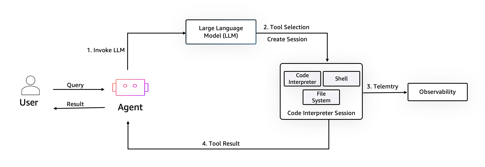

# File Operations with AgentCore Code Interpreter

## Overview

This demo shows the core Code Interpreter API — no agent framework, just direct SDK calls. You'll learn how to start a session, write files into the sandbox, list the filesystem, execute a Python script, and read the output.

```
┌────────────────────┐    writeFiles      ┌─────────────────────────────┐
│  Local filesystem  │ ─────────────────▶ │  Code Interpreter Sandbox   │
│  data.csv          │                    │  /data.csv   (uploaded)      │
│  stats.py          │                    │  /stats.py   (uploaded)      │
└────────────────────┘                    │                              │
                                          │  executeCode(stats.py)       │
                                          │    → pandas.read_csv()       │
                                          │    → df.describe()           │
                                          │    → stdout captured         │
                                          └─────────────────────────────┘
```

## Architecture



The sandbox enables agents to safely process queries by creating an isolated environment with a code interpreter, shell, and file system. After a Large Language Model helps with tool selection, code is executed within the session, before being returned to the user or agent for synthesis.

## How It Works

### Starting a Session

`CodeInterpreter` is the class-based client for explicit session lifecycle control:

```python
from bedrock_agentcore.tools.code_interpreter_client import CodeInterpreter

code_client = CodeInterpreter("us-west-2")
code_client.start()          # Allocates a sandbox session
# ... do work ...
code_client.stop()           # Releases the session
```

Use a `try/finally` block to guarantee cleanup:

```python
code_client = CodeInterpreter("us-west-2")
code_client.start()
try:
    # work here
finally:
    code_client.stop()
```

### Writing Files to the Sandbox

`writeFiles` uploads file content as text. Files persist for the duration of the session and are available to subsequent `executeCode` or `executeCommand` calls:

```python
response = code_client.invoke("writeFiles", {
    "content": [
        {"path": "data.csv", "text": "<csv content>"},
        {"path": "stats.py", "text": "import pandas as pd\ndf = pd.read_csv('data.csv')\nprint(df.describe())"},
    ]
})
for event in response["stream"]:
    print(event["result"]["content"][0]["text"])
# "Successfully wrote all 2 files"
```

> **Important**: `writeFiles` paths are relative to the sandbox working directory. Write `"data.csv"`, not `"/home/user/data.csv"`.

### Listing Sandbox Files

`listFiles` shows what is present in a given directory:

```python
response = code_client.invoke("listFiles", {"path": ""})
for event in response["stream"]:
    for item in event["result"].get("content", []):
        print(item["description"], item["name"])
# "File      data.csv"
# "File      stats.py"
# "Directory node_modules"
```

The sandbox has a pre-populated directory structure. Your uploaded files appear at the root.

### Executing Code

`executeCode` runs Python in the sandbox and returns captured stdout, stderr, and the exit code:

```python
with open("stats.py") as f:
    stats_py = f.read()

response = code_client.invoke("executeCode", {
    "code": stats_py,
    "language": "python",
    "clearContext": True,   # True = fresh kernel; False = share state with prior calls
})
for event in response["stream"]:
    result = event["result"]
    stdout = result["structuredContent"]["stdout"]
    stderr = result["structuredContent"]["stderr"]
    exit_code = result["structuredContent"]["exitCode"]
    print(stdout)
```

`clearContext: True` starts a fresh Python interpreter. `clearContext: False` preserves variables from previous calls — useful when building up state across multiple invocations.

### `executeCode` Parameters

| Parameter | Type | Description |
|:----------|:-----|:------------|
| `code` | `str` | Python source code to execute |
| `language` | `str` | Must be `"python"` |
| `clearContext` | `bool` | `True` = fresh kernel, `False` = retain state from prior calls |

### Response Structure

```python
result = event["result"]

result["isError"]                          # bool — True if execution failed
result["content"][0]["text"]               # Human-readable summary (e.g., stdout preview)
result["structuredContent"]["stdout"]      # Full captured stdout
result["structuredContent"]["stderr"]      # Full captured stderr
result["structuredContent"]["exitCode"]    # 0 = success, non-zero = error
result["structuredContent"]["executionTime"] # Seconds (float)
```

## Prerequisites

```bash
pip install -r ../requirements.txt
```

The demo reads sample files from `samples/`:

| File | Description |
|:-----|:------------|
| `samples/data.csv` | Small dataset with Name, Preferred_City, Preferred_Animal, Preferred_Thing columns |
| `samples/stats.py` | Runs `pandas.DataFrame.describe()` on data.csv |

## Usage

```bash
python file_operations.py
```

## IAM Permissions

```json
{
  "Effect": "Allow",
  "Action": [
    "bedrock-agentcore:CreateCodeInterpreter",
    "bedrock-agentcore:GetCodeInterpreter",
    "bedrock-agentcore:ListCodeInterpreters",
    "bedrock-agentcore:DeleteCodeInterpreter",
    "bedrock-agentcore:StartCodeInterpreterSession",
    "bedrock-agentcore:InvokeCodeInterpreter",
    "bedrock-agentcore:StopCodeInterpreterSession"
  ],
  "Resource": "*"
}
```

## Files

| File | Description |
|:-----|:------------|
| `file_operations.py` | Main demo script |
| `samples/data.csv` | Sample dataset |
| `samples/stats.py` | Analysis script executed in the sandbox |
