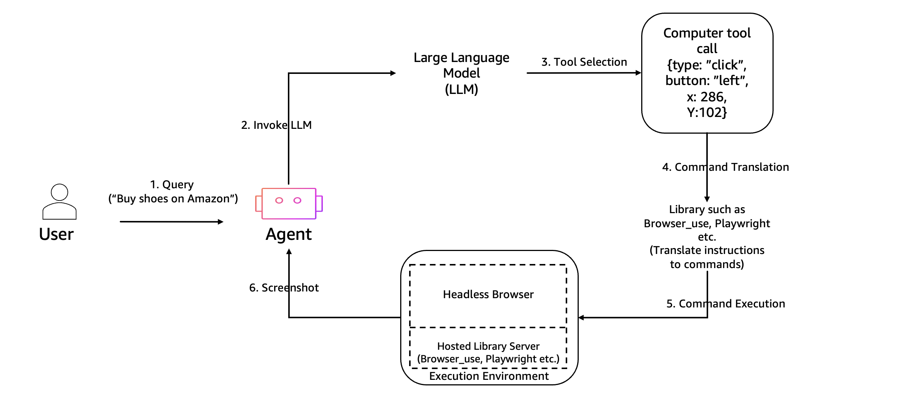

# Headless Browser Automation with Nova Act

## Overview

This demo shows how to connect the Amazon Nova Act SDK to an AgentCore Browser session. Nova Act is Amazon's native browser automation agent — you give it a natural language prompt and a starting URL, and it navigates the page, interacts with UI elements, and returns a structured result.

## Architecture



## How It Works

### Connecting Nova Act to AgentCore

The key is passing the AgentCore WebSocket URL and authentication headers directly to `NovaAct`:

```python
from nova_act import NovaAct
from bedrock_agentcore.tools.browser_client import browser_session

with browser_session("us-west-2") as client:
    ws_url, headers = client.generate_ws_headers()

    with NovaAct(
        cdp_endpoint_url=ws_url,
        cdp_headers=headers,
        nova_act_api_key="<your-key>",
        starting_page="https://www.amazon.com/",
    ) as nova_act:
        result = nova_act.act("Search for macbooks and extract details of the first one")
        print(result.response)
```

- `ws_url`: A `wss://` Chrome DevTools Protocol endpoint pointing to the AgentCore sandbox
- `headers`: SigV4-signed HTTP headers that authenticate the WebSocket connection
- `preview={"playwright_actuation": True}`: Enables the Playwright-based actuation backend for reliable element interaction

### `browser_session()` Context Manager

`browser_session(region)` handles the full session lifecycle:

1. Starts a managed Chromium sandbox session
2. Yields the `BrowserClient` (from which you call `generate_ws_headers()`)
3. Automatically stops the session when the `with` block exits, even on error

There is no need to call `.start()` or `.stop()` explicitly when using the context manager.

### The `NovaAct.act()` Result

`nova_act.act(prompt)` returns a result object with:

| Field | Description |
|:------|:------------|
| `result.response` | The natural language answer to your prompt |
| `result.matches_schema` | Whether the response matches a requested JSON schema |
| `result.parsed_response` | Parsed JSON response (when a schema is requested) |

For structured data extraction, pass a Pydantic model as the `schema` parameter:

```python
from pydantic import BaseModel

class ProductDetails(BaseModel):
    name: str
    price: str
    rating: float

result = nova_act.act(
    "Extract details of the first product",
    schema=ProductDetails,
)
product = result.parsed_response
```

### Live View Demo (`live_view.py`)

The `live_view.py` script adds two capabilities beyond `getting_started.py`:

**Multi-step tasks**: Pass a JSON array of steps instead of a single prompt. Each step executes sequentially in the same browser session, preserving state (login sessions, loaded pages, filled forms):

```bash
python live_view.py \
  --steps '["Search for AI news and press enter", "Extract the first result title and URL"]' \
  --starting-page "https://www.google.com/" \
  --nova-act-key $NOVA_ACT_API_KEY
```

**CAPTCHA handling**: Pass `--captcha` to enable Nova Act's built-in CAPTCHA detection. When a CAPTCHA is encountered, the session pauses and waits for human intervention (useful when combined with live view):

```bash
python live_view.py \
  --prompt "Sign in and check order history" \
  --starting-page "https://www.amazon.com/" \
  --nova-act-key $NOVA_ACT_API_KEY \
  --captcha
```

**Live DCV viewer** (optional): If the `interactive_tools/` directory from the source repo is present at `../../interactive_tools/`, the script starts a `BrowserViewerServer` that streams the browser display to a DCV endpoint so you can watch the automation in real time. The demo falls back to headless mode if the viewer is not available.

## What Happens Behind the Scenes

1. `browser_session()` creates a Browser client and starts a managed Chromium sandbox session
2. `generate_ws_headers()` returns a `wss://` CDP endpoint URL and SigV4-signed auth headers
3. Nova Act is pointed at the browser session via `cdp_endpoint_url` and `cdp_headers`
4. Nova Act SDK translates your natural language instructions into Playwright actuations on the browser
5. The browser session is automatically stopped when the `with browser_session()` block exits

For the live-view demo (`live_view.py`), a `BrowserViewerServer` is started between steps 2 and 3, streaming the browser display to a local DCV endpoint so you can watch the automation in real time.

## Prerequisites

```bash
pip install -r ../requirements.txt
```

Get a Nova Act API key at [nova.amazon.com/act](https://nova.amazon.com/act).

```bash
export NOVA_ACT_API_KEY=<your-nova-act-api-key>
```

## Usage

```bash
# Basic headless demo
python getting_started.py \
  --prompt "Search for macbooks and extract the details of the first one" \
  --starting-page "https://www.amazon.com/" \
  --nova-act-key $NOVA_ACT_API_KEY

# Live view with a single step
python live_view.py \
  --prompt "Extract Amazon revenue for the last 4 years" \
  --starting-page "https://stockanalysis.com/stocks/amzn/financials/" \
  --nova-act-key $NOVA_ACT_API_KEY

# Multi-step task with CAPTCHA handling enabled
python live_view.py \
  --steps '["Search for AI news and press enter", "Extract the first result title"]' \
  --starting-page "https://www.google.com/" \
  --nova-act-key $NOVA_ACT_API_KEY \
  --captcha
```

## IAM Permissions

```json
{
  "Effect": "Allow",
  "Action": [
    "bedrock-agentcore:StartBrowserSession",
    "bedrock-agentcore:StopBrowserSession",
    "bedrock-agentcore:ConnectBrowserAutomationStream",
    "bedrock-agentcore:ConnectBrowserLiveViewStream"
  ],
  "Resource": "*"
}
```

`ConnectBrowserLiveViewStream` is only needed for `live_view.py`.

## Files

| File | Description |
|:-----|:------------|
| `getting_started.py` | Basic headless Nova Act automation demo |
| `live_view.py` | Multi-step tasks, CAPTCHA detection, and optional live DCV viewer |
