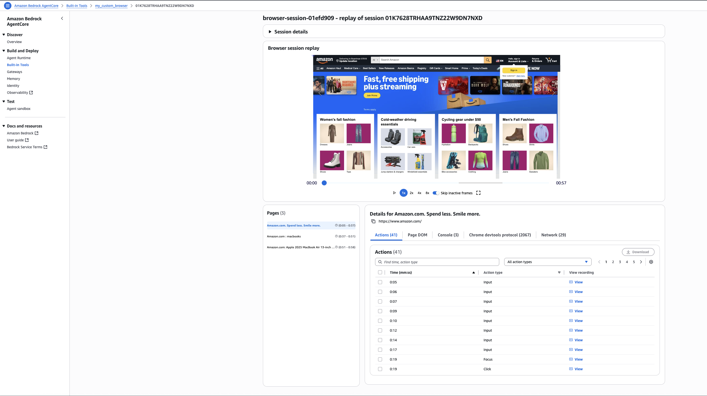

# Browser Session Recording and observability

## Overview

AgentCore Browser Tool can record everything that happens in a browser session — every page navigation, click, network request, and console message — and store the recording in Amazon S3. You can replay sessions in the AWS console, debug automation failures, audit agent behavior, and build monitoring pipelines on top of the recorded data.

```
┌─────────────────────────────────────────────────────────────────────┐
│  browser_observability.py                                           │
│                                                                     │
│  1. Create S3 bucket for recordings                                 │
│  2. Create IAM execution role                                       │
│  3. cp_client.create_browser(                                       │
│       executionRoleArn=role_arn,                                     │
│       recording={"enabled": True,                                   │
│                  "s3Location": {"bucket": bucket}})                 │
│              │                                                      │
│              ▼                                                      │
│  ┌─────────────────────────────────────────────────────────────┐   │
│  │  Custom Browser Resource (recording enabled)                │   │
│  │                                                             │   │
│  │  Session runs ──▶ Nova Act task                             │   │
│  │       │                                                     │   │
│  │       ├── S3: session recording (video + events)           │   │
│  │       ├── S3: console logs                                  │   │
│  │       ├── S3: network logs                                  │   │
│  │       └── S3: CDP command trace                             │   │
│  └─────────────────────────────────────────────────────────────┘   │
│              │                                                      │
│              ▼                                                      │
│  AWS Console → AgentCore → Browser use tools → View recording      │
└─────────────────────────────────────────────────────────────────────┘
```

## How It Works

### Creating a Browser Resource with Recording

Session recording requires a **custom Browser resource** (not the default shared browser). You create one using the control plane client, specifying an S3 bucket for recordings and an execution role:

```python
import boto3

cp_client = boto3.client("bedrock-agentcore-control", region_name=region)
s3_client = boto3.client("s3", region_name=region)

# Create the recording bucket
s3_client.create_bucket(
    Bucket=bucket_name,
    CreateBucketConfiguration={"LocationConstraint": region},
)

# Create the browser resource with recording enabled
resp = cp_client.create_browser(
    name="my-recording-browser",
    executionRoleArn=role_arn,
    networkConfiguration={"networkMode": "PUBLIC"},
    recording={
        "enabled": True,
        "s3Location": {"bucket": bucket_name},
    },
)
browser_id = resp["browserId"]
```

### The Execution Role

The execution role is assumed by the AgentCore service at session time. It needs permissions to:
- Connect browser streams (automation and live view)
- Write recordings to the S3 bucket
- Write logs to CloudWatch

```json
{
  "Version": "2012-10-17",
  "Statement": [
    {
      "Effect": "Allow",
      "Action": [
        "bedrock-agentcore:ConnectBrowserAutomationStream",
        "bedrock-agentcore:ConnectBrowserLiveViewStream"
      ],
      "Resource": "*"
    },
    {
      "Effect": "Allow",
      "Action": ["s3:PutObject", "s3:GetObject", "s3:ListBucket"],
      "Resource": [
        "arn:aws:s3:::my-recordings-bucket",
        "arn:aws:s3:::my-recordings-bucket/*"
      ]
    },
    {
      "Effect": "Allow",
      "Action": ["logs:CreateLogGroup", "logs:CreateLogStream", "logs:PutLogEvents"],
      "Resource": "*"
    }
  ]
}
```

Trust policy (the service must be able to assume the role):

```json
{
  "Version": "2012-10-17",
  "Statement": [{
    "Effect": "Allow",
    "Principal": {"Service": "bedrock-agentcore.amazonaws.com"},
    "Action": "sts:AssumeRole",
    "Condition": {
      "StringEquals": {"aws:SourceAccount": "123456789012"},
      "ArnLike": {
        "aws:SourceArn": "arn:aws:bedrock-agentcore:us-west-2:123456789012:*"
      }
    }
  }]
}
```

### Starting a Session on the Custom Browser

Once the browser resource is created, use `BrowserClient` with the custom `browser_id`:

```python
from bedrock_agentcore.tools.browser_client import BrowserClient

client = BrowserClient(region, browser_id=browser_id)
client.start()
ws_url, headers = client.generate_ws_headers()

# Run your automation (Nova Act, Browser-Use, Playwright, etc.)
with NovaAct(
    cdp_endpoint_url=ws_url,
    cdp_headers=headers,
    nova_act_api_key=api_key,
    starting_page="https://www.amazon.com/",
) as nova_act:
    result = nova_act.act("Search for macbooks and extract product details")

client.stop()
```

### Viewing Recordings in the AWS Console

After running a recorded session, visit the AWS console to replay it:



```
https://<region>.console.aws.amazon.com/bedrock-agentcore/builtInTools
→ Browser use tools
→ <your-browser-name>
→ View recording
```

The console shows:
- **Video replay** of the browser session with click overlays
- **Console logs** (JavaScript errors, warnings, info)
- **Network logs** (all HTTP requests and responses)
- **CDP command trace** (exact DevTools Protocol commands sent)

### Cleanup

The script deletes all created resources by default. Use `--skip-cleanup` to preserve them for inspection:

```python
# Always clean up in this order:
client.stop()                          # Stop the active session
cp_client.delete_browser(browserId=browser_id)  # Delete the browser resource
iam.delete_role_policy(...)            # Remove inline policy
iam.delete_role(...)                   # Delete the IAM role
s3.delete_bucket(...)                  # Delete recordings bucket
```

## Prerequisites

```bash
pip install -r ../requirements.txt
export NOVA_ACT_API_KEY=<your-nova-act-api-key>
```

## Usage

```bash
# Run with automatic cleanup (default)
python browser_observability.py --nova-act-key $NOVA_ACT_API_KEY

# Preserve resources for inspection
python browser_observability.py \
  --nova-act-key $NOVA_ACT_API_KEY \
  --skip-cleanup

# Custom task and starting page
python browser_observability.py \
  --prompt "Extract Amazon revenue for the last 4 years" \
  --starting-page "https://stockanalysis.com/stocks/amzn/financials/" \
  --nova-act-key $NOVA_ACT_API_KEY \
  --skip-cleanup
```

## IAM Permissions

**Caller (your local credentials):**

```json
{
  "Effect": "Allow",
  "Action": [
    "bedrock-agentcore:CreateBrowser",
    "bedrock-agentcore:DeleteBrowser",
    "bedrock-agentcore:StartBrowserSession",
    "bedrock-agentcore:StopBrowserSession",
    "bedrock-agentcore:ConnectBrowserAutomationStream",
    "iam:CreateRole",
    "iam:PutRolePolicy",
    "iam:DeleteRole",
    "iam:DeleteRolePolicy",
    "s3:CreateBucket",
    "s3:DeleteBucket",
    "s3:ListBucket",
    "s3:PutBucketPolicy",
    "s3:DeleteBucketPolicy"
  ],
  "Resource": "*"
}
```

**Execution role (assumed by the browser sandbox):** see the trust and permissions policy above.

## Files

| File | Description |
|:-----|:------------|
| `browser_observability.py` | Main demo: creates custom browser with recording, runs Nova Act task, provides console link |
