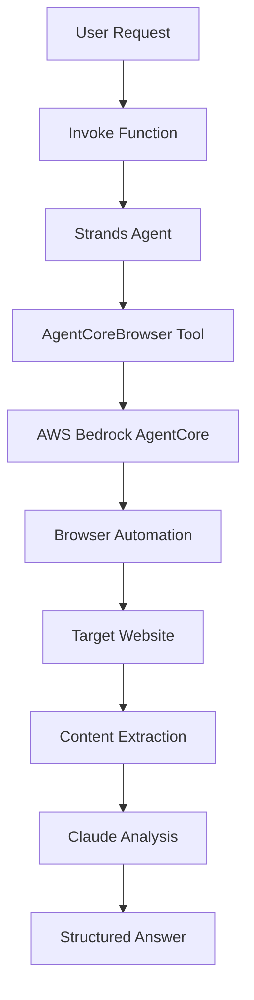

# Intelligent Web Analysis with Strands and AgentCoreBrowser

## Overview

This demo shows how to give a Strands agent the ability to browse the web by adding `AgentCoreBrowser` as a tool. The agent receives a natural language question, autonomously navigates to the relevant page, reads the content, and synthesises a structured answer — all without you managing the browser session lifecycle.

## Architecture



## How It Works

### The `AgentCoreBrowser` Tool

`strands_tools.browser.AgentCoreBrowser` is the official Strands integration for AgentCore Browser. It wraps the full browser session lifecycle (start, connect, stop) into a single Strands tool that an agent can call like any other:

```python
from strands import Agent
from strands.models import BedrockModel
from strands_tools.browser import AgentCoreBrowser

agent_core_browser = AgentCoreBrowser(region="us-west-2")

agent = Agent(
    model=BedrockModel(model_id="global.anthropic.claude-haiku-4-5-20251001-v1:0"),
    tools=[agent_core_browser.browser],
    system_prompt="You are a web research assistant. Use the browser tool to find accurate information.",
)
```

The `agent_core_browser.browser` tool exposes the browser capability to the LLM's tool schema. When the agent decides to browse a URL, it calls this tool with the target URL and any instructions, and the tool returns the page content.

### The Shared Agent (`utils/browser_agent.py`)

The agent is defined once in `utils/browser_agent.py` and imported by the demo:

```python
from utils.browser_agent import create_agent

agent = create_agent()
response = agent("Visit https://www.marketwatch.com/investing/stock/tsla and report the current price")
```

This pattern — defining the agent in `utils/` and importing it in scripts — makes it easy to reuse the same agent configuration across multiple demos.

### System Prompt Design

The system prompt guides the agent to use the browser tool consistently and return well-structured answers:

```
You are a web research assistant specialising in financial data and web content analysis.
When asked about a website or web content, ALWAYS use the browser tool to navigate to
the actual page and extract the information directly. Do not make assumptions.
```

Without an explicit instruction to use the tool, the LLM may answer from training data instead of fetching current information.

### How Strands Handles Tool Calls

When you call `agent(query)`, Strands:

1. Sends the query + tool schema to the LLM
2. LLM decides to call `browser` with a URL and instructions
3. Strands runs the tool — AgentCoreBrowser starts a session, navigates, extracts content
4. Content is fed back to the LLM as a tool result
5. LLM synthesises a final answer

The loop repeats until the LLM produces a final text response without further tool calls.

### Reading the Response

```python
response = agent("What is Apple's current stock price?")

# response is a strands AgentResult
if hasattr(response, "message"):
    for block in response.message.get("content", []):
        if block.get("text"):    # Note: type may be None in current SDK
            print(block["text"])
```

> **Note**: In the current Strands SDK, content blocks in the final message have `type=None` rather than `type="text"`. Check `block.get("text")` directly rather than checking `block.get("type") == "text"`.

## What Happens Behind the Scene

When you call `agent(query)`, the Strands Agent initializes with Claude Haiku and connects to AWS Bedrock's AgentCore browser automation service. The agent intelligently navigates to the target website, extracts the requested information, then processes it through Claude's AI to generate a structured answer.

The `invoke()` function pattern used in the demo coordinates multiple AWS services behind a single function call:

1. The agent receives the natural language prompt
2. It calls `AgentCoreBrowser` which starts an AgentCore Browser session
3. The browser navigates to the target URL and extracts page content
4. Content is fed back to the LLM as a tool result
5. Claude synthesises a final structured answer
6. The browser session is stopped automatically

```python
# Direct invoke pattern
result = invoke({"prompt": "Analyze Tesla stock at https://www.marketwatch.com/investing/stock/tsla"})

# Interactive helper
result = analyze_website("https://www.marketwatch.com/investing/stock/aapl", "What is Apple's current valuation?")
```

## Prerequisites

```bash
pip install -r ../requirements.txt
```

Requires access to Claude Haiku 4.5 in your AWS region. Set `AWS_DEFAULT_REGION=us-west-2` or configure via the AWS CLI.

## Usage

```bash
# Default demo (Tesla stock analysis on MarketWatch)
python demo.py

# Single custom prompt
python demo.py --prompt "Analyze Apple stock at https://www.marketwatch.com/investing/stock/aapl and provide key metrics"

# URL + focused question
python demo.py \
  --url "https://www.marketwatch.com/investing/stock/nvda" \
  --question "What is NVIDIA's current market cap and P/E ratio?"
```

## IAM Permissions

```json
{
  "Effect": "Allow",
  "Action": [
    "bedrock-agentcore:StartBrowserSession",
    "bedrock-agentcore:StopBrowserSession",
    "bedrock-agentcore:ConnectBrowserAutomationStream",
    "bedrock:InvokeModel"
  ],
  "Resource": "*"
}
```

## Files

| File | Description |
|:-----|:------------|
| `demo.py` | Main demo script |
| `../utils/browser_agent.py` | Shared Strands agent with `AgentCoreBrowser` tool |
