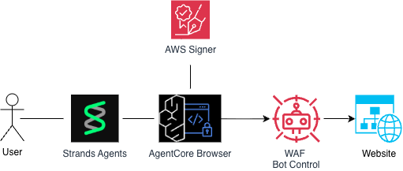

# AgentCore Browser — Web Bot Auth Signing

| Information         | Details                                                                 |
|:--------------------|:------------------------------------------------------------------------|
| Tutorial type       | Feature demonstration                                                   |
| Agent type          | Single — Strands agent with AgentCoreBrowser                            |
| Agentic Framework   | Strands Agents                                                          |
| LLM model           | Anthropic Claude Haiku 4.5                                              |
| Tutorial components | AgentCore Browser, Web Bot Auth (`browserSigning`), SequentialExecutor |
| Example complexity  | Intermediate                                                            |

## Overview

Web Bot Auth (WBA) is a Cloudflare standard that lets browsers prove they are legitimate AI agents
by attaching cryptographic signatures to every outgoing HTTP request. When `browserSigning` is
enabled on an AgentCore Browser resource, the service automatically signs requests with
`Signature`, `Signature-Input`, and `Signature-Agent` HTTP headers — removing CAPTCHAs that would
otherwise block AI agents.

This demo creates two Strands agents:

1. **SIGNED** — custom browser with `browserSigning.enabled=True`
2. **UNSIGNED** — default managed browser (no signing)

Both visit `https://crawltest.com/cdn-cgi/web-bot-auth` (Cloudflare's WBA test endpoint) and a
comparison agent summarises the difference.

## Architecture



## How Request Signing Works

When `browserSigning={"enabled": True}` is set, the following process runs for every outgoing HTTP/HTTPS request:

```
┌─────────────────┐    ┌───────────────────┐    ┌──────────────────────┐    ┌──────────────┐
│  Agent Request  │ ──▶│ AgentCore Browser │ ──▶│ Sign Request Headers │ ──▶│Target Website│
└─────────────────┘    └───────────────────┘    └──────────────────────┘    └──────────────┘
                                                          │
                                                          ▼
                                              Adds Web Bot Auth headers:
                                              • Signature-Input
                                              • Signature-Agent
                                              • Signature
```

1. **Browser Configuration** — `create_browser(browserSigning={"enabled": True})` activates signing for all sessions on this browser resource
2. **Agent Initialization** — `AgentCoreBrowser(identifier=browser_id)` connects the Strands tool to the signed browser
3. **Request Interception** — the browser intercepts all HTTP/HTTPS requests before sending them
4. **Signature Injection** — `Signature`, `Signature-Input`, and `Signature-Agent` headers are added per RFC 9421

## Security Benefits

- **Automatic Authentication** — no manual header management required
- **Request Integrity** — cryptographic signatures prevent request tampering
- **AWS Integration** — seamless IAM credential integration for agents using the browser tool
- **Session Management** — each session gets its own secure browser context
- **Audit Trail** — all signed requests can be logged for compliance

## Key Concepts

- **`browserSigning={"enabled": True}`** — passed to `create_browser()` on the control-plane client
- **`SequentialToolExecutor`** — prevents concurrent CDP tool calls that cause asyncio task conflicts
- **`AgentCoreBrowser(identifier=browser_id)`** — connects a Strands tool to the custom (signed) browser

## Sample Prompts

**Prompt**: "Visit crawltest.com/cdn-cgi/web-bot-auth and report the HTTP status code and response body."
**Expected Behavior**: Signed agent reports HTTP 200 and a response indicating successful WBA authentication.

**Prompt**: "What Signature headers are present in the HTTP response from crawltest.com?"
**Expected Behavior**: Signed agent identifies `Signature`, `Signature-Input`, and `Signature-Agent` headers.

**Prompt**: "Compare signed vs unsigned browser access to crawltest.com."
**Expected Behavior**: Signed agent passes WBA; unsigned agent receives a challenge or blocked response.

**Prompt**: "What is Web Bot Auth and why does the signed browser succeed?"
**Expected Behavior**: Agent explains the RFC 9421 signing mechanism and how AgentCore implements it.

## Troubleshooting

### RuntimeError: "Leaving task does not match the current task"
**Issue**: Browser tool operations ran concurrently inside an async Strands agent.
**Solution**: Use `SequentialToolExecutor()` — already included in this script. It ensures all tool calls execute one at a time.

### ConflictException when creating the browser
**Issue**: A browser with the same name already exists.
**Solution**: The script generates a UUID suffix for the browser name so each run is unique.

### Unsigned agent also passes the challenge
**Issue**: Cloudflare WBA test behaviour may vary by IP or time.
**Solution**: The test endpoint (`crawltest.com`) is a demo site. Results are illustrative; the presence or absence of `Signature` headers in request logs is the authoritative signal.

## Clean Up

```bash
# If --skip-cleanup was used:
aws bedrock-agentcore-control delete-browser --browser-id <browser_id>
aws iam delete-role-policy --role-name <role_name> --policy-name BrowserWebBotAuthPolicy
aws iam delete-role --role-name <role_name>
```

## Running the Python Script

```bash
pip install -r ../requirements.txt

# Run with automatic cleanup
python web_bot_auth.py --region us-west-2

# Keep resources for further inspection
python web_bot_auth.py --region us-west-2 --skip-cleanup
```

## Further Reading

- [AgentCore Browser Web Bot Auth (AWS Blog)](https://aws.amazon.com/blogs/machine-learning/reduce-captchas-for-ai-agents-browsing-the-web-with-web-bot-auth-preview-in-amazon-bedrock-agentcore-browser/)
- [Cloudflare Web Bot Auth documentation](https://developers.cloudflare.com/bots/reference/bot-verification/web-bot-auth/)
- [HTTP Message Signatures (RFC 9421)](https://datatracker.ietf.org/doc/rfc9421/)
- [AgentCore Browser documentation](https://docs.aws.amazon.com/bedrock-agentcore/latest/devguide/browser-tool.html)
