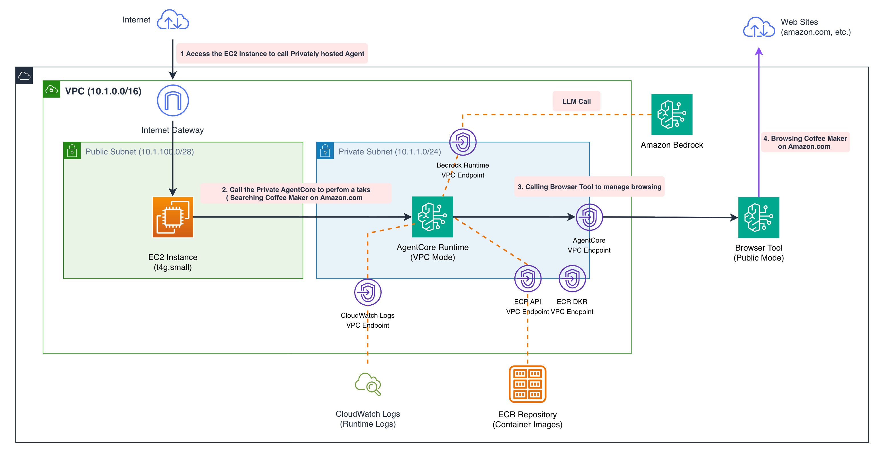

# AgentCore Browser — Public Browser + Private VPC Runtime

| Information         | Details                                                           |
|:--------------------|:------------------------------------------------------------------|
| Tutorial type       | Infrastructure / Architecture pattern                             |
| Agent type          | Hybrid — public AgentCore Browser + private AgentCore Runtime     |
| Agentic Framework   | AgentCore Runtime (HTTP)                                          |
| LLM model           | Amazon Bedrock (configured in CFN template)                       |
| Tutorial components | AgentCore Browser (PUBLIC), AgentCore Runtime (VPC), CloudFormation |
| Example complexity  | Advanced                                                          |

## Overview

This sample deploys a hybrid architecture where the **AgentCore Browser** runs in a **public
subnet** with direct internet access, while the **AgentCore Runtime** runs in a **private subnet**
with no internet egress. The two components communicate through secure internal AWS channels.

This pattern separates concerns:
- **Public browser** — reaches any website, handles real-time data retrieval
- **Private runtime** — processes sensitive business logic in isolation, satisfies compliance requirements

## Architecture



## Key Concepts

- **Browser PUBLIC mode** — `networkMode: PUBLIC` gives the browser direct internet egress
- **Runtime VPC mode** — the agent executes inside a private subnet; external traffic is routed through the browser
- **Development EC2 instance** — the CFN stack provisions an instance in the private subnet to invoke the runtime from inside the VPC

## Deployment

```bash
# Deploy the stack (~10 minutes)
python deploy.py --region us-east-1

# Clean up when done
python deploy.py --cleanup --region us-east-1
```

Alternatively, deploy with the AWS CLI:

```bash
aws cloudformation deploy \
  --template-file cfn-browser.yaml \
  --stack-name agentcore-public-browser-private-vpc \
  --capabilities CAPABILITY_IAM CAPABILITY_NAMED_IAM \
  --region us-east-1
```

## Testing

After deployment, `deploy.py` prints step-by-step instructions:

1. Connect to the EC2 development instance via AWS Systems Manager Session Manager
2. Install Python dependencies on the instance
3. Run `call-agent.py` from inside the private subnet

The agent (running in the private runtime) uses the public browser to fetch live web data and returns the result.

## Troubleshooting

### Stack creation fails at VPC resource
**Issue**: Region may not have enough EIPs or the AZ selection is invalid.
**Solution**: Check the `AvailabilityZone` CloudFormation parameter; update the template or pass a valid AZ for your region.

### Agent invocation times out
**Issue**: Runtime is still initialising or the EC2 instance lacks outbound connectivity to the AgentCore control plane.
**Solution**: Wait 1-2 minutes after stack creation, then retry. Check CloudWatch log group `/aws/bedrock-agentcore/runtimes/<id>` for details.

### Session Manager connection fails
**Issue**: SSM Agent not running on the EC2 instance or missing IAM permissions.
**Solution**: The CFN template attaches `AmazonSSMManagedInstanceCore` — wait a few minutes for agent registration, then retry.

## Clean Up

```bash
python deploy.py --cleanup --region us-east-1 --stack-name agentcore-public-browser-private-vpc
```

## Files

| File | Description |
|:-----|:------------|
| `deploy.py` | Deploy and clean up the CloudFormation stack |
| `cfn-browser.yaml` | CloudFormation template — VPC, Browser (public), Runtime (VPC), EC2 |
| `architecture-browser.png` | Architecture diagram |

## Further Reading

- [AgentCore Browser network modes](https://docs.aws.amazon.com/bedrock-agentcore/latest/devguide/browser-tool.html)
- [AgentCore Runtime VPC configuration](https://docs.aws.amazon.com/bedrock-agentcore/latest/devguide/runtime-vpc.html)
