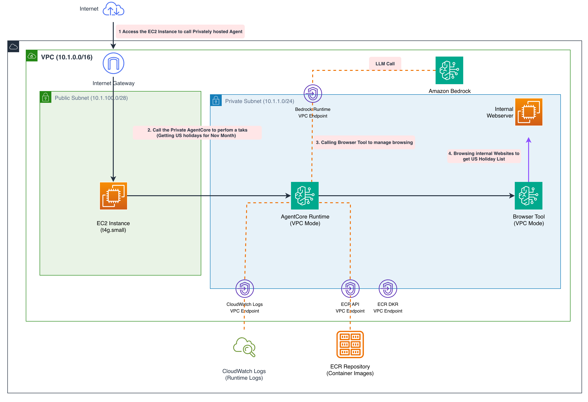

# AgentCore Browser — VPC Browser from VPC Runtime (Fully Private)

| Information         | Details                                                               |
|:--------------------|:----------------------------------------------------------------------|
| Tutorial type       | Infrastructure / Architecture pattern                                 |
| Agent type          | Hybrid — VPC AgentCore Browser + VPC AgentCore Runtime               |
| Agentic Framework   | AgentCore Runtime (HTTP)                                              |
| LLM model           | Amazon Bedrock (configured in CFN template)                           |
| Tutorial components | AgentCore Browser (VPC), AgentCore Runtime (VPC), internal web server |
| Example complexity  | Advanced                                                              |

## Overview

This sample deploys a fully private architecture where **both** the AgentCore Browser and Runtime
operate inside a VPC with **no public internet egress**. The browser is limited to internal
resources — an EC2 web server running on port 8080 that hosts a holiday calendar page.

Use this pattern when:
- Agents must access internal intranet / corporate portal pages
- Data must never leave the VPC (compliance / air-gap requirements)
- You need to browse private IP addresses inaccessible from the public internet

## Architecture



## Key Concepts

- **Browser VPC mode** — `networkMode: VPC` restricts egress to VPC-only traffic; no NAT gateway
- **Internal web server** — the CFN template provisions an EC2 instance serving a simple HTTP page at port 8080; the browser can reach it by private IP but cannot reach `google.com`
- **Runtime + Browser separation** — the Runtime invokes the VPC Browser via the AgentCore control plane; both must have matching VPC configuration

## Deployment

```bash
# Deploy the stack (~13 minutes)
python deploy.py --region us-east-1

# Clean up when done
python deploy.py --cleanup --region us-east-1
```

Alternatively, with the AWS CLI:

```bash
aws cloudformation deploy \
  --template-file cfn-vpc-browser.yaml \
  --stack-name agentcore-vpc-browser-from-vpc \
  --capabilities CAPABILITY_IAM CAPABILITY_NAMED_IAM \
  --region us-east-1
```

## Testing

After deployment, `deploy.py` prints the step-by-step test instructions.
The test invokes the Runtime agent from the development EC2 instance (inside the VPC) with:

```
"Access <web_server_ip> over http at port 8080 to check what are holidays in November"
```

The agent uses the VPC Browser to fetch the internal page and returns the parsed holiday list.

## Troubleshooting

### Browser cannot reach the internal web server
**Issue**: Security group rules may not allow inbound traffic on port 8080 from the browser's subnet.
**Solution**: Check the CloudFormation template's security group ingress rules for the web server EC2.

### Runtime cannot start a browser session
**Issue**: VPC endpoints for `bedrock-agentcore` may not be configured, or subnet/SG settings block the API calls.
**Solution**: Verify that the VPC has the required `bedrock-agentcore` interface endpoint. The CFN template creates this automatically.

### Agent times out without response
**Issue**: The Runtime or Browser is still initialising.
**Solution**: Wait 2-3 minutes after stack creation. Check CloudWatch logs for the runtime.

## Clean Up

```bash
python deploy.py --cleanup --region us-east-1 --stack-name agentcore-vpc-browser-from-vpc
```

## Files

| File | Description |
|:-----|:------------|
| `deploy.py` | Deploy and clean up the CloudFormation stack |
| `cfn-vpc-browser.yaml` | CloudFormation template — VPC, Browser (VPC mode), Runtime (VPC), web server, EC2 |
| `Architecture-vpc-browser.png` | Architecture diagram |

## Further Reading

- [AgentCore Browser VPC mode](https://docs.aws.amazon.com/bedrock-agentcore/latest/devguide/browser-tool.html)
- [AgentCore Runtime VPC configuration](https://docs.aws.amazon.com/bedrock-agentcore/latest/devguide/runtime-vpc.html)
