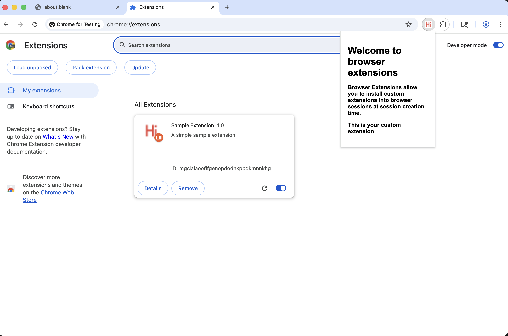
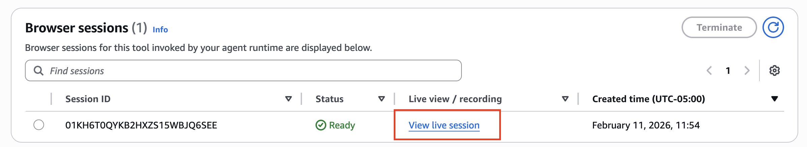
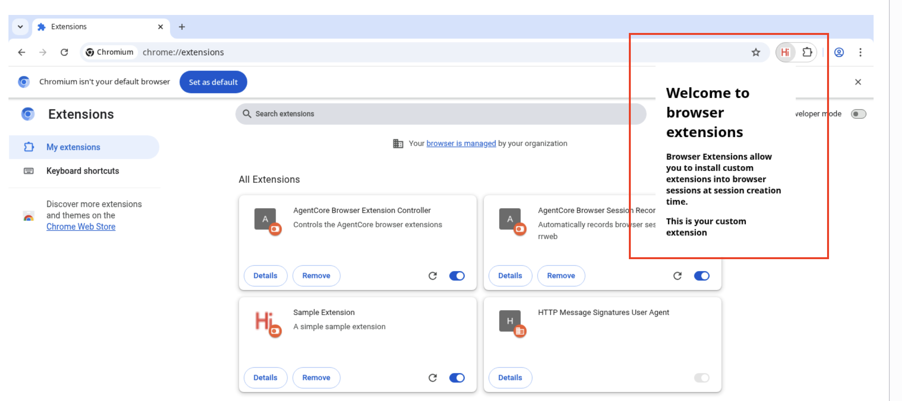

# AgentCore Browser — Browser Extensions

| Information         | Details                                                              |
|:--------------------|:---------------------------------------------------------------------|
| Tutorial type       | Feature demonstration                                                |
| Agent type          | Direct SDK (Playwright) — no LLM agent                               |
| Agentic Framework   | Playwright (CDP)                                                     |
| LLM model           | None                                                                 |
| Tutorial components | AgentCore Browser, Chrome Extensions, S3, Playwright                |
| Example complexity  | Intermediate                                                         |

## Overview

AgentCore Browser supports loading custom Chrome extensions into browser sessions at
session-creation time. Extensions are stored in S3 as zip files and loaded via the `extensions`
parameter of `start_browser_session()`.

Use cases:
- Load a corporate content-security or DLP extension into every agent session
- Add custom browser automation helpers (screenshot annotators, form fillers)
- Test your extension under agent-driven browser conditions

This demo zips the sample extension in `./extension/`, uploads it to S3, starts a session with
the extension loaded, and uses Playwright to verify `chrome://extensions/` shows the extension.

## Key Concepts

- **Extension as S3 artifact** — the extension directory is zipped and uploaded to S3 before session creation
- **`extensions` parameter** — passed to `start_browser_session()` with `location.s3.bucket/prefix`
- **Works with managed and custom browsers** — the `extensions` parameter is supported on both

```python
response = browser_client.start_browser_session(
    browserIdentifier=browser_id,
    extensions=[{
        "location": {
            "s3": {
                "bucket": "my-bucket",
                "prefix": "extensions/my_extension.zip"
            }
        }
    }],
)
```

## Architecture

```
  extension/ directory
       │
       ▼
  zip -r sample_extension.zip extension/
       │
       ▼
  s3://bucket/extensions/sample_extension.zip
       │
       ▼
  start_browser_session(extensions=[{location: {s3: ...}}])
       │
       ▼
  Browser session (extension installed and active)
       │
       ▼
  Playwright → chrome://extensions/ → extension is visible
```

## Local Extension Testing

Before deploying to AgentCore, you can verify that the extension works correctly using a local Playwright session. This is a useful pre-flight check that doesn't require AWS credentials:

```python
from playwright.async_api import async_playwright

extension_path = "./extension"

async with async_playwright() as p:
    context = await p.chromium.launch_persistent_context(
        user_data_dir="./user-data",
        headless=False,
        args=[
            f"--disable-extensions-except={extension_path}",
            f"--load-extension={extension_path}",
        ],
    )
    page = await context.new_page()
    await page.goto("chrome://extensions/")
    await page.wait_for_timeout(2000)

    input("Press Enter to close...")
    await context.close()
```

This opens a visible Chrome window with the extension loaded. Click the extension icon to verify the popup works before uploading to S3.



> **Note**: `launch_persistent_context` with `headless=False` requires a display. This local test runs on your development machine, not inside the AgentCore sandbox.

## Running the Script

```bash
pip install -r ../requirements.txt
playwright install chromium

# Run the full demo
python browser_extensions.py --region us-east-1

# Keep the browser running after the demo for manual inspection
python browser_extensions.py --region us-east-1 --skip-cleanup
```

While the script is running, open the AgentCore console → Built-in Tools → your browser → **View live session** to see the extension popup in the remote Chrome UI.



After the script navigates to `chrome://extensions/`, the extension will be visible in the remote session:



## Sample Extension

The `extension/` directory contains a minimal Chrome extension:

| File | Purpose |
|:-----|:--------|
| `manifest.json` | Extension manifest (Manifest V3) |
| `popup.html` | Simple "Hello Extensions" popup |
| `hello_extensions.png` | Extension icon |

## Troubleshooting

### Extension not visible in chrome://extensions/
**Issue**: The extension zip may be malformed or uploaded to the wrong S3 path.
**Solution**: Verify the zip contains `manifest.json` at the root level (not inside a subdirectory). The script uses `cd extension && zip -r ... .` to ensure this.

### S3 upload fails with permission error
**Issue**: The IAM user/role running the script does not have `s3:PutObject` on the bucket.
**Solution**: Ensure the AWS credentials have S3 write access. The bucket is created automatically by the script.

### Extension loads but popup doesn't appear
**Issue**: The live browser view shows a headless Chrome window; clicking the extension icon requires an interactive session.
**Solution**: This is expected for headless automation. The extension is active (verifiable at `chrome://extensions/`) even if the popup cannot be triggered in headless mode.

## Clean Up

```bash
# Automatic cleanup (default):
python browser_extensions.py --region us-east-1
# → deletes browser, local zip file

# Manual cleanup if --skip-cleanup was used:
aws bedrock-agentcore-control delete-browser --browser-id <id>
```

## Files

| File | Description |
|:-----|:------------|
| `browser_extensions.py` | Main demo script |
| `extension/` | Sample Chrome extension source |
| `extension/manifest.json` | Chrome Manifest V3 definition |
| `img/` | Screenshots of local and remote extension |

## Further Reading

- [AgentCore Browser extensions documentation](https://docs.aws.amazon.com/bedrock-agentcore/latest/devguide/browser-extensions.html)
- [Chrome Extension development guide](https://developer.chrome.com/docs/extensions/mv3/getstarted/)
