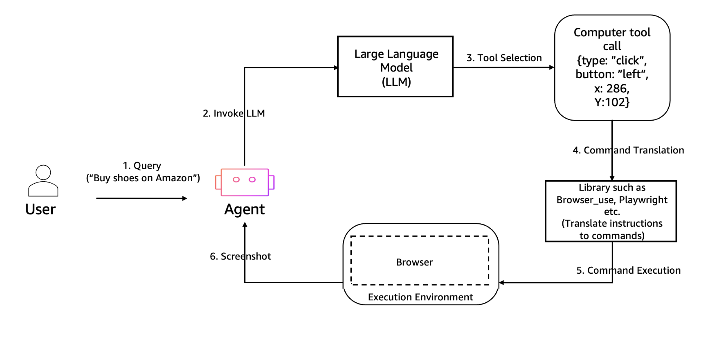

# AgentCore Browser Tool

## Overview

[Amazon Bedrock AgentCore Browser Tool](https://docs.aws.amazon.com/bedrock-agentcore/latest/devguide/browser-tool-overview.html) is a fully managed, headless Chromium sandbox that your agents can control at runtime. Connect to it via the Chrome DevTools Protocol (CDP), and drive it with any browser automation framework — Nova Act, Browser-Use, or Strands — using natural language instructions.




## How the Browser Tool Works

### Starting a Session

The `browser_session()` context manager is the simplest way to connect. It starts a Chromium sandbox, yields a client, and automatically stops the session when the `with` block exits:

```python
from bedrock_agentcore.tools.browser_client import browser_session

with browser_session("us-west-2") as client:
    ws_url, headers = client.generate_ws_headers()
    # Connect your automation framework to ws_url with the provided headers
```

For explicit lifecycle control, use the `BrowserClient` class:

```python
from bedrock_agentcore.tools.browser_client import BrowserClient

client = BrowserClient("us-west-2")
client.start()
try:
    ws_url, headers = client.generate_ws_headers()
    # ... your automation ...
finally:
    client.stop()
```

### CDP WebSocket Authentication

`generate_ws_headers()` returns:

- **`ws_url`**: A `wss://` endpoint for the Chrome DevTools Protocol WebSocket
- **`headers`**: SigV4-signed HTTP headers that authenticate the WebSocket connection

Pass both to your automation framework. Without the headers, the connection is rejected.

### Custom Browser Resources

By default, `browser_session()` uses a shared AgentCore-managed browser. For advanced features — session recording, domain filtering, Chrome policies, browser profiles — you create a **custom Browser resource** with an execution role:

```python
cp_client = boto3.client("bedrock-agentcore-control", region_name=region)

resp = cp_client.create_browser(
    name="my-browser",
    executionRoleArn="arn:aws:iam::123456789012:role/my-browser-role",
    networkConfiguration={"networkMode": "PUBLIC"},
    recording={
        "enabled": True,
        "s3Location": {"bucket": "my-recordings-bucket"},
    },
)
browser_id = resp["browserId"]
```

### Available Automation Frameworks

| Framework | Import | Best For |
|:----------|:-------|:---------|
| **Nova Act** | `from nova_act import NovaAct` | Amazon's native browser agent with structured output |
| **Browser-Use** | `from browser_use import Agent, Browser` | Open-source multi-step agents with Claude |
| **Strands** | `from strands_tools.browser import AgentCoreBrowser` | Strands agent with browser as a tool |
| **Playwright** | `from playwright.async_api import async_playwright` | Low-level CDP automation, policy/proxy/profile tests |

## Demos

| Folder | Framework / API | What You'll Learn |
|:-------|:----------------|:------------------|
| [01-nova-act/](01-nova-act/) | Nova Act | Start a browser session, issue a natural language prompt, get structured output |
| [02-browser-use/](02-browser-use/) | Browser-Use | Connect the Browser-Use SDK to an AgentCore session with auth headers |
| [03-observability/](03-observability/) | Nova Act | Enable S3 recording, replay sessions, view console + network logs |
| [04-strands/](04-strands/) | Strands | Use `AgentCoreBrowser` as a Strands tool for autonomous web analysis |
| [05-domain-filtering/](05-domain-filtering/) | Playwright | Restrict browser to an allow-list of domains via AWS Network Firewall |
| [06-web-bot-auth/](06-web-bot-auth/) | Strands | Enable `browserSigning` to pass Cloudflare Web Bot Auth challenges without CAPTCHAs |
| [07-public-browser-private-vpc/](07-public-browser-private-vpc/) | CloudFormation | Hybrid: public AgentCore Browser + private VPC AgentCore Runtime |
| [08-vpc-browser-from-vpc/](08-vpc-browser-from-vpc/) | CloudFormation | Fully private: VPC Browser + VPC Runtime access internal web servers |
| [09-browser-profile/](09-browser-profile/) | Playwright | Persist cookies and localStorage across sessions with Browser Profiles |
| [10-proxy/](10-proxy/) | Playwright | Route browser traffic through a Squid proxy with full S3 audit logs |
| [11-extensions/](11-extensions/) | Playwright | Load custom Chrome extensions into browser sessions from S3 |
| [12-chrome-policies/](12-chrome-policies/) | Playwright + BrowserClient | Chrome enterprise policies (URL blocklist) and custom root CA certificates |
| [13-os-actions/](13-os-actions/) | InvokeBrowser REST | Raw OS-level mouse, keyboard, scroll, and screenshot via SigV4 REST API |

## Quick Start

```bash
pip install -r requirements.txt
playwright install chromium

# Nova Act — headless
python 01-nova-act/getting_started.py \
  --prompt "Search for macbooks and extract details of the first one" \
  --starting-page "https://www.amazon.com/" \
  --nova-act-key $NOVA_ACT_API_KEY

# Browser-Use
python 02-browser-use/getting_started.py \
  --task "Search for a coffee maker on amazon.com and extract details of the first one"

# Strands agent
python 04-strands/demo.py \
  --url "https://www.marketwatch.com/investing/stock/tsla" \
  --question "What is the current stock price and P/E ratio?"

# Observability (creates custom browser with S3 recording)
python 03-observability/browser_observability.py \
  --nova-act-key $NOVA_ACT_API_KEY --skip-cleanup

# Domain filtering (deploy CloudFormation stack first)
aws cloudformation deploy \
  --template-file 05-domain-filtering/agentcore-browser-firewall.yaml \
  --stack-name agentcore-browser-firewall \
  --capabilities CAPABILITY_IAM
python 05-domain-filtering/verify_domain_filtering.py

# Web Bot Auth signing
python 06-web-bot-auth/web_bot_auth.py --region us-west-2

# Browser profile persistence (deploy sample-ecommerce first)
python 09-browser-profile/browser_profile.py --cfn-url https://xxxx.cloudfront.net

# Squid proxy routing (deploy CFN stack first)
python 10-proxy/verify_proxy.py

# Browser extensions
python 11-extensions/browser_extensions.py --region us-east-1

# Chrome enterprise policies + root CA
python 12-chrome-policies/chrome_policies.py --region us-west-2

# OS-level actions (InvokeBrowser)
python 13-os-actions/os_actions.py --region us-west-2
```

## Shared Agent

Demo `04-strands` and `06-web-bot-auth` use Strands agents with `AgentCoreBrowser`. The shared
agent in `utils/browser_agent.py` is used by `04-strands`:

```python
from strands import Agent
from strands_tools.browser import AgentCoreBrowser

def create_agent() -> Agent:
    browser = AgentCoreBrowser(region=REGION)
    return Agent(
        model=MODEL_ID,
        tools=[browser.browser],
        system_prompt=SYSTEM_PROMPT,
    )
```

The `AgentCoreBrowser` integration handles the full browser session lifecycle automatically — no explicit start/stop required.

## IAM Permissions

```json
{
  "Effect": "Allow",
  "Action": [
    "bedrock-agentcore:StartBrowserSession",
    "bedrock-agentcore:StopBrowserSession",
    "bedrock-agentcore:ConnectBrowserAutomationStream",
    "bedrock-agentcore:ConnectBrowserLiveViewStream",
    "bedrock-agentcore:CreateBrowser",
    "bedrock-agentcore:DeleteBrowser",
    "bedrock-agentcore:InvokeBrowser",
    "bedrock-agentcore:SaveBrowserSessionProfile",
    "bedrock-agentcore:CreateBrowserProfile",
    "bedrock-agentcore:DeleteBrowserProfile",
    "bedrock:InvokeModel"
  ],
  "Resource": "*"
}
```

See [Browser Tool IAM reference](https://docs.aws.amazon.com/bedrock-agentcore/latest/devguide/browser-tool-permissions.html) for full details.
