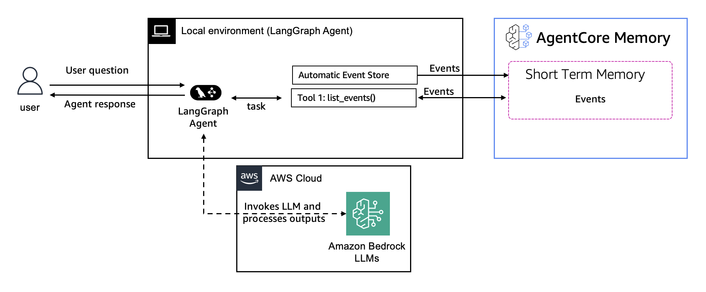

# AgentCore memory — Short-term memory

Short-term memory stores raw conversation turns (events) scoped to an actor and session, plus branching for exploratory or parallel flows. It provides immediate, low-latency context for a conversation without background processing.

## Folder layout

| Folder | Purpose |
|---|---|
| [`02-single-agent/`](./02-single-agent/) | Framework integrations (Strands, LangGraph, LlamaIndex) with the three patterns: built-in hook, custom hook, memory-as-tool |
| [`03-multi-agent/`](./03-multi-agent/) | Multi-agent STM with shared context, including parallel branching |

## The three integration patterns (per framework)

| Pattern | What it is | When to use |
|---|---|---|
| **Built-in hook** | Use the framework's out-of-the-box AgentCore memory hook | Fastest path; standard save/retrieve lifecycle |
| **Custom hook** | Subclass/implement your own hook | Conditional logic, custom retrieval, orchestration |
| **memory-as-tool** | Expose memory operations as tools the agent calls | Agent decides when to recall/save |

## Framework × pattern notebooks

### Single-agent

| Framework | Built-in hook | Custom hook | memory-as-tool |
|---|---|---|---|
| Strands | [`personal-agent.py`](./02-single-agent/with-strands-agent/personal-agent.py) | [`personal-agent-memory-manager.py`](./02-single-agent/with-strands-agent/personal-agent-memory-manager.py) | _gap_ |
| LangGraph | [`math-agent-with-checkpointing.py`](./02-single-agent/with-langgraph-agent/math-agent-with-checkpointing.py) | [`personal-fitness-coach.py`](./02-single-agent/with-langgraph-agent/personal-fitness-coach.py) | [`support-agent-human-in-the-loop.py`](./02-single-agent/with-langgraph-agent/support-agent-human-in-the-loop.py) |
| LlamaIndex | _gap_ | _gap_ | four domain examples in [`with-llamaindex-agent/`](./02-single-agent/with-llamaindex-agent/) |

**Branching** (Strands): [`travel-planning-branching/`](./02-single-agent/with-strands-agent/travel-planning-branching/)

### LangGraph integration architecture

The LangGraph agent stores conversation turns in AgentCore memory via an automatic event store and retrieves past events with a `list_events()` tool. The agent calls Amazon Bedrock LLMs (AWS Cloud) for reasoning while the AgentCore memory service handles raw event storage. See the scripts under [`02-single-agent/with-langgraph-agent/`](./02-single-agent/with-langgraph-agent/) for the implementation.

### Multi-agent (Strands)

- Built-in hook: [`travel-planning-agent.py`](./03-multi-agent/with-strands-agent/travel-planning-agent.py)
- Custom hook: [`travel-planning-agent-memory-manager.py`](./03-multi-agent/with-strands-agent/travel-planning-agent-memory-manager.py)
- Parallel branching: [`multi-agent-parallel-branches/`](./03-multi-agent/with-strands-agent/multi-agent-parallel-branches/)

## Next steps

- Cross-session persistence: [`../02-long-term-memory/`](../02-long-term-memory/)
- Security and isolation: [`../04-security-patterns/`](../04-security-patterns/)

## Running the Python Scripts

Install dependencies and run scripts from the sub-folders:

