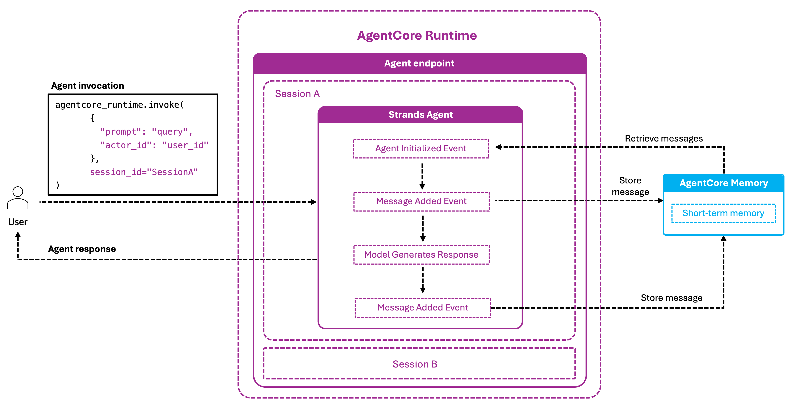

# Advanced patterns

Composite use cases that build on top of the memory primitives covered in [`../02-long-term-memory/01-core-features/`](../02-long-term-memory/01-core-features/).

| Folder | Pattern | Starts from |
|---|---|---|
| [`01-runtime-integration/`](./01-runtime-integration/) | memory + AgentCore runtime | Any framework example |
| [`02-identity-integration/`](./02-identity-integration/) | memory + AgentCore identity + runtime | runtime integration |
| [`03-guardrails-integration/`](./03-guardrails-integration/) | memory + Bedrock Guardrails | Any long-term memory example |
| [`04-memory-browser/`](./04-memory-browser/) | Web UI for inspecting memory resources | — |
| [`05-streaming-use-cases/`](./05-streaming-use-cases/) | Cross-region replication, personalisation, cross-customer analytics — all built on the streaming primitive | [LTM 01-core-features/09-record-streaming](../02-long-term-memory/01-core-features/09-record-streaming.py) |
| [`06-observability.py`](./06-observability.py) | CloudWatch metrics and logs for stream health and extraction pipelines | — |

## runtime integration architecture



When a user invokes the agent endpoint, AgentCore runtime starts a session and runs the Strands agent. memory hooks fire at two points in the lifecycle:

- **Agent Initialized Event** — the hook retrieves recent conversation turns from AgentCore memory and injects them into the agent's context before the first LLM call.
- **Message Added Event** — each new user and assistant message is immediately stored in AgentCore memory's short-term store.

This means the agent can continue a conversation seamlessly across multiple runtime sessions: even after a session expires, the next invocation re-hydrates the conversation from memory. See [`01-runtime-integration/`](./01-runtime-integration/) for a hello-world example and [`02-identity-integration/`](./02-identity-integration/) for the Cognito-authenticated variant.

For the **streaming primitive itself** (enabling streaming, `METADATA_ONLY` vs `FULL_CONTENT` modes, consuming from Kinesis), see [LTM 01-core-features/09-record-streaming.py](../02-long-term-memory/01-core-features/09-record-streaming.py). That notebook is the prerequisite for everything in `05-streaming-use-cases/`.

## Running the Python Scripts

Navigate into each sub-folder and run the scripts:

```bash
pip install -r requirements.txt  # if present
```

```bash
# 01-runtime-integration/
python 01-runtime-integration/runtime_memory_integration.py
python 01-runtime-integration/runtime_memory_agent.py
```

```bash
# 02-identity-integration/
python 02-identity-integration/runtime_memory_identity_integration.py
python 02-identity-integration/runtime_identity_memory_agent.py
python 02-identity-integration/utils.py
```

```bash
# 03-guardrails-integration/
python 03-guardrails-integration/guardrails-memory.py
```

```bash
# 05-streaming-use-cases/
python 05-streaming-use-cases/02-personalised-recommendations.py
python 05-streaming-use-cases/03-cross-customer-analytics.py
```

