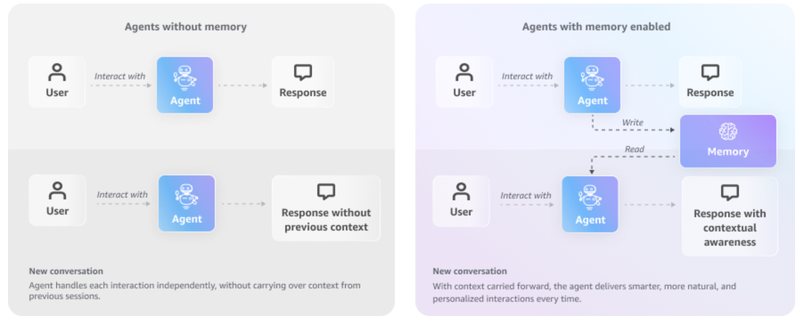

# Amazon Bedrock AgentCore memory

AgentCore memory is a fully managed service that gives your AI agents the ability to remember past interactions, enabling them to provide more intelligent, context-aware, and personalized conversations. It provides a simple and powerful way to handle both short-term context and long-term knowledge retention without the need to build or manage complex infrastructure



## Start here

New to AgentCore memory? → [`00-getting-started/`](./00-getting-started/). You'll get the vocabulary, pick a surface (CLI / boto3 / AgentCore SDK), and walk the same end-to-end flow through whichever one fits.

## Top-level layout

| Folder | What's inside |
|---|---|
| [`00-getting-started/`](./00-getting-started/) | Concepts, surface decision guide, and three quickstarts (CLI, boto3, AgentCore SDK) |
| [`01-short-term-memory/`](./01-short-term-memory/) | Events, sessions, branching — plus Strands / LangGraph / LlamaIndex single- and multi-agent examples |
| [`02-long-term-memory/`](./02-long-term-memory/) | Strategies (semantic, summary, user-preference, episodic, overrides, self-managed), namespaces, retrieval, batch APIs, redrive, streaming — plus framework examples across the three integration patterns |
| [`03-advanced-patterns/`](./03-advanced-patterns/) | runtime integration, identity integration, guardrails, memory browser, streaming use cases, observability |
| [`04-security-patterns/`](./04-security-patterns/) | IAM scoping, Cognito federation, KMS encryption |

## How this tree is organized

Two axes:

1. **memory type** → short-term vs long-term. Pick once based on what you're storing.
2. **Inside each memory type**:
   - `02-single-agent/` and `03-multi-agent/` — framework integrations (Strands, LangGraph, LlamaIndex), each offering three patterns: built-in hook, custom hook, and memory-as-tool

A third concern — access surface (CLI / boto3 / AgentCore SDK) — is orthogonal. Surfaces are interchangeable; the choice is made per notebook based on what's clearest, not by folder. The getting-started section shows the same flow in all three. Elsewhere, primitive/ops tutorials default to boto3 and agent tutorials default to the AgentCore SDK.

## The three integration patterns

| Pattern | What it is | When to use |
|---|---|---|
| **Built-in hook / callback / memory block** | The framework's out-of-the-box AgentCore adapter | Fastest path; standard save/retrieve lifecycle |
| **Custom hook / callback / memory block** | You implement your own | Conditional logic, custom retrieval, multi-strategy orchestration |
| **memory-as-tool** | memory ops exposed as tools the LLM calls | Agent decides when to recall/save |

## Finding things

- **By framework** (Strands, LangGraph, LlamaIndex) → `with-<framework>-agent/` under each memory type.
- **By pattern** (built-in / custom / tool) → one level deeper inside the framework folder.
- **By integration** (runtime, identity, Guardrails, Browser, streaming use cases) → `03-advanced-patterns/`.
- **By policy concern** (IAM, Cognito, KMS) → `04-security-patterns/`.

## AgentCore CLI

Add memory to an existing runtime agent project with the AgentCore CLI:

```bash
# Install the CLI (stable channel)
npm install -g @aws/agentcore

# Add memory to an existing project (interactive mode)
agentcore add memory

# Or non-interactive, specifying strategies
agentcore add memory \
  --name mymemory \
  --strategies SEMANTIC,USER_PREFERENCE \
  --expiry 30

# Supported strategies: SEMANTIC, SUMMARIZATION, USER_PREFERENCE, EPISODIC
# After adding memory, redeploy to sync changes
agentcore deploy
```

For direct control of memory resources (create, query, delete), use the **AWS CLI** — see [`00-getting-started/03-quickstart-cli.md`](./00-getting-started/03-quickstart-cli.md) for the full walkthrough using `aws bedrock-agentcore-control` and `aws bedrock-agentcore`.

## Resources

- [AgentCore memory documentation](https://docs.aws.amazon.com/bedrock-agentcore/latest/devguide/memory.html)
- [Deep-dive video](https://www.youtube.com/live/-N4v6-kJgwA)

## Prerequisites

- Python 3.10 or higher
- AWS account with Amazon Bedrock and AgentCore access
- Per-tutorial `requirements.txt` where present

## Running the Python Scripts

Install dependencies and run scripts from the sub-folders:

```bash
# 00-getting-started/
python 00-getting-started/04-quickstart-boto3.py
python 00-getting-started/05-quickstart-agentcore-sdk.py
```

```bash
# 03-advanced-patterns/
python 03-advanced-patterns/06-observability.py
```

```bash
# 04-security-patterns/
python 04-security-patterns/03-kms-encryption.py
```

