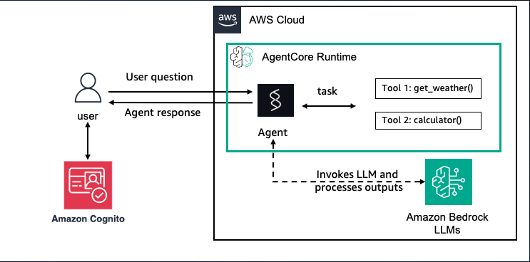
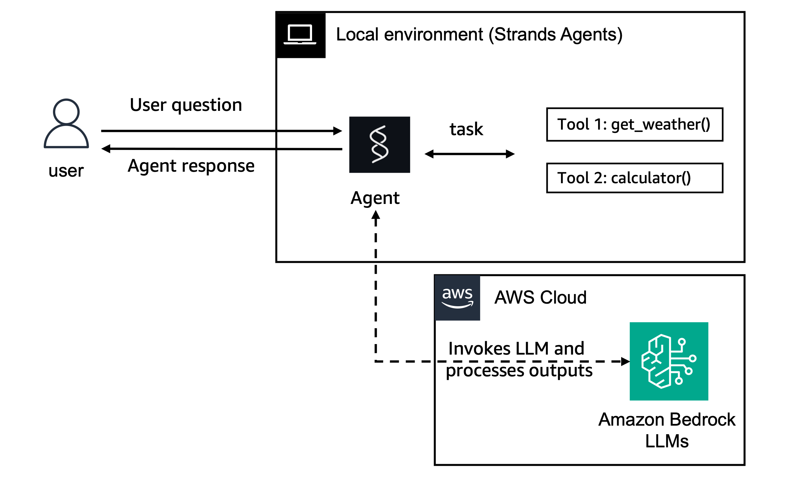
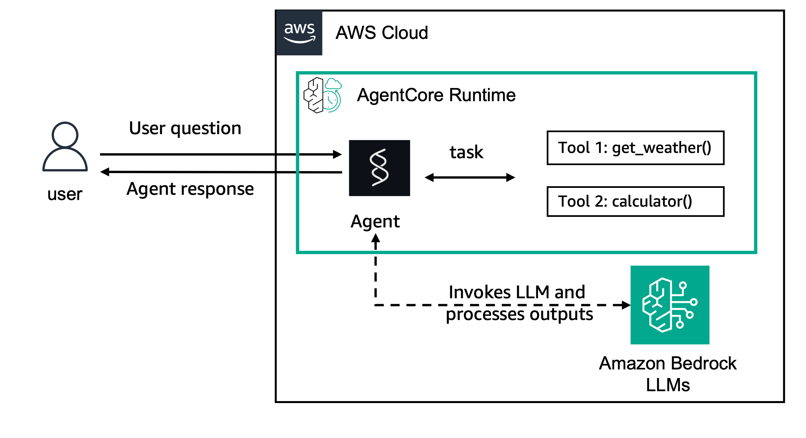

# Inbound Auth with Amazon Cognito

| Information         | Details                                                                          |
|:--------------------|:---------------------------------------------------------------------------------|
| Tutorial type       | Conversational                                                                   |
| Agent type          | Single                                                                           |
| Agentic Framework   | Strands Agents                                                                   |
| LLM model           | Anthropic Claude Haiku 4.5                                                       |
| Tutorial components | AgentCore runtime, Inbound Auth, Amazon Cognito                                  |
| Example complexity  | Easy                                                                             |

## Overview

This tutorial demonstrates how to configure an Amazon Bedrock AgentCore runtime to require
JWT bearer token authentication using **Amazon Cognito** as the identity provider.

AgentCore identity validates inbound access for users and applications calling agents or tools
in an AgentCore runtime. With **Inbound Auth**, you specify an OAuth/OIDC identity provider,
and AgentCore runtime validates every inbound request against that provider before forwarding
it to your agent.

### Tutorial Architecture



```
Client
  │
  │  Authorization: Bearer <cognito_access_token>
  ▼
AgentCore runtime  ──── customJWTAuthorizer ────► Cognito User Pool
  │                          (validates JWT)
  │  (if valid)
  ▼
Strands Agent (Claude Haiku 4.5)
  └── calculator tool
  └── weather tool
```

**Local development:**


**Deployed on AgentCore runtime:**


By default, AgentCore uses IAM (SigV4) credentials. When you configure a `customJWTAuthorizer`:
- OAuth discovery URL: the OIDC well-known endpoint of your identity provider
- Allowed clients: list of OAuth client IDs whose tokens are accepted
- Requests without a valid JWT return `AccessDeniedException`

## What is Inbound Auth?

- **Validates callers** attempting to invoke agents or tools in AgentCore runtime or gateway
- **Works with IAM** (default) or **OAuth** (Cognito, Entra ID, Okta, PingFederate, etc.)
- **Requires** a bearer token in the `Authorization: Bearer <token>` header
- **Rejects** requests without a valid token with `AccessDeniedException`

The Cognito access token is valid for **2 hours**. Use `reauthenticate_user()` to get a fresh token.

## Sample Prompts

**Prompt**: `How is the weather now?`
**Expected Behavior**: Agent calls the `weather` tool and returns "sunny"

**Prompt**: `What is 2 + 2?`
**Expected Behavior**: Agent calls the `calculator` tool and returns 4

**Prompt**: (no token — AccessDeniedException)
**Expected Behavior**: runtime rejects the request with an authorization error

**Prompt**: (expired token — AccessDeniedException)
**Expected Behavior**: runtime rejects with token expired error

## Key Concepts

- **customJWTAuthorizer**: runtime-level config linking AgentCore to your OIDC provider
- **Discovery URL**: The OIDC `/.well-known/openid-configuration` endpoint that AgentCore uses
  to fetch JWKS for JWT signature validation
- **allowedClients**: List of OAuth client IDs whose tokens are accepted (prevents token reuse
  from other applications)

## Prerequisites

- Python 3.10+
- AWS CLI configured with credentials
- AWS account with AgentCore runtime access
- `uv` installed: `curl -LsSf https://astral.sh/uv/install.sh | sh`
- Required permissions:
  - `bedrock-agentcore:*` (runtime create/invoke/delete)
  - `cognito-idp:*` (user pool create/manage)
  - `iam:CreateRole`, `iam:PutRolePolicy`, `iam:DeleteRole`
  - `s3:CreateBucket`, `s3:PutObject`
  - `bedrock:InvokeModel` on foundation models

## Setup

```bash
cd 01-inbound-auth/01-inbound-auth-cognito/

# Create and activate a virtual environment
python3 -m venv .venv
source .venv/bin/activate

pip install -r requirements.txt
```

## Running the Script

The script runs end-to-end: sets up Cognito, deploys the runtime, tests with and without auth,
then prints the state file location for reference.

```bash
python inbound_auth_runtime.py
```

### Options

```bash
# Skip deployment, use existing runtime from runtime_config.json
python inbound_auth_runtime.py --skip-deploy

# Delete all created resources (reads runtime_config.json)
python inbound_auth_runtime.py --cleanup
```

## Configuration

All configuration is auto-discovered from your AWS session. The following are set automatically:

| Variable | Source | Description |
|:---------|:-------|:------------|
| `REGION` | `boto3.Session().region_name` | AWS region |
| `ACCOUNT_ID` | `sts.get_caller_identity()` | AWS account ID |
| `AGENT_NAME` | `inbound_auth_cognito_<timestamp>` | Unique agent name |
| `S3_BUCKET` | `agentcore-code-<account>-<region>` | S3 bucket for code |

## What to Expect

```
Region:  us-east-1
Account: 123456789012
Agent:   inbound_auth_cognito_12345

=== Step 1: Setting up Amazon Cognito User Pool ===
  Created Cognito User Pool: us-east-1_AbCdEfGhI
  App client ID: 1a2b3c4d5e6f7g8h9i0j
  Test user created: testuser / MyPassword123!

=== Step 2: Creating IAM Execution Role ===
  Execution role: arn:aws:iam::123456789012:role/agentcore-...

=== Step 3: Building and Uploading Code ===
  Uploaded code to s3://agentcore-code-.../inbound_auth.../code.zip

=== Step 4: Creating AgentCore runtime with Inbound Auth ===
  runtime created: inbound_auth_cognito_12345
  Status: CREATING
  Status: READY
  runtime READY: arn:aws:bedrock-agentcore:...

=== Step 5: Testing — Invoke WITHOUT authorization ===
Expected: AccessDeniedException
  Got expected error: ClientError: An error occurred (AccessDeniedException) ...
  Agent is configured for a different authorization token type

=== Step 6: Obtaining Cognito Access Token ===
  Access token obtained: eyJraWQiOiJ...

=== Step 7: Testing — Invoke WITH authorization ===
  Agent response: The weather is currently sunny!

=== Demo Complete ===
Runtime ARN: arn:aws:bedrock-agentcore:...
State saved to: runtime_config.json

To clean up: python inbound_auth_runtime.py --cleanup
```

## Troubleshooting

### AccessDeniedException even with bearer token
**Issue**: Token is valid but the runtime rejects it.
**Solution**: Verify `allowedClients` includes the exact Cognito client ID used to issue the token.
Check that the Cognito `discovery_url` matches the pool that issued the token.

### Token expired error
**Issue**: `The access_token has expired.`
**Solution**: Call `reauthenticate_user()` to obtain a fresh token. Cognito access tokens expire
after 2 hours by default. You can extend this via the user pool client token validity settings.

### runtime creation fails with CREATE_FAILED
**Issue**: IAM role permissions not yet propagated.
**Solution**: Wait 15-30 seconds after role creation before creating the runtime. The script
includes a 10-second sleep; increase it if you still see failures.

### uv not found
**Issue**: `uv: command not found`
**Solution**: Install uv: `curl -LsSf https://astral.sh/uv/install.sh | sh` then restart your shell.

## Clean Up

```bash
# Delete all resources created by this script
python inbound_auth_runtime.py --cleanup
```

This removes:
- AgentCore runtime
- IAM execution role
- Cognito User Pool and all users
- S3 code artifacts are retained (can be deleted manually from the agentcore-code-* bucket)
