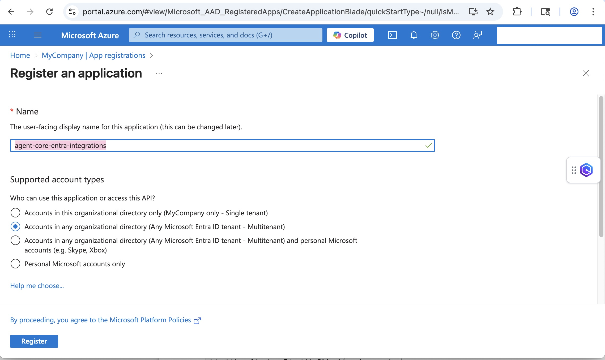
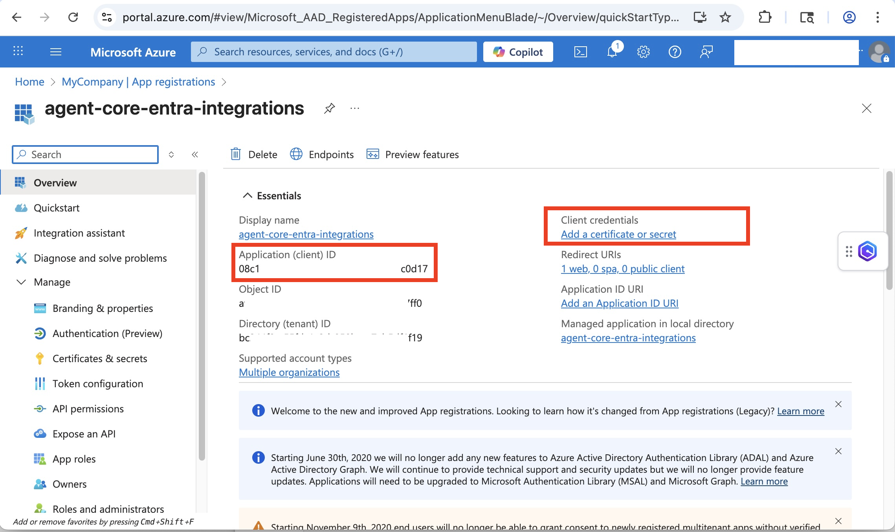
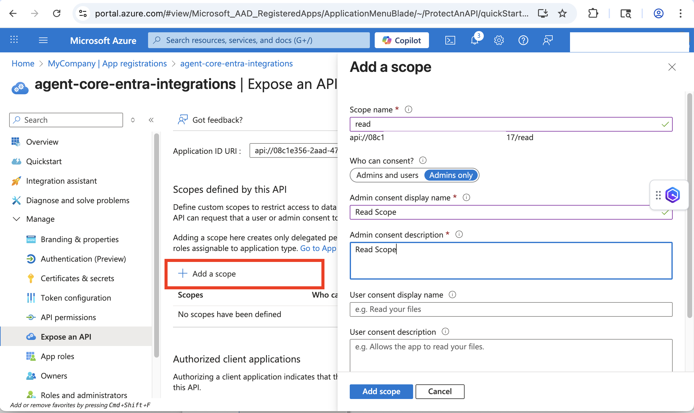
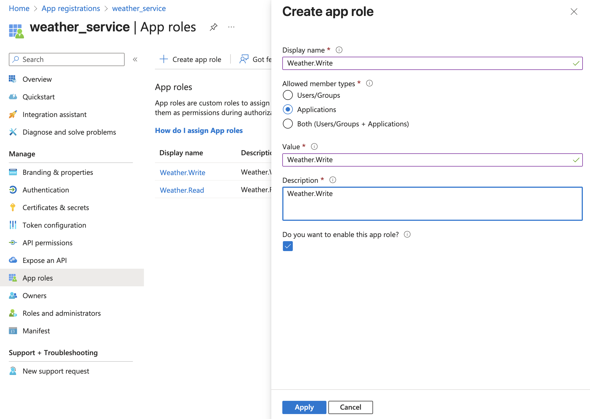
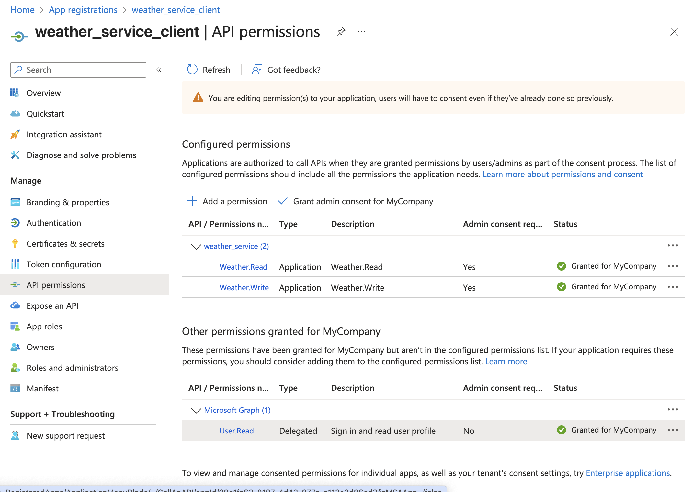
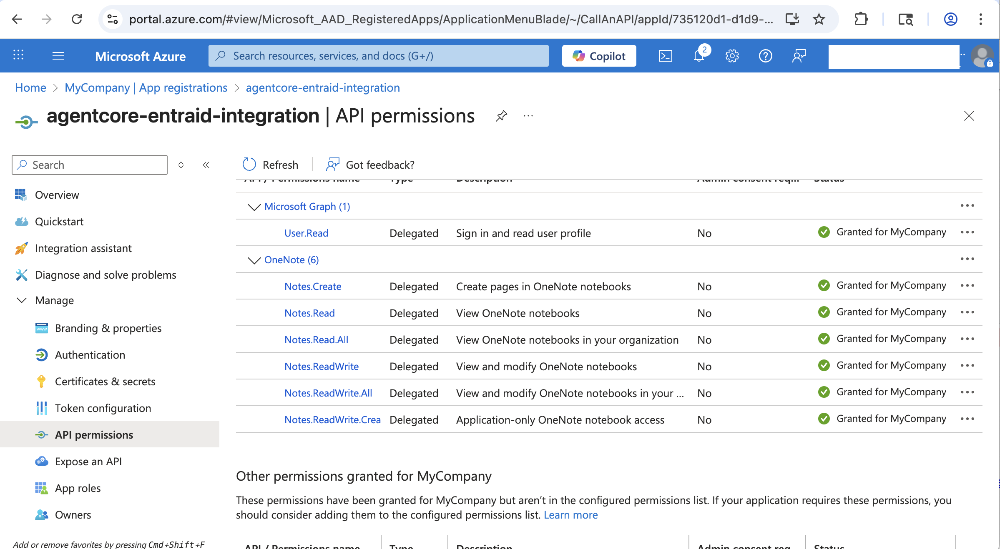
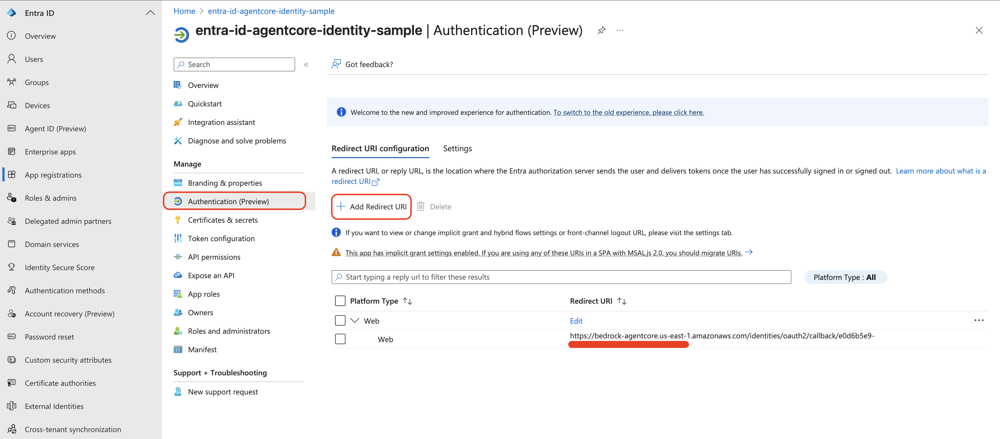
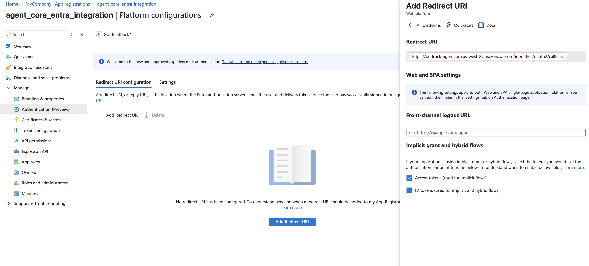

# Inbound Auth with Microsoft Entra ID

## What is Microsoft Entra ID?

Microsoft Entra ID is Microsoft's cloud-based identity and access management service that serves
as the central identity provider for Microsoft 365, Azure, and other SaaS applications.

### Key Features

- **Single Sign-On (SSO)** — Users authenticate once to access multiple applications
- **Multi-Factor Authentication (MFA)** — Enhanced security through additional verification methods
- **Conditional Access** — policy-based access control based on user, device, location, and risk
- **Application Integration** — Supports modern authentication protocols like OAuth 2.0, OpenID Connect, and SAML

### Integration with AgentCore

Microsoft Entra ID can be used as an identity provider with AgentCore identity to:

- Authenticate users before they can invoke agents (inbound authentication)
- Authorize agents to access protected resources on behalf of users (outbound authentication)
- Secure AgentCore gateway endpoints with JWT-based authorization

> **Note**: Microsoft Entra ID is not an AWS service. Please refer to [Microsoft Entra ID Documentation](https://learn.microsoft.com/en-us/entra/) for costs and licensing related to Entra ID usage.

| Information         | Details                                                                        |
|:--------------------|:-------------------------------------------------------------------------------|
| Tutorial type       | Step-by-step                                                                   |
| Agent type          | Single                                                                         |
| Agentic Framework   | Strands Agents                                                                 |
| LLM model           | Amazon Bedrock (default Claude)                                                |
| Tutorial components | AgentCore runtime, AgentCore gateway, AgentCore identity, Microsoft Entra ID   |
| Example complexity  | Intermediate                                                                   |
| SDK used            | boto3, msal                                                                    |

## Overview

This tutorial demonstrates three patterns for integrating Microsoft Entra ID (Azure Active Directory)
with Amazon Bedrock AgentCore:

1. **Inbound Auth (runtime)** — AgentCore runtime validates Entra ID JWT tokens before allowing
   agent invocation
2. **M2M gateway Auth** — AgentCore gateway uses Entra ID `client_credentials` flow for
   machine-to-machine authentication; Lambda tools exposed as MCP server
3. **3LO Auth Code Flow** — AgentCore gateway + runtime use Entra ID USER_FEDERATION flow to
   access Microsoft Graph (OneNote) on behalf of authenticated users

## Architecture

```
1. Inbound Auth (runtime):
   Client → MSAL (client_credentials) → Entra ID → JWT
   Client + JWT → AgentCore runtime (customJWTAuthorizer) → Agent

2. M2M gateway:
   Client → Entra ID (client_credentials) → access_token
   Client + token → AgentCore gateway → Lambda (weather/directions tools)
   Strands Agent + MCPClient → gateway → response

3. 3LO Auth Code Flow:
   Agent runtime → @requires_access_token(USER_FEDERATION) → auth URL
   User → browser → Entra ID consent → oauth2_callback_server → token stored
   Agent re-invokes → token retrieved → Microsoft Graph (OneNote) API call
```

## Files

| File | Description |
|:-----|:------------|
| `entra_id_inbound_auth.py` | Setup + deploy runtime with Entra JWT authorizer, invoke with MSAL token |
| `entra_gateway_m2m.py` | Create gateway + Lambda target with Entra M2M auth |
| `entra_gateway_auth_code.py` | Deploy 3LO agent with MicrosoftOauth2 credential provider |
| `strands_entraid_onenote.py` | Agent code: create/manage OneNote notebooks via Microsoft Graph |
| `oauth2_callback_server.py` | OAuth2 callback server for 3LO session binding (port 9090) |
| `images/` | Tutorial screenshots |
| `requirements.txt` | Python dependencies |

## Microsoft Entra ID Setup

### For `entra_id_inbound_auth.py` (Inbound Auth runtime)

1. Go to https://portal.azure.com > Microsoft Entra ID > App registrations
2. Click **New Registration** → select multi-tenant option
   <br>
3. Go to **Certificates & Secrets** → create a client secret; copy it
   <br>
4. Go to **Expose an API** → set Application ID URI → Add Scope
   <br>
5. Collect: **Tenant ID**, **Client ID**, **Client Secret**, **Audience** (Application ID URI)

### For `entra_gateway_m2m.py` (M2M gateway)

6. Register a second app (API app) to represent the API service:
   - Expose an API → set Application ID URI → App Roles → add `mcp_invoke` role
   <br>
7. Register a client app:
   - API Permissions → APIs my organization uses → weather_service → grant admin consent
   <br>

### For `entra_gateway_auth_code.py` (3LO OneNote)

8. Add API Permissions for Microsoft Graph:
   - Microsoft Graph → Delegated → `Notes.ReadWrite.All`, `Notes.Create`
   <br>
9. After running the script, add the printed callback URL as a Redirect URI:
   - Authentication → Redirect URIs → Add
   - Also enable: Access tokens + ID tokens
   <br>
   <br>

## Prerequisites

- Python 3.10+
- AWS CLI configured with credentials
- Microsoft Entra ID tenant with App Registrations (see setup above)
- Required AWS permissions:
  - `bedrock-agentcore:CreateAgentRuntime`, `DeleteAgentRuntime`, `InvokeAgentRuntime`
  - `bedrock-agentcore:CreateGateway`, `CreateGatewayTarget`, `DeleteGateway`
  - `bedrock-agentcore:CreateOauth2CredentialProvider`
  - `iam:CreateRole`, `PutRolePolicy`, `DeleteRole`
  - `lambda:CreateFunction`, `DeleteFunction`, `InvokeFunction`
  - `s3:CreateBucket`, `PutObject`, `DeleteBucket`
  - `secretsmanager:GetSecretValue` on `bedrock-agentcore*`

## Setup

```bash
cd 01-inbound-auth/02-inbound-auth-entraid/

python3 -m venv .venv
source .venv/bin/activate

pip install -r requirements.txt
```

## Configuration

```bash
# For entra_id_inbound_auth.py
export ENTRA_TENANT_ID="your-tenant-id"
export ENTRA_CLIENT_ID="your-client-id"
export ENTRA_CLIENT_SECRET="your-client-secret"
export ENTRA_AUDIENCE="api://your-app-id"
export ENTRA_SCOPES="api://your-app-id/.default"

# For entra_gateway_m2m.py (uses API app)
export ENTRA_TENANT_ID="your-tenant-id"
export ENTRA_CLIENT_ID="weather_service_client-id"
export ENTRA_CLIENT_SECRET="weather_service_client-secret"
export ENTRA_APP_ID_URI="api://weather-service-app-id"

# For entra_gateway_auth_code.py (3LO OneNote)
export ENTRA_TENANT_ID="your-tenant-id"
export ENTRA_CLIENT_ID="your-client-id"
export ENTRA_CLIENT_SECRET="your-client-secret"
```

## Running the Scripts

### Tutorial 1: Inbound Auth for AgentCore runtime

```bash
python entra_id_inbound_auth.py
```

Expected output:
```
=== AgentCore runtime: Entra ID Inbound Auth ===

=== Step 1: Creating IAM Execution Role ===
  Created IAM role: agentcore-entra-inbound-...

=== Step 2: Uploading Agent Code to S3 ===
  Uploaded agent code to s3://agentcore-entra-inbound-.../agents/.../agent.zip

=== Step 3: Creating AgentCore runtime with Entra JWT Authorizer ===
  Created runtime: entra_inbound_auth_...
  Discovery URL: https://login.microsoftonline.com/<tenant>/.well-known/openid-configuration
  Waiting for runtime to become READY...
    Status: CREATING
    Status: READY

=== Step 4: Testing Agent Invocation ===
  TEST 1: Invoking without bearer token (should fail)...
  Expected: HTTP 401 - authentication required ✓

  TEST 2: Invoking with valid Entra ID bearer token...
  Entra ID token acquired successfully
  Agent responded: Hello! I'm responding to...

  TEST 3: Continuing session (same session ID)...
  Agent responded: ...
```

### Tutorial 2: M2M Auth for AgentCore gateway

```bash
python entra_gateway_m2m.py
```

Expected output:
```
=== AgentCore gateway: Entra ID M2M Auth ===
...
  Access token acquired from Entra ID
  Available tools: ['weather_check', 'directions']
  Agent response: The weather in San Diego is bright and sunny!
```

### Tutorial 3: 3LO Auth Code Flow (OneNote)

```bash
# Terminal 1: Start the OAuth2 callback server
python oauth2_callback_server.py --region us-west-2

# Terminal 2: Set up credential provider and deploy agent
python entra_gateway_auth_code.py
```

After the agent returns an authorization URL, copy it into your browser, sign in with your
Microsoft account, and grant consent. The callback server will bind the session automatically.

After completing auth, re-invoke:
```bash
python entra_gateway_auth_code.py --test-only
```

## Key Concepts

- **customJWTAuthorizer**: AgentCore runtime/gateway config using `discoveryUrl` and
  `allowedAudience`; automatically validates inbound JWT tokens
- **MSAL ConfidentialClientApplication**: Acquires M2M tokens using `client_credentials` grant
- **MicrosoftOauth2 provider**: Pre-configured for Entra ID; handles USER_FEDERATION 3LO flows
- **Microsoft Graph API**: OneNote endpoints (`/me/onenote/notebooks`, `/sections`, `/pages`)
- **OAuth2 session binding**: `oauth2_callback_server.py` handles the redirect after user consent

## Troubleshooting

### `AccessDeniedException` on invocation without token
**Issue**: Auth is working correctly — unauthenticated requests are rejected.
**Solution**: Acquire an Entra ID token with MSAL and pass it as `Authorization: Bearer <token>`.

### MSAL `invalid_client` error
**Issue**: Client ID or secret mismatch.
**Solution**: Double-check values from App Registration > Overview (Client ID) and
Certificates & Secrets (secret value, not secret ID).

### `redirect_uri_mismatch` on 3LO flow
**Issue**: The `callbackUrl` from AgentCore is not registered in Entra ID.
**Solution**: Copy the `callbackUrl` printed by the script and add it to App Registration >
Authentication > Redirect URIs.

### `AADSTS70011: Invalid scope`
**Issue**: Scope is malformed or not configured on the app.
**Solution**: Scope must match the Application ID URI exactly, e.g. `api://<app-id>/.default`.
Use the full URI from App Registration > Expose an API.

### Agent runtime status `CREATE_FAILED`
**Issue**: IAM role propagation or container image issue.
**Solution**: Wait 30 seconds and retry. Ensure the execution role has `bedrock:InvokeModel`
and the ECR managed container URI is accessible.

## Clean Up

```bash
# Inbound auth runtime
python entra_id_inbound_auth.py --cleanup

# M2M gateway
python entra_gateway_m2m.py --cleanup

# 3LO agent
python entra_gateway_auth_code.py --cleanup
```

## Resources

- [Microsoft Entra ID Documentation](https://learn.microsoft.com/en-us/entra/)
- [Amazon Bedrock AgentCore Documentation](https://docs.aws.amazon.com/bedrock-agentcore/)
- [AgentCore identity overview](https://docs.aws.amazon.com/bedrock-agentcore/latest/devguide/identity.html)
- [OAuth 2.0 Specification](https://oauth.net/2/)
