# Inbound Auth with Okta

## What is Okta?

Okta is a cloud-based identity and access management service that provides secure identity
solutions for enterprises, enabling seamless authentication and authorization across applications
and services.

### Key Features

- **Single Sign-On (SSO)** — Users authenticate once to access multiple applications
- **Multi-Factor Authentication (MFA)** — Enhanced security through additional verification methods
- **Adaptive Authentication** — Risk-based authentication policies based on user behavior and context
- **Universal Directory** — Centralized user management and profile synchronization
- **API Access Management** — OAuth 2.0 and OpenID Connect support for API security

### Integration with AgentCore

Okta can be used as an identity provider with AgentCore identity to:

- Authenticate users before they can invoke agents (inbound authentication)
- Authorize agents to access protected resources on behalf of users (outbound authentication)
- Secure AgentCore gateway endpoints with JWT-based authorization

> **Note**: Okta is not an AWS service. Please refer to [Okta documentation](https://developer.okta.com/) for costs and licensing related to Okta usage.

| Information         | Details                                                                   |
|:--------------------|:--------------------------------------------------------------------------|
| Tutorial type       | Step-by-step                                                              |
| Agent type          | Single                                                                    |
| Agentic Framework   | Strands Agents                                                            |
| LLM model           | Anthropic Claude Sonnet 4                                                 |
| Tutorial components | AgentCore runtime, AgentCore gateway, AgentCore identity, Okta            |
| Example complexity  | Intermediate                                                              |
| SDK used            | boto3                                                                     |

## Overview

This tutorial demonstrates two patterns for integrating Okta as an identity provider with
Amazon Bedrock AgentCore:

1. **Inbound Auth (runtime)** — AgentCore runtime validates Okta JWT tokens using
   `customJWTAuthorizer`. Only authenticated Okta clients can invoke the agent.
   Includes scope validation tests and session continuity testing.

2. **gateway Auth (runtime + gateway)** — Full integration: AgentCore runtime with Okta
   inbound auth + AgentCore gateway with Okta outbound auth. A Strands agent uses MCPClient
   to call a Lambda-backed travel plans API through the gateway.

## Architecture

```
1. Inbound Auth:
   ┌──────────┐  1. client_credentials  ┌──────────┐  2. JWT  ┌──────────┐
   │  Client  │ ──────────────────────► │   Okta   │ ────────►│  Client  │
   └──────────┘                         └──────────┘          └──────────┘
                                                                     │
                                                                     │ 3. Bearer JWT
                                                                     ▼
   ┌──────────┐  6. Response  ┌──────────────────────┐  4. Invoke  ┌──────────┐
   │  Client  │ ◄──────────── │   AgentCore runtime  │ ───────────►│  Agent   │
   └──────────┘               │   (JWT validated)    │             └──────────┘
                              └──────────────────────┘

2. gateway Auth:
   Flask OAuth Server → Okta → access_token
   Client + token → AgentCore runtime (Okta JWT) → Agent
   Agent → @requires_access_token(USER_FEDERATION) → AgentCore gateway (Okta)
   gateway → Lambda (travel plans API)
```

## Files

| File | Description |
|:-----|:------------|
| `okta_inbound_auth.py` | Deploy runtime with Okta JWT authorizer; test with scope validation |
| `okta_gateway_auth.py` | Full integration: Lambda + gateway + Okta provider + Agent runtime |
| `images/` | Tutorial screenshots (Okta setup steps) |
| `requirements.txt` | Python dependencies |

## Okta Setup

### 1. Sign up / log in to Okta

Browse to https://developer.okta.com/signup/ → Select "Sign up for Integrator Free Plan".

### 2. Add a Test User

1. Select **Directory** → **People** → **Add person**
   <br>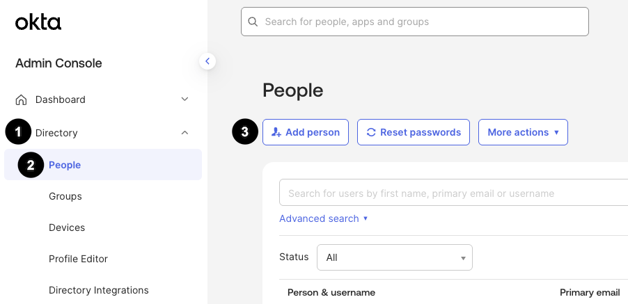
2. Fill in the form:
   - Activation: **Activate now**
   - Check **I will set password**, set a password
   - Uncheck **User must change password on first login**
   - Click **Save**
   <br>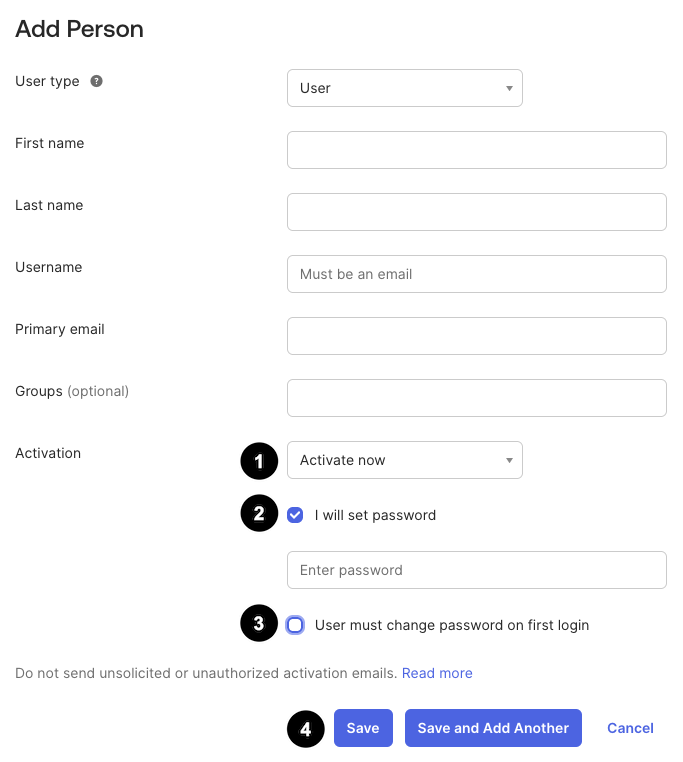

### 3. Create App Integration

3. Select **Applications** → **Create App Integration**
   <br>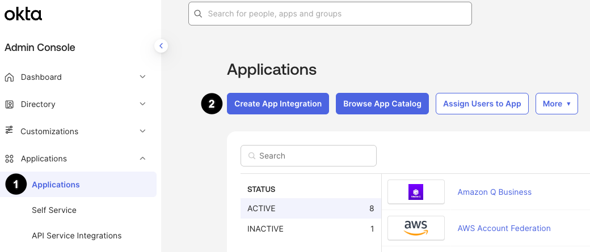
4. Sign-in method: **OIDC - OpenID Connect** → App type: **Web Application**
   <br>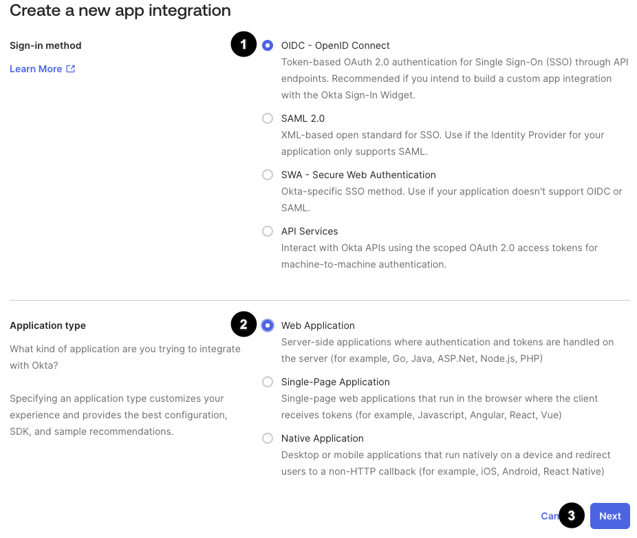
5. Configure:
   - App name: **AgentCore Inbound Auth**
   - Grant type: **Authorization Code**
   - Redirect URL: `https://bedrock-agentcore.{region}.amazonaws.com/identities/oauth2/callback`
   <br>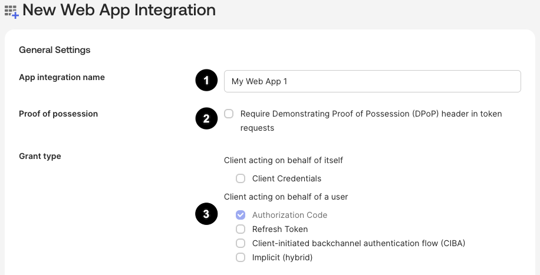
6. Assignments: **Allow everyone in your organization to access** → **Save**
   <br>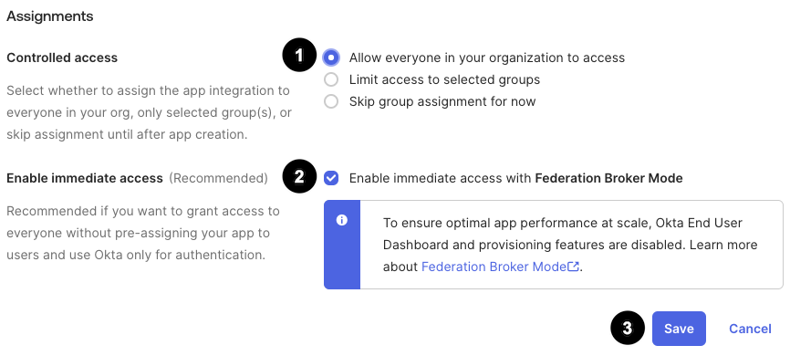
7. Copy the **Client ID** and **Secret**
   <br>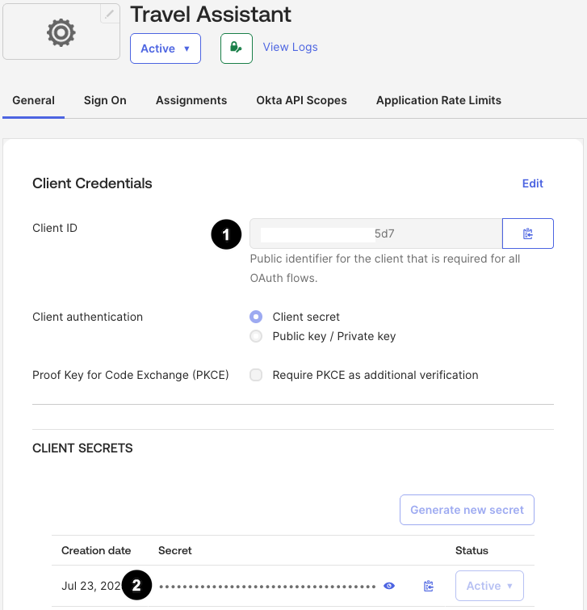

### 4. Configure Authorization Server

8. **Security** → **API** → click your authorization server name
   <br>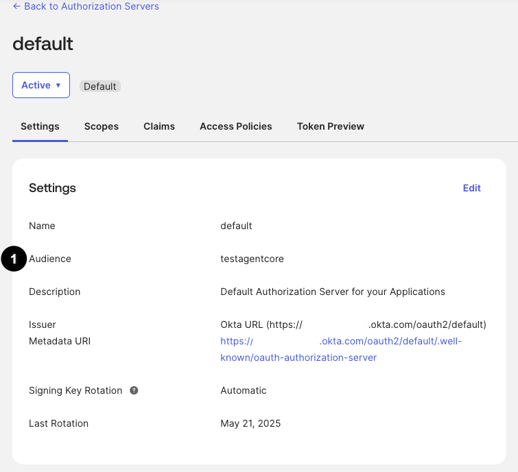
9. Copy the **Audience** value
10. **Scopes** → **Add Scope**: name=`agentcore`, User Consent=**implicit**
    <br>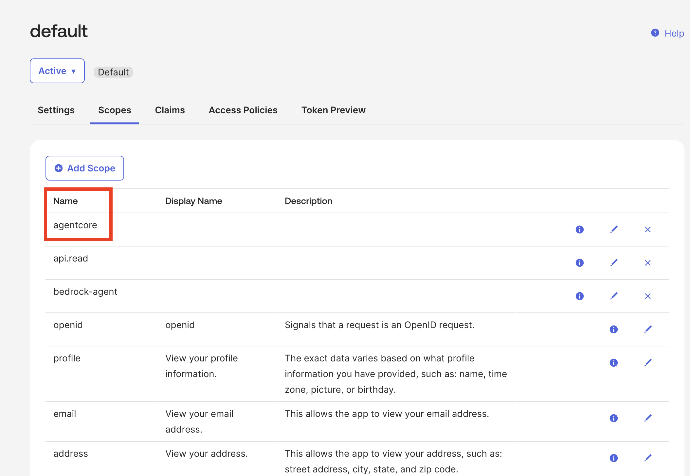
11. **Claims** → add `client_id` and `scope` claims
    <br>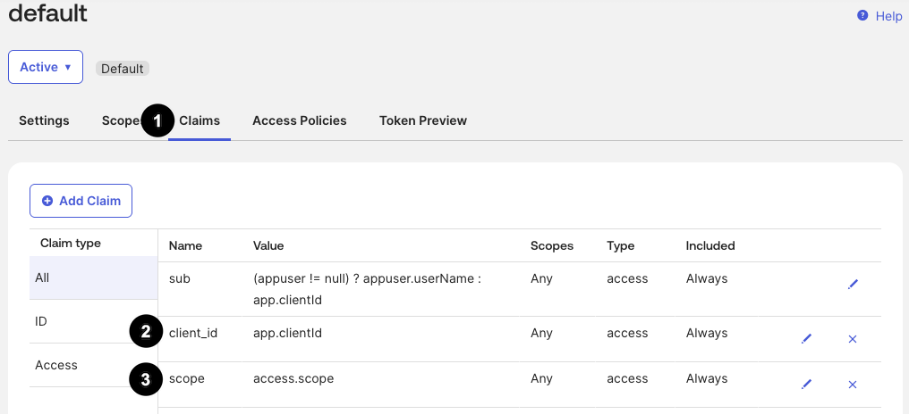

### For `okta_gateway_auth.py` additional setup

12. **Applications** → **Create App Integration** → add redirect URL `http://127.0.0.1:5000/callback`
    <br>
13. Add **Access Policies** for the new scope:
    - Security → API → Access Policies → Add New Access policy
    <br>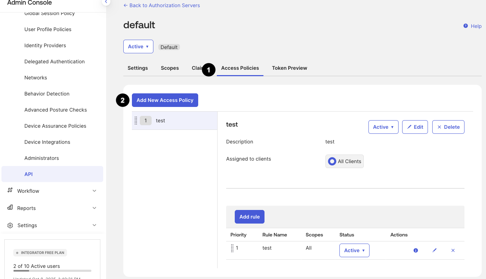
    - Add rule
    <br>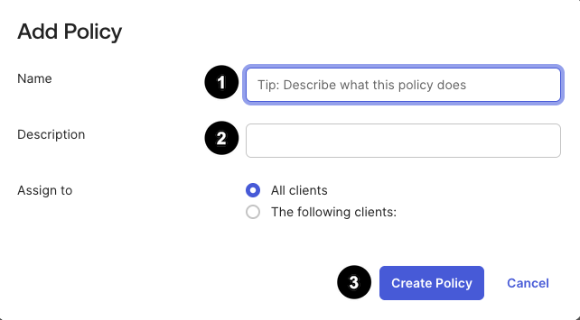
14. Create scope `okta.myAccount.read` with User Consent=implicit

## Prerequisites

- Python 3.10+
- AWS CLI configured with credentials
- Okta developer account (see setup above)
- Required AWS permissions:
  - `bedrock-agentcore:CreateAgentRuntime`, `DeleteAgentRuntime`, `InvokeAgentRuntime`
  - `bedrock-agentcore:CreateGateway`, `CreateGatewayTarget`, `DeleteGateway`
  - `bedrock-agentcore:CreateOauth2CredentialProvider`
  - `iam:CreateRole`, `PutRolePolicy`, `DeleteRole`
  - `lambda:CreateFunction`, `DeleteFunction`
  - `s3:CreateBucket`, `PutObject`, `DeleteBucket`
  - `secretsmanager:GetSecretValue` on `bedrock-agentcore*`

## Setup

```bash
cd 01-inbound-auth/03-inbound-auth-okta/

python3 -m venv .venv
source .venv/bin/activate

pip install -r requirements.txt
```

## Configuration

```bash
# For okta_inbound_auth.py
export OKTA_CLIENT_ID="your-client-id"
export OKTA_CLIENT_SECRET="your-client-secret"
export OKTA_AUDIENCE="testagentcore"
export OKTA_TOKEN_URL="https://your.okta.com/oauth2/default/v1/token"
export OKTA_DISCOVERY_URL="https://your.okta.com/oauth2/default/.well-known/openid-configuration"

# For okta_gateway_auth.py (add these)
export OKTA_AUTHORIZATION_URL="https://your.okta.com/oauth2/default/v1/authorize"
```

## Running the Scripts

### Tutorial 1: Okta Inbound Auth for AgentCore runtime

```bash
python okta_inbound_auth.py
```

Expected output:
```
=== AgentCore runtime: Okta Inbound Auth ===

=== Step 3: Creating AgentCore runtime with Okta JWT Authorizer ===
  Created runtime: okta_inbound_auth_...
  Discovery URL: https://your.okta.com/oauth2/default/.well-known/openid-configuration
  Waiting for READY...
    Status: CREATING
    Status: READY

=== Step 4: Testing Agent Invocation ===
  TEST 1: Unauthenticated request (should fail)...
  Expected: HTTP 401 - authentication required ✓

  TEST 2: Decoding Okta JWT token...
    Audience: testagentcore
    Scopes: ['agentcore']

  TEST 3: Scope validation - negative (checking for 'admin' scope)...
  Token does NOT have 'admin' scope ✓ (has: ['agentcore'])

  TEST 4: Scope validation - positive (checking for 'agentcore' scope)...
  Token has 'agentcore' scope ✓

  TEST 5: Authenticated invocation...
  Response: {"result": "..."}

  TEST 6: Session continuity (same session ID)...
  Response: {"result": "..."}
```

To test only (skip deployment):
```bash
python okta_inbound_auth.py --test-only
```

### Tutorial 2: Okta gateway Auth (runtime + gateway)

```bash
# Step 1: Deploy all resources
python okta_gateway_auth.py
```

This will create:
- Lambda travel plans API
- Okta CustomOauth2 credential provider
- AgentCore gateway with Okta JWT authorizer
- AgentCore runtime agent with `@requires_access_token`

To get an Okta token via the authorization code flow:
```bash
# Run the Flask OAuth server (in a separate terminal)
python -c "
import os, secrets, requests
from flask import Flask, redirect, request, session
app = Flask(__name__)
app.secret_key = os.urandom(24)

CLIENT_ID = os.environ['OKTA_CLIENT_ID']
CLIENT_SECRET = os.environ['OKTA_CLIENT_SECRET']
AUTHORIZATION_URL = os.environ['OKTA_AUTHORIZATION_URL']
TOKEN_URL = os.environ['OKTA_TOKEN_URL']
REDIRECT_URI = 'http://127.0.0.1:5000/callback'
SCOPE = 'openid email'

@app.route('/')
def home():
    return '<a href=\"/login\">Login with Okta</a>'

@app.route('/login')
def login():
    state = secrets.token_urlsafe(16)
    session['state'] = state
    auth_url = (f'{AUTHORIZATION_URL}?response_type=code&client_id={CLIENT_ID}'
                f'&redirect_uri={REDIRECT_URI}&scope={SCOPE}&state={state}')
    return redirect(auth_url)

@app.route('/callback')
def callback():
    code = request.args.get('code')
    resp = requests.post(TOKEN_URL, data={
        'grant_type': 'authorization_code', 'code': code,
        'redirect_uri': REDIRECT_URI, 'client_id': CLIENT_ID,
        'client_secret': CLIENT_SECRET,
    })
    token = resp.json().get('access_token', '')
    print('Access Token:', token)
    return 'Login successful! Token printed to console.'

app.run(host='127.0.0.1', port=5000)
"
```

Browse to http://127.0.0.1:5000, log in with Okta, copy the token from the console.

```bash
# Invoke the agent with the token
OKTA_BEARER_TOKEN="<your-token>" python okta_gateway_auth.py --test-only
```

Expected output:
```
Agent response: Based on the travel plans for user-123:
  1. Paris, France (March 15-22, 2024) - Status: confirmed
  2. Tokyo, Japan (May 10-20, 2024) - Status: planned
```

## Key Concepts

- **customJWTAuthorizer**: Uses `discoveryUrl`, `allowedClients`, and `allowedAudience` to
  validate Okta JWTs automatically
- **Scope validation**: JWT `scp` claim contains granted scopes; agent can enforce scope-based
  access control at the application level
- **USER_FEDERATION with Okta**: `@requires_access_token` returns an authorization URL on first
  call; subsequent calls use the cached token from AgentCore identity vault
- **Session continuity**: Same `X-Amzn-Bedrock-AgentCore-runtime-Session-Id` header preserves
  conversation context within the session

## Troubleshooting

### `AccessDeniedException` — no bearer token
**Issue**: Request sent without `Authorization: Bearer <token>` header.
**Solution**: Get a token from Okta using client_credentials grant and pass it in the header.

### `invalid_client` on token request
**Issue**: Client ID or secret incorrect.
**Solution**: Check Okta Application > General > Client Credentials for the exact values.

### Okta token missing `agentcore` scope
**Issue**: Scope not configured or not granted.
**Solution**: In Okta, Security > API > your auth server > Scopes > verify `agentcore` scope
exists. Then confirm the token URL request includes `scope=agentcore`.

### `redirect_uri_mismatch` on 3LO flow
**Issue**: Redirect URI in token request doesn't match the one registered in Okta.
**Solution**: Add `http://127.0.0.1:5000/callback` to Application > Sign-In Redirect URIs in Okta.

### Agent returns `auth_required` in response
**Issue**: The `@requires_access_token` flow has not completed — token not yet in vault.
**Solution**: Follow the authorization URL, complete consent, then re-invoke the agent.

## Clean Up

```bash
python okta_inbound_auth.py --cleanup
python okta_gateway_auth.py --cleanup
```

## Resources

- [Okta Developer Documentation](https://developer.okta.com/)
- [Amazon Bedrock AgentCore Documentation](https://docs.aws.amazon.com/bedrock-agentcore/)
- [AgentCore identity overview](https://docs.aws.amazon.com/bedrock-agentcore/latest/devguide/identity.html)
- [OAuth 2.0 and OpenID Connect](https://developer.okta.com/docs/concepts/oauth-openid/)
