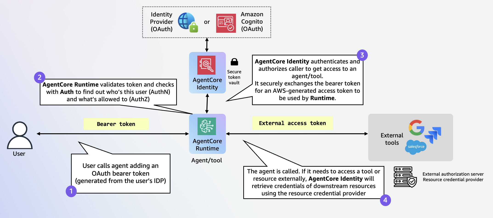
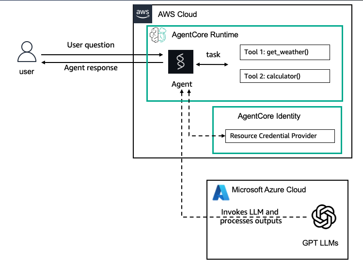

# Outbound Auth with API Key Credential Provider (OpenAI / Azure OpenAI)

| Information         | Details                                                                  |
|:--------------------|:-------------------------------------------------------------------------|
| Tutorial type       | Conversational                                                           |
| Agent type          | Single                                                                   |
| Agentic Framework   | Strands Agents                                                           |
| LLM model           | GPT-4.1-mini (Azure OpenAI via LiteLLM)                                  |
| Tutorial components | AgentCore runtime, Outbound Auth, API Key Credential Provider            |
| Example complexity  | Easy                                                                     |

## Overview

This tutorial demonstrates how to configure an AgentCore agent to securely retrieve an API key at
runtime using the **AgentCore identity API Key credential provider**, rather than hardcoding
secrets in the agent code.

Outbound Auth allows agents to access external services (OpenAI, Azure OpenAI, etc.) on behalf of
users. The API Key credential provider stores the key in AWS Secrets Manager and vends it to the
agent via the `@requires_api_key` decorator or `GetResourceApiKey` API.

### Tutorial Architecture





```
AgentCore runtime
  │
  │  @requires_api_key(provider_name="openai-apikey-provider")
  ▼
AgentCore identity ──────────────────────► AWS Secrets Manager
  │                  GetResourceApiKey         (stores key)
  │  returns API key
  ▼
Strands Agent  ──────────────────────────► Azure OpenAI / OpenAI
               AZURE_API_KEY=<key>             (LiteLLM)
```

## What is Outbound Auth?

Outbound Auth provides secure outbound access from an agent to external services:

- **API Key provider**: stores API keys for services like OpenAI, Anthropic, etc.
- **OAuth2 provider**: handles 2LO (M2M) and 3LO (user consent) flows
- **Built-in providers**: Google, GitHub, Slack, Salesforce, Microsoft Entra ID
- **Custom provider**: any OAuth2-compatible service

The `@requires_api_key` decorator automatically retrieves the key from the credential provider
and injects it into the function as a keyword argument. The LLM never sees the raw key.

## `@requires_api_key` Parameters

| Parameter     | Description                                      |
|:-------------|:--------------------------------------------------|
| `provider_name` | The credential provider name                   |
| `into`          | Parameter name to inject the key into          |

## Sample Prompts

**Prompt**: `Hello, how are you?`
**Expected Behavior**: Agent responds using Azure OpenAI GPT-4.1-mini

**Prompt**: `What is the weather like?`
**Expected Behavior**: Agent calls the `weather` tool and returns "sunny"

**Prompt**: `Calculate 15 * 23`
**Expected Behavior**: Agent uses the `calculator` tool to compute 345

## Key Concepts

- **API Key Credential Provider**: Stores the key in Secrets Manager, vends it on demand
- **@requires_api_key**: Decorator that automatically injects the API key at runtime
- **Lazy initialization**: Agent is created after the key is retrieved (avoids startup failures)
- **Secret isolation**: The key never appears in logs, prompts, or agent code

## Prerequisites

- Python 3.10+
- AWS CLI configured with credentials
- Azure OpenAI or OpenAI API key
- Required permissions:
  - `bedrock-agentcore:CreateApiKeyCredentialProvider`
  - `bedrock-agentcore:GetResourceApiKey`
  - `secretsmanager:GetSecretValue` on `bedrock-agentcore*` resources

## Setup

```bash
cd 02-outbound-auth/01-outbound-auth-openai/

python3 -m venv .venv
source .venv/bin/activate

pip install -r requirements.txt
```

## Configuration

Set these environment variables before running:

```bash
# For Azure OpenAI:
export AZURE_OPENAI_API_KEY="your-api-key"
export AZURE_API_BASE="https://your-resource.openai.azure.com/"
export AZURE_API_VERSION="2024-02-15-preview"

# For OpenAI:
export OPENAI_API_KEY="your-api-key"
export OPENAI_PROVIDER="openai"
```

Do not hardcode secrets. Use the credential provider to store and rotate them.

## Running the Script

```bash
python outbound_auth_runtime.py
```

This will:
1. Create an API key credential provider named `openai-apikey-provider`
2. Print the IAM permissions needed on the runtime execution role
3. Save the agent code (`strands_agents_openai.py`) for reference
4. Show how to deploy the agent to AgentCore runtime

## What to Expect

```
=== Outbound Auth: API Key Credential Provider (OpenAI/Azure) ===

=== Step 1: Creating API Key Credential Provider ===
  Created API key provider: arn:aws:bedrock-agentcore:...

=== Step 2: Credential Provider Usage ===
  API Key credential provider is ready.
  The @requires_api_key decorator retrieves the key at agent runtime.

=== Step 3: Required runtime Role IAM Permissions ===
  IAM permissions required on the runtime execution role: ...

=== Step 4: Agent Code ===
  Agent code saved to strands_agents_openai.py

=== Summary ===
  Credential provider: openai-apikey-provider
  ...
```

## Adding Outbound Permissions to Your runtime Role

After deploying the agent, add these policies to the auto-created execution role:

```python
import boto3, json

iam = boto3.client("iam")
policies = {
    "Version": "2012-10-17",
    "Statement": [
        {
            "Sid": "GetResourceAPIKey",
            "Effect": "Allow",
            "Action": ["bedrock-agentcore:GetResourceApiKey"],
            "Resource": "*",
        },
        {
            "Sid": "SecretManager",
            "Effect": "Allow",
            "Action": ["secretsmanager:GetSecretValue"],
            "Resource": "arn:aws:secretsmanager:*:*:secret:bedrock-agentcore*",
        },
    ],
}
iam.put_role_policy(
    PolicyDocument=json.dumps(policies),
    PolicyName="outbound_policies",
    RoleName="<your-runtime-role-name>",
)
```

## Troubleshooting

### `NoCredentialsError` or key not retrieved
**Issue**: The `@requires_api_key` decorator fails to retrieve the key.
**Solution**: Ensure the runtime role has `bedrock-agentcore:GetResourceApiKey` and
`secretsmanager:GetSecretValue` permissions on `bedrock-agentcore*` resources.

### `AZURE_API_KEY` not set error from LiteLLM
**Issue**: LiteLLM tries to initialize before the key is retrieved.
**Solution**: The agent uses lazy initialization — the model is created inside the
`@app.entrypoint` function, after `await need_api_key()` completes.

### Old API key still in use
**Issue**: Need to rotate the key.
**Solution**: Call `update_api_key_credential_provider` with the new key.
The change takes effect on the next `GetResourceApiKey` call.

## Clean Up

```bash
# Delete the credential provider
python -c "
import boto3
control = boto3.client('bedrock-agentcore-control')
control.delete_api_key_credential_provider(name='openai-apikey-provider')
print('Credential provider deleted')
"
```
