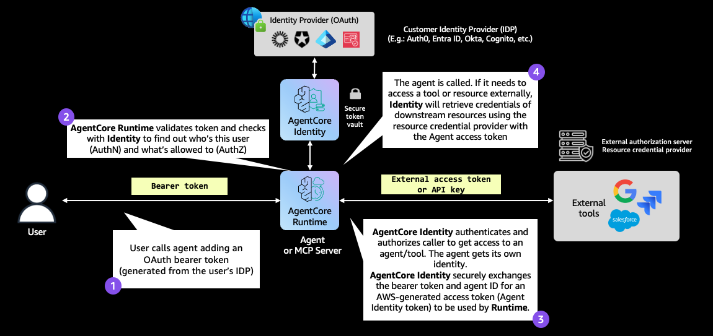
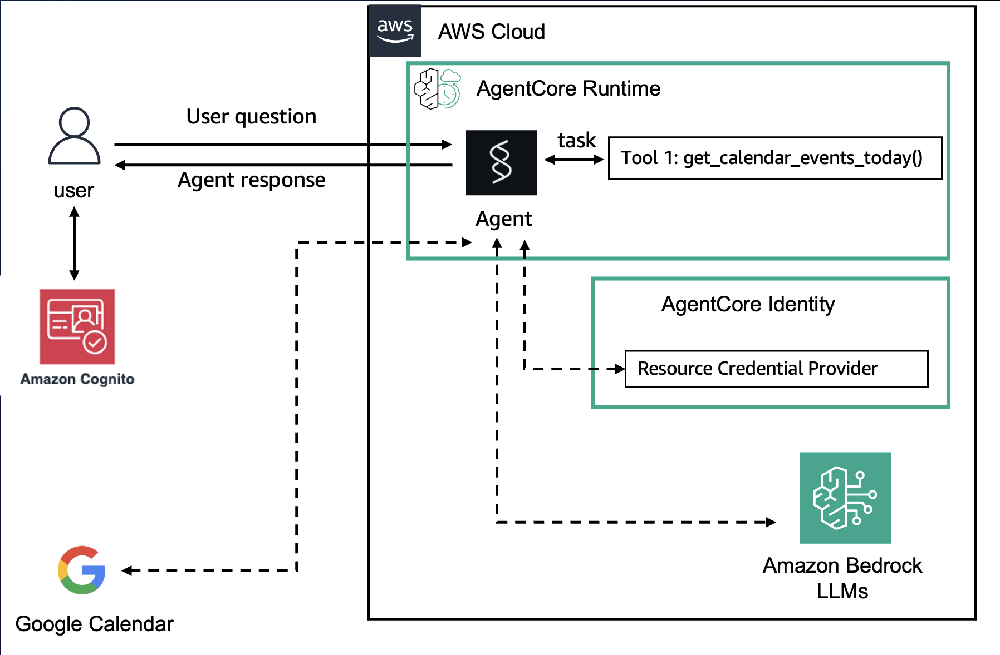
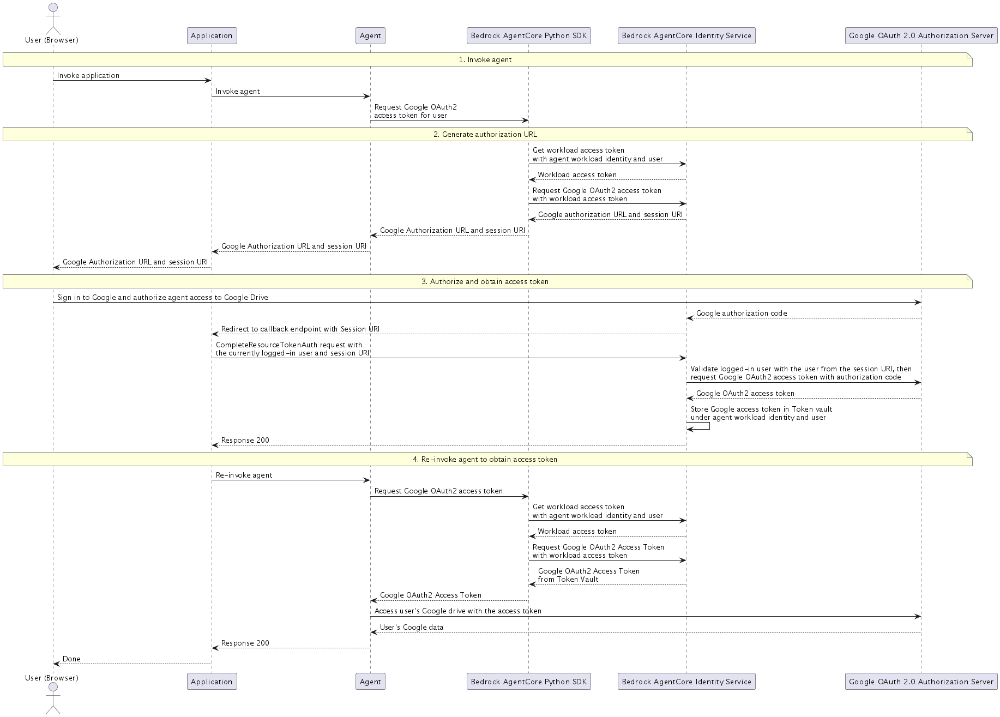

# Outbound Auth with Google OAuth2 3-Legged OAuth (3LO)

| Information         | Details                                                                  |
|:--------------------|:-------------------------------------------------------------------------|
| Tutorial type       | Conversational                                                           |
| Agent type          | Single                                                                   |
| Agentic Framework   | Strands Agents                                                           |
| LLM model           | Anthropic Claude Haiku 4.5                                               |
| Tutorial components | AgentCore runtime, Outbound Auth, GoogleOauth2 Credential Provider       |
| Example complexity  | Medium                                                                   |

## Architecture





## Overview

This tutorial demonstrates how to configure a Strands agent on AgentCore runtime to access
**Google Calendar** on behalf of a user using the **3-Legged OAuth (3LO)** flow with AgentCore
Identity's `GoogleOauth2` credential provider.

3LO (also called USER_FEDERATION) requires the user to grant consent once. After consent, AgentCore
Identity stores the token and automatically refreshes it — your agent never handles raw tokens.

### Tutorial Architecture

```
User (Cognito JWT) ──► AgentCore runtime ──► Strands Agent
                              │
                              │  @requires_access_token(auth_flow="USER_FEDERATION")
                              ▼
                      AgentCore identity
                         GetResourceOauth2Token
                              │
              ┌───────────────┴───────────────┐
              │ (first call)                   │ (subsequent calls)
              ▼                               ▼
     Returns auth URL              Returns cached access token
              │
              ▼
        User opens URL ──► Google OAuth2 ──► grants consent
              │
              ▼
        oauth2_callback_server.py (port 9090)
              │  CompleteResourceTokenAuth
              ▼
        AgentCore identity stores token
              │
              ▼
        Agent calls Google Calendar API
```

## What is the USER_FEDERATION Flow?

USER_FEDERATION (3LO) is used when:
- The external API requires the user's own credentials (not a service account)
- You want to access resources like Google Calendar, GitHub repos, or Salesforce objects
- The user needs to grant consent once and the agent should act on their behalf

Compared to M2M (client credentials), 3LO:
- Returns an authorization URL on first access (user must visit it)
- Stores user consent in AgentCore identity's token vault
- Automatically refreshes tokens on expiry

## OAuth2 Session Binding

Session binding ensures the OAuth token is tied to the authenticated user:



```
1. Agent invokes GetResourceOauth2Token (USER_FEDERATION)
2. AgentCore identity returns { authorizationUrl, sessionUri }
3. User opens authorizationUrl in their browser
4. Google redirects to the callback server with a session_id
5. Callback server calls CompleteResourceTokenAuth (binds session to user)
6. Agent re-invokes GetResourceOauth2Token → gets the access token
7. Agent calls Google Calendar API
```

The `oauth2_callback_server.py` in this folder handles steps 4-5 automatically.

## Files

| File | Description |
|:-----|:------------|
| `outbound_auth_3lo.py` | Main setup script (Cognito + Google credential provider) |
| `strands_claude_google_3lo.py` | Agent code deployed to AgentCore runtime |
| `oauth2_callback_server.py` | Local FastAPI server for OAuth2 session binding |
| `chatbot_app_cognito.py` | Streamlit chat UI for interactive testing |
| `requirements.txt` | Python dependencies |

## Google Developer Console Setup

Before running, configure Google OAuth2:

1. Go to [Google Developer Console](https://console.developers.google.com/)
2. Create a project and enable **Google Calendar API**
3. Configure OAuth consent screen (External audience, add your email as test user)
4. Create OAuth 2.0 credentials → Web application
5. After creating the credential provider (Step 2), add the returned `callbackUrl` to
   **Authorized redirect URIs**
6. Set the scope: `https://www.googleapis.com/auth/calendar.readonly`

## Prerequisites

- Python 3.10+
- AWS CLI configured with credentials
- Google OAuth2 client ID and secret from Google Developer Console
- Required AWS permissions:
  - `bedrock-agentcore:*`
  - `cognito-idp:*`
  - `bedrock-agentcore:GetResourceOauth2Token`
  - `secretsmanager:GetSecretValue` on `bedrock-agentcore*`

## Setup

```bash
cd 02-outbound-auth/02-outbound-auth-3lo/

python3 -m venv .venv
source .venv/bin/activate

pip install -r requirements.txt
```

## Configuration

```bash
# Create a .env file with your Google credentials
cat > .env << EOF
GOOGLE_CLIENT_ID="your-google-client-id"
GOOGLE_CLIENT_SECRET="your-google-client-secret"
EOF
```

## Running the Scripts

### Setup (creates Cognito + Google credential provider)

```bash
python outbound_auth_3lo.py
```

### Interactive Streamlit Chat App

```bash
# Terminal 1: Start the OAuth2 callback server
python oauth2_callback_server.py --region us-east-1

# Terminal 2: Start the Streamlit app
streamlit run chatbot_app_cognito.py
```

- Login: `testuser` / `MyPassword123!`
- Try: "What is in my agenda for today?"
- The app shows the authorization URL — click it to grant Google Calendar access

## What to Expect

```
=== Outbound Auth: Google OAuth2 3LO (Google Calendar) ===

=== Step 1: Setting up Cognito for Inbound Auth ===
  Cognito pool: us-east-1_AbCdEfGhI, client: 1a2b3c4d...

=== Step 2: Creating Google OAuth2 Credential Provider ===
  Created credential provider: arn:aws:bedrock-agentcore:...
  Google OAuth2 callback URL: https://bedrock-agentcore.us-east-1.amazonaws.com/...

  IMPORTANT: Register this callback URL in the Google Developer Console:
  APIs & Services → Credentials → OAuth 2.0 Client → Authorized redirect URIs
  Add: https://bedrock-agentcore.us-east-1.amazonaws.com/identities/oauth2/callback/...

=== Step 3: Agent Code ===
  Key pattern: @requires_access_token(provider_name='google-cal-provider',
                                       scopes=['https://www.googleapis.com/auth/calendar.readonly'],
                                       auth_flow='USER_FEDERATION',
                                       callback_url=CALLBACK_URL)
...
```

## Key Concepts

- **GoogleOauth2 provider**: Pre-configured Google OAuth2 endpoints. You only need to supply
  your app's `clientId` and `clientSecret`
- **USER_FEDERATION**: Auth flow that returns an authorization URL. The user grants consent
  once; subsequent calls return the cached token
- **callbackUrl**: AgentCore identity's redirect URI — must be registered with Google
- **Session binding**: `oauth2_callback_server.py` calls `CompleteResourceTokenAuth` after
  the user grants consent, binding the Google token to the Cognito user

## Troubleshooting

### Authorization URL not clickable in terminal
**Issue**: Terminal doesn't open URLs automatically.
**Solution**: Copy and paste the URL from the agent response into your browser.

### "redirect_uri_mismatch" error from Google
**Issue**: The `callbackUrl` from AgentCore identity is not registered with Google.
**Solution**: Copy the `callbackUrl` printed by `outbound_auth_3lo.py` and add it to
Authorized redirect URIs in Google Developer Console.

### Token expired or revoked
**Issue**: User revoked access in Google Account settings.
**Solution**: Re-invoke the agent — it will return a new authorization URL for re-consent.

### oauth2_callback_server port already in use
**Issue**: Port 9090 is occupied.
**Solution**: Pass `--port 9091` to `oauth2_callback_server.py` and update the
workload identity's `allowedResourceOauth2ReturnUrls` accordingly.

## Clean Up

```bash
python -c "
import boto3
control = boto3.client('bedrock-agentcore-control')
control.delete_oauth2_credential_provider(name='google-cal-provider')
print('Google credential provider deleted')
"
```
