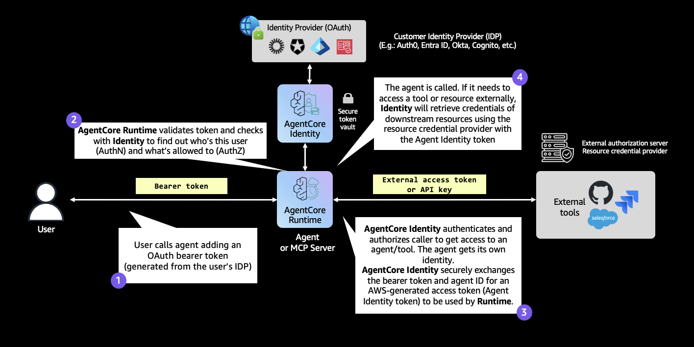
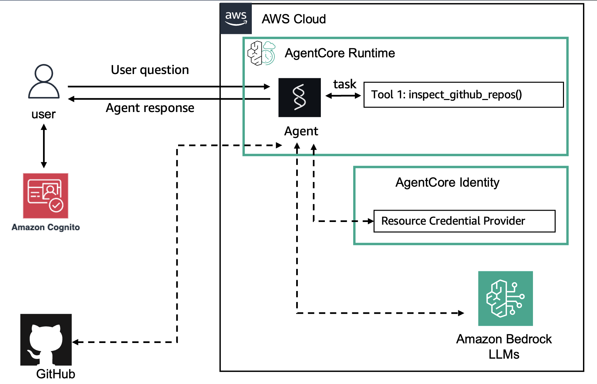

# Outbound Auth with GitHub OAuth2 3-Legged OAuth (3LO)

| Information         | Details                                                                  |
|:--------------------|:-------------------------------------------------------------------------|
| Tutorial type       | Conversational                                                           |
| Agent type          | Single                                                                   |
| Agentic Framework   | Strands Agents                                                           |
| LLM model           | Anthropic Claude Haiku 4.5                                               |
| Tutorial components | AgentCore runtime, Outbound Auth, GithubOauth2 Credential Provider       |
| Example complexity  | Medium                                                                   |

## Architecture





## Overview

This tutorial demonstrates how to configure a Strands agent on AgentCore runtime to access a
user's **private GitHub repositories** using the **GithubOauth2** credential provider with the
USER_FEDERATION (3LO) auth flow.

The agent requests authorization on behalf of the user. After the user grants consent in GitHub,
AgentCore identity stores the token and vends it automatically on subsequent calls.

### Tutorial Architecture

```
User (Cognito JWT) ──► AgentCore runtime ──► Strands Agent (github_agent.py)
                              │
                              │  @requires_access_token(auth_flow="USER_FEDERATION")
                              ▼
                      AgentCore identity (GithubOauth2 provider)
                              │
              ┌───────────────┴───────────────┐
              │ (first call)                   │ (subsequent calls)
              ▼                               ▼
     Returns auth URL              Returns cached GitHub token
              │
              ▼
        User clicks URL ──► GitHub OAuth2 consent page
              │
              ▼
        oauth2_callback_server.py (port 9090)
              │  CompleteResourceTokenAuth
              ▼
        Agent calls GitHub API → lists private repos
```

## Files

| File | Description |
|:-----|:------------|
| `outbound_auth_github.py` | Main setup script (Cognito + GitHub credential provider) |
| `github_agent.py` | Agent code: lists private GitHub repositories |
| `oauth2_callback_server.py` | Local FastAPI server for OAuth2 session binding |
| `chatbot_app_cognito.py` | Streamlit chat UI for interactive testing |
| `requirements.txt` | Python dependencies |

## GitHub OAuth App Setup

Before running, create a GitHub OAuth App:

1. Sign in to GitHub and go to **Settings → Developer settings → OAuth Apps**
2. Click **New OAuth App**
3. Fill in:


   - **Application name**: any name
   - **Homepage URL**: e.g. `https://github.com/your-org/your-repo`
   - **Authorization callback URL**: `https://bedrock-agentcore.us-east-1.amazonaws.com/identities/oauth2/callback/tobeupdated`
     (this placeholder will be replaced after you create the credential provider)
   - Leave **Enable Device Flow** unchecked
4. Click **Register application**
5. Copy the **Client ID** and generate + copy the **Client Secret**
6. After running Step 2, update the Authorization callback URL with the one printed by the script

## Prerequisites

- Python 3.10+
- AWS CLI configured with credentials
- GitHub account and a GitHub OAuth App
- Required AWS permissions:
  - `bedrock-agentcore:*`
  - `cognito-idp:*`
  - `bedrock-agentcore:GetResourceOauth2Token`
  - `secretsmanager:GetSecretValue` on `bedrock-agentcore*`

## Setup

```bash
cd 02-outbound-auth/03-outbound-auth-github/

python3 -m venv .venv
source .venv/bin/activate

pip install -r requirements.txt
```

## Configuration

```bash
# Create a .env file with your GitHub credentials
cat > .env << EOF
GITHUB_CLIENT_ID="your-github-client-id"
GITHUB_CLIENT_SECRET="your-github-client-secret"
EOF
```

## Running the Scripts

### Setup (creates Cognito + GitHub credential provider)

```bash
python outbound_auth_github.py
```

After running, **update the Authorization callback URL** in your GitHub OAuth App settings
(see Step 2 output).

### Interactive Streamlit Chat App

```bash
# Terminal 1: Start the OAuth2 callback server
python oauth2_callback_server.py --region us-east-1

# Terminal 2: Start the Streamlit app
streamlit run chatbot_app_cognito.py
```

- Login: `testuser` / `MyPassword123!`
- Try: "What are my private repositories?"
- The app shows the GitHub authorization URL — click it to grant access

## What to Expect

```
=== Outbound Auth: GitHub OAuth2 3LO ===

=== Step 1: Setting up Cognito for Inbound Auth ===
  Cognito pool: us-east-1_AbCdEfGhI, client: 1a2b3c4d...

=== Step 2: Creating GitHub OAuth2 Credential Provider ===
  Created credential provider: arn:aws:bedrock-agentcore:...
  GitHub OAuth2 callback URL: https://bedrock-agentcore.us-east-1.amazonaws.com/...

  IMPORTANT: Update your GitHub OAuth App's Authorization callback URL:
  GitHub → Settings → Developer Settings → OAuth Apps → your app
  Authorization callback URL → Update to:
  https://bedrock-agentcore.us-east-1.amazonaws.com/identities/oauth2/callback/...
...
```

## Key Concepts

- **GithubOauth2 provider**: Pre-configured GitHub OAuth2 endpoints
- **USER_FEDERATION**: Returns an authorization URL on first access; subsequent calls use
  the cached token
- **inspect_github_repos tool**: In `github_agent.py`, calls `GET /user/repos?type=private`
  using the GitHub access token
- **Session binding**: `oauth2_callback_server.py` handles the redirect and calls
  `CompleteResourceTokenAuth` to bind the GitHub token to the Cognito user

## Troubleshooting

### "bad_verification_code" from GitHub
**Issue**: The authorization code expired or was already used.
**Solution**: Re-invoke the agent to get a fresh authorization URL.

### "redirect_uri_mismatch" from GitHub
**Issue**: The callback URL in your GitHub OAuth App doesn't match the one from the credential provider.
**Solution**: Copy the `callbackUrl` printed by `outbound_auth_github.py` exactly to the
GitHub OAuth App's Authorization callback URL field.

### Private repos not returned
**Issue**: The agent shows public repos only.
**Solution**: Ensure the `repo` scope is included in `@requires_access_token(scopes=['repo'])`.

## Clean Up

```bash
python -c "
import boto3
control = boto3.client('bedrock-agentcore-control')
control.delete_oauth2_credential_provider(name='github-provider')
print('GitHub credential provider deleted')
"
```
