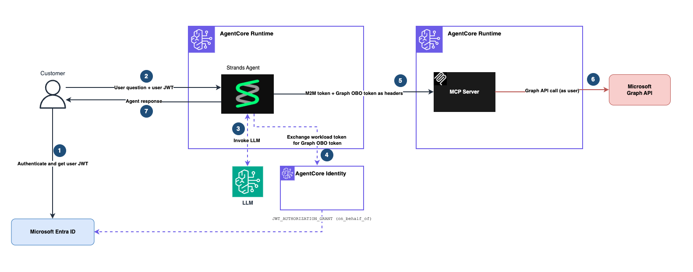

# Microsoft Entra ID On-Behalf-Of (OBO) with AgentCore runtime + MCP Server

| Information         | Details                                                                        |
|:--------------------|:-------------------------------------------------------------------------------|
| Tutorial type       | Step-by-step                                                                   |
| Agent type          | Multi-runtime (Agent runtime + MCP Server runtime)                             |
| Agentic Framework   | Strands Agents                                                                 |
| LLM model           | Anthropic Claude Sonnet 4.5                                                    |
| Tutorial components | AgentCore runtime (×2), AgentCore identity, Microsoft Entra ID, Microsoft Graph |
| Example complexity  | Advanced                                                                       |
| SDK used            | boto3, msal, bedrock-agentcore                                                 |
| Inbound Auth        | User JWT via Entra ID Device Code Flow                                         |
| Outbound Auth       | OBO (ON_BEHALF_OF_TOKEN_EXCHANGE) + M2M (client_credentials)                  |

## Overview

This tutorial demonstrates the **On-Behalf-Of (OBO) token exchange pattern** for agents that
call downstream resources (Microsoft Graph) through a dedicated MCP server — while preserving
the end-user's identity end-to-end.

An agent receives a user's JWT, exchanges it for a Graph-scoped delegation token via AgentCore
Identity, and passes that token to an MCP tool without the token ever entering the LLM context.

## Use Case

*Alex signs in with her Microsoft account and asks "who am I and what's on my profile?" The
agent calls Microsoft Graph as Alex (not a shared service account) — returning Alex's profile
specifically. Bob running the same prompt gets Bob's profile back.*

**Pick this pattern when:**
- Your MCP server calls APIs that accept user-delegated OAuth 2.0 tokens (Graph, Salesforce, etc.)
- You want the user to consent once at sign-in, not via a mid-conversation authorization URL
- You need the downstream call to carry both the user's identity and the agent's identity

## Architecture

<div style="text-align:center">
    
</div>

```
1. User → Entra ID (device code flow) → user JWT (aud = Agent app client_id)
2. User + user JWT → AgentCore runtime (Agent) → customJWTAuthorizer validates JWT
3. Agent → LLM (Amazon Bedrock) → decides tool call needed
4. Agent → GetResourceOauth2Token(ON_BEHALF_OF_TOKEN_EXCHANGE)
          → AgentCore identity → Entra ID OBO exchange → Graph delegation token
5. Agent → MCP Server runtime:
          Authorization: Bearer <M2M token>          (transport auth)
          X-Amzn-Bedrock-AgentCore-runtime-Custom-Graph-Token: <OBO token>  (user delegation)
6. MCP tool → Microsoft Graph (Bearer <OBO token>) → user profile data
7. Response → MCP → Agent → User
```

### Token flow comparison

| Pattern | What crosses Agent → MCP | User identity preserved? |
|---------|--------------------------|--------------------------|
| Pure M2M | Agent's M2M token only | No (agent acts as itself) |
| Forward user JWT | M2M + inbound user JWT | Technically yes, but `aud` wrong |
| **OBO (this sample)** | M2M + Graph-scoped delegation token | Yes, agent recorded as actor |

## Files

| File | Description |
|:-----|:------------|
| `entra_obo_mcp_runtime.py` | Main script: deploy MCP runtime, credential provider, agent runtime, invoke |
| `agent/agent_obo.py` | Agent code: performs OBO exchange, calls MCP server with two tokens |
| `mcp/mcp_server_obo.py` | MCP server: exposes `get_my_profile` tool, reads Graph token from request header |
| `agent/requirements.txt` | Agent runtime dependencies |
| `mcp/requirements.txt` | MCP server dependencies |
| `ENTRA_SETUP.md` | Detailed portal walkthrough for Entra ID app registrations |
| `images/architecture.png` | Architecture diagram |

## Entra ID Setup

This sample requires **two app registrations**. See `ENTRA_SETUP.md` for the detailed walkthrough.

### App 1: `AgentCore - Agent` (middle-tier)

| Setting | Value |
|---------|-------|
| Authentication | Add "Mobile and desktop applications" platform; enable Allow public client flows |
| Certificates & Secrets | Create a client secret |
| Expose an API | Set URI to `api://<client-id>`; add scope `user_delegation` |
| API permissions | Microsoft Graph → Delegated → `User.Read` (admin consent) |
| API permissions | AgentCore - MCP Server → Application → `mcp_invoke` (admin consent) |

### App 2: `AgentCore - MCP Server` (protected resource)

| Setting | Value |
|---------|-------|
| Expose an API | Set URI to `api://<client-id>` |
| App roles | Create role with Value=`mcp_invoke`, Allowed member types=Applications |

### Collect these values

| Variable | Source |
|----------|--------|
| `ENTRA_TENANT_ID` | Entra admin center → Overview → Tenant ID |
| `ENTRA_AGENT_CLIENT_ID` | AgentCore - Agent → Overview → Application (client) ID |
| `ENTRA_AGENT_CLIENT_SECRET` | The secret value copied when created |
| `ENTRA_MCP_CLIENT_ID` | AgentCore - MCP Server → Overview → Application (client) ID |

## Prerequisites

- Python 3.10+
- AWS CLI configured with credentials
- Microsoft Entra ID tenant with two app registrations (see Entra ID Setup above)
- Required AWS permissions:
  - `bedrock-agentcore:CreateAgentRuntime`, `DeleteAgentRuntime`, `InvokeAgentRuntime`
  - `bedrock-agentcore:GetResourceOauth2Token`
  - `bedrock-agentcore:CreateOauth2CredentialProvider`
  - `iam:CreateRole`, `PutRolePolicy`, `DeleteRole`
  - `s3:CreateBucket`, `PutObject`, `DeleteBucket`
  - `secretsmanager:GetSecretValue` on `bedrock-agentcore*`

## Setup

```bash
cd 04-entra-obo-mcp-runtime/

python3 -m venv .venv
source .venv/bin/activate

pip install -r requirements.txt
```

## Configuration

```bash
export ENTRA_TENANT_ID="your-tenant-id"
export ENTRA_AGENT_CLIENT_ID="your-agent-app-client-id"
export ENTRA_AGENT_CLIENT_SECRET="your-agent-app-client-secret"
export ENTRA_MCP_CLIENT_ID="your-mcp-server-app-client-id"
```

## Running the Script

```bash
python entra_obo_mcp_runtime.py
```

Expected output:
```
=== Entra ID OBO: AgentCore runtime + MCP Server ===

=== Step 1: Deploying MCP Server to AgentCore runtime ===
  Created IAM role: agentcore-obo-mcp-...
  Uploaded mcp/ → s3://agentcore-obo-.../agents/.../agent.zip
  Created runtime: entra_obo_mcp_... (ID: ...)
  Waiting for READY...
    Status: CREATING
    Status: READY
  MCP Server URL: https://bedrock-agentcore.us-west-2.amazonaws.com/runtimes/.../invocations?qualifier=DEFAULT

=== Step 2: Creating MicrosoftOauth2 Credential Provider ===
  Created credential provider: entra-agent-provider
  This provider handles both M2M (client_credentials) and OBO flows.

=== Step 3: Deploying Agent to AgentCore runtime ===
  Created IAM role: agentcore-obo-agent-...
  Created runtime: entra_obo_agent_...
  Waiting for READY...
    Status: READY

=== Step 4: Getting User JWT via MSAL Device Code Flow ===
============================================================
  Go to: https://microsoft.com/devicelogin
  Enter code: XXXXXXXX
============================================================
  User JWT acquired: eyJ0eXAiOiJKV1QiLCJhb...

=== Step 5: Invoking Agent ===

  Prompt: Who am I and what's my email address?
  Response: Based on your Microsoft profile, your display name is Alex Johnson
            and your email is alex.johnson@yourcompany.com.

  Prompt: What is my display name in the directory?
  Response: Your display name in the Microsoft directory is Alex Johnson.
```

To re-invoke without redeploying:
```bash
python entra_obo_mcp_runtime.py --test-only
```

## Key Concepts

- **OBO Token Exchange**: `GetResourceOauth2Token(oauth2Flow='ON_BEHALF_OF_TOKEN_EXCHANGE')`
  exchanges the user's inbound JWT for a Graph-scoped delegation token. Entra records both the
  user identity (`sub`) and the acting agent (`xms_act.sub`) in the resulting token.

- **MicrosoftOauth2 provider**: Single provider handles both M2M (`client_credentials`) and
  OBO (`ON_BEHALF_OF_TOKEN_EXCHANGE`) flows; the flow type is passed per-call.

- **requestHeaderAllowlist**: AgentCore runtime strips headers by default. To pass the Graph
  OBO token to the MCP server, the MCP runtime must allowlist the header:
  ```python
  "requestHeaderConfiguration": {
      "requestHeaderAllowlist": [
          "Authorization",
          "X-Amzn-Bedrock-AgentCore-runtime-Custom-Graph-Token",
      ]
  }
  ```
  Header names must be `Authorization` or start with `X-Amzn-Bedrock-AgentCore-runtime-Custom-`.

- **customClaims** on MCP runtime: validates the `mcp_invoke` app role claim in the agent's
  M2M token, preventing unauthorized callers from reaching the MCP transport.

- **Token security**: No token appears in prompts, tool signatures, or tool return values.
  The MCP tool reads the Graph token from `request.headers` via `mcp.get_context()`.

## Security Considerations

```
Agent → MCP Server:
  Authorization: Bearer <M2M token>                   # identifies agent, authorizes transport
  X-Amzn-Bedrock-AgentCore-runtime-Custom-Graph-Token: <OBO token>  # carries user delegation

MCP Server → Graph API:
  Authorization: Bearer <OBO token>                   # acts as user
```

Three tokens, each audience-restricted:
| Token | `aud` | Where it travels |
|-------|-------|-----------------|
| User JWT | Agent app client_id | user → agent `Authorization` header |
| M2M token | MCP Server app client_id | agent → MCP `Authorization` header |
| Graph OBO token | `https://graph.microsoft.com` | agent → MCP custom header, then MCP → Graph |

## Troubleshooting

### `AADSTS500131` on OBO exchange
**Issue**: The inbound JWT's `aud` doesn't match the Agent app's `client_id`.
**Solution**: At sign-in, use scope `<AGENT_CLIENT_ID>/.default` (bare GUID, not `api://...`).
See ENTRA_SETUP.md troubleshooting section.

### Missing Graph token in MCP tool (`RuntimeError: Missing Graph OBO token`)
**Issue**: The custom header was stripped by AgentCore runtime before reaching the container.
**Solution**: Verify `X-Amzn-Bedrock-AgentCore-runtime-Custom-Graph-Token` is in the MCP
runtime's `requestHeaderAllowlist`. The header must start with `X-Amzn-Bedrock-AgentCore-runtime-Custom-`.

### `AADSTS65001` — user has not consented to scopes
**Issue**: The Agent app has not been granted admin consent for `User.Read`.
**Solution**: In Azure Portal > App Registration > API Permissions > grant admin consent for
Microsoft Graph `User.Read` delegated permission.

### Agent runtime `CREATE_FAILED`
**Issue**: IAM role not yet propagated, or container image issue.
**Solution**: Wait 30 seconds, then retry. Verify the execution role has the required policies.

### `roles` claim missing on M2M token
**Issue**: The Agent app hasn't been granted the `mcp_invoke` app role.
**Solution**: In Azure Portal > App Registration (Agent) > API Permissions > add the MCP Server
app's `mcp_invoke` application permission and grant admin consent.

## Clean Up

```bash
python entra_obo_mcp_runtime.py --cleanup
```

This deletes:
- Agent runtime
- MCP server runtime
- `entra-agent-provider` credential provider
- IAM execution roles
- S3 bucket
