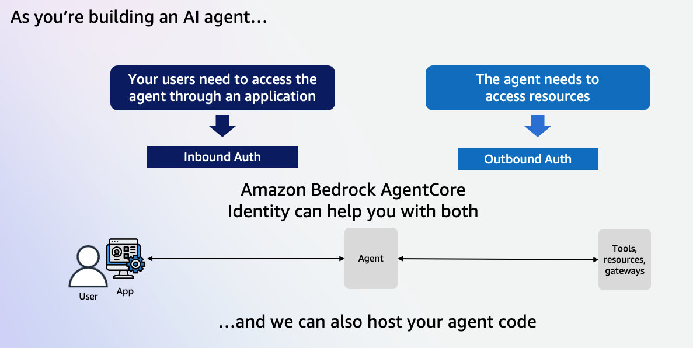
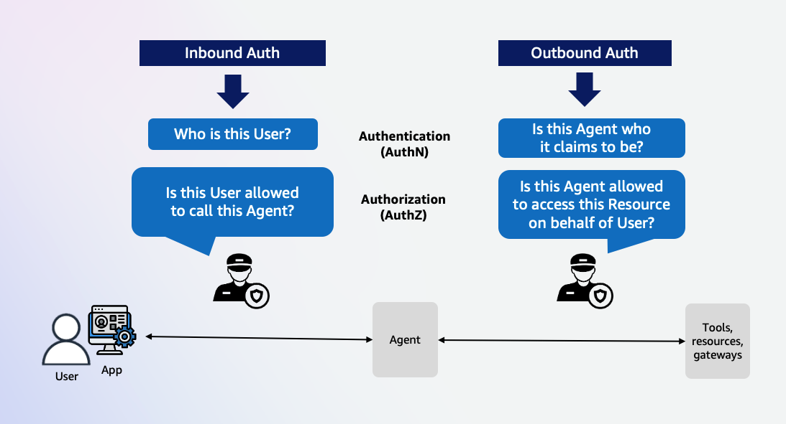
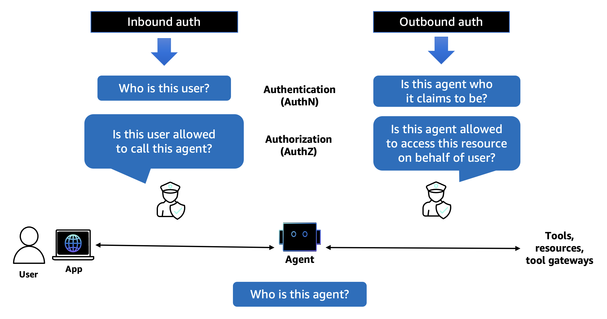
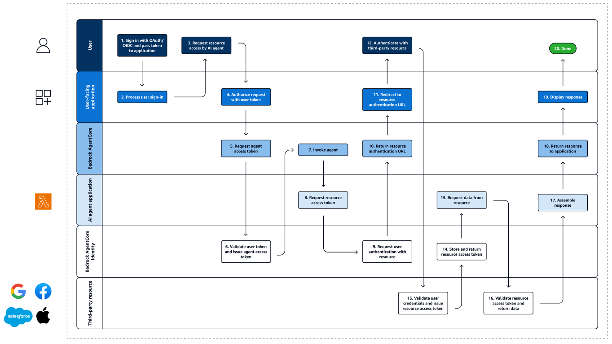

# Authenticate and Authorize

Amazon Bedrock AgentCore identity is a comprehensive identity and credential management service
designed specifically for AI agents and automated workloads. It provides secure authentication,
authorization, and credential management capabilities that enable users to invoke agents, and agents
to access external resources and services on behalf of users while maintaining strict security
controls and audit trails.

AgentCore identity addresses a fundamental challenge in AI agent deployment: enabling agents to
securely access user-specific data across multiple services without compromising security or user
experience. The service operates on the principle of **delegation rather than impersonation**, where
agents authenticate as themselves while carrying verifiable user context.

## Key Features

- **Inbound Authentication**: Validate access for users and applications calling agents or tools
- **Outbound Authentication**: Secure access from agents to external services on behalf of users
- **OAuth Integration**: Support for 2-legged and 3-legged OAuth flows
- **AWS IAM Integration**: Native integration with AWS identity and access management
- **Zero Trust Security**: Every request is validated regardless of source or previous trust relationships
- **Cross-Platform Support**: Works across AWS, other cloud providers, and on-premise environments

## Authentication Types

AgentCore identity supports two primary authentication patterns:





### Inbound Auth

Validates access for users and applications calling agents or tools in AgentCore runtime or gateway
targets. Supports:

- **AWS IAM**: Direct IAM-based access control
- **OAuth**: Token-based authentication without requiring IAM permissions for end users

### Outbound Auth

Enables agents to access AWS services and external resources on behalf of users:

- **AWS Resources**: Uses IAM execution roles for AWS service access
- **External Services**: OAuth 2-legged (client credentials) and 3-legged (authorization code) flows



## How It Works

AgentCore identity implements a comprehensive workflow that orchestrates authentication and
authorization across multiple trust domains:

1. **User Authentication**: Users authenticate through existing identity providers (Cognito, Auth0, etc.)
2. **Agent Authorization**: Applications request agent access with user tokens
3. **Token Exchange**: AgentCore identity validates user tokens and issues workload access tokens
4. **Resource Access**: Agents use workload tokens to access AWS and third-party resources
5. **Delegation & Audit**: All actions maintain user context and audit trails



## Key Benefits

- **Enhanced Security**: Zero trust authentication with fine-grained access controls
- **User Experience**: Seamless access without repeated authentication prompts
- **Audit & Compliance**: Complete audit trails for all agent actions
- **Framework Agnostic**: Works with any agent framework (Strands, LangGraph, CrewAI, etc.)
- **Scalable**: Enterprise-ready with support for multiple identity providers
- **Standards-Based**: Built on OAuth 2.0, OIDC, and industry security standards

## Architecture Integration

AgentCore identity integrates seamlessly with other AgentCore components:

- **AgentCore runtime**: Provides authentication for hosted agents
- **AgentCore gateway**: Secures access to tools and external APIs
- **AgentCore memory**: Maintains secure access to user-specific memory stores
- **Third-Party Services**: Enables secure integration with external APIs and services

## Top-level layout

| Folder | What's inside |
|:-------|:--------------|
| `01-inbound-auth/` | Protect runtime and gateway endpoints with JWTs from Cognito, Entra ID, Okta, or PingFederate |
| `02-outbound-auth/` | Give agents secure access to external APIs: OpenAI (API key), Google Calendar (3LO), GitHub (3LO), self-hosted OAuth2 |
| `03-m2m-3lo/` | Combined M2M + Auth Code flows in one runtime agent using the AgentCore CLI; Cognito inbound, GitHub + Google outbound |
| `04-entra-obo-mcp-runtime/` | Advanced: Entra ID On-Behalf-Of token exchange across two runtimes (Agent + MCP Server); user identity preserved end-to-end |

## How this section is organized

The section is split on two axes:

**Direction** — inbound (who can call the agent) vs outbound (what the agent can call).

**Complexity** — simple single-flow examples in `01-inbound-auth/` and `02-outbound-auth/`,
followed by combined multi-flow examples in `03-m2m-3lo/` and `04-entra-obo-mcp-runtime/`.

## Auth Pattern Quick Reference

| Pattern | Section | Use Case |
|:--------|:--------|:---------|
| Custom JWT (Cognito) | 01-inbound-auth/01 | Protect runtime with Cognito User Pool JWT |
| Custom JWT (Entra ID) | 01-inbound-auth/02 | Protect runtime/gateway with Microsoft Entra ID JWT |
| Custom JWT (Okta) | 01-inbound-auth/03 | Protect runtime/gateway with Okta JWT + scope enforcement |
| Custom JWT (PingFederate) | 01-inbound-auth/04 | Protect gateway with self-hosted PingFederate (CDK deploy) |
| API Key outbound | 02-outbound-auth/01 | Agent calls OpenAI with stored API key |
| 3LO outbound (Google) | 02-outbound-auth/02 | Agent calls Google Calendar with user consent flow |
| 3LO outbound (GitHub) | 02-outbound-auth/03 | Agent calls GitHub API with user consent flow |
| M2M outbound | 02-outbound-auth/04 | Agent calls self-hosted resource server with client credentials |
| M2M + 3LO combined | 03-m2m-3lo/ | Single agent with both M2M and Auth Code outbound flows |
| Entra OBO | 04-entra-obo-mcp-runtime/ | Agent calls MCP server carrying user-delegated Graph token |

## Finding Things

**By identity provider:**
- Cognito → `01-inbound-auth/01-inbound-auth-cognito/`, `03-m2m-3lo/`
- Microsoft Entra ID → `01-inbound-auth/02-inbound-auth-EntraID/`, `04-entra-obo-mcp-runtime/`
- Okta → `01-inbound-auth/03-inbound-auth-okta/`
- PingFederate → `01-inbound-auth/04-inbound-auth-pingfederate/`

**By external API:**
- OpenAI → `02-outbound-auth/01-outbound-auth-openai/`
- Google Calendar → `02-outbound-auth/02-outbound-auth-3lo/`, `03-m2m-3lo/`
- GitHub → `02-outbound-auth/03-outbound-auth-github/`, `03-m2m-3lo/`
- Microsoft Graph → `01-inbound-auth/02-inbound-auth-EntraID/` (OneNote), `04-entra-obo-mcp-runtime/`

**By deployment method:**
- AgentCore CLI (`agentcore create/deploy`) → `03-m2m-3lo/`
- Python SDK (`boto3` `bedrock-agentcore-control`) → all other folders
- AWS CDK → `01-inbound-auth/04-inbound-auth-pingfederate/`

## Prerequisites

- Python 3.10+
- AWS CLI configured with credentials
- Node.js 20+ and `@aws/agentcore` npm package (for `03-m2m-3lo/` only)
- AWS CDK (`npm install -g aws-cdk`) for `04-inbound-auth-pingfederate/` only
- Bedrock model access: enable `claude-haiku-4-5` and/or `claude-sonnet-4-5` in the Bedrock console
- identity provider accounts as needed (see individual sub-folder READMEs)

## Running the Python Scripts

Each sub-folder is self-contained. Install dependencies and run:

```bash
# Inbound auth — Cognito
cd 01-inbound-auth/01-inbound-auth-cognito/
pip install -r requirements.txt
python inbound_auth_runtime.py

# Inbound auth — Entra ID
cd 01-inbound-auth/02-inbound-auth-EntraID/
pip install -r requirements.txt
python entra_id_inbound_auth.py       # Tutorial 1: runtime
python entra_gateway_m2m.py           # Tutorial 2: gateway M2M
python entra_gateway_auth_code.py     # Tutorial 3: gateway 3LO

# Inbound auth — Okta
cd 01-inbound-auth/03-inbound-auth-okta/
pip install -r requirements.txt
python okta_inbound_auth.py           # Tutorial 1: runtime
python okta_gateway_auth.py           # Tutorial 2: gateway

# Outbound auth — OpenAI (API key)
cd 02-outbound-auth/01-outbound-auth-openai/
pip install -r requirements.txt
python outbound_auth_runtime.py

# Outbound auth — Google 3LO
cd 02-outbound-auth/02-outbound-auth-3lo/
pip install -r requirements.txt
python outbound_auth_3lo.py

# Outbound auth — GitHub 3LO
cd 02-outbound-auth/03-outbound-auth-github/
pip install -r requirements.txt
python outbound_auth_github.py

# Outbound auth — Self-hosted OAuth2
cd 02-outbound-auth/04-outbound-auth-self-hosted/
pip install -r requirements.txt
bash create_cognito.sh
python self_hosted_agent_oauth.py

# M2M + 3LO combined (AgentCore CLI)
cd 03-m2m-3lo/
pip install -r requirements.txt
python setup_cognito.py
# ... see 03-m2m-3lo/README.md for full steps

# Entra OBO + MCP runtime
cd 04-entra-obo-mcp-runtime/
pip install -r requirements.txt
python entra_obo_mcp_runtime.py
```

## AgentCore CLI

The AgentCore CLI supports both inbound and outbound auth configuration. Install it:

```bash
npm install -g @aws/agentcore
```

### Inbound auth — protect a runtime with a JWT authorizer

Pass `--authorizer-type CUSTOM_JWT` when adding an agent to require bearer token authentication
on every inbound request:

```bash
agentcore add agent \
  --name MyAgent \
  --type byo \
  --code-location app/MyAgent \
  --entrypoint main.py \
  --language Python \
  --authorizer-type CUSTOM_JWT \
  --discovery-url $COGNITO_DISCOVERY_URL \
  --allowed-clients $COGNITO_CLIENT_ID

agentcore deploy
```

### Outbound auth — store credentials for agents to call external APIs

Store an API key (e.g. OpenAI):

```bash
agentcore add credential \
  --name OpenAIKey \
  --type api-key \
  --api-key $OPENAI_API_KEY
```

Store OAuth2 client credentials for M2M (machine-to-machine) access:

```bash
agentcore add credential \
  --name GitHubM2M \
  --type oauth \
  --discovery-url $GITHUB_DISCOVERY_URL \
  --client-id $GITHUB_CLIENT_ID \
  --client-secret $GITHUB_CLIENT_SECRET \
  --scopes repo,read:user
```

Then deploy to provision all configured resources:

```bash
agentcore deploy
```

See [`03-m2m-3lo/README.md`](03-m2m-3lo/README.md) for a complete end-to-end walkthrough
using the CLI with both M2M and Auth Code (3LO) flows in one runtime agent.
Most other tutorials in this section use boto3 directly — OBO token exchange, PingFederate
CDK deployment, and 3LO consent flows require SDK-level control not available via the CLI.

## Resources

- [AgentCore identity overview](https://docs.aws.amazon.com/bedrock-agentcore/latest/devguide/identity.html)
- [Inbound auth configuration](https://docs.aws.amazon.com/bedrock-agentcore/latest/devguide/inbound-auth.html)
- [Outbound auth configuration](https://docs.aws.amazon.com/bedrock-agentcore/latest/devguide/outbound-auth.html)
- [On-Behalf-Of token exchange](https://docs.aws.amazon.com/bedrock-agentcore/latest/devguide/on-behalf-of-token-exchange.html)
