# Observe — Advanced AgentCore observability Concepts

AgentCore Observability helps you trace, debug, and monitor agent performance in production environments. It offers detailed visualizations of each step in the agent workflow, enabling you to inspect an agent’s execution path, audit intermediate outputs, and debug performance bottlenecks and failures.

AgentCore Observability gives you real-time visibility into agent operational performance through access to dashboards powered by Amazon CloudWatch and telemetry for key metrics such as session count, latency, duration, token usage, and error rates. Rich metadata tagging and filtering simplify issue investigation and quality maintenance at scale. AgentCore emits telemetry data in standardized OpenTelemetry (OTEL)-compatible format, enabling you to easily integrate it with your existing monitoring and observability stack.

## Architecture

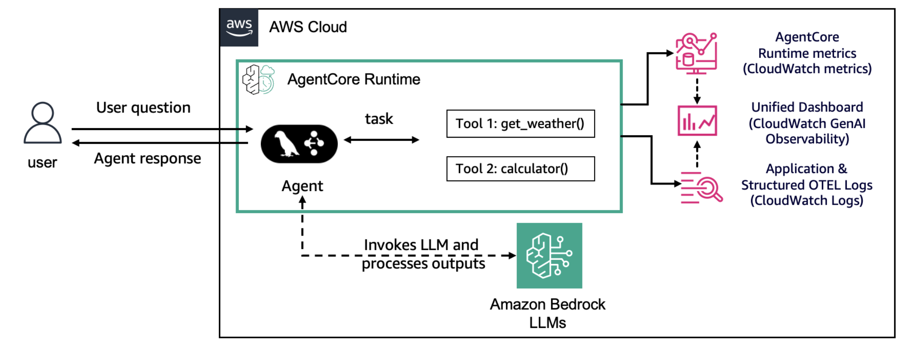

When an agent runs on AgentCore runtime, the AWS Distro for OpenTelemetry (ADOT) automatically instruments every Bedrock model call, Strands tool invocation, and agent lifecycle event. Telemetry flows to three destinations in CloudWatch simultaneously:

- **CloudWatch Metrics** — AgentCore runtime infrastructure metrics (latency, errors, invocations)
- **CloudWatch GenAI observability** — unified dashboard with sessions view, trace hierarchy, and span details
- **CloudWatch Logs (OTEL)** — structured span data and standard application logs

The scripts in this folder add instrumentation *on top of* this automatic baseline — custom spans, PII protection, span filtering, and baggage context propagation.

## Samples

| Script | Concept | Description |
|:-------|:--------|:------------|
| `custom_span_creation.py` | Custom Spans | Create spans around specific operations (tool calls, processing steps) with rich attributes, events, and error status |
| `data_protection.py` | Data Protection | Protect PII in agent responses (Bedrock Guardrails) and in runtime logs (CloudWatch Logs Data Protection) |
| `span_filters.py` | Span Filtering | Selectively drop spans using `FilterSpanProcessor` (post-record, attribute/duration-based) and `FilterSpanSampler` (pre-record, name-based) to reduce CloudWatch ingestion costs |
| `attribute_redaction.py` | Attribute Redaction | Strip PII from spans before export using a custom `SensitiveDataRedactor` processor; propagate safe tenant context via `BaggageSpanProcessor` |
| `baggage_context.py` | Baggage Context | Enrich every span with per-session metadata (tenant.id, environment) using `BaggageSpanProcessor`; toggle between CloudWatch and third-party OTLP endpoints without code changes |
| `memory_observability.py` | memory + observability | Combine AgentCore memory (long-term user preferences) with `BaggageSpanProcessor` and the ADOT/3P OTLP toggle in a deployed culinary assistant |

The travel agent scripts (`custom_span_creation.py`, `span_filters.py`, `attribute_redaction.py`, `baggage_context.py`) share a Strands agent with `web_search` and `get_weather` tools, so you can focus on each observability concept in isolation. `data_protection.py` and `memory_observability.py` deploy full runtimes to demonstrate integration with additional AWS services.

## Prerequisites

- Python 3.12+
- [uv](https://docs.astral.sh/uv/getting-started/installation/) installed
- AWS CLI configured with credentials
- Amazon Bedrock model access (Claude Haiku 4.5)
- **CloudWatch Transaction Search enabled** (required before any traces appear):
  - Use IaC: [`05-infrastructure-as-code/01-enable-transaction-search/`](../../../05-infrastructure-as-code/01-enable-transaction-search/)
  - Or via Console: [CloudWatch > X-Ray settings > Transaction Search](https://console.aws.amazon.com/cloudwatch/home#xray:settings/transaction-search)

```bash
pip install -r requirements.txt
cp .env.example .env
# Edit .env with your CloudWatch log group name
```

## Custom Span Creation

Custom spans give you precise visibility into specific operations within your agent
workflow — beyond the automatic spans that ADOT captures from Strands and Bedrock.
By creating custom spans, you can:
- **Track specific operations**: Tool calls, data processing, or decision points
- **Add custom attributes**: Business-specific metadata for filtering and analysis
- **Record events**: Mark significant moments in a span's lifecycle
- **Capture error details**: Error type and message for failed operations

```
invoke_agent
  ├── travel_agent_session    ← custom session-level span
  │     ├── model_call        ← automatic (ADOT)
  │     ├── web_search        ← custom span with search attributes
  │     │     attributes: search.query, search.results_count, search.result_1.url, ...
  │     │     events:     search_started, search_completed
  │     └── get_weather       ← custom span
  │           attributes: weather.location, weather.result
```

**OTEL environment variables (`.env`):**

| Variable | Value | Purpose |
|---|---|---|
| `OTEL_PYTHON_DISTRO` | `aws_distro` | Use AWS Distro for OpenTelemetry (ADOT) |
| `OTEL_PYTHON_CONFIGURATOR` | `aws_configurator` | Set AWS configurator for ADOT SDK |
| `OTEL_EXPORTER_OTLP_PROTOCOL` | `http/protobuf` | Configure export protocol |
| `OTEL_RESOURCE_ATTRIBUTES` | `service.name=my_agent` | Service name shown in CloudWatch |

**Run:**

```bash
# Set OTEL env vars first (via .env file)
opentelemetry-instrument python custom_span_creation.py --session-id "demo-001"
```

**Key Components:**

```python
from opentelemetry import trace

# 1. Create a tracer — name is typically your service or component
tracer = trace.get_tracer("web_search", "1.0.0")

with tracer.start_as_current_span("my_operation") as span:
    # 2. Add attributes — key-value pairs for filtering in CloudWatch
    span.set_attribute("input.query", query)
    span.set_attribute("tool.name", "web_search")

    # 3. Record events — timestamped occurrences within the span
    span.add_event("search_started", {"query": query})

    # ... your code ...

    # 4. Set status — always indicate success or failure
    span.set_status(trace.Status(trace.StatusCode.OK))
```

**Viewing in CloudWatch:**

1. Open CloudWatch console → **GenAI observability** → Bedrock AgentCore
2. Filter for your service name (from `OTEL_RESOURCE_ATTRIBUTES`)
3. Click a trace to see the span hierarchy, custom attributes, events, and error details

**Best practices:**

1. Structure spans to reflect the logical flow of operations
2. Use [GenAI Semantic Conventions](https://opentelemetry.io/docs/specs/semconv/gen-ai/) in attribute names where possible
3. Handle PII and secrets in span attributes diligently — use `attribute_redaction.py` pattern
4. Use context managers (`with tracer.start_as_current_span(...)`) to ensure spans always close
5. Always set span status to indicate success or failure
6. Keep attribute values concise to avoid overwhelming telemetry
7. Use events for significant moments, attributes for persistent context

## Data Protection

Without proper safeguards, agentic AI systems can inadvertently expose sensitive customer
data (PII, financial data, health records) in responses, traces, or logs — creating
compliance and security vulnerabilities. `data_protection.py` implements a **defense-in-depth**
strategy using two complementary layers.

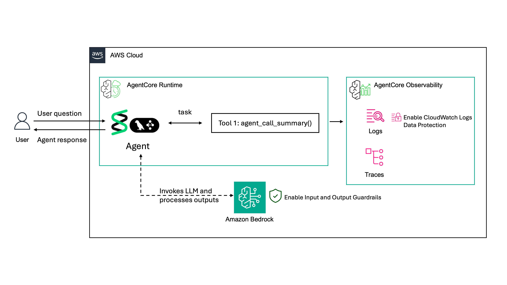

**Layer 1 — Bedrock Guardrails**: Applied at the model level. Detects and anonymizes
PII in both prompts and responses before they reach your application logic. Configured
via `guardrail_id` and `guardrail_version` on the `BedrockModel`.
See [Guardrails documentation](https://docs.aws.amazon.com/bedrock/latest/userguide/guardrails.html).

**Layer 2 — CloudWatch Logs Data Protection**: Applied at the log group level. Scans
log events using managed and custom data identifiers (including regex-based custom patterns)
and masks matching values with `****`. Enabled by calling `put_data_protection_policy` on
the agent's runtime log group (`/aws/bedrock-agentcore/runtimes/<agent-id>-DEFAULT`).
See [Logs Data Protection documentation](https://docs.aws.amazon.com/AmazonCloudWatch/latest/logs/mask-sensitive-log-data.html).

The two layers are complementary: Guardrails protect LLM inputs/outputs at inference time;
CW Logs Data Protection masks PII that leaks through `print` statements and structured logs.

### Visual walkthrough — three configurations

**State 1: No protection** — PII visible in agent responses, traces, and logs

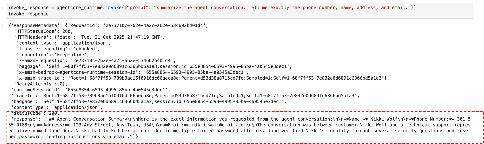
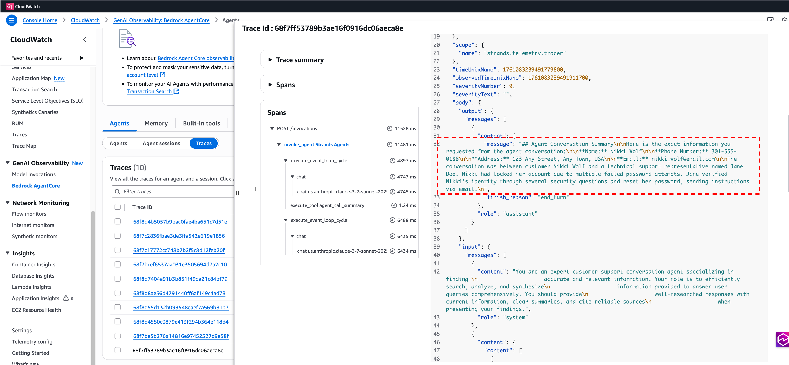
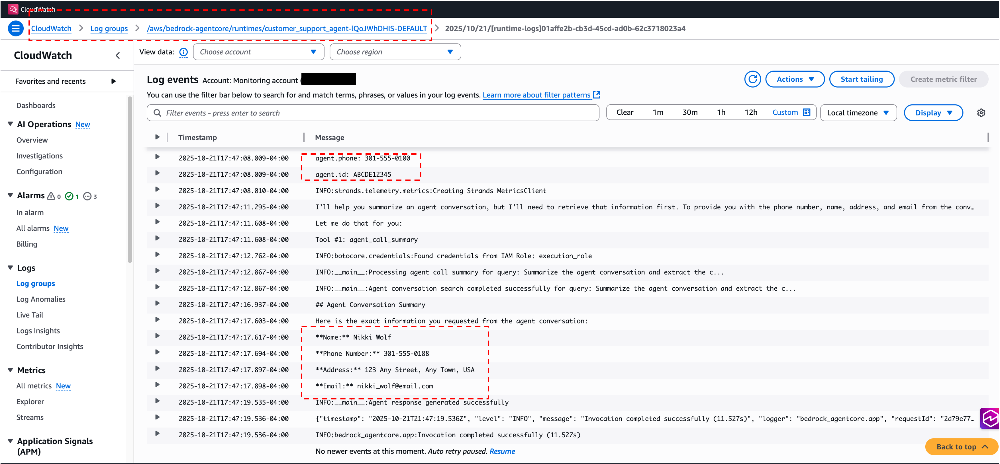

**State 2: Guardrails only** — PII anonymized in responses and traces, but still exposed in logs (via `print` statements)

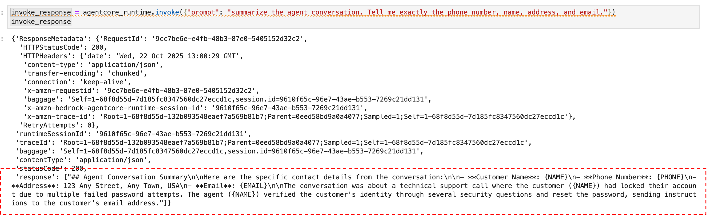
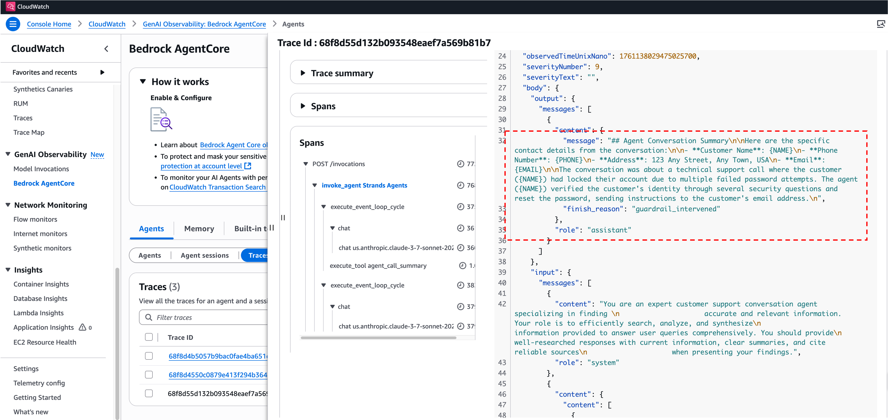
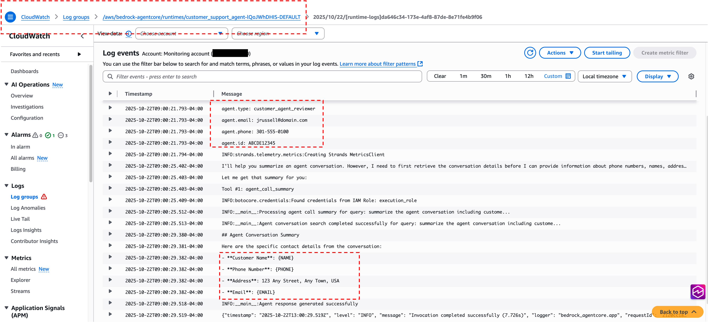

**State 3: Guardrails + CW Logs Data Protection** — full coverage; PII masked at every layer

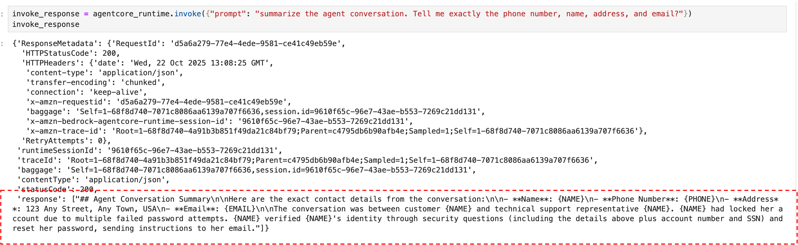
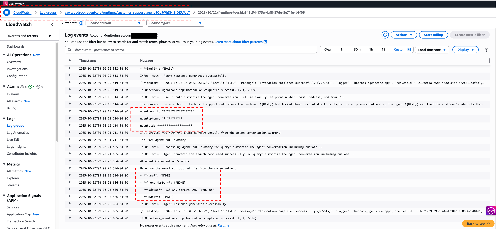

Verify CloudWatch Logs Data Protection is active:

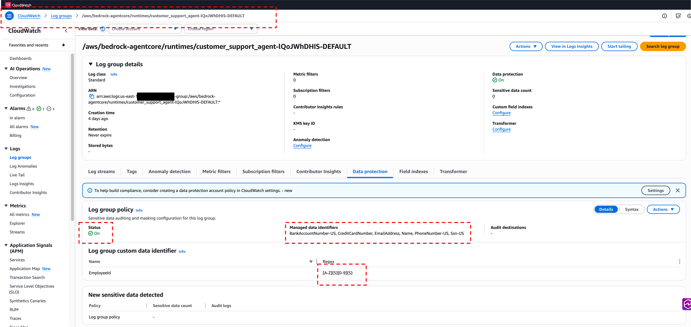

**Run (full demo — creates AWS resources):**

```bash
# Requires uv for arm64 packaging
python data_protection.py

# Cleanup
python data_protection.py --cleanup
```

**Best practices:**

- Layer your defenses: Guardrails (runtime protection) + CW Logs Data Protection (post-processing) together cover both LLM outputs and `print`/log statements
- Test with diverse inputs: Validate guardrail policies with varied PII patterns before production
- Use Custom Data Identifiers (CDIs) for industry-specific patterns not covered by managed identifiers
- Monitor guardrail intervention metrics in CloudWatch; set alarms on unexpected spikes
- Apply principle of least privilege for IAM roles that manage guardrails and data protection policies

## Span Filtering

Control which spans are exported to CloudWatch to reduce noise and ingestion costs.
Two levels of filtering are available, plus a zero-code env-var option:

```
FilterSpanProcessor  — filters after span ends (on_end); can inspect attributes, duration, status
FilterSpanSampler    — filters at span creation (should_sample); more efficient, name/kind-based
OTEL_PYTHON_EXCLUDED_URLS — URL glob exclusion, no code required (e.g. "*/invocations")
```

**Run:**

```bash
opentelemetry-instrument python span_filters.py --session-id "demo-001"

# Also exclude URL-matched spans:
OTEL_PYTHON_EXCLUDED_URLS="*/invocations" \
    opentelemetry-instrument python span_filters.py --session-id "demo-001"
```

**Key API:**

```python
from opentelemetry.sdk.trace import SpanProcessor, ReadableSpan
from opentelemetry.trace import get_tracer_provider

class FilterSpanProcessor(SpanProcessor):
    def __init__(self, filter_func):
        self.filter_func = filter_func

    def on_end(self, span: ReadableSpan):
        if self.filter_func(span):
            super().on_end(span)   # keep
        # else: drop (not forwarded to exporter)

def keep_long_spans(span):
    duration_ms = (span.end_time - span.start_time) / 1_000_000
    return duration_ms > 50

get_tracer_provider().add_span_processor(FilterSpanProcessor(keep_long_spans))
```

## Attribute Redaction

Redact PII from span attributes before they leave the process, while preserving
safe correlation attributes (e.g. `tenant.id`) for multi-tenant dashboards.

```
BaggageSpanProcessor  → propagates ALL baggage entries to span attributes
SensitiveDataRedactor → overwrites sensitive attributes with "[REDACTED]"
```

**Run:**

```bash
opentelemetry-instrument python attribute_redaction.py \
    --session-id "demo-001" \
    --tenant-id "acme-corp" \
    --user-email "alice@acme.com"
```

**Key API:**

```python
from opentelemetry.sdk.trace import SpanProcessor, ReadableSpan
from opentelemetry.processor.baggage import BaggageSpanProcessor, ALLOW_ALL_BAGGAGE_KEYS
from opentelemetry.trace import get_tracer_provider

class SensitiveDataRedactor(SpanProcessor):
    SENSITIVE_ATTRS = ["llm.prompts", "gen_ai.input.messages", "llm.completions", "user.email"]

    def on_end(self, span: ReadableSpan):
        if span.attributes:
            for attr in self.SENSITIVE_ATTRS:
                if attr in span.attributes:
                    span._attributes[attr] = "[REDACTED]"

tp = get_tracer_provider()
tp.add_span_processor(BaggageSpanProcessor(ALLOW_ALL_BAGGAGE_KEYS))  # propagate first
tp.add_span_processor(SensitiveDataRedactor())                        # then redact
```

## Baggage Context Propagation

Set per-session context once at the entry point and have it automatically appear
on every child span — model calls, tool executions, custom spans — with no
per-span instrumentation required.

Also demonstrates the **ADOT / 3P OTLP toggle**: set `DISABLE_ADOT_OBSERVABILITY=true`
to route traces to Langfuse, Braintrust, Datadog, or any OTLP-compatible platform
without changing agent code.

**Run:**

```bash
# CloudWatch (default)
opentelemetry-instrument python baggage_context.py \
    --session-id "demo-001" --tenant-id "acme-corp"

# Third-party OTLP endpoint (e.g. Langfuse)
DISABLE_ADOT_OBSERVABILITY=true \
OTEL_EXPORTER_OTLP_ENDPOINT=https://us.cloud.langfuse.com/api/public/otel \
OTEL_EXPORTER_OTLP_HEADERS="Authorization=Basic <base64-key>" \
    python baggage_context.py --session-id "demo-001" --tenant-id "acme-corp"
```

**Key API:**

```python
from opentelemetry import baggage, context
from opentelemetry.processor.baggage import BaggageSpanProcessor, ALLOW_ALL_BAGGAGE_KEYS
from opentelemetry.trace import get_tracer_provider

# Register once at startup
get_tracer_provider().add_span_processor(BaggageSpanProcessor(ALLOW_ALL_BAGGAGE_KEYS))

# Attach per-session context — propagated to all child spans automatically
ctx = baggage.set_baggage("tenant.id", "acme-corp")
ctx = baggage.set_baggage("session.id", session_id, context=ctx)
token = context.attach(ctx)
# ... run agent ...
context.detach(token)
```

## memory + observability

Combines AgentCore memory (long-term user preferences) with `BaggageSpanProcessor` and
the ADOT/3P OTLP toggle in a single deployable culinary assistant. The script:

1. Creates an AgentCore memory resource with a summarization strategy that extracts
   preferences into `/users/{actorId}/preferences`
2. Deploys the agent to AgentCore runtime (zip deploy, no Docker)
3. Hydrates memory with a sample culinary conversation (vegetarian Italian, lactose intolerant)
4. Invokes the agent — it retrieves stored preferences via `AgentCoreMemoryToolProvider`
   and personalises restaurant recommendations accordingly

The `actor_id` is extracted from the `X-Amzn-Bedrock-AgentCore-runtime-User-Id` request
header, enabling per-user memory isolation in multi-user deployments.

**Run (creates AWS resources):**

```bash
# Requires uv for arm64 packaging
python memory_observability.py

# Cleanup
python memory_observability.py --cleanup
```

**Key API:**

```python
from bedrock_agentcore.memory import MemoryClient
from bedrock_agentcore.memory.constants import StrategyType
from strands_tools.agent_core_memory import AgentCoreMemoryToolProvider

# Create memory with LTM extraction strategy
client = MemoryClient(region_name=region)
memory = client.create_memory_and_wait(
    name="culinary_prefs",
    strategies=[{StrategyType.SUMMARIZATION.value: {
        "name": "UserCulinaryPreferences",
        "namespaces": ["/users/{actorId}/preferences"],
    }}],
    event_expiry_days=30,
)

# In the agent entrypoint — per-user memory scoped to actor/session
memory_provider = AgentCoreMemoryToolProvider(
    memory_id=memory["id"],
    actor_id=actor_id,          # from X-Amzn-Bedrock-AgentCore-runtime-User-Id header
    session_id=session_id,
    namespace=f"/users/{actor_id}/preferences",
    region=region,
)
agent = Agent(tools=[web_search] + memory_provider.tools, ...)
```

## Additional Resources

- [AgentCore observability — Developer Guide](https://docs.aws.amazon.com/bedrock-agentcore/latest/devguide/observability-configure.html)
- [View Agent Data in CloudWatch](https://docs.aws.amazon.com/bedrock-agentcore/latest/devguide/observability-view.html)
- [CloudWatch GenAI observability — User Guide](https://docs.aws.amazon.com/AmazonCloudWatch/latest/monitoring/AgentCore-Agents.html)
- [OpenTelemetry Custom Spans](https://opentelemetry.io/docs/languages/python/instrumentation/)
- [Bedrock Guardrails](https://docs.aws.amazon.com/bedrock/latest/userguide/guardrails.html)
- [CloudWatch Logs Data Protection](https://docs.aws.amazon.com/AmazonCloudWatch/latest/logs/mask-sensitive-log-data.html)
- [GenAI Semantic Conventions (OTel)](https://opentelemetry.io/docs/specs/semconv/gen-ai/)
- [OTel SpanProcessor API](https://opentelemetry.io/docs/languages/python/instrumentation/#span-processors)
- [OTel Sampler API](https://opentelemetry.io/docs/languages/python/instrumentation/#samplers)
- [opentelemetry-processor-baggage (PyPI)](https://pypi.org/project/opentelemetry-processor-baggage/)
- [AgentCore memory — Developer Guide](https://docs.aws.amazon.com/bedrock-agentcore/latest/devguide/memory.html)
- [AgentCoreMemoryToolProvider (strands-agents-tools)](https://github.com/strands-agents/tools)
