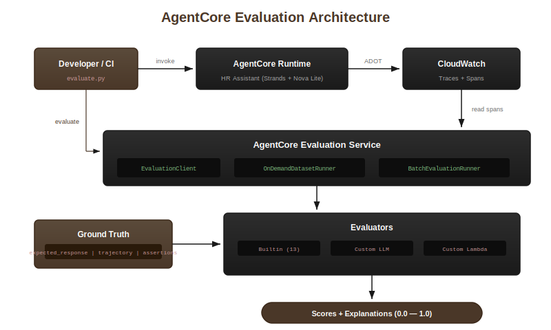
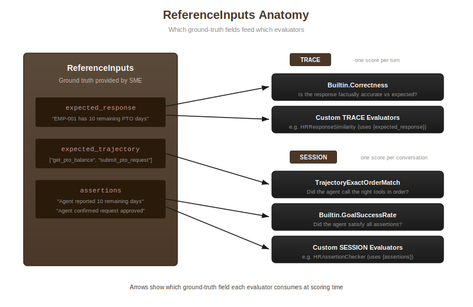

# Ground Truth evaluation with Amazon Bedrock AgentCore

## Overview



Evaluate an agent using **Amazon Bedrock AgentCore evaluations** with ground-truth reference inputs. Ground truth evaluation lets you supply the correct answer, expected tool calls, and session-level assertions alongside each agent invocation — the service compares the agent's actual behavior against your references and produces a numeric score.

```
┌───────────────┐   invoke_agent_runtime()   ┌──────────────────────────────┐
│  evaluate.py  │ ──────────────────────────▶│  AgentCore runtime           │
│               │◀────────────────────────── │  HR Assistant (Strands)      │
│               │      response + spans       └──────────────┬───────────────┘
│               │                                            │ OTel spans
│               │                             ┌──────────────▼───────────────┐
│               │                             │  CloudWatch Logs             │
│               │                             │  /aws/bedrock-agentcore/...  │
│               │                             └──────────────┬───────────────┘
│               │   Evaluate API                             │
│ EvaluationClient ─────────────────────────────────────────▶│
│ DatasetRunner ─────────────────────────────────────────────▶│
│ BatchRunner   ─────────────────────────────────────────────▶│
│               │◀────────────────────────────────────────── │ scores
└───────────────┘                             └──────────────────────────────┘
```

This example deploys an **HR Assistant agent** — a Strands agent that handles PTO, HR policies, benefits, and pay stubs using deterministic mock data, so evaluation results are fully reproducible.

---

## What You'll Learn

| Concept | Description |
|:--------|:------------|
| **EvaluationClient** | Evaluate specific sessions that already exist in CloudWatch |
| **OnDemandEvaluationDatasetRunner** | Define a dataset, auto-invoke the agent per scenario, evaluate results |
| **BatchEvaluationRunner** | Submit all sessions to a service-side job; get aggregate scores per evaluator |
| **ReferenceInputs** | Supply `expected_response`, `expected_trajectory`, and `assertions` as ground truth |
| **Custom evaluators** | Create LLM-as-a-judge evaluators with domain-specific criteria and ground-truth placeholders |

---

## The Three evaluation Interfaces

### EvaluationClient — evaluate a session you already have

Use this when you have an existing session ID (from production or a manual test) and want to score it:

```python
from bedrock_agentcore.evaluation import EvaluationClient, ReferenceInputs
from datetime import timedelta

ec = EvaluationClient(region_name="us-east-1")

results = ec.run(
    evaluator_ids=["Builtin.Correctness", "Builtin.GoalSuccessRate"],
    session_id="my-session-abc123",
    agent_id="hr_assistant_xyz-RuntimeId",
    look_back_time=timedelta(hours=2),
    reference_inputs=ReferenceInputs(
        expected_response="EMP-001 has 10 remaining PTO days.",
        assertions=["Agent called get_pto_balance", "Agent reported 10 days"],
    ),
)
```

Best for: post-hoc analysis, debugging a specific session, CI checks on known sessions.

### OnDemandEvaluationDatasetRunner — define a dataset and run it

Use this when you have a set of test scenarios and want the runner to invoke the agent, wait for spans, and evaluate — all automatically:

```python
from bedrock_agentcore.evaluation import (
    Dataset, PredefinedScenario, Turn, EvaluationRunConfig,
    EvaluatorConfig, OnDemandEvaluationDatasetRunner,
    CloudWatchAgentSpanCollector, AgentInvokerInput, AgentInvokerOutput,
)

def agent_invoker(inp: AgentInvokerInput) -> AgentInvokerOutput:
    resp = agentcore_client.invoke_agent_runtime(
        agentRuntimeArn=AGENT_ARN,
        runtimeSessionId=inp.session_id,
        payload=json.dumps({"prompt": inp.payload}).encode(),
    )
    # ... parse response ...
    return AgentInvokerOutput(agent_output=response_text)

dataset = Dataset(scenarios=[
    PredefinedScenario(
        scenario_id="pto-check",
        turns=[Turn(
            input="What is the PTO balance for EMP-001?",
            expected_response="EMP-001 has 10 remaining PTO days.",
        )],
        expected_trajectory=["get_pto_balance"],
        assertions=["Agent called get_pto_balance", "Agent reported 10 days"],
    ),
])

runner = OnDemandEvaluationDatasetRunner(region="us-east-1")
result = runner.run(
    config=EvaluationRunConfig(
        evaluator_config=EvaluatorConfig(evaluator_ids=["Builtin.Correctness"]),
        evaluation_delay_seconds=180,
    ),
    dataset=dataset,
    agent_invoker=agent_invoker,
    span_collector=CloudWatchAgentSpanCollector(log_group_name=CW_LOG_GROUP, region="us-east-1"),
)
```

Best for: regression testing, CI/CD pipelines, validating a dataset of known scenarios.

### BatchEvaluationRunner — aggregate scores across many sessions

Use this for baseline measurement and pre/post comparison. The runner invokes the agent for each scenario, then submits all sessions in a single `StartBatchEvaluation` call. Results are aggregate scores per evaluator:

```python
from bedrock_agentcore.evaluation.runner.batch.batch_evaluation_runner import BatchEvaluationRunner
from bedrock_agentcore.evaluation.runner.batch.batch_evaluation_models import (
    BatchEvaluationRunConfig, BatchEvaluatorConfig, CloudWatchDataSourceConfig,
)

batch_runner = BatchEvaluationRunner(region="us-east-1")
result = batch_runner.run_dataset_evaluation(
    config=BatchEvaluationRunConfig(
        batch_evaluation_name="my_baseline",
        evaluator_config=BatchEvaluatorConfig(
            evaluator_ids=["Builtin.Correctness", "Builtin.GoalSuccessRate"],
        ),
        data_source=CloudWatchDataSourceConfig(
            service_names=[f"{AGENT_ID}.DEFAULT"],
            log_group_names=["aws/spans", CW_LOG_GROUP],
        ),
    ),
    dataset=dataset,
    agent_invoker=agent_invoker,
)

for summary in result.evaluation_results.evaluator_summaries:
    print(f"{summary.evaluator_id}: avg={summary.statistics.average_score:.3f}")
```

Best for: baseline snapshots, large-scale evaluation, comparing before/after a prompt change.

---

## Ground Truth: ReferenceInputs



`ReferenceInputs` carries the ground truth for each session. Each evaluator reads only the fields it needs:

| Field | Used by | Description |
|:------|:--------|:------------|
| `expected_response` | `Builtin.Correctness`, custom TRACE evaluators | The ideal answer text |
| `expected_trajectory` | `Builtin.TrajectoryExactOrderMatch`, `InOrderMatch`, `AnyOrderMatch` | Ordered list of tool names |
| `assertions` | `Builtin.GoalSuccessRate`, custom SESSION evaluators | Free-text checks the session should satisfy |

Evaluators that don't need ground truth (`Builtin.Helpfulness`, `Builtin.ResponseRelevance`) can be included in the same call — they simply ignore the reference fields.

### Built-in Evaluators Reference

| Evaluator | Level | Needs ground truth |
|:----------|:------|:-------------------|
| `Builtin.Correctness` | TRACE (per turn) | `expected_response` |
| `Builtin.Helpfulness` | TRACE (per turn) | None |
| `Builtin.ResponseRelevance` | TRACE (per turn) | None |
| `Builtin.GoalSuccessRate` | SESSION | `assertions` |
| `Builtin.TrajectoryExactOrderMatch` | SESSION | `expected_trajectory` |
| `Builtin.TrajectoryInOrderMatch` | SESSION | `expected_trajectory` |
| `Builtin.TrajectoryAnyOrderMatch` | SESSION | `expected_trajectory` |

**TRACE** evaluators produce one score per conversational turn.
**SESSION** evaluators produce one score per complete conversation.

---

## Custom Evaluators

Custom evaluators let you define your own scoring criteria in natural language. They use **ground-truth placeholders** that the service substitutes at evaluation time:

| Level | Placeholder | Filled from |
|:------|:------------|:------------|
| TRACE | `{assistant_turn}` | Agent's actual response for that turn |
| TRACE | `{expected_response}` | `ReferenceInputs.expected_response` |
| TRACE | `{context}` | Conversation context preceding the turn |
| SESSION | `{actual_tool_trajectory}` | Tools the agent actually called |
| SESSION | `{expected_tool_trajectory}` | `ReferenceInputs.expected_trajectory` |
| SESSION | `{assertions}` | `ReferenceInputs.assertions` |
| SESSION | `{available_tools}` | All tools available to the agent |

Example — a custom TRACE evaluator for HR response similarity:

```python
cp = boto3.client("bedrock-agentcore-control", region_name="us-east-1")

result = cp.create_evaluator(
    evaluatorName="HRResponseSimilarity_abc12345",
    level="TRACE",
    evaluatorConfig={
        "llmAsAJudge": {
            "instructions": (
                "Compare the agent's response with the expected response.\n"
                "Agent response: {assistant_turn}\n"
                "Expected response: {expected_response}\n\n"
                "Rate how closely the key facts and numbers agree."
            ),
            "ratingScale": {
                "numerical": [
                    {"value": 0.0, "label": "not_similar", "definition": "Factually different."},
                    {"value": 0.5, "label": "partially_similar", "definition": "Partially matches."},
                    {"value": 1.0, "label": "highly_similar", "definition": "All key facts match."},
                ]
            },
            "modelConfig": {
                "bedrockEvaluatorModelConfig": {
                    "modelId": "us.amazon.nova-lite-v1:0",
                    "inferenceConfig": {"maxTokens": 512},
                }
            },
        }
    },
)
evaluator_id = result["evaluatorId"]
```

> **Note**: Evaluator names must be letters/numbers/underscores only (no hyphens), 1–48 chars. Append a UUID suffix (e.g. `_abc12345`) to avoid naming conflicts on repeated runs.

---

## Prerequisites

- Python 3.10+
- AWS CLI configured with credentials (`aws configure` or environment variables)
- Permissions for: `bedrock-agentcore:*`, `bedrock-agentcore-control:*`, `logs:*`, `iam:CreateRole`, `iam:PutRolePolicy`, `s3:PutObject`, `bedrock:InvokeModel`

---

## Step 1: Deploy the HR Assistant Agent (`../utils/deploy.py`)

The HR Assistant agent is shared across all evaluation tutorials in this directory. Deploy it once and all evaluation scripts use the same runtime.

```bash
cd ../utils
pip install boto3
python deploy.py [--region us-east-1]
```

`deploy.py` will:
1. Create an IAM execution role for the runtime
2. Build a deployment zip with the agent source and ARM64 dependencies
3. Upload the zip to S3
4. Create an AgentCore runtime via `bedrock-agentcore-control`
5. Poll until READY (typically ~30–60 seconds)
6. Write `utils/agent_config.json` with `AGENT_ID`, `AGENT_ARN`, and `CW_LOG_GROUP`

```
utils/agent_config.json  ← created by deploy.py, read by evaluate.py
```

Example output:

```
Region: us-east-1
[1/5] Creating IAM role 'hr_assistant_a1b2c3d4_role' ...
  Created: arn:aws:iam::123456789012:role/hr_assistant_a1b2c3d4_role
  policy attached. Waiting 10s for IAM propagation ...
[2/5] Building deployment package ...
  Package: /tmp/hr_assistant_a1b2c3d4_build/deployment_package.zip (52.1 MB)
[3/5] Uploading to S3 ...
  Uploaded: s3://bedrock-agentcore-code-123456789012-us-east-1/hr_assistant_a1b2c3d4/deployment_package.zip
[4/5] Creating AgentCore runtime 'hr_assistant_a1b2c3d4' ...
  runtime ID: hr_assistant_a1b2c3d4-AbCdEfGh
[5/5] Waiting for READY ...
  [  0s] CREATING
  [ 15s] CREATING
  [ 30s] READY
Deploy complete.
  AGENT_ID     : hr_assistant_a1b2c3d4-AbCdEfGh
  AGENT_ARN    : arn:aws:bedrock-agentcore:us-east-1:123456789012:runtime/hr_assistant_a1b2c3d4-AbCdEfGh
  CW_LOG_GROUP : /aws/bedrock-agentcore/runtimes/hr_assistant_a1b2c3d4-AbCdEfGh-DEFAULT
  Config saved : .../utils/agent_config.json
```

---

## Step 2: Install evaluation Dependencies

```bash
cd ground-truth-based-evaluation
pip install -r requirements.txt
```

---

## Step 3: Run the evaluation Script

```bash
python evaluate.py [--region us-east-1] [--config ../utils/agent_config.json]
```

The script runs in sequence:

| Step | What happens |
|:-----|:-------------|
| **1. Custom evaluators** | Creates `HRResponseSimilarity` (TRACE) and `HRAssertionChecker` (SESSION) evaluators with a unique suffix |
| **2. Create sessions** | Invokes the HR Assistant for 5 scenarios (3 single-turn + 2 multi-turn); waits 60s for CloudWatch ingestion |
| **3. EvaluationClient** | Evaluates each of the 4 pre-created sessions individually against ground truth |
| **4. DatasetRunner** | Defines a 5-scenario dataset, invokes the agent per scenario, waits 180s, evaluates all scenarios |
| **5. BatchRunner** | Runs the same dataset through `BatchEvaluationRunner`; submits one batch job, polls until complete |
| **6. Summary** | Prints aggregate scores and saves all results to `results/` |

Example output (abbreviated):

```
[3/6] EvaluationClient — evaluating existing sessions ...

  3a. PTO Balance session ...
  --- PTO Balance — Correctness + Quality + Custom ResponseSimilarity ---
  Evaluator                                     Value  Label                Explanation
  Builtin.Correctness                             1.0  Correct              Response matches expected answer
  Builtin.Helpfulness                             1.0  Very helpful         Clear and accurate response
  HRResponseSimilarity_abc12345-bXxYyZz           1.0  highly_similar       All key facts match

[4/6] OnDemandEvaluationDatasetRunner — automated dataset evaluation ...
  Dataset: 5 scenarios
  Evaluators: 7 (5 built-in + 2 custom)

  Summary (average score across all scenarios):
  Evaluator                                       avg  n
  Builtin.Correctness                            0.57  7
  Builtin.GoalSuccessRate                        0.80  5
  Builtin.TrajectoryExactOrderMatch              0.80  5
  HRAssertionChecker_abc12345-cDdEeFf            1.00  3

[5/6] BatchEvaluationRunner — service-side batch evaluation ...
  Per-evaluator aggregate scores:
    Builtin.GoalSuccessRate          score=0.800  (n=5)
    Builtin.TrajectoryExactOrderMatch score=0.800  (n=5)
    Builtin.Correctness              score=0.710  (n=7)
```

Results are saved to:

```
results/eval_client_results.json       ← EvaluationClient scores per session
results/dataset_runner_results.json    ← OnDemandDatasetRunner per-scenario scores
results/batch_runner_results.json      ← BatchRunner aggregate scores
```

---

## Comparison: Three evaluation Interfaces

| | EvaluationClient | OnDemandDatasetRunner | BatchEvaluationRunner |
|:---|:---|:---|:---|
| **Where eval runs** | Client-side | Client-side | Service-side |
| **Session source** | You provide a session ID | Runner invokes agent for you | Runner invokes agent for you |
| **Results** | Per-session, synchronous | Per-scenario, synchronous | Aggregate per evaluator |
| **Custom evaluators** | Yes (TRACE + SESSION) | Yes (TRACE + SESSION) | No (built-ins only) |
| **Best for** | Ad-hoc, debugging, CI spot-check | Regression testing, CI/CD | Baseline, pre/post comparison |

---

## Shared Agent

The HR Assistant agent source (`hr_assistant_agent.py`) and deployment script (`deploy.py`) live in `../utils/` and are reused by all evaluation tutorials in this directory:

```
evaluate/
├── utils/
│   ├── hr_assistant_agent.py   ← Strands agent with 5 HR tools
│   ├── deploy.py               ← deploys the agent, writes agent_config.json
│   └── requirements.txt        ← agent runtime dependencies (ARM64)
├── ground-truth-based-evaluation/   ← this folder
│   ├── evaluate.py
│   ├── requirements.txt
│   └── README.md
├── custom-code-based-evaluation/    ← reuses the same utils agent
└── llm-as-a-judge-evaluation/       ← reuses the same utils agent
```

---

## Clean Up

To delete the agent runtime and free resources:

```python
import boto3, json
from pathlib import Path

cfg = json.loads(Path("../utils/agent_config.json").read_text())
ctrl = boto3.client("bedrock-agentcore-control", region_name=cfg["region"])
ctrl.delete_agent_runtime(agentRuntimeId=cfg["agent_id"])
print("Agent runtime deleted.")
```

Or with the AWS CLI:

```bash
AGENT_ID=$(jq -r .agent_id ../utils/agent_config.json)
REGION=$(jq -r .region ../utils/agent_config.json)
aws bedrock-agentcore-control delete-agent-runtime \
  --agent-runtime-id "$AGENT_ID" \
  --region "$REGION"
```

---

## Sample Prompts

The following prompts are used in the evaluation script. They can also be sent directly to a
deployed HR Assistant to generate sessions for evaluation.

### Single-turn

| Prompt | Expected tool | Expected outcome |
|---|---|---|
| `What is the current PTO balance for employee EMP-001?` | `get_pto_balance` | 10 remaining days (15 total, 5 used) |
| `Please submit a PTO request for EMP-001 from 2026-04-14 to 2026-04-16 for a family vacation.` | `submit_pto_request` | Approved, request ID `PTO-2026-001` |
| `Can you pull up the January 2026 pay stub for employee EMP-001?` | `get_pay_stub` | Gross $8,333.33, net $5,362.50 |
| `What is the company PTO policy?` | `lookup_hr_policy` | 15 days/year, 2-day advance notice, 5-day rollover |
| `How does the 401k match work?` | `get_benefits_summary` | 100% match up to 4%, 50% on next 2%, 3-year vesting |
| `Check the PTO balance for EMP-002 and if they have at least 2 days, submit a request for 2026-05-26 to 2026-05-27.` | `get_pto_balance` → `submit_pto_request` | 3 days remaining → request approved |

### Multi-turn

**PTO planning (3 turns)**
1. `How many PTO days do I have left? My employee ID is EMP-001.`
2. `Great. I'd like to take December 23 to December 25 off. Please submit a request.`
3. `Remind me — what is the policy on rolling over unused PTO?`

Expected trajectory: `get_pto_balance` → `submit_pto_request` → `lookup_hr_policy`

**New employee onboarding (4 turns)**
1. `I just joined the company. What is the remote work policy?`
2. `How much PTO do I get as a new employee?`
3. `What life insurance benefit does the company provide?`
4. `Can you check the current PTO balance for employee EMP-042?`

Expected trajectory: `lookup_hr_policy` → `lookup_hr_policy` → `get_benefits_summary` → `get_pto_balance`

---

## Custom Evaluators in This Tutorial

Two custom LLM-as-a-judge evaluators are created with domain-specific instructions and ground-truth placeholders:

| Evaluator | Level | Placeholders used | Where used |
|---|---|---|---|
| `HRResponseSimilarity` | TRACE | `{assistant_turn}`, `{expected_response}` | EvaluationClient (single-turn sessions), DatasetRunner (all scenarios) |
| `HRAssertionChecker` | SESSION | `{actual_tool_trajectory}`, `{expected_tool_trajectory}`, `{assertions}` | EvaluationClient (multi-turn sessions), DatasetRunner (all scenarios) |

> **Note:** SESSION-level custom evaluators require a session with multiple tool calls to
> extract a meaningful trajectory. They are used on multi-turn sessions and on
> all DatasetRunner scenarios, where a 180-second ingestion delay ensures span
> data is complete before evaluation.

---

## Additional Resources

- [Ground-truth evaluations — custom evaluators](https://docs.aws.amazon.com/bedrock-agentcore/latest/devguide/ground-truth-evaluations.html#gt-custom-evaluators)
- [Dataset-based evaluations](https://docs.aws.amazon.com/bedrock-agentcore/latest/devguide/dataset-evaluations.html)
- [Amazon Bedrock AgentCore Developer Guide](https://docs.aws.amazon.com/bedrock-agentcore/latest/devguide/)
- [Strands Agents SDK](https://strandsagents.com/)
- [Build reliable AI agents with Amazon Bedrock AgentCore evaluations](https://aws.amazon.com/blogs/machine-learning/build-reliable-ai-agents-with-amazon-bedrock-agentcore-evaluations/)

---

## Files

| File | Description |
|:-----|:------------|
| `evaluate.py` | Full evaluation script — custom evaluators, EvaluationClient, DatasetRunner, BatchRunner |
| `requirements.txt` | Python dependencies (`bedrock-agentcore`, `boto3`) |
| `../utils/hr_assistant_agent.py` | HR Assistant agent source (Strands, 5 tools, mock data) |
| `../utils/deploy.py` | Deploys the agent and writes `agent_config.json` |
