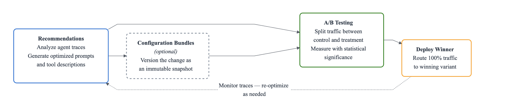

# AgentCore Optimization

End-to-end optimization workflow for an HR Assistant agent on Amazon Bedrock AgentCore runtime. Demonstrates how to measure baseline performance, generate AI-driven improvements, and validate them through A/B testing — without redeploying code.

### What You Will Learn

| Stage | Concepts Covered |
|-------|-----------------|
| **Baseline evaluation** | Batch evaluations on agent sessions |
| **Recommendations** | System prompt optimization, tool description optimization from production traces |
| **Configuration Bundles** | Versioned config containers, runtime config hooks, baggage-based injection |
| **A/B Test: Config-Bundle Routing** | Prompt-level A/B testing without redeployment, online evaluation, statistical analysis |
| **A/B Test: Target-Based Routing** | Code-level A/B testing, phased rollout (90/10 canary), multi-runtime comparison |



### Key Components

| Component | Service | Purpose |
|-----------|---------|---------|
| AgentCore runtime | `bedrock-agentcore-control` | Hosts the HR Assistant container |
| Configuration Bundle | `bedrock-agentcore-control` | Versioned system prompt and tool description storage |
| Batch evaluation | `bedrock-agentcore` (DP) | Off-line scoring of historical sessions |
| Recommendation | `bedrock-agentcore` (DP) | AI-generated prompt/tool improvements |
| gateway + Targets | `bedrock-agentcore-control` | Traffic routing for A/B tests |
| Online Eval Config | `bedrock-agentcore-control` | Continuous automatic session scoring |
| A/B Test | `bedrock-agentcore` (DP) | Traffic split + statistical comparison |

## Prerequisites

- AWS account with Bedrock AgentCore access enabled
- AWS CLI configured: `aws configure` (or set `AWS_ACCESS_KEY_ID`, `AWS_SECRET_ACCESS_KEY`, `AWS_DEFAULT_REGION`)
- IAM caller permissions:
  - `bedrock-agentcore:GetConfigurationBundle*`, `ListConfigurationBundleVersions`, `CreateConfigurationBundle`, `UpdateConfigurationBundle`, `DeleteConfigurationBundle`
  - `bedrock-agentcore:StartRecommendation`, `GetRecommendation`
  - `bedrock-agentcore:StartABTest`, `StopABTest`, `GetABTest`, `DeleteABTest`, `ListABTests`
  - `logs:GetLogEvents`, `FilterLogEvents`, `StartQuery`, `GetQueryResults` on `runtimes/*` log groups
  - `iam:CreateRole`, `AttachRolePolicy`, `PassRole` to create the execution role for the A/B test
  - `bedrock:InvokeModel`, `s3:*`, `ecr:*`, `xray:*`
- Python 3.10+
- Access to Amazon Bedrock models (Nova Lite) in your region

> **Timing note:** CloudWatch ingestion takes 2–3 minutes after invoking the agent. Batch evaluations take 1–5 minutes. Recommendations take 2–5 minutes. Budget ~45 minutes for the full workflow.

## Quick Start

```bash
pip install -r requirements.txt

# Deploy v1 HR Assistant to AgentCore runtime
python deploy.py --name HRAssistV1

# Invoke the deployed agent
python invoke.py --name HRAssistV1

# Run the full optimization workflow
python optimize.py --name HRAssistV1

# Clean up all resources
python cleanup.py --name HRAssistV1
```

## AgentCore CLI Examples

The following commands reproduce the full optimization workflow from the command line.

Install the AgentCore CLI:

```bash
npm install -g @aws/agentcore
agentcore --version   # should print 0.13.0 or later
```

### Step 1: Deploy the HR Assistant

```bash
# Scaffold a new AgentCore project
agentcore create --name HRAssistant --framework Strands --model-provider Bedrock --defaults

# Copy the HR assistant implementation
cp utils/hr_assistant_agent.py app/HRAssistant/main.py

# Test locally before deploying
agentcore dev

# Deploy to AWS (builds container, pushes to ECR, creates AgentCore runtime)
agentcore deploy
# Note the runtime ID and ARN from the output.
```

### Step 2: Run Baseline evaluation

```bash
# Invoke the agent to generate traffic
agentcore invoke \
  --runtime HRAssistant \
  --prompt "Employee ID: EMP-001. What is my PTO balance?" \
  --session-id $(python3 -c "import uuid; print(uuid.uuid4())")

# Run batch evaluation across all sessions
agentcore run batch-evaluation \
  --runtime HRAssistant \
  --evaluator Builtin.GoalSuccessRate Builtin.Helpfulness Builtin.Correctness
```

### Step 3: Get Recommendations

```bash
# System prompt recommendation (optimize for GoalSuccessRate)
agentcore run recommendation \
  --runtime HRAssistant \
  --type system-prompt \
  --evaluator Builtin.GoalSuccessRate \
  --inline "You are an HR assistant for Acme Corp. Help employees with PTO, policies, benefits, and pay stubs."

# Tool description recommendation
agentcore run recommendation \
  --runtime HRAssistant \
  --type tool-description \
  --tools "get_pto_balance:Get the PTO balance for an employee" \
  --tools "get_policy:Look up an HR policy by name"
```

### Step 4: Create Configuration Bundles

```bash
# Create control bundle (original prompt)
agentcore add config-bundle \
  --name HRControl \
  --components '{"{{runtime:HRAssistant}}": {"configuration": {"systemPrompt": "'"$(cat original_prompt.txt)"'"}}}'
agentcore deploy

# Create treatment bundle (recommended prompt)
agentcore add config-bundle \
  --name HRTreatment \
  --components '{"{{runtime:HRAssistant}}": {"configuration": {"systemPrompt": "'"$(cat recommended_prompt.txt)"'"}}}'
agentcore deploy

# View version IDs (needed for the A/B test below)
agentcore cb versions --bundle HRControl --json
agentcore cb versions --bundle HRTreatment --json
```

### Step 5a: A/B Test — Config-Bundle Routing

```bash
# Create gateway
agentcore add gateway --name HRGateway --authorizer-type AWS_IAM

# Create gateway target
agentcore add gateway-target \
  --gateway HRGateway \
  --name HRAgentV1 \
  --type mcp-server \
  --runtime HRAssistant

# Create online evaluation config
agentcore add online-eval \
  --name HROnlineEval \
  --runtime HRAssistant \
  --evaluator Builtin.GoalSuccessRate Builtin.Helpfulness \
  --sampling-rate 100 \
  --enable-on-create
agentcore deploy

# Create A/B test with config-bundle routing (50/50 split)
agentcore add ab-test \
  --name HRBundleABTest \
  --runtime HRAssistant \
  --control-bundle HRControl \
  --control-version <control-version-id> \
  --treatment-bundle HRTreatment \
  --treatment-version <treatment-version-id> \
  --control-weight 50 \
  --treatment-weight 50 \
  --online-eval HROnlineEval \
  --enable
agentcore deploy

# Monitor results
agentcore ab-test HRBundleABTest
```

### Step 5b: A/B Test — Target-Based Routing (Phased Rollout)

```bash
# Deploy v2 of the agent (with new code changes)
agentcore create --name HRAssistantV2 --framework Strands --model-provider Bedrock --defaults
cp utils/hr_assistant_agent.py app/HRAssistantV2/main.py
# (Apply v2 code changes to main.py — e.g. add escalate_to_hr_manager tool)
cd HRAssistantV2 && agentcore deploy

# Add v2 gateway target
agentcore add gateway-target \
  --gateway HRGateway \
  --name HRAgentV2 \
  --type mcp-server \
  --runtime HRAssistantV2

# Create online eval config for v2
agentcore add online-eval \
  --name HROnlineEvalV2 \
  --runtime HRAssistantV2 \
  --evaluator Builtin.GoalSuccessRate Builtin.Helpfulness \
  --sampling-rate 100 \
  --enable-on-create
agentcore deploy

# Create A/B test with target-based routing (90/10 canary)
agentcore add ab-test \
  --name HRTargetABTest \
  --mode target-based \
  --control-endpoint v1 \
  --treatment-endpoint v2 \
  --control-weight 90 \
  --treatment-weight 10 \
  --control-online-eval HROnlineEval \
  --treatment-online-eval HROnlineEvalV2 \
  --enable
agentcore deploy

# Monitor canary results; stop and promote when v2 wins
agentcore ab-test HRTargetABTest
agentcore stop ab-test HRTargetABTest
```

### Step 6: Cleanup

```bash
agentcore stop ab-test HRBundleABTest
agentcore stop ab-test HRTargetABTest
agentcore remove ab-test --name HRBundleABTest
agentcore remove ab-test --name HRTargetABTest
agentcore remove online-eval --name HROnlineEval
agentcore remove online-eval --name HROnlineEvalV2
agentcore remove config-bundle --name HRControl
agentcore remove config-bundle --name HRTreatment
agentcore remove gateway --name HRGateway
agentcore remove agent --name HRAssistant
agentcore remove agent --name HRAssistantV2
agentcore deploy -y
```

## How It Works

### Step 1: Deploy HR Assistant v1 (`deploy.py`)

Creates an IAM execution role, packages `utils/hr_assistant_agent.py` with ARM64 dependencies, uploads to S3, and creates an AgentCore runtime. The agent code is written to `main.py` inside the deployment zip with entry point `["opentelemetry-instrument", "main.py"]` for OTel tracing.

State is saved to `agent_state_{name}.json` for use by subsequent scripts.

The `--version v2` flag builds an enhanced version that adds an `escalate_to_hr_manager` tool and a more detailed system prompt baked into the code — used in the target-based A/B test.

### Step 2: Configuration Bundles (`optimize.py`)

A **Configuration Bundle** is a versioned container for agent configuration keyed by runtime ARN. The agent reads the bundle at invocation time via `BedrockAgentCoreContext.get_config_bundle()` — changing the system prompt or tool descriptions requires no redeployment.

Each bundle call returns a `bundleId` (stable) and a `versionId` (immutable snapshot). Pass `parentVersionIds` on updates to record lineage and prevent accidental overwrites. Use `commitMessage` on every create and update to document why the config changed — just like a Git commit.

#### Bundle lifecycle

| Operation | API | When to use |
|-----------|-----|-------------|
| Create | `create_configuration_bundle` | First time; establishes `bundleId` |
| Update | `update_configuration_bundle` | After evaluation; pass `parentVersionIds` to record lineage |
| Read | `get_configuration_bundle` | Verify current config (always returns latest version) |
| Compare | `get_configuration_bundle_version` | Diff two versions; useful for audits and rollback decisions |

**What we create:**
- **Control (C)** — original system prompt + original tool descriptions
- **Treatment (T1)** — recommended system prompt + recommended tool descriptions

### Step 3: Batch evaluation

Baseline batch evaluation discovers sessions from CloudWatch, runs them through built-in LLM evaluators, and returns aggregate scores:

| Evaluator | What it measures |
|-----------|------------------|
| **GoalSuccessRate** | Did the agent complete the user's goal? |
| **Helpfulness** | Was the response useful and actionable? |
| **Correctness** | Did the agent give accurate information? |

### Step 4: Optimization Recommendations

AgentCore analyzes production traces and generates:
- **System Prompt Recommendation**: rewrites your system prompt to improve a target metric
- **Tool Description Recommendation**: improves tool descriptions so the agent selects tools more reliably

Recommendations are returned as text and can be applied immediately via configuration bundles — no code changes needed.

### Step 5: Config-Bundle A/B Test

Use configuration bundle routing when the change you are testing is purely configuration — a different system prompt, a different model ID, or different tool descriptions. Both variants run on the **same runtime** with different configuration bundle versions.

**Architecture:**
```
User Request
     │
     ▼
[gateway] ──50%──▶ [Control Bundle C]   ──┐
     │                                     ├──▶ [HR runtime v1] ──▶ CloudWatch
     └──50%──▶ [Treatment Bundle T1] ──────┘                            │
                                                   [Online Eval Config] ◀┘
                                                           │
                                                   [A/B Test Results]
```

The gateway injects the correct bundle reference into each request via W3C baggage headers. The agent reads it at runtime via `BedrockAgentCoreContext.get_config_bundle()`.

**Session stickiness:** Once a session ID is assigned to a variant, all subsequent requests with that same session ID route to the same variant. This ensures a consistent experience within a session while distributing new sessions across variants according to your traffic weights.

An **online evaluation config** automatically scores every session as it closes, without requiring explicit API calls per session. It monitors the agent's CloudWatch log group, detects when a session closes (after `sessionTimeoutMinutes` of inactivity), and runs the configured evaluators.

**Results timeline:** Budget 10–15 minutes from your last request: session timeout (2 min) → evaluation (2–3 min) → aggregation (~5 min cycle). Poll until `analysisTimestamp` is populated.

### Step 6: Target-Based A/B Test

When code changes are involved (new tools, framework upgrade, or entirely different agent implementation), use target-based routing instead. It sends traffic to two **separate runtimes** — each registered as a different gateway target. Each variant has its own online evaluation config since they have different log groups.

**Architecture:**
```
User ──► [gateway] ──90%──► [Target HRAgentV1 → HR runtime v1 (stable)]  ──► CloudWatch
               │                                                                    │
               └──10%──► [Target HRAgentV2 → HR runtime v2 (canary)]   ──► CloudWatch
                                                                              │
                                                           [Online Eval v1 + Online Eval v2]
                                                                              │
                                                                    [A/B Test Results]
```

**Phased rollout:** 10% canary → validate no regressions → 50% ramp → gather statistical significance → 100% cutover → decommission old runtime.

**`gatewayFilter.targetPaths`** scopes the A/B test routing rule to requests matching the control target's path, ensuring only traffic intended for this test is intercepted.

## Files

| File | Description |
|:-----|:------------|
| `deploy.py` | Deploys HR Assistant v1 or v2 to AgentCore runtime |
| `invoke.py` | Invokes the deployed agent with sample HR queries |
| `optimize.py` | End-to-end optimization workflow (Steps 2–8) |
| `cleanup.py` | Deletes all AWS resources created by this tutorial |
| `requirements.txt` | Python dependencies |
| `utils/hr_assistant_agent.py` | HR Assistant agent with Configuration Bundle hook |

## HR Assistant Sample Prompts

```bash
python invoke.py --name HRAssistV1 --prompt "What is the PTO balance for EMP-001?"
python invoke.py --name HRAssistV1 --prompt "What is the company remote work policy?"
python invoke.py --name HRAssistV1 --prompt "Show me EMP-042 pay stub for January 2026."
python invoke.py --name HRAssistV1 --prompt "How many vacation days do I get after 3 years?"
```

## Key Concepts

### Config-Bundle vs. Target-Based A/B Testing

| | Config-Bundle Routing | Target-Based Routing |
|---|---|---|
| **What changes** | System prompt or config (no code change) | Agent code, tools, model, or framework |
| **Redeployment needed** | No — config applied at request time | Yes — new runtime required |
| **Runtimes needed** | One shared runtime | Two separate runtimes |
| **Eval configs needed** | One shared online eval config | One per variant (different log groups) |
| **Best for** | Prompt tuning, config experiments | Code releases, version upgrades |
| **Traffic split** | Typically 50/50 | Typically 90/10 canary |
| **Rollback** | Instant — update bundle version | runtime still running; shift weights back |
| **Risk** | Very low | Higher — binary change |

### Phased Rollout (Target-Based)

```
10% canary  →  validate no regressions (errors, latency, quality drop)
      ↓
50% ramp    →  gather statistical significance
      ↓
100% promote →  complete cutover; decommission old runtime
```

### Configuration Bundle Hook

The agent reads its system prompt **and tool descriptions** from the bundle on every model call — enabling live prompt updates and A/B testing without redeployment:

```python
from bedrock_agentcore.runtime import BedrockAgentCoreContext
from strands.hooks.events import BeforeModelCallEvent

def _config_bundle_hook(event: BeforeModelCallEvent) -> None:
    bundle = BedrockAgentCoreContext.get_config_bundle()
    system_prompt = DEFAULT_SYSTEM_PROMPT
    tool_descs = {}
    if bundle:
        system_prompt = bundle.get("system_prompt", DEFAULT_SYSTEM_PROMPT)
        tool_descs = bundle.get("tool_descriptions", {})

    event.agent.system_prompt = system_prompt
    if tool_descs:
        for t in event.agent.tools:
            if t.tool_name in tool_descs:
                t.tool_spec["description"] = tool_descs[t.tool_name]

agent.hooks.add_callback(BeforeModelCallEvent, _config_bundle_hook)
```

This pattern allows testing both prompt changes and tool description improvements in the same A/B experiment.

## Next Steps

- **Add custom evaluators**: Lambda-based code evaluators for deterministic policy compliance checks
- **Automate the loop**: Run batch evaluations in CI/CD to catch regressions before deployment
- **Use recommendations iteratively**: Re-run recommendations after each traffic batch to compound improvements
- **Multi-metric optimization**: Run separate recommendation jobs targeting different evaluators, then pick the best balance
- **Increase canary exposure**: Use `update_ab_test` to gradually raise treatment weight (10% → 25% → 50% → 100%)
- **Continuous monitoring**: Keep online eval configs enabled in production for zero-effort quality monitoring

## Workflow Summary

| Step | What you do | Key API |
|------|-------------|---------|
| 1 | Deploy HR Assistant to AgentCore runtime | `create_agent_runtime` |
| 2 | Create baseline Configuration Bundle and send traffic | `create_configuration_bundle`, `invoke_agent_runtime` |
| 3 | Measure baseline performance with batch evaluation | `start_batch_evaluation` / `get_batch_evaluation` |
| 4a | Generate improved system prompt from production traces | `start_recommendation` (SYSTEM_PROMPT) |
| 4b | Generate improved tool descriptions from production traces | `start_recommendation` (TOOL_DESCRIPTION) |
| 5 | Package control and treatment configs into bundles | `create_configuration_bundle` / `update_configuration_bundle` |
| 6 | A/B test prompt + tool description change via config-bundle routing | `create_ab_test` (configurationBundle variants, 50/50) |
| 7 | Canary rollout of v2 via target-based routing | `create_ab_test` (target variants, 90/10 split) |
| 8 | Promote winner or roll back | `update_configuration_bundle` / stop A/B test |

---

## Decision Framework

| A/B Test Result | Action |
|-----------------|--------|
| **Config-bundle T1 wins** | Promote treatment bundle (`update_configuration_bundle`) as new default — no code deployment |
| **Target-based v2 wins** | Ramp to 50%, then 100% cutover; delete v1 runtime |
| **Regression detected** | Stop A/B test immediately (`update_ab_test(executionStatus="STOPPED")`), investigate |
| **Inconclusive** | Continue sending traffic to accumulate sample size (p < 0.05 threshold) |
