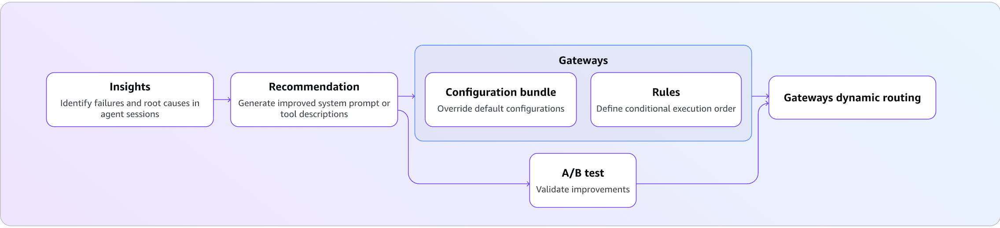

# AgentCore optimization

End-to-end optimization workflow for an HR Assistant agent on Amazon Bedrock AgentCore runtime. Covers automated insights to detect agent failures, run baseline evaluation, get recommendations to improve the agent, and A/B testing via configuration bundles and target-based routing.

### What You Will Learn

| Stage | Concepts Covered |
|-------|-----------------|
| **Insights** | FailureAnalysis, UserIntent, ExecutionSummary: root cause clustering of agent failures |
| **Baseline evaluation** | Batch evaluations on agent sessions |
| **Recommendations** | System prompt optimization, tool description optimization from production traces |
| **Configuration Bundles** | Versioned config containers, runtime config hooks, baggage-based injection |
| **A/B Test: Config-Bundle Routing** | Prompt-level A/B testing without redeployment, online evaluation, statistical analysis |
| **A/B Test: Target-Based Routing** | Code-level A/B testing, phased rollout (90/10 canary), multi-runtime comparison |



### Key Components

| Component | Service | Purpose |
|-----------|---------|---------|
| AgentCore runtime | `bedrock-agentcore-control` | Hosts the HR Assistant container |
| Configuration Bundle | `bedrock-agentcore-control` | Versioned system prompt and tool description storage |
| Batch evaluation | `bedrock-agentcore` (DP) | Off-line scoring of historical sessions |
| Batch insights | `bedrock-agentcore` (DP) | Root-cause failure clustering, user intent analysis, execution summaries |
| Online insights config | `bedrock-agentcore-control` (CP) | Recurring daily insights over live agent traffic |
| Recommendation | `bedrock-agentcore` (DP) | AI-generated prompt/tool improvements |
| gateway + Targets | `bedrock-agentcore-control` | Traffic routing for A/B tests |
| Online Eval Config | `bedrock-agentcore-control` | Continuous automatic session scoring |
| A/B Test | `bedrock-agentcore` (DP) | Traffic split + statistical comparison |

## Prerequisites

- AWS account with Bedrock AgentCore access enabled
- AWS CLI configured: `aws configure` (or set `AWS_ACCESS_KEY_ID`, `AWS_SECRET_ACCESS_KEY`, `AWS_DEFAULT_REGION`)
- IAM caller permissions:
  - `bedrock-agentcore:GetConfigurationBundle*`, `ListConfigurationBundleVersions`, `CreateConfigurationBundle`, `UpdateConfigurationBundle`, `DeleteConfigurationBundle`
  - `bedrock-agentcore:StartRecommendation`, `GetRecommendation`
  - `bedrock-agentcore:StartABTest`, `StopABTest`, `GetABTest`, `DeleteABTest`, `ListABTests`
  - `logs:GetLogEvents`, `FilterLogEvents`, `StartQuery`, `GetQueryResults` on `runtimes/*` log groups
  - `iam:CreateRole`, `AttachRolePolicy`, `PassRole` to create the execution role for the A/B test
  - `bedrock:InvokeModel`, `s3:*`, `ecr:*`, `xray:*`
- Python 3.10+
- Access to Amazon Bedrock models (Nova Lite) in your region

> **Timing note:** CloudWatch ingestion takes 2-3 minutes after invoking the agent. Batch evaluations take 1-5 minutes. Recommendations take 2-5 minutes. Budget ~45 minutes for the full workflow.

## Quick Start

```bash
pip install -r requirements.txt

# Deploy v1 HR Assistant to AgentCore runtime
python deploy.py --name HRAssistV1

# Invoke the deployed agent
python invoke.py --name HRAssistV1

# [Optional] Run insights: generate traces then analyze with all 3 insight types
python insights.py --name HRAssistV1 --generate-traces

# Run the full optimization workflow
python optimize.py --name HRAssistV1

# Clean up all resources
python cleanup.py --name HRAssistV1
```

## AgentCore CLI Examples

The following commands reproduce the full optimization workflow from the command line.

Install the AgentCore CLI:

```bash
npm install -g @aws/agentcore@latest
agentcore --version   # 0.20.1 or later
```

### Step 1: Deploy the HR Assistant

```bash
# Scaffold a new AgentCore project
agentcore create --name HRAssistant --framework Strands --model-provider Bedrock --defaults

# Copy the HR assistant implementation
cp utils/hr_assistant_agent.py app/HRAssistant/main.py

# Test locally before deploying
agentcore dev

# Deploy to AWS (builds container, pushes to ECR, creates AgentCore runtime)
agentcore deploy
# Note the runtime ID and ARN from the output.
```

### Step 2: Run Baseline evaluation

```bash
# Invoke the agent to generate traffic
agentcore invoke \
  --runtime HRAssistant \
  --prompt "Employee ID: EMP-001. What is my PTO balance?" \
  --session-id $(python3 -c "import uuid; print(uuid.uuid4())")

# Run batch evaluation across all sessions
agentcore run batch-evaluation \
  --runtime HRAssistant \
  --evaluator Builtin.GoalSuccessRate Builtin.Helpfulness Builtin.Correctness
```

### Step 3: Run Insights

After generating traffic, run insights to understand which sessions are failing and why before optimizing. The CLI insights commands require an `agentcore` project with a deployed runtime (v0.20.1+).

```bash
# Run a one-shot insights job over the last 7 days of traces:
agentcore run insights \
  --runtime HRAssistant \
  --insights Builtin.Insight.FailureAnalysis \
  --insights Builtin.Insight.UserIntent \
  --insights Builtin.Insight.ExecutionSummary \
  --lookback-days 7 \
  --wait \
  --json

# List all insights jobs for this project:
agentcore insights history --json

# View results for a specific job:
agentcore insights results --id <insights-job-id> --json

# Add a recurring daily online-insights config:
agentcore add online-insights \
  --name HROnlineInsights \
  --runtime HRAssistant \
  --insights Builtin.Insight.FailureAnalysis \
  --insights Builtin.Insight.UserIntent \
  --insights Builtin.Insight.ExecutionSummary \
  --sampling-rate 100 \
  --clustering-frequency DAILY \
  --enable-on-create
agentcore deploy -y
```

Notes:
- `insights` and `evaluators` are mutually exclusive in a single batch job. Do not pass `--evaluator` to `agentcore run insights`.
- Resource names must match `^[a-zA-Z][a-zA-Z0-9_]{0,47}$` (letters, numbers, underscores; no hyphens).
- `agentcore insights history` and `agentcore insights results` must be run from inside the project directory.

### Step 4: Get Recommendations

```bash
# System prompt recommendation (optimize for GoalSuccessRate)
agentcore run recommendation \
  --runtime HRAssistant \
  --type system-prompt \
  --evaluator Builtin.GoalSuccessRate \
  --inline "You are an HR assistant for Acme Corp. Help employees with PTO, policies, benefits, and pay stubs."

# Tool description recommendation
agentcore run recommendation \
  --runtime HRAssistant \
  --type tool-description \
  --tools "get_pto_balance:Get the PTO balance for an employee" \
  --tools "get_policy:Look up an HR policy by name"
```

### Step 5: Create Configuration Bundles

```bash
# Create control bundle (original prompt)
agentcore add config-bundle \
  --name HRControl \
  --components '{"{{runtime:HRAssistant}}": {"configuration": {"systemPrompt": "'"$(cat original_prompt.txt)"'"}}}'
agentcore deploy

# Create treatment bundle (recommended prompt)
agentcore add config-bundle \
  --name HRTreatment \
  --components '{"{{runtime:HRAssistant}}": {"configuration": {"systemPrompt": "'"$(cat recommended_prompt.txt)"'"}}}'
agentcore deploy

# View version IDs (needed for the A/B test below)
agentcore cb versions --bundle HRControl --json
agentcore cb versions --bundle HRTreatment --json
```

### Step 6a: A/B Test -- Config-Bundle Routing

```bash
# Create gateway
agentcore add gateway --name HRGateway --authorizer-type AWS_IAM

# Create gateway target
agentcore add gateway-target \
  --gateway HRGateway \
  --name HRAgentV1 \
  --type mcp-server \
  --runtime HRAssistant

# Create online evaluation config
agentcore add online-eval \
  --name HROnlineEval \
  --runtime HRAssistant \
  --evaluator Builtin.GoalSuccessRate Builtin.Helpfulness \
  --sampling-rate 100 \
  --enable-on-create
agentcore deploy

# Create A/B test with config-bundle routing (50/50 split)
agentcore add ab-test \
  --name HRBundleABTest \
  --runtime HRAssistant \
  --control-bundle HRControl \
  --control-version <control-version-id> \
  --treatment-bundle HRTreatment \
  --treatment-version <treatment-version-id> \
  --control-weight 50 \
  --treatment-weight 50 \
  --online-eval HROnlineEval \
  --enable
agentcore deploy

# Monitor results
agentcore ab-test HRBundleABTest
```

### Step 6b: A/B Test -- Target-Based Routing (Phased Rollout)

```bash
# Deploy v2 of the agent (with new code changes)
agentcore create --name HRAssistantV2 --framework Strands --model-provider Bedrock --defaults
cp utils/hr_assistant_agent.py app/HRAssistantV2/main.py
# (Apply v2 code changes to main.py -- e.g. add escalate_to_hr_manager tool)
cd HRAssistantV2 && agentcore deploy

# Add v2 gateway target
agentcore add gateway-target \
  --gateway HRGateway \
  --name HRAgentV2 \
  --type mcp-server \
  --runtime HRAssistantV2

# Create online eval config for v2
agentcore add online-eval \
  --name HROnlineEvalV2 \
  --runtime HRAssistantV2 \
  --evaluator Builtin.GoalSuccessRate Builtin.Helpfulness \
  --sampling-rate 100 \
  --enable-on-create
agentcore deploy

# Create A/B test with target-based routing (90/10 canary)
agentcore add ab-test \
  --name HRTargetABTest \
  --mode target-based \
  --control-endpoint v1 \
  --treatment-endpoint v2 \
  --control-weight 90 \
  --treatment-weight 10 \
  --control-online-eval HROnlineEval \
  --treatment-online-eval HROnlineEvalV2 \
  --enable
agentcore deploy

# Monitor canary results; stop and promote when v2 wins
agentcore ab-test HRTargetABTest
agentcore stop ab-test HRTargetABTest
```

### Step 7: Cleanup

```bash
agentcore stop ab-test HRBundleABTest
agentcore stop ab-test HRTargetABTest
agentcore remove ab-test --name HRBundleABTest
agentcore remove ab-test --name HRTargetABTest
agentcore remove online-eval --name HROnlineEval
agentcore remove online-eval --name HROnlineEvalV2
agentcore remove config-bundle --name HRControl
agentcore remove config-bundle --name HRTreatment
agentcore remove gateway --name HRGateway
agentcore remove agent --name HRAssistant
agentcore remove agent --name HRAssistantV2
agentcore deploy -y
```

## How It Works

### Step 1: Deploy HR Assistant v1 (`deploy.py`)

Creates an IAM execution role, packages `utils/hr_assistant_agent.py` with ARM64 dependencies, uploads to S3, and creates an AgentCore runtime. The agent code is written to `main.py` inside the deployment zip with entry point `["opentelemetry-instrument", "main.py"]` for OTel tracing.

State is saved to `agent_state_{name}.json` for use by subsequent scripts.

The `--version v2` flag builds an enhanced version that adds an `escalate_to_hr_manager` tool and a more detailed system prompt baked into the code. This is the version used in the target-based A/B test.

### Step 2: Insights (`insights.py`)

Sends a set of failure-mode and successful sessions to the agent, waits for traces to propagate to CloudWatch, then calls `start_batch_evaluation` with all three insight types. Polls until the job completes and prints the full failure hierarchy, user intent clusters, and execution summary clusters. The `--online` flag also creates a recurring daily `OnlineEvaluationConfig` so insights continue running automatically over live traffic.


| Insight | What It Produces |
|---------|-----------------|
| **FailureAnalysis** | Identifies failures, categorizes them using a signal taxonomy (see below), traces root causes to specific spans, and provides fix recommendations. Results appear as a three-level hierarchy: failure categories, subcategories, and root cause clusters with affected session IDs. |
| **UserIntent** | Extracts what users were trying to accomplish in each session, then clusters similar intents together. Shows the most common use cases your agent handles and reveals gaps between user requests and agent capabilities. |
| **ExecutionSummary** | Summarizes the approach the agent took and the outcome for each session, then clusters similar execution patterns. Requires at least 3 sessions. |

Each failure in the response includes one or more `signals`, the specific evidence found at a span level. Each signal has a `category` (a machine-readable taxonomy label), `evidence` (a quoted description of what went wrong in that span), and `confidence` (0–1 float).

The signal categories returned by the API:

| Category | What it means |
|---|---|
| `hallucination-category-hall-capabilities` | Agent invented constraints or limitations for a tool that do not exist in the tool spec (e.g., "this tool only supports years 2025-2026" when no such constraint is documented) |
| `hallucination-category-hall-misunderstand` | Agent misread the tool result and reported a different value (e.g., tool returned "5% match", agent reported "6%") |
| `hallucination-category-hall-usage` | Agent asserted knowledge of a tool's contents without calling it (e.g., "sabbatical leave is not in the available topics" without calling `lookup_hr_policy`) |
| `task-instruction-category-non-compliance` | Agent violated an explicit instruction in the system prompt (e.g., system prompt says "always use available tools", agent answered without calling any tool) |
| `orchestration-related-errors-category-premature-termination` | Agent terminated the task without attempting a relevant tool call, rather than calling the tool and handling any error it returns |
| `llm-output-category-nonsensical` | Agent output was incoherent or exposed internal artifacts — unresolved template placeholders, raw `<thinking>` tags, or other content that should not appear in a user-facing response |
| `repetitive-behavior-category-repetition-info` | Agent asked for information the user had already provided in the same session |

Each `affectedSessions` entry under a root cause contains:
- `sessionId` — the session where this failure occurred
- `explanation` — a sentence citing the specific span ID and what went wrong
- `fixType` — `SYSTEM_PROMPT_FIX` (addressable via prompt change) or `OTHERS` (backend or data issue)
- `recommendation` — a concrete instruction to add to the system prompt
- `failureSpans[]` — the span(s) where the failure was detected, each with `spanId`, `traceId`, and `signals[]`

Example from a real run:

```json
{
  "sessionId": "3b927bee-...",
  "explanation": "At span 619f31562100b9b6, the agent concluded without ever invoking get_pay_stub, because it hallucinated a non-existent date-range constraint.",
  "fixType": "SYSTEM_PROMPT_FIX",
  "recommendation": "Add a guardrail requiring the agent to attempt tool calls before concluding a request cannot be fulfilled.",
  "failureSpans": [{
    "spanId": "619f31562100b9b6",
    "traceId": "6a3080fa61c3929d7c75522421a71cec",
    "signals": [{
      "category": "hallucination-category-hall-capabilities",
      "evidence": "Agent claims get_pay_stub only supports 2025-2026, but the tool definition has no such constraint documented.",
      "confidence": 0.9
    }]
  }]
}
```

### How Insights Are Triggered

Insights run in two modes:

**One-time (batch):** Call `start_batch_evaluation` with an `insights` list. Results come back through `get_batch_evaluation`. Use this for on-demand analysis over a specific time range.

**Recurring (scheduled):** Create an `OnlineEvaluationConfig` with a `clusteringConfig` frequency (`DAILY`, `WEEKLY`, or `MONTHLY`). The service automatically triggers batch evaluation jobs on that cadence. Per-session analysis runs continuously; clustered results are generated during each scheduled batch job.

### Data Source

Insights pull from the `aws/spans` CloudWatch log group, which receives OTel span documents from AgentCore Runtime via the `opentelemetry-instrument` entry point. Each session's tool calls, model calls, and errors are captured as spans and correlated by session ID.

The runtime log group (`/aws/bedrock-agentcore/runtimes/...`) must also be included. Without it, the insights engine cannot resolve the log events that spans reference, which produces incomplete results.

`insights` and `evaluators` are mutually exclusive in the batch evaluation API. Use a separate batch job for each.


The `--generate-traces` flag sends sessions across several failure categories:
- **Unknown employee IDs** (`EMP-999`, `EMP-003`) -> tool returns "not found" errors
- **Unsupported policy topics** (`sabbatical`, `floating_holiday`, `relocation`) -> tool returns error
- **Unknown benefit types** (`gym`, `commuter`, `wellness`) -> tool returns error
- **Unavailable pay periods** (`2019-12`, `2020-03`) -> tool returns "not found" error
- **Invalid date formats** in PTO requests -> agent confusion / multi-turn failure
- **Normal successful sessions** -> required for UserIntent and ExecutionSummary clustering

### Reading the FailureAnalysis Output

```
FailureAnalysis (2 top-level categories)

  Category: Tool Execution Failures  (sessions affected: 8)
    Subcategory: Employee Lookup Failures
      Root cause: Unknown Employee ID Errors (4 sessions)
      Recommendation: Add input validation and a list of valid employee ID formats
                       to the system prompt. Return a helpful error message with
                       instructions to verify the employee ID.
      Session IDs: ['3fa85f64-...', 'c3d4e5f6-...', ...]

    Subcategory: Data Not Found
      Root cause: Pay Stub Period Unavailable (2 sessions)
      Recommendation: Document available pay periods in the tool description
                       and add graceful handling when a period is not found.

  Category: Out-of-Scope Requests  (sessions affected: 7)
    Subcategory: Unsupported Policy Topics
      Root cause: Missing Policy Coverage (4 sessions)
      Recommendation: Expand the policy knowledge base or add a clear out-of-scope
                       message when a policy topic is not available.
```

### Online Insights Config

The `--online` flag creates an `OnlineEvaluationConfig` that runs on a daily schedule. It uses `clusteringConfig` with `frequencies: ["DAILY"]` to re-cluster sessions automatically. View results with `get_online_evaluation_config` or the CLI:

```bash
# Run from inside your agentcore project directory:
agentcore insights history --json
agentcore insights results --id <id> --json
```

The Python SDK call (used by `insights.py --online`):

```python
ctrl.create_online_evaluation_config(
    onlineEvaluationConfigName="HROnlineInsights",
    rule={"samplingConfig": {"samplingPercentage": 100}},
    dataSourceConfig={
        "cloudWatchLogs": {
            "logGroupNames": ["aws/spans", "/aws/bedrock-agentcore/runtimes/<runtime-id>-DEFAULT"],
            "serviceNames": ["<runtime-name>.DEFAULT"],
        }
    },
    insights=[
        {"insightId": "Builtin.Insight.FailureAnalysis"},
        {"insightId": "Builtin.Insight.UserIntent"},
        {"insightId": "Builtin.Insight.ExecutionSummary"},
    ],
    clusteringConfig={"frequencies": ["DAILY"]},
    evaluationExecutionRoleArn=ROLE_ARN,
    enableOnCreate=True,
)
```

### Chaining Insights into Recommendations

Pass the insights job ID to a recommendation to generate a system prompt that targets the identified failures:

```bash
# CLI:
agentcore run recommendation \
  --from-insights <insights-id> \
  --type system-prompt \
  --inline "You are a helpful HR Assistant for Acme Corp..." \
  --json

# Python (DP client):
dp.start_recommendation(
    name="HRSpRecFromInsights",
    type="SYSTEM_PROMPT_RECOMMENDATION",
    recommendationConfig={
        "systemPromptRecommendationConfig": {
            "systemPrompt": {"text": CURRENT_SYSTEM_PROMPT},
            "agentTraces": {"batchEvaluation": {"batchEvaluationArn": INSIGHTS_EVAL_ARN}},
            "evaluationConfig": {
                "evaluators": [{"evaluatorArn": "arn:aws:bedrock-agentcore:::evaluator/Builtin.GoalSuccessRate"}]
            },
        }
    },
)
```

### Step 3: Configuration Bundles (`optimize.py`)

A **Configuration Bundle** is a versioned container for agent configuration keyed by runtime ARN. The agent reads the bundle at invocation time via `BedrockAgentCoreContext.get_config_bundle()`. Changing the system prompt or tool descriptions does not require redeployment.

Each bundle call returns a `bundleId` (stable) and a `versionId` (immutable snapshot). Pass `parentVersionIds` on updates to track lineage and prevent accidental overwrites. Use `commitMessage` on every create and update to document the change.

#### Bundle lifecycle

| Operation | API | When to use |
|-----------|-----|-------------|
| Create | `create_configuration_bundle` | First time; establishes `bundleId` |
| Update | `update_configuration_bundle` | After evaluation; pass `parentVersionIds` to record lineage |
| Read | `get_configuration_bundle` | Verify current config (always returns latest version) |
| Compare | `get_configuration_bundle_version` | Diff two versions; useful for audits and rollback decisions |

**What we create:**
- **Control (C)** -- original system prompt + original tool descriptions
- **Treatment (T1)** -- recommended system prompt + recommended tool descriptions

### Step 4: Batch evaluation

Baseline batch evaluation discovers sessions from CloudWatch, runs them through built-in LLM evaluators, and returns aggregate scores:

| Evaluator | What it measures |
|-----------|------------------|
| **GoalSuccessRate** | Did the agent complete the user's goal? |
| **Helpfulness** | Was the response useful and actionable? |
| **Correctness** | Did the agent give accurate information? |

### Step 5: Optimization Recommendations

AgentCore analyzes production traces and generates:
- **System Prompt Recommendation**: rewrites your system prompt to improve a target metric
- **Tool Description Recommendation**: improves tool descriptions so the agent selects tools more reliably

Recommendations are returned as text and can be applied immediately via configuration bundles. No code changes needed.

### Step 6: Config-Bundle A/B Test

Use configuration bundle routing when the change is purely configuration: a different system prompt, model ID, or tool descriptions. Both variants run on the same runtime with different bundle versions.

**Architecture:**
```
User Request
     |
     v
[gateway] --50%--> [Control Bundle C]   --|
     |                                    |--> [HR runtime v1] --> CloudWatch
     +--50%--> [Treatment Bundle T1] -----|                            |
                                                [Online Eval Config] <-+
                                                        |
                                                [A/B Test Results]
```

The gateway injects the correct bundle reference into each request via W3C baggage headers. The agent reads it at runtime via `BedrockAgentCoreContext.get_config_bundle()`.

**Session stickiness:** Once a session ID is assigned to a variant, all requests with that session ID go to the same variant. New sessions are distributed across variants by weight.

An **online evaluation config** scores sessions automatically as they close. It watches the agent's CloudWatch log group, detects session close (after `sessionTimeoutMinutes` of inactivity), and runs the configured evaluators.

**Results timeline:** Budget 10-15 minutes from your last request: session timeout (2 min) -> evaluation (2-3 min) -> aggregation (~5 min cycle). Poll until `analysisTimestamp` is populated.

### Step 7: Target-Based A/B Test

When the change involves code (new tools, framework upgrade, different agent implementation), use target-based routing. Traffic splits between two separate runtimes, each registered as a gateway target. Each variant needs its own online evaluation config because they have different log groups.

**Architecture:**
```
User --> [gateway] --90%--> [Target HRAgentV1 -> HR runtime v1 (stable)]  --> CloudWatch
               |                                                                    |
               +--10%--> [Target HRAgentV2 -> HR runtime v2 (canary)]   --> CloudWatch
                                                                              |
                                                         [Online Eval v1 + Online Eval v2]
                                                                              |
                                                                    [A/B Test Results]
```

**Phased rollout:** 10% canary -> validate no regressions -> 50% ramp -> gather statistical significance -> 100% cutover -> decommission old runtime.

**`gatewayFilter.targetPaths`** restricts the A/B routing rule to requests matching the control target's path, so only traffic for this test is affected.

## Key Concepts

### From Triage to Optimization

After insights identifies failure patterns, you can feed those findings into the Recommendations API to generate an improved system prompt:

1. Run insights to identify recurring failure categories and root causes.
2. Call `start_recommendation` with your current system prompt, pointing it at the same agent traces (or pass the insights batch evaluation ARN directly).
3. Use A/B testing to compare the original and recommended configurations with live traffic.

The `insights.py --online` flag and the `agentcore run recommendation --from-insights <id>` CLI command both implement this flow.

### Config-Bundle vs. Target-Based A/B Testing

| | Config-Bundle Routing | Target-Based Routing |
|---|---|---|
| **What changes** | System prompt or config (no code change) | Agent code, tools, model, or framework |
| **Redeployment needed** | No -- config applied at request time | Yes -- new runtime required |
| **Runtimes needed** | One shared runtime | Two separate runtimes |
| **Eval configs needed** | One shared online eval config | One per variant (different log groups) |
| **Best for** | Prompt tuning, config experiments | Code releases, version upgrades |
| **Traffic split** | Typically 50/50 | Typically 90/10 canary |
| **Rollback** | Instant -- update bundle version | runtime still running; shift weights back |
| **Risk** | Very low | Higher -- binary change |

### Phased Rollout (Target-Based)

```
10% canary  ->  validate no regressions (errors, latency, quality drop)
      |
50% ramp    ->  gather statistical significance
      |
100% promote ->  complete cutover; decommission old runtime
```

### Configuration Bundle Hook

The agent reads its system prompt and tool descriptions from the bundle on every model call. This supports live prompt updates and A/B testing without redeployment:

```python
from bedrock_agentcore.runtime import BedrockAgentCoreContext
from strands.hooks.events import BeforeModelCallEvent

def _config_bundle_hook(event: BeforeModelCallEvent) -> None:
    bundle = BedrockAgentCoreContext.get_config_bundle()
    system_prompt = DEFAULT_SYSTEM_PROMPT
    tool_descs = {}
    if bundle:
        system_prompt = bundle.get("system_prompt", DEFAULT_SYSTEM_PROMPT)
        tool_descs = bundle.get("tool_descriptions", {})

    event.agent.system_prompt = system_prompt
    if tool_descs:
        for t in event.agent.tools:
            if t.tool_name in tool_descs:
                t.tool_spec["description"] = tool_descs[t.tool_name]

agent.hooks.add_callback(BeforeModelCallEvent, _config_bundle_hook)
```

This supports testing both prompt changes and tool description improvements in the same A/B experiment.

## Next Steps

- **Add custom evaluators**: Lambda-based evaluators for deterministic policy checks
- **Automate the loop**: Run batch evaluations in CI/CD to catch regressions before deployment
- **Use recommendations iteratively**: Re-run after each traffic batch to compound improvements
- **Multi-metric optimization**: Run separate recommendation jobs for different evaluators, then pick the best result
- **Increase canary exposure**: Use `update_ab_test` to gradually raise treatment weight (10% -> 25% -> 50% -> 100%)
- **Continuous monitoring**: Leave online eval configs enabled in production


## Decision Framework

| A/B Test Result | Action |
|-----------------|--------|
| **Config-bundle T1 wins** | Promote treatment bundle (`update_configuration_bundle`) as new default -- no code deployment |
| **Target-based v2 wins** | Ramp to 50%, then 100% cutover; delete v1 runtime |
| **Regression detected** | Stop A/B test immediately (`update_ab_test(executionStatus="STOPPED")`), investigate |
| **Inconclusive** | Continue sending traffic to accumulate sample size (p < 0.05 threshold) |
