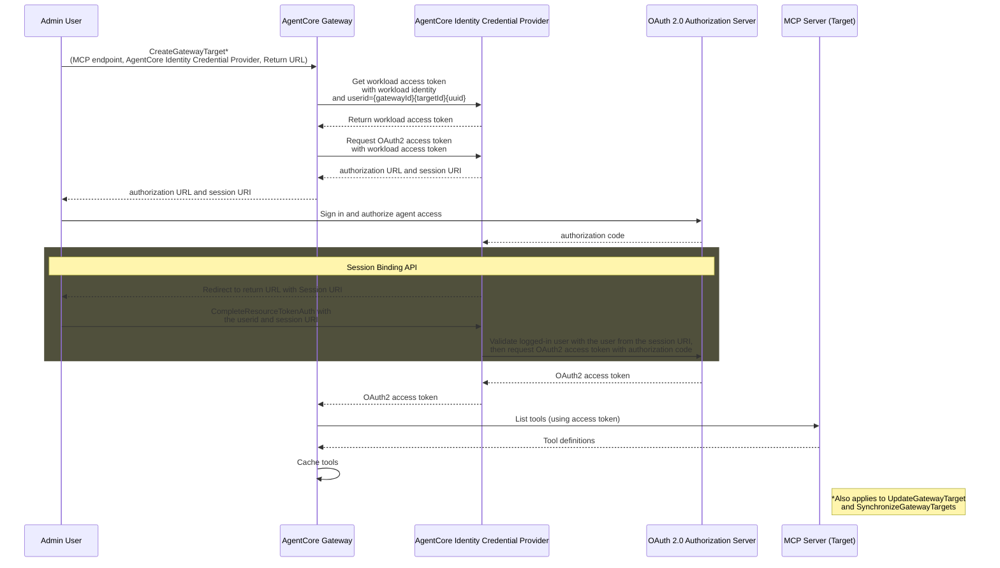

```mermaid
sequenceDiagram
    participant Admin as Admin User
    participant Gateway as AgentCore Gateway
    participant Cred as AgentCore Identity Credential Provider
    participant IdP as OAuth 2.0 Authorization Server
    participant MCP as MCP Server (Target)

    Admin->>Gateway: CreateGatewayTarget*<br/>(MCP endpoint, AgentCore Identity Credential Provider, Return URL)
    Gateway->>Cred: Get workload access token<br/>with workload identity<br/>and userid={gatewayId}{targetId}{uuid}
    Cred-->>Gateway: Return workload access token
    Gateway->>Cred: Request OAuth2 access token<br/>with workload access token
    Cred-->>Gateway: authorization URL and session URI
    Gateway-->>Admin: authorization URL and session URI

    Admin->>IdP: Sign in and authorize agent access
    IdP-->>Cred: authorization code
    rect rgb(80, 80, 60)
        Note over Admin, IdP: Session Binding API
        Cred-->>Admin: Redirect to return URL with Session URI
        Admin->>Cred: CompleteResourceTokenAuth with<br/>the userid and session URI
        Cred->>IdP: Validate logged-in user with the user from the session URI,<br/>then request OAuth2 access token with authorization code
    end
    IdP-->>Cred: OAuth2 access token
    Cred-->>Gateway: OAuth2 access token
    Gateway->>MCP: List tools (using access token)
    MCP-->>Gateway: Tool definitions
    Gateway->>Gateway: Cache tools

    Note right of MCP: *Also applies to UpdateGatewayTarget<br/>and SynchronizeGatewayTargets
```
