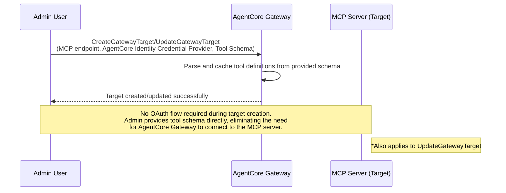

```mermaid
sequenceDiagram
    participant Admin as Admin User
    participant Gateway as AgentCore Gateway
    participant MCP as MCP Server (Target)

    Admin->>Gateway: CreateGatewayTarget/UpdateGatewayTarget<br/>(MCP endpoint, AgentCore Identity Credential Provider, Tool Schema)
    Gateway->>Gateway: Parse and cache tool definitions from provided schema
    Gateway-->>Admin: Target created/updated successfully

    Note over Admin, MCP: No OAuth flow required during target creation.<br/>Admin provides tool schema directly, eliminating the need<br/>for AgentCore Gateway to connect to the MCP server.

    Note right of MCP: *Also applies to UpdateGatewayTarget
```
