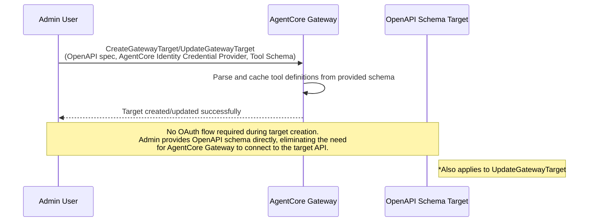

```mermaid
sequenceDiagram
    participant Admin as Admin User
    participant Gateway as AgentCore Gateway
    participant API as OpenAPI Schema Target

    Admin->>Gateway: CreateGatewayTarget/UpdateGatewayTarget<br/>(OpenAPI spec, AgentCore Identity Credential Provider, Tool Schema)
    Gateway->>Gateway: Parse and cache tool definitions from provided schema
    Gateway-->>Admin: Target created/updated successfully

    Note over Admin, API: No OAuth flow required during target creation.<br/>Admin provides OpenAPI schema directly, eliminating the need<br/>for AgentCore Gateway to connect to the target API.

    Note right of API: *Also applies to UpdateGatewayTarget
```
