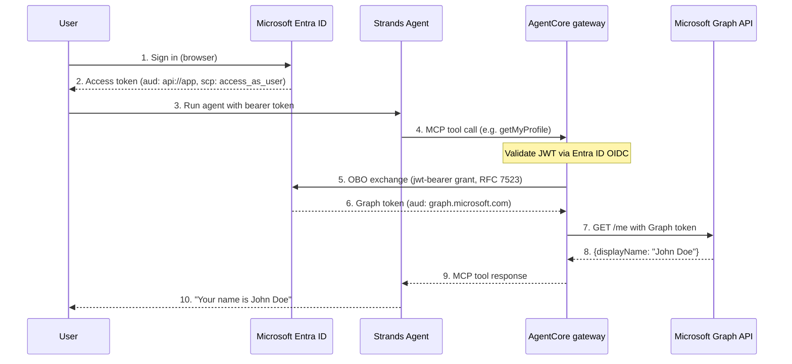

# OBO Token Exchange with AgentCore gateway + Microsoft Graph API

This tutorial shows how to use **AgentCore gateway** to expose the Microsoft Graph API as MCP tools, with **OBO (On-Behalf-Of) token exchange** handling authentication transparently. The agent code is just a few lines — no token handling, no session binding, no runtime deployment.


## How It Works

1. User authenticates directly with **Microsoft Entra ID** and gets an access token scoped to the app (`api://<client-id>/access_as_user`)
2. User passes that Entra ID token to the **AgentCore gateway** as the bearer
3. gateway validates the token using Entra ID's OIDC discovery URL (inbound auth)
4. gateway performs **OBO token exchange** — swaps the app-scoped Entra ID token for a Microsoft Graph token using JWT Authorization Grant (RFC 7523)
5. A **Strands agent** connects to the gateway MCP URL, discovers tools, and invokes them

**Docs:**[OBO Token Exchange](https://docs.aws.amazon.com/bedrock-agentcore/latest/devguide/on-behalf-of-token-exchange.html) · [gateway Outbound Auth](https://docs.aws.amazon.com/bedrock-agentcore/latest/devguide/gateway-outbound-auth.html)

### Architecture



## Prerequisites

- Python 3.12+
- [uv](https://docs.astral.sh/uv/getting-started/installation/) installed
- Node.js >= 22.7.5
- [AgentCore CLI](https://www.npmjs.com/package/@aws/agentcore): `npm install -g @aws/agentcore`
- [AWS CLI](https://docs.aws.amazon.com/cli/latest/userguide/getting-started-install.html) configured with credentials (`aws configure`)
- [IAM permissions](https://github.com/aws/agentcore-cli/blob/main/docs/PERMISSIONS.md)
- Microsoft Entra ID (Azure AD) tenant with appropriate permissions
- A Microsoft 365 **work or school account** with access to Microsoft Entra ID

> **Personal Microsoft accounts (`@outlook.com`, `@hotmail.com`, `@live.com`) will not work for the calendar/email demo.** The OBO token exchange itself works with personal accounts, but Microsoft Graph calendar and mail endpoints require an Exchange Online mailbox, which is only available with work/school accounts. Get a free sandbox at the [Microsoft 365 Developer Program](https://developer.microsoft.com/en-us/microsoft-365/dev-program).

## Deployment Steps

### Step 1: Register Application in Microsoft Entra ID

#### 1.1 Create App Registration

1. Go to [entra.microsoft.com](https://entra.microsoft.com) -> **App registrations**
2. Click **New registration**
3. Name: `AgentCore-OBO-Tutorial`, Single tenant
4. Click **Register**

#### 1.2 Record IDs

From the **Overview** page, copy:

- **Application (client) ID** → `MICROSOFT_CLIENT_ID`
- **Directory (tenant) ID** → `MICROSOFT_TENANT_ID`

#### 1.3 Create Client Secret

1. **Certificates & secrets** → **+ New client secret**. Copy the **Value** immediately → `MICROSOFT_CLIENT_SECRET`

#### 1.4 Configure API Permissions

1. **API permissions** → **+ Add a permission** → **Microsoft Graph** → **Delegated permissions**
2. Add: `Calendars.Read`, `Mail.Read`, `User.Read`

#### 1.5 Expose an API (Required for OBO)

1. **Expose an API** → Set **Application ID URI** (accept default `api://<client-id>`)
2. **Add a scope** name `access_as_user`, consent by Admins and users, Enabled

#### 1.6 Configure Authentication (Redirect URI)

1. **Authentication** → **+ Add a platform** → **Web**
2. Add redirect URI: `http://localhost:9090/oauth2/callback`
3. Click **Configure**

> This redirect URI is used by the token callback server to receive the authorization code.

#### 1.7 Grant Admin Consent

1. **API permissions** → **Grant admin consent for [tenant]** → **Yes**

> All permissions should show green checkmarks.

#### Important: Token Version

By default, Entra ID issues **v1.0 access tokens** (issuer: `https://sts.windows.net/{tenant}/`). The gateway discovery URL in this tutorial uses the v1.0 endpoint to match. If you need v2.0 tokens, set `accessTokenAcceptedVersion: 2` in the app manifest and use the v2.0 discovery URL instead.

### Step 2: Set Entra ID Environment Variables

Export your Entra ID credentials as environment variables:

```bash
export MICROSOFT_CLIENT_ID=""      # Application (client) ID from Entra ID
export MICROSOFT_CLIENT_SECRET=""  # Client secret value from Entra ID
export MICROSOFT_TENANT_ID=""      # Directory (tenant) ID from Entra ID
```

### Step 3: Create OBO Credential Provider and gateway (boto3)

All tutorials share a single AgentCore CLI project at [`gatewaylabproject/`](../../../../../gatewaylabproject/). Navigate to that directory and run all subsequent commands from there.

Deploy the credential provider, gateway, and target and Install Python dependencies (first time only):

```bash
uv sync
uv run python scripts/obo-token-exchange/deploy.py
```

This script:

1. Creates a **Custom OAuth2 credential provider** with `onBehalfOfTokenExchangeConfig` (JWT Authorization Grant) using your Entra ID credentials
2. Creates an **AgentCore gateway** with Entra ID v1.0 OIDC inbound auth (`CUSTOM_JWT` authorizer, `allowedAudience: api://<client-id>`)
3. Waits for the gateway to reach `READY` status
4. Creates a **gateway Target** with an OpenAPI schema for Microsoft Graph endpoints (calendar, email, profile) and OBO token exchange outbound auth (`TOKEN_EXCHANGE` grant type, `requested_token_use: on_behalf_of`)
5. Waits for the target to reach `READY` status

**Key details:**

- The `customParameters` with `requested_token_use: on_behalf_of` is **required** for Entra ID's OBO endpoint
- The inbound auth discovery URL uses Entra ID **v1.0** (not v2.0) because Entra ID issues v1.0 access tokens by default
- Uses `allowedAudience` (not `allowedClients`) since Entra ID v1.0 tokens carry `api://<client-id>` as the `aud` claim
- OpenAPI parameter names use `top` and `select` (not `$top`/`$select`) because the `$` character breaks Bedrock's tool schema validation

Capture the gateway MCP URL from the deploy output:

```bash
GATEWAY_MCP_URL="<gateway-url-from-deploy-output>"
```

## Demo


### Step 4: Get an Entra ID Access Token

The demo script starts an environment-aware OAuth2 callback server, opens the Entra ID login page in your browser, and automatically captures the token when you sign in. No copy-paste needed.

**Environment-Aware OAuth2 Callback Server**

The `token_callback_server.py` automatically adapts to different execution environments:

**Local Development:**

- External Callback URL: `http://localhost:9090/oauth2/callback` (browser-accessible)
- Internal Communication: `http://localhost:9090` (notebook ↔ server)
- Server Binding: `127.0.0.1` (localhost only, secure)

**SageMaker Workshop Studio:**

- External Callback URL: `https://<domain>.studio.<region>.sagemaker.aws/proxy/9090/oauth2/callback` (browser-accessible via proxy)
- Internal Communication: `http://localhost:9090` (notebook ↔ server in same container)
- Server Binding: `0.0.0.0` (allows SageMaker proxy to reach server)

The server detects the environment by checking for `/opt/ml/metadata/resource-metadata.json` and configures itself accordingly.

> **Register the callback URL with Entra ID:** The redirect URI in your Entra ID app registration (Step 1.6) must match the callback URL for your environment. For local development use `http://localhost:9090/oauth2/callback`. For SageMaker, use the proxy URL printed by the script.

### Step 5: Run the Agent

This is the entire agent — just a few lines. The `MCPClient` connects to the gateway, discovers the MCP tools (profile, calendar, email), and the Strands Agent uses them to answer the user's question.

**No `@requires_access_token`, no custom tools, no callback server, no Docker.**

> The `getMyProfile` tool works with all account types. The `listCalendarEvents` and `listUserMails` tools require a work/school account with an Exchange Online mailbox.

From the [`gatewaylabproject/`](../../../../../gatewaylabproject/) directory:

```bash
uv run python scripts/obo-token-exchange/invoke.py
```

This script:

1. Starts the token callback server and opens the Entra ID login page
2. Captures the bearer token after sign-in
3. Connects a Strands agent to the gateway MCP URL
4. Discovers tools (`listCalendarEvents`, `listUserMails`, `getMyProfile`) from the gateway
5. Asks the agent: "What is my Microsoft profile information?"

```python
from strands import Agent
from strands.tools.mcp import MCPClient
from mcp.client.streamable_http import streamablehttp_client

## Connect to the AgentCore gateway as an MCP server
mcp_client = MCPClient(
    lambda: streamablehttp_client(
        gateway_mcp_url,
        headers={"Authorization": f"Bearer {bearer_token}"}
    )
)

with mcp_client:
    # The gateway provides MCP tools: listCalendarEvents, listUserMails, getMyProfile
    tools = mcp_client.list_tools_sync()
    print(f"Discovered {len(tools)} MCP tools from gateway:")
    for t in tools:
        print(f"  - {t.tool_name}")

    agent = Agent(
        model="us.anthropic.claude-haiku-4-5-20251001-v1:0",
        tools=tools,
        system_prompt="You are a Microsoft 365 assistant. Use the available tools to help users with their Microsoft profile, Outlook calendar, and email."
    )

    response = agent("What is my Microsoft profile information?")
    print(response)
```

## Step 5b: Compare User Token vs OBO Token

The OBO exchange transforms the token in two critical ways:

|                      | User Token (before OBO)       | OBO Token (after OBO)                          |
| -------------------- | ----------------------------- | ---------------------------------------------- |
| **Audience (`aud`)** | Your app: `api://<client-id>` | Microsoft Graph: `https://graph.microsoft.com` |
| **Scopes (`scp`)**   | `access_as_user`              | `Calendars.Read Mail.Read User.Read`           |
| **identity**         | User's identity               | Same user — preserved through delegation       |

The OBO token also carries a **delegation chain** via the `xms_st` claim, which contains the original user's `sub` from the inbound token. This is how Microsoft Graph knows the request comes from an app acting **on behalf of** a specific user, not the app itself.

To decode both tokens and see the difference:

```bash
uv run python scripts/obo-token-exchange/compare_tokens.py
```

This performs the OBO exchange manually and prints a side-by-side comparison of the user token claims vs the OBO token claims, highlighting the `aud`, `scp`, and delegation chain changes.

## Cleanup

> [!IMPORTANT]
> Clean up this tutorial before starting another. Leftover resources can cause conflicts with other tutorials.

From the [`gatewaylabproject/`](../../../../../gatewaylabproject/) directory:

> [!NOTE]
> The gateway, target, and credential provider were created via boto3 (not CLI). Delete them via boto3:

```bash
uv run python scripts/obo-token-exchange/cleanup.py
```

**Also delete manually:**

- Microsoft Entra ID app registration from the [Entra portal](https://entra.microsoft.com)

## Summary

You built a Strands agent that accesses Microsoft Graph API through AgentCore gateway with OBO token exchange — using **Entra ID directly** for end-to-end authentication. The agent code has **zero token handling logic** — the gateway handles everything transparently.

### What you accomplished

- Registered an app in **Microsoft Entra ID** with OBO-compatible scopes and exposed an API
- Created a **Custom OAuth2 credential provider** with `JWT_AUTHORIZATION_GRANT` OBO config
- Set up an **AgentCore gateway** with Entra ID v1.0 OIDC inbound auth and OpenAPI schema target
- Configured the target with `TOKEN_EXCHANGE` grant type and `requested_token_use: on_behalf_of` custom parameter
- Authenticated directly with **Entra ID** to get an app-scoped access token
- Connected a **Strands agent** to the gateway MCP URL and discovered tools automatically
- Queried your **Microsoft profile** through the agent — all auth handled by the gateway via OBO

### Key learnings

- The gateway's **inbound auth discovery URL must match the token version** (v1.0 by default for Entra ID)
- Do **not** use `allowedClients` in the gateway authorizer config for Entra ID v1.0 tokens
- The `customParameters` with `requested_token_use: on_behalf_of` is **required** for Entra ID's OBO endpoint
- Personal accounts work for `/me` profile; calendar/email endpoints require a work/school account with Exchange Online

### Next steps

- Use a **work/school account** to test calendar and email tools
- Add more Microsoft Graph endpoints to the OpenAPI schema (e.g., OneDrive, Teams)
- Try different agent prompts: "What meetings do I have this week?", "List my recent emails"
- Explore the [OBO Token Exchange docs](https://docs.aws.amazon.com/bedrock-agentcore/latest/devguide/on-behalf-of-token-exchange.html) and [gateway Outbound Auth docs](https://docs.aws.amazon.com/bedrock-agentcore/latest/devguide/gateway-outbound-auth.html)

## Documentation

- [AgentCore gateway Developer Guide](https://docs.aws.amazon.com/bedrock-agentcore/latest/devguide/gateway.html)
- [OBO Token Exchange](https://docs.aws.amazon.com/bedrock-agentcore/latest/devguide/on-behalf-of-token-exchange.html)
- [gateway Outbound Auth](https://docs.aws.amazon.com/bedrock-agentcore/latest/devguide/gateway-outbound-auth.html)
- [AgentCore identity](https://docs.aws.amazon.com/bedrock-agentcore/latest/devguide/identity-authentication.html)
