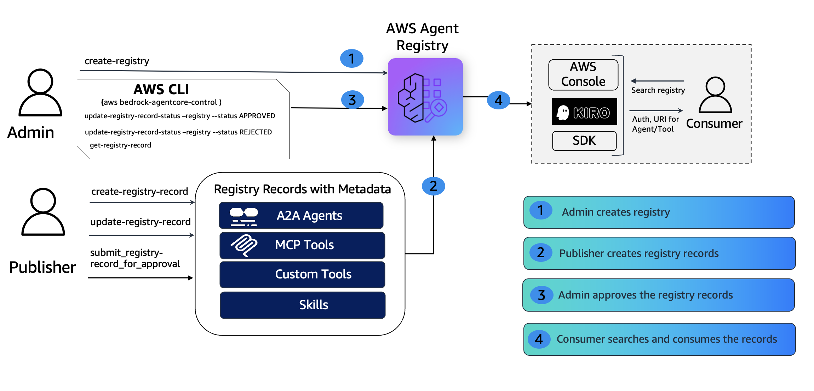

# Zero to registry in 10 Minutes — Admin Setup & IAM Governance Guide

> **⚠️ CAUTION:** The examples provided in this repository are for experimental and educational purposes only. They demonstrate concepts and techniques but are not intended for direct use in production environments.

## Overview

When organizations adopt AI agents at scale — MCP tool servers, A2A agents, and custom skills across dozens of teams — they need a centralized, governed registry to prevent unvetted agents from reaching production and to make approved agents discoverable.

AWS Agent registry provides a governance-first approach where every record must pass through an approval workflow (`DRAFT → PENDING_APPROVAL → APPROVED / REJECTED`) before it becomes searchable. This tutorial walks an IT/DevOps Admin through standing up the registry from scratch, configuring IAM policies for three personas (Admin, Publisher, Consumer), registering all three record types, proving governance guardrails work, and verifying semantic search — all in under 10 minutes.



### How It Works

1. **Admin creates a registry** with `autoApproval: false` — nothing goes live without review.
2. **IAM policies** scope each persona to their allowed operations — Publishers cannot self-approve, Consumers are read-only.
3. **Publisher registers records** (MCP, A2A, CUSTOM) — all start in `DRAFT` status.
4. **Publisher submits for approval** — records move to `PENDING_APPROVAL`.
5. **Governance tests prove boundaries** — Publisher self-approval is denied, Consumer write access is denied.
6. **Admin approves records** — records become `APPROVED` and discoverable via semantic search.
7. **Consumer searches** — natural language queries return approved, vetted agents.

### Personas

| Persona       | Can Do                                                        | Cannot Do                                |
|:--------------|:--------------------------------------------------------------|:-----------------------------------------|
| Admin         | Create/delete registries, approve/reject/deprecate records    | —                                        |
| Publisher     | Create records, submit for approval, update DRAFT records     | Approve/reject records, create/delete registries |
| Consumer      | List, get, search records                                     | Create, modify, or approve anything      |

### Supported Record Types

| Type     | Description                                      | Descriptors              |
|:---------|:-------------------------------------------------|:-------------------------|
| MCP      | Model Context Protocol servers (tools)           | `server` + `tools`       |
| A2A      | Agent-to-Agent protocol agents                   | `agentCard`              |
| CUSTOM   | Skills, custom API resources, anything else      | `custom`                 |

## Tutorial Details

| Information              | Details                                                                |
|:-------------------------|:-----------------------------------------------------------------------|
| Tutorial type            | Interactive                                                            |
| AgentCore components     | AWS Agent registry                                                     |
| Record types             | MCP, A2A, CUSTOM                                                       |
| Approval mode            | Manual (`autoApproval: false`)                                         |
| Tutorial components      | AWS Agent registry, AWS IAM                                            |
| Tutorial vertical        | Cross-vertical (applicable to any enterprise agent governance workflow) |
| Example complexity       | Beginner                                                               |
| SDK used                 | boto3                                                                  |

## Tutorial Key Features

* Governance-first Agent registry with manual approval workflow (`DRAFT → PENDING_APPROVAL → APPROVED / REJECTED`).
* IAM policy configuration for three personas: Admin, Publisher, Consumer.
* Per-persona guardrail tests proving separation of duties (Publisher cannot self-approve, Consumer cannot write).
* All three record types registered in one pass: MCP server, A2A agent (inline agent card), CUSTOM skill.
* Semantic search verification via the data plane after approval.
* Production-readiness checklist and troubleshooting FAQ.
* Full cleanup of all created resources (records, registry, IAM users).

## Prerequisites

- IAM credentials with appropriate permissions. This tutorial requires admin-level permissions to create registries, IAM users, and inline policies.

  | Service | Permissions |
  |:--------|:------------|
  | **AWS Agent registry** | `CreateRegistry`, `DeleteRegistry`, `GetRegistry`, `ListRegistries`, `CreateRegistryRecord`, `DeleteRegistryRecord`, `GetRegistryRecord`, `ListRegistryRecords`, `UpdateRegistryRecord`, `SubmitRegistryRecordForApproval`, `UpdateRegistryRecordStatus`, `SearchRegistryRecords` |
  | **AWS IAM** | `CreateUser`, `DeleteUser`, `PutUserPolicy`, `DeleteUserPolicy`, `CreateAccessKey`, `DeleteAccessKey`, `ListAccessKeys` |
  | **AWS STS** | `GetCallerIdentity` |

- Python 3.8+ with `boto3 >= 1.42.87` installed
- AWS CLI configured with a default region (`us-west-2`)

## AWS Resources Created

| Resource                        | Type                              | Purpose                                          |
|:--------------------------------|:----------------------------------|:-------------------------------------------------|
| Agent registry                  | `bedrock-agentcore:registry`      | Central registry with manual approval workflow   |
| MCP Server Record               | `bedrock-agentcore:record`        | Code review MCP tool server (DRAFT → APPROVED)   |
| A2A Agent Record                | `bedrock-agentcore:record`        | Compliance agent with inline card (DRAFT → APPROVED) |
| CUSTOM Skill Record             | `bedrock-agentcore:record`        | Data pipeline skill (DRAFT → APPROVED)           |
| IAM User (Admin)                | `AWS::IAM::User`                  | Full registry access + approval authority         |
| IAM User (Publisher)            | `AWS::IAM::User`                  | Create/submit records, no approval authority      |
| IAM User (Consumer)             | `AWS::IAM::User`                  | Read-only access + semantic search                |

## Running the Python Scripts

```bash
pip install boto3
python getting_started_registry_end_to_end.py
```
