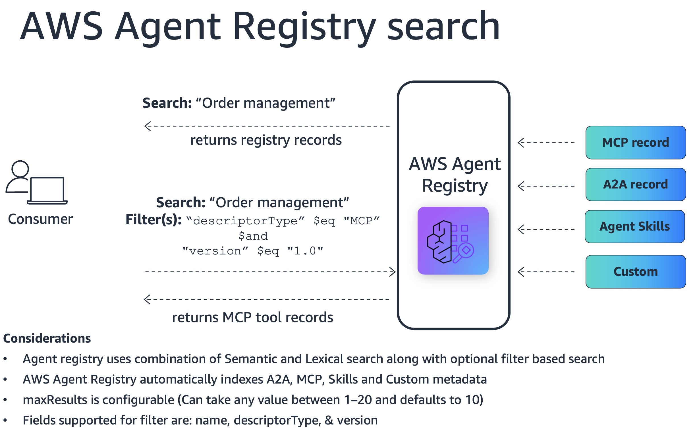

# Consumer Discovery: Semantic Search

Demonstrates the consumer role in AWS Agent registry — discovering tools and agents
via semantic search, filtered search, and detailed descriptor inspection.



## What This Example Shows

- Seed a registry with 14 e-commerce capability records (MCP tools and A2A agents)
  loaded from `registry-records.json`
- Run 12 discovery scenarios covering:
  - Basic semantic search by natural-language query
  - Filtered search using `$eq`, `$ne`, `$in`, `$and`, `$or` operators on
    `descriptorType`, `name`, and `version`
  - Drill-down into MCP `serverSchema` / `toolSchema` descriptors
  - Drill-down into A2A `agentCard` descriptors
  - Cross-type discovery (finding both MCP and A2A capabilities with one query)
- Full cleanup of all created resources

## Prerequisites

- Python 3.10+
- AWS credentials configured
- `boto3` installed: `pip install boto3`

## Running the Python Scripts

```bash
pip install boto3
```

```bash
python consumer_discovery_semantic_search.py
```

The script creates a registry, seeds it with records from `registry-records.json`,
runs all discovery demos, then deletes the registry and records on completion.
