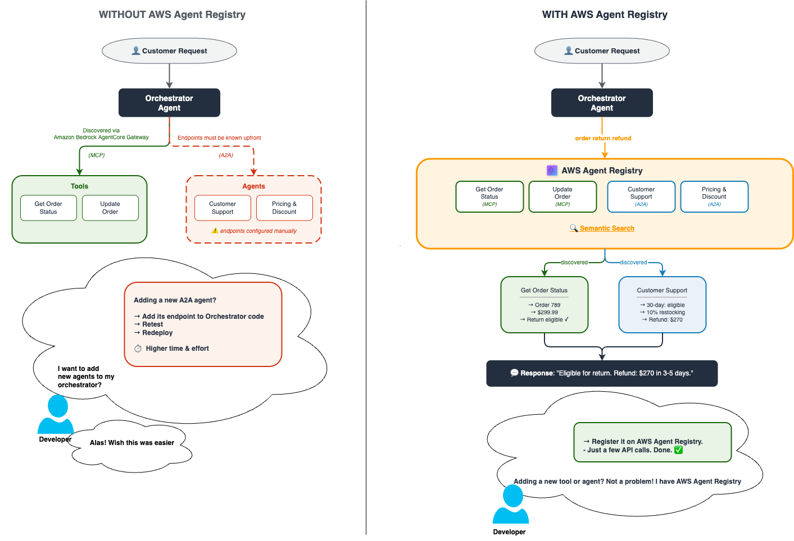
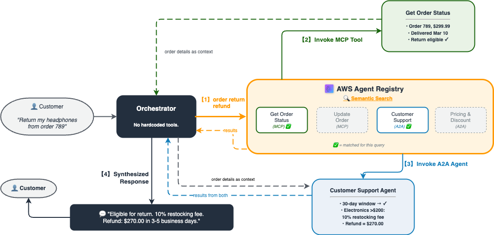
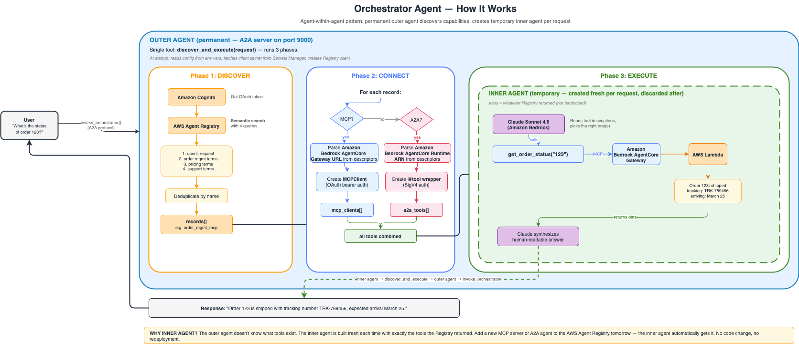

# Discovering Tools and Agents at runtime Using AWS Agent registry

## Overview

This tutorial demonstrates an autonomous agent that discovers tools and agents at runtime via **AWS Agent registry** semantic search and invokes them dynamically — zero hardcoded integrations.

The orchestrator agent follows a three-phase discovery pattern:

1. **Discovery** — Searches the registry with natural language to find relevant MCP servers and A2A agents
2. **Instantiation** — Creates live connections: `MCPClient` for Amazon Bedrock AgentCore gateway MCP servers, `@tool` wrappers for A2A agents
3. **Execution** — Runs the user's request using only the dynamically discovered capabilities

### registry-Driven Discovery

In traditional agent systems, integrations are hardcoded at build time. **AWS Agent registry** flips this: MCP servers and agents register themselves in a catalog with rich descriptions, and at runtime the orchestrator searches the catalog with natural language to find what it needs. New capabilities become available instantly — no redeployment required.



### Use Case: Order Management & Customer Service

An orchestrator agent helps customers with order-related tasks by dynamically discovering:
- **MCP servers** for order data retrieval (get status, update orders)
- **A2A agents** for business logic reasoning (pricing/discounts, returns/refunds)

### Tutorial Details

| Information | Details |
|:---|:---|
| Tutorial type | Agentic Discovery & Multi-Agent Orchestration |
| AgentCore components | AWS Agent registry, Amazon Bedrock AgentCore gateway, Amazon Bedrock AgentCore runtime |
| Agentic Framework | Strands Agents |
| gateway Target type | AWS Lambda |
| Inbound Auth | OAuth2 (Custom JWT via Amazon Cognito) |
| Outbound Auth | gateway IAM Role |
| LLM model | Anthropic Claude Sonnet 4.6 |
| Tutorial components | AWS Agent registry, Amazon Bedrock AgentCore gateway (MCP/OAuth2), Amazon Bedrock AgentCore runtime (A2A/SigV4), AWS Lambda, Amazon Cognito |
| Tutorial vertical | Cross-vertical (Order Management & Customer Service) |
| Example complexity | Advanced |
| SDK used | boto3 |

## Tutorial Architecture



The orchestrator searches the registry on every request, instantiates tools from the results, and executes — all at runtime with zero hardcoded integrations.

### Orchestrator Agent Flow



The orchestrator is deployed to Amazon Bedrock AgentCore runtime. On each request it runs three phases — **discover** capabilities from the registry, **connect** to them (MCP via Amazon Bedrock AgentCore gateway, A2A via Amazon Bedrock AgentCore runtime), and **execute** using a Strands Agent created with only the discovered tools.

## Tutorial Key Features

- **Semantic discovery** — registry search finds capabilities by meaning, not name (e.g., "return refund" matches the Customer Support Agent even though those exact words don't appear in its name)
- **Dynamic orchestration** — No hardcoded integrations; the agent builds its toolset at runtime
- **Mixed protocols** — MCP servers (via Amazon Bedrock AgentCore gateway) and A2A agents (via Amazon Bedrock AgentCore runtime) in a single agent
- **OAuth2 + SigV4** — Amazon Bedrock AgentCore gateway uses Amazon Cognito JWT auth; Amazon Bedrock AgentCore runtime uses IAM SigV4 signing
- **Protocol-agnostic discovery** — One AWS Agent registry search returns both MCP servers and A2A agents
- **End-to-end lifecycle** — Creates all infrastructure, runs demos, and cleans up

## Prerequisites

- **Amazon SageMaker notebook instance** — Recommended configuration:
  - Platform: **Amazon Linux 2**
  - Notebook environment: **JupyterLab 4** (`notebook-al2-v3`)
  - Kernel: **conda_python3**
  - Instance type: `ml.t3.xlarge` or larger
- AWS account with Amazon Bedrock model access (Claude Sonnet 4.6)
- IAM role attached to the notebook instance with the required permissions (see below)
- Python 3.10+
- boto3 >= 1.42.87

### Required IAM Permissions

This tutorial creates and manages resources across multiple AWS services. Attach the following IAM policy to the SageMaker notebook instance's execution role:

```json
{
    "Version": "2012-10-17",
    "Statement": [
        {
            "Sid": "BedrockAgentCoreAccess",
            "Effect": "Allow",
            "Action": "bedrock-agentcore:*",
            "Resource": "*"
        },
        {
            "Sid": "BedrockModelInvocation",
            "Effect": "Allow",
            "Action": "bedrock:InvokeModel",
            "Resource": "*"
        },
        {
            "Sid": "LambdaManagement",
            "Effect": "Allow",
            "Action": [
                "lambda:CreateFunction",
                "lambda:DeleteFunction",
                "lambda:GetFunction",
                "lambda:InvokeFunction",
                "lambda:AddPermission"
            ],
            "Resource": "arn:aws:lambda:*:*:function:*"
        },
        {
            "Sid": "CognitoManagement",
            "Effect": "Allow",
            "Action": [
                "cognito-idp:CreateUserPool",
                "cognito-idp:CreateUserPoolClient",
                "cognito-idp:CreateResourceServer",
                "cognito-idp:CreateUserPoolDomain",
                "cognito-idp:DeleteUserPool",
                "cognito-idp:DeleteUserPoolDomain",
                "cognito-idp:DescribeUserPoolClient"
            ],
            "Resource": "*"
        },
        {
            "Sid": "IAMRoleManagement",
            "Effect": "Allow",
            "Action": [
                "iam:CreateRole",
                "iam:DeleteRole",
                "iam:PutRolePolicy",
                "iam:DeleteRolePolicy",
                "iam:AttachRolePolicy",
                "iam:DetachRolePolicy",
                "iam:ListRolePolicies",
                "iam:ListAttachedRolePolicies",
                "iam:PassRole"
            ],
            "Resource": "arn:aws:iam::*:role/*"
        },
        {
            "Sid": "ECRManagement",
            "Effect": "Allow",
            "Action": [
                "ecr:CreateRepository",
                "ecr:DeleteRepository",
                "ecr:GetAuthorizationToken",
                "ecr:BatchDeleteImage",
                "ecr:PutImage",
                "ecr:InitiateLayerUpload",
                "ecr:UploadLayerPart",
                "ecr:CompleteLayerUpload",
                "ecr:BatchCheckLayerAvailability"
            ],
            "Resource": "*"
        },
        {
            "Sid": "CodeBuildManagement",
            "Effect": "Allow",
            "Action": [
                "codebuild:CreateProject",
                "codebuild:UpdateProject",
                "codebuild:StartBuild",
                "codebuild:BatchGetBuilds"
            ],
            "Resource": "arn:aws:codebuild:*:*:project/bedrock-agentcore-*"
        },
        {
            "Sid": "SecretsManagerManagement",
            "Effect": "Allow",
            "Action": [
                "secretsmanager:CreateSecret",
                "secretsmanager:GetSecretValue",
                "secretsmanager:DeleteSecret"
            ],
            "Resource": "arn:aws:secretsmanager:*:*:secret:*"
        },
        {
            "Sid": "S3CodeBuildArtifacts",
            "Effect": "Allow",
            "Action": [
                "s3:CreateBucket",
                "s3:PutBucketLifecycleConfiguration",
                "s3:PutObject",
                "s3:GetObject",
                "s3:GetBucketLocation"
            ],
            "Resource": "arn:aws:s3:::bedrock-agentcore-*"
        },
        {
            "Sid": "STSAccess",
            "Effect": "Allow",
            "Action": "sts:GetCallerIdentity",
            "Resource": "*"
        },
        {
            "Sid": "CloudWatchLogs",
            "Effect": "Allow",
            "Action": [
                "logs:CreateLogGroup",
                "logs:CreateLogStream",
                "logs:PutLogEvents"
            ],
            "Resource": "arn:aws:logs:*:*:log-group:/aws/bedrock-agentcore/*"
        }
    ]
}
```

> **Note:** This policy follows least-privilege principles and is scoped to the resources this tutorial creates. Copy the JSON above and attach it as an inline policy to your SageMaker notebook instance's execution role.

## Tutorials Overview

| Notebook | Description |
|:---|:---|
| [discovery-and-invocation-at-runtime.ipynb](discovery-and-invocation-at-runtime.ipynb) | End-to-end tutorial: deploy infrastructure, create registry, register records, deploy orchestrator, run 3 live demos, and clean up |

### Notebook Structure

The tutorial is organized into five main steps:

**Step 1: Deploy Infrastructure** — Creates all backend resources that will be registered in the registry:
- **MCP Servers (via Amazon Bedrock AgentCore gateway):** `get_order_status` and `update_order` tools backed by AWS Lambda, authenticated via Amazon Cognito OAuth2
- **A2A Agents (via Amazon Bedrock AgentCore runtime):** Pricing Agent and Customer Support Agent as Docker containers, authenticated via IAM SigV4

**Step 2: Create registry & Register Records** — Creates an AWS Agent registry with `autoApproval: False`, registers 3 records (1 MCP, 2 A2A), approves them through the two-step workflow (DRAFT → PENDING_APPROVAL → APPROVED), and verifies semantic search

**Step 3: Deploy Orchestrator Agent** — Deploys an orchestrator agent to Amazon Bedrock AgentCore runtime that uses `discover_and_execute` to search the registry, parse metadata into live connections, and execute the user's request

**Step 4: End-to-End Demos** — Three scenarios demonstrating different tool combinations:
1. **Order Status** — MCP server invocation only
2. **Pricing & Discounts** — MCP + A2A multi-agent collaboration
3. **Return & Refund** — Customer Support decision with A2A agent

**Step 5: Cleanup** — Deletes all resources in reverse order of creation

## Getting Started

1. **Create an Amazon SageMaker notebook instance** with the recommended configuration above. Attach an IAM role with the policy listed in [Required IAM Permissions](#required-iam-permissions).

2. Once the instance is **InService**, click **Open JupyterLab**.

3. **Upload all files** to the notebook's home directory:
   - `discovery-and-invocation-at-runtime.ipynb`
   - `utils.py`
   - `cleanup.py`
   - `images/` folder (all PNG files)

4. Open `discovery-and-invocation-at-runtime.ipynb` and select the **conda_python3** kernel.

5. Run cells sequentially — the notebook installs all dependencies (including boto3 >= 1.42.87), deploys infrastructure, creates and populates the registry, deploys the orchestrator, runs three live demos, and cleans up.

## Resources

- [AgentCore samples repository](https://github.com/awslabs/agentcore-samples)
- [Amazon Bedrock AgentCore documentation](https://docs.aws.amazon.com/bedrock-agentcore/latest/userguide/)
- [Amazon Bedrock AgentCore gateway tutorials](https://github.com/awslabs/agentcore-samples/tree/main/06-workshops/02-AgentCore-gateway)
- [Strands Agents SDK](https://github.com/strands-agents/sdk-python)

## Running the Python Scripts

```bash
pip install boto3 strands-agents bedrock-agentcore-starter-toolkit requests
```

```bash
# Main script: deploys all infrastructure and runs demos
python discovery_and_invocation_at_runtime.py

# Cleanup script: tears down all created resources
python cleanup.py
```

> **Note:** Full deployment takes 10–15 minutes (Lambda, Cognito, AgentCore gateway,
> 2 A2A runtimes, orchestrator runtime). The script prints each resource ARN as it deploys.

