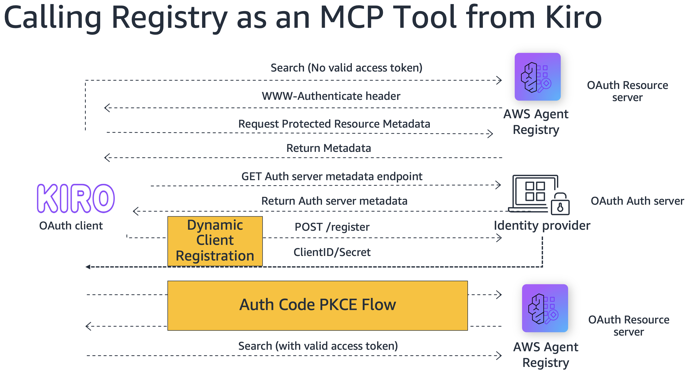
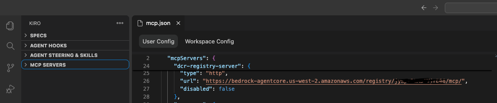
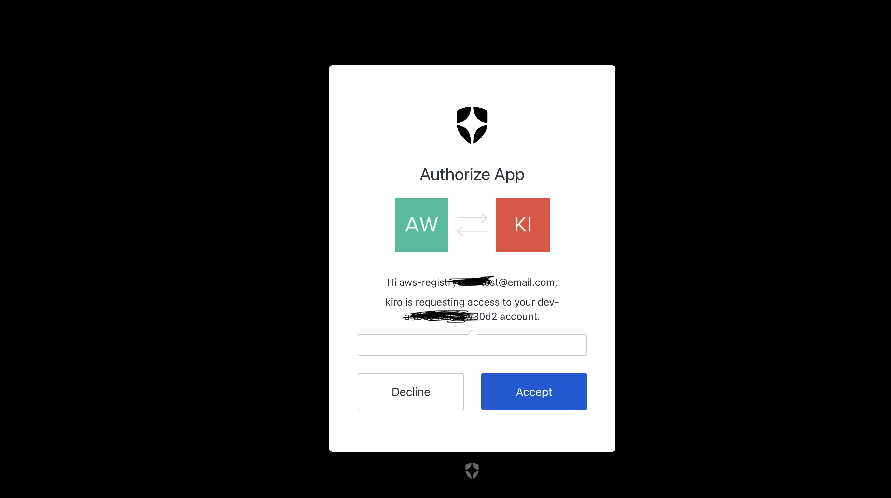
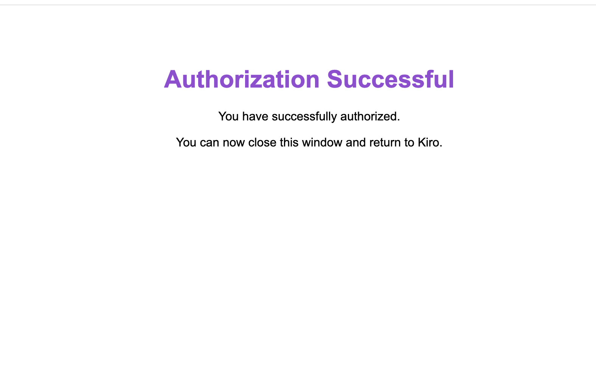
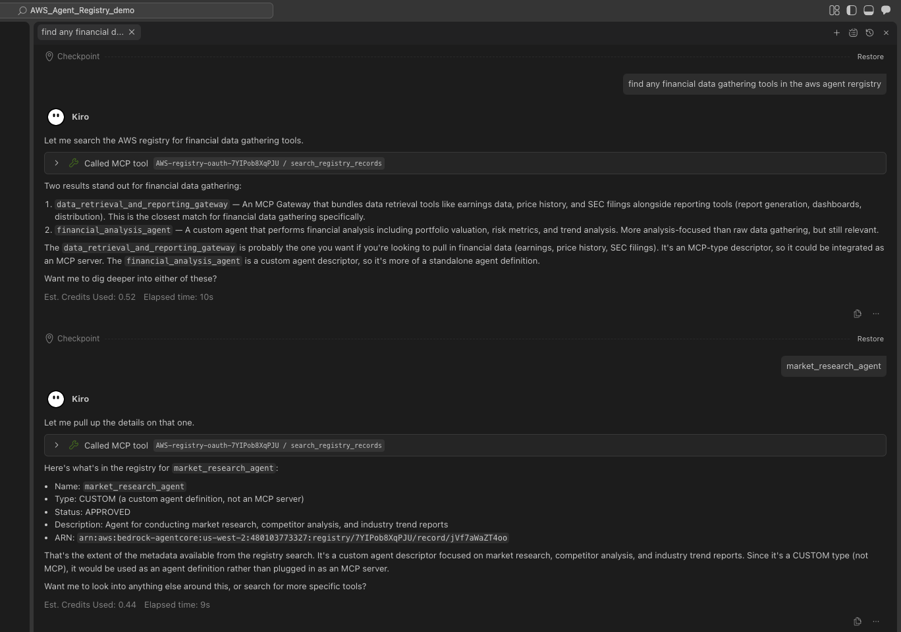

# Calling registry as an MCP Tool from Kiro

Discover agentic capabilities from the AWS Agent registry across your organization
directly from your Kiro IDE, without writing a single line of code.

## Overview

Being able to search across a registry of agentic capabilities built across your
organization directly in your IDE like Kiro is a superpower. This example shows how
to configure an AWS Agent registry with Auth0 Dynamic Client Registration (DCR) to
enable secure, zero-config discovery of agents and tools.

**What is Dynamic Client Registration?**

Dynamic Client Registration is an OAuth / OpenID Connect protocol (RFC 7591) that
lets client applications automatically register with an authorization server instead
of requiring manual pre-registration. In the context of using your AWS registry MCP
in your IDE, DCR allows Kiro to automatically get its own unique credentials for
AWS registry access — completely removing the need to manually copy and paste tokens.



## Tutorial Details

| Information | Details |
|:---|:---|
| Tutorial type | Interactive |
| AgentCore components | AWS Agent registry |
| Auth method | Auth0 DCR (Dynamic Client Registration) |
| Inbound Auth IdP | Auth0 (CUSTOM_JWT) |
| Outbound Auth | OAuth Bearer Token |
| Tutorial components | Create Auth0 DCR Server, OAuth search, MCP setup on Kiro |
| Example complexity | Easy |
| SDK used | boto3 |

## Prerequisites

- **Auth0 account** with a tenant configured (see Step 1 below)
- Python 3.10+ with `boto3`, `python-dotenv`, `requests`
- **Kiro IDE** (for the MCP integration step)
- `.env` file configured from `.env.example`

## Step 1: Auth0 Setup

### 1. Create an Auth0 Account & Tenant

1. Sign up at [auth0.com](https://auth0.com) if you don't already have an account
2. Create a new tenant — this acts as your authorization server
3. Note your **Auth0 Domain** (e.g., `your-tenant.auth0.com`)
4. Go to **Dashboard → Settings → Advanced** and enable **Dynamic Client Registration (DCR)**

### 2. Register an API (Resource Server)

1. Navigate to **Applications → APIs** in the Auth0 Dashboard
2. Click **Create API**
3. Set the **Identifier (Audience)** to: `https://bedrock-agentcore.us-west-2.amazonaws.com`
4. Set **Signing Algorithm** to `RS256`
5. Enable grant types: **Authorization Code, Refresh Token, Client Credentials**

> **⚠️ Caution:** DCR automates registration. Ensure only trusted clients can register
> and that the registration workflow cannot be exploited.

### 3. Enable Authentication at Domain Level

Navigate to **Authentication → Database → Username-Password-Authentication → Settings**
and toggle on **Promote Connection to Domain Level**.

### 4. Configure .env

Copy `.env.example` to `.env` and fill in your values:

```bash
cp .env.example .env
# edit .env with your AUTH0_DOMAIN, AUTH0_AUDIENCE, AWS_REGION, AWS_ACCOUNT_ID
```

### 5. Add MCP URL as Auth0 API Audience

After running Step 2 of the script (registry creation), note the registry ID and:
1. In Auth0 Dashboard, navigate to **Applications → APIs** and create an API with the
   MCP endpoint URL as **Identifier**:
   `https://bedrock-agentcore.us-west-2.amazonaws.com/registry/<REGISTRY_ID>/mcp`
2. The `create_registry` helper in `seed_records.py` automatically adds this MCP URL
   to the registry's `allowedAudience` — no manual update needed in the code.

## Running the Python Scripts

```bash
pip install boto3 python-dotenv requests
```

```bash
python dcr_registry_search_mcp_in_kiro.py
```

The script:
1. Creates a registry with Auth0 CUSTOM_JWT authorizer
2. Seeds it with 4 sample records (weather, order-status, customer-support, inventory-lookup)
3. Lists registries and records to verify
4. Prints Kiro MCP configuration instructions
5. Cleans up all resources

## Connect registry as MCP in Kiro

After the script prints the MCP URL, add it to `.kiro/settings/mcp.json`:

```json
{
  "mcpServers": {
    "dcr-registry-server": {
      "type": "http",
      "url": "https://bedrock-agentcore.us-west-2.amazonaws.com/registry/<REGISTRY_ID>/mcp/",
      "disabled": false
    }
  }
}
```



### Authenticate in Kiro

When Kiro connects, it will:
- Discover the Auth0 authorization server via the registry's well-known endpoint
- Use DCR to auto-register as an OAuth client (`POST /oidc/register`)
- Obtain an access token via PKCE authorization code flow
- Use the token to call registry search via MCP

| Authorization PKCE | Successful Auth |
|:---:|:---:|
|  |  |

### Search from Kiro

Open Kiro chat and ask:

> "Use the AWS registry to search for weather records"



## Useful Reference Commands

View authorization server metadata:
```bash
curl https://<domain>/.well-known/oauth-authorization-server
```

Manually register a DCR client:
```bash
curl -X POST https://<domain>/oidc/register \
  -H "Content-Type: application/json" \
  -d '{
    "client_name": "test-mcp-client",
    "redirect_uris": ["http://localhost:65358/callback"],
    "grant_types": ["authorization_code"],
    "response_types": ["code"],
    "token_endpoint_auth_method": "none"
  }'
```
