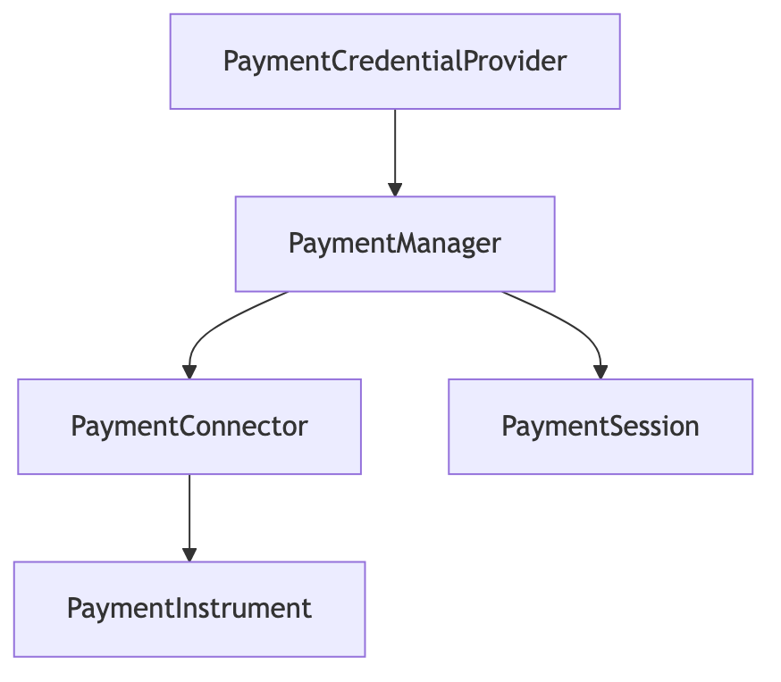
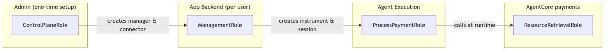
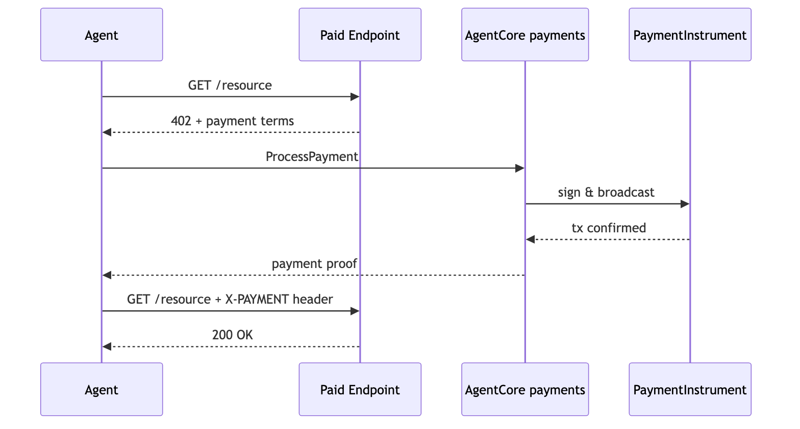

# Tutorial 00 — Setting Up Amazon Bedrock AgentCore payments

| Information         | Details                                                              |
|:--------------------|:---------------------------------------------------------------------|
| Tutorial type       | Task-based setup                                                     |
| Tutorial components | IAM roles, Payment Manager, Connector, Embedded Wallet, Session      |
| Wallet providers    | Coinbase CDP and/or Stripe (Privy)                                   |
| Networks            | Base Sepolia (ETHEREUM), Solana Devnet (SOLANA)                      |
| SDK used            | boto3, bedrock-agentcore                                             |
| Example complexity  | Easy                                                                 |

## Overview

Building payment infrastructure for AI agents means solving secure wallet management, deterministic payment limits enforcement, and payment orchestration across evolving protocols. A single agent task may hit dozens of x402 endpoints, each with different payment requirements, while the agent makes non-deterministic decisions about which to call next.

**Amazon Bedrock AgentCore payments** handles all of this. This tutorial creates the complete payment stack that all downstream tutorials depend on: IAM roles with least-privilege separation, a Payment Manager, a Payment Connector, an embedded USDC wallet, and a budgeted Payment Session.


## Architecture

```
┌───────────────────────────────────────────────────────────┐
│                   Developer / Admin                       │
│                 (ControlPlaneRole)                        │
│                                                           │
│  CredentialProvider → PaymentManager → PaymentConnector   │
│  One-time setup. Creates the payment stack.               │
└─────────────────────────────┬─────────────────────────────┘
                              │
                              ▼
┌───────────────────────────────────────────────────────────┐
│             Application Backend                           │
│                 (ManagementRole)                          │
│                                                           │
│  CreateInstrument (wallet) → CreateSession (budget)       │
│  Cannot call ProcessPayment.                              │
└─────────────────────────┬─────────────────────────────────┘
                          │ passes sessionId + instrumentId
                          ▼
┌───────────────────────────────────────────────────────────┐
│                    Agent runtime                          │
│               (ProcessPaymentRole)                        │
│                                                           │
│  ProcessPayment only. Cannot create sessions/instruments. │
└───────────────────────────────────────────────────────────┘
```

The **ResourceRetrievalRole** is a service role assumed by AgentCore at runtime — you never call it directly.



### Role Separation

The role separation enforces a security boundary between the application backend and the runtime process:

- **ControlPlaneRole** — Creates and manages Managers, Connectors, Credential Providers. Admin setup.
- **ManagementRole** — Creates Instruments and Sessions with spending limits. Has an explicit IAM **Deny** on `ProcessPayment`. The code that sets budgets never processes payments.
- **ProcessPaymentRole** — Calls `ProcessPayment` only. Cannot create sessions, override limits, or provision wallets.
- **ResourceRetrievalRole** — Service role assumed by AgentCore at runtime to access credentials from Secrets Manager. You never call this directly.

This is structural separation enforced by IAM, not application logic.



## x402 Payment Flow



The x402 protocol embeds payment requirements inside HTTP responses. The agent reads the requirement, calls `ProcessPayment` to generate a signed proof, and retries the request with the proof attached. AgentCore handles signing and budget enforcement — the agent code never touches wallet credentials.

## Supported Provider and Network Combinations

AgentCore payments is provider-agnostic and network-agnostic:

| Provider | Network setting | Faucet network |
|----------|-----------------|----------------|
| Coinbase CDP | `ETHEREUM` | Base Sepolia |
| Coinbase CDP | `SOLANA` | Solana Devnet |
| Stripe (Privy) | `ETHEREUM` | Base Sepolia |
| Stripe (Privy) | `SOLANA` | Solana Devnet |

All combinations use `EMBEDDED_CRYPTO_WALLET` with `linkedAccounts` for user identity. Set `CREDENTIAL_PROVIDER_TYPE` and `NETWORK` in `.env` to choose. Agent code in downstream tutorials is identical regardless of provider or network.

## API Reference

| Operation | Plane | Client | Description |
|:----------|:------|:-------|:------------|
| `CreatePaymentCredentialProvider` | Control | `bedrock-agentcore-control` | Stores wallet credentials securely |
| `CreatePaymentManager` | Control | `bedrock-agentcore-control` | Top-level payment configuration |
| `CreatePaymentConnector` | Control | `bedrock-agentcore-control` | Links Manager to Credential Provider |
| `CreatePaymentInstrument` | Data | `bedrock-agentcore` | Provisions a crypto wallet |
| `CreatePaymentSession` | Data | `bedrock-agentcore` | Time-bounded spending authorization |

## Prerequisites

- Python 3.10+
- AWS CLI configured (`aws sts get-caller-identity` to verify)
- AWS account with access to AgentCore payments
- Wallet provider credentials:
  - **Coinbase CDP:** See [`providers/coinbase_cdp_account_setup.py`](providers/coinbase_cdp_account_setup.py)
  - **Stripe (Privy):** See [`providers/stripe_privy_account_setup.py`](providers/stripe_privy_account_setup.py)
- `.env` configured: `cp .env.sample .env` and fill in values

## Running the Python Scripts

```bash
pip install -r requirements.txt

# Step 1: Provider setup (choose one)
python providers/coinbase_cdp_account_setup.py
# OR
python providers/stripe_privy_account_setup.py

# Step 2: Create the full payment stack
python setup_agentcore_payments.py

# Optional: Multi-provider setup (both Coinbase + Privy on one Manager)
python multi_provider_setup.py
```

## Security Best Practice: Restrict Secret Access

After setup, lock down the credential provider secrets in Secrets Manager so only the `ResourceRetrievalRole` can read them. In the [Secrets Manager console](https://console.aws.amazon.com/secretsmanager/), find secrets prefixed with `bedrock-agentcore-identity` and add a resource policy that denies `GetSecretValue` to all principals except `ResourceRetrievalRole`.

See the [documentation](https://docs.aws.amazon.com/bedrock-agentcore/latest/devguide/payments-iam-roles.html) for the full policy template and [Configure credential provider](https://docs.aws.amazon.com/bedrock-agentcore/latest/devguide/resource-providers.html) for more details.

## Two Identities in Play

These tutorials have you play two roles simultaneously:

| identity | Who | What they do |
|----------|-----|-------------|
| **Developer** | Your AWS credentials | Call AgentCore APIs, create managers/connectors/sessions |
| **End user** | `LINKED_EMAIL` identity | Log into WalletHub or Privy frontend, fund wallet, grant signing permission |

In a real application these are different people — your backend code uses AWS credentials, while end users interact via your app's UI. For tutorial simplicity you play both roles with the same email.

### Funding and Delegated Signing

Before the agent can produce x402 payments, two things must happen:

1. **Fund the wallet** with testnet USDC at [faucet.circle.com](https://faucet.circle.com/) — request 20 USDC (covers all tutorials)
2. **Delegate signing** — the end user grants AgentCore permission to sign transactions on their wallet

| | Coinbase CDP | Stripe (Privy) |
|---|---|---|
| **Signing grant** | CDP Portal → Wallets → Embedded Wallet → Policies → enable Delegated Signing | Privy reference frontend → log in as `LINKED_EMAIL` → **Connect agent → Give access** |
| **Fund + delegate UI** | Coinbase WalletHub (`redirectUrl` in the instrument response) | Privy reference frontend at `http://localhost:3000` |
| **Scope** | All wallets under the project | Per-wallet |

## Key Concepts

**PaymentManager** — The top-level resource. All payment operations reference the Manager ARN. Created once; shared across all downstream tutorials.

**PaymentConnector** — Links the Manager to a wallet provider (Coinbase CDP or Stripe/Privy). One Connector per provider; multiple Connectors on one Manager enables multi-provider scenarios (see `multi_provider_setup.py`).

**PaymentInstrument** — An embedded crypto wallet provisioned for a specific `userId`. The wallet address is assigned when the instrument becomes `ACTIVE`.

**PaymentSession** — Time-bounded spending authorization with a `maxSpendAmount` limit. Agents cannot exceed this budget. The session expires after `expiryTimeInMinutes` or when the budget is exhausted, whichever comes first.

**Delegated Signing** — Required for `ProcessPayment` to succeed. The end user grants AgentCore permission to sign transactions on their behalf. For Coinbase CDP, this is enabled at the project level in the CDP Portal. For Stripe/Privy, it is done through the Privy reference frontend (localhost:3000) after the wallet is created.

## Troubleshooting

### CreatePaymentManager returns ConflictException

A Manager with the same name already exists. Either use `idempotent_create()` (already done in the script) or delete the existing Manager first. The script appends a UUID suffix to ensure uniqueness on fresh runs.

### Instrument status stays CREATING

`EMBEDDED_CRYPTO_WALLET` provisioning is asynchronous. The script uses `wait_for_status()` which polls every 5 seconds for up to 5 minutes. If it times out, check the Coinbase CDP or Privy dashboard for errors. Make sure `LINKED_EMAIL` is a real email address.

### ProcessPayment fails with signing error (Tutorial 01)

Delegated signing is not configured. For Coinbase CDP: enable Delegated Signing under CDP Portal → Wallets → Embedded Wallet → Policies. For Stripe/Privy: open the Privy reference frontend at `http://localhost:3000`, log in as `LINKED_EMAIL`, and choose **Connect agent**.

### LINKED_EMAIL not accepted

`LINKED_EMAIL` must be a real, reachable email address. It cannot be a placeholder like `user@example.com` or `<your email>`. The script validates this and exits if not set.

### Missing IAM role permissions

If you see `AccessDenied` errors, run `setup_agentcore_payments.py` from an IAM identity with `iam:CreateRole` and `iam:PutRolePolicy` permissions. The `setup_payment_roles()` call in Step 0a creates the four tutorial roles. You do not need admin access after that.

## Clean Up

> **Warning:** Cleanup is irreversible. Run only after completing all downstream tutorials.

Uncomment and run the cleanup section at the bottom of `setup_agentcore_payments.py`. It deletes resources in dependency order:

1. Payment Sessions (data plane)
2. Payment Instruments (data plane)
3. Payment Connectors (control plane)
4. Payment Manager (control plane)
5. Credential Provider (control plane)

After running the script, also:

- Delete the four IAM roles from the IAM console.
- Delete CloudWatch log groups: `/aws/vendedlogs/bedrock-agentcore/<manager-id>`.
- For runtime deployments: `agentcore remove all -y` in the agent directory.

## Next Steps

After completing Tutorial 00, continue to any of the downstream tutorials in any order:

- **Tutorial 01** — `../01-agents-payments-and-limits/` — Strands and LangGraph agents with automatic x402 payments
- **Tutorial 02** — `../02-deploy-to-agentcore-runtime/` — Deploy a payment agent to AgentCore runtime
- **Tutorial 03** — `../03-user-onboarding-wallet-funding/` — Wallet lifecycle, funding, delegation
- **Tutorial 04** — `../04-agent-with-coinbase-bazaar-via-gateway/` — Discover paid MCP tools via AgentCore gateway
- **Tutorial 05** — `../05-agent-with-browser-tool-pay-for-content/` — Browser + paywall payment pattern
- **Tutorial 06** — `../06-multi-agent-payment-orchestrator/` — Multi-agent orchestration with per-agent budgets
