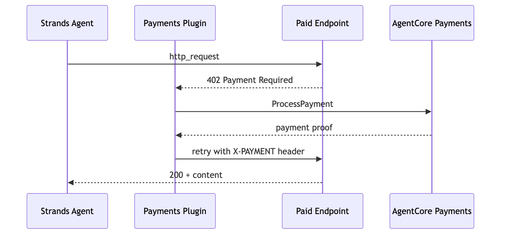
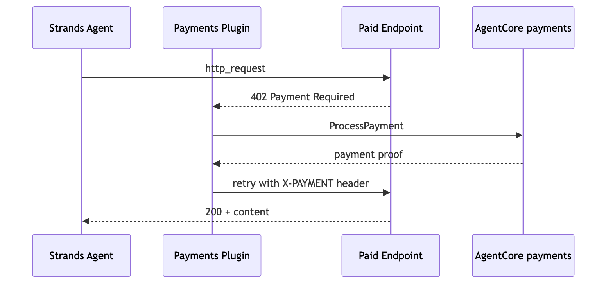
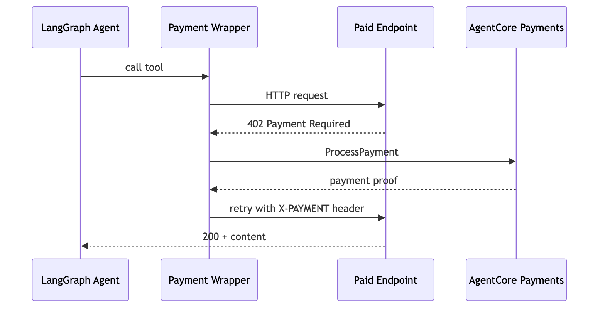
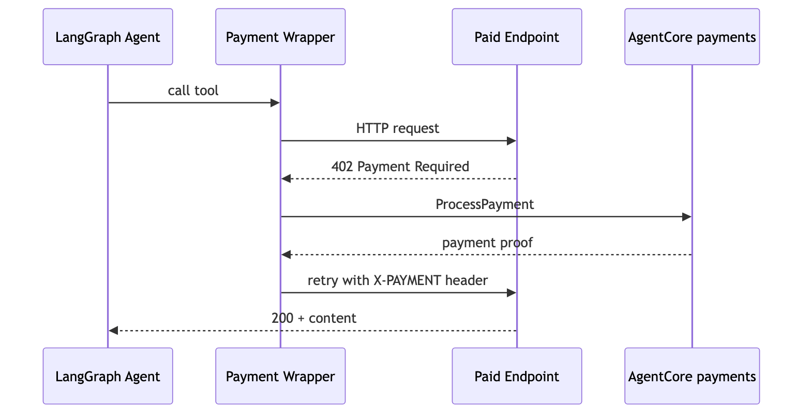

# Tutorial 01 — Enable Payment Limits on an Agent

| Information         | Details                                                            |
|:--------------------|:-------------------------------------------------------------------|
| Tutorial type       | Conversational                                                     |
| Agent type          | Single                                                             |
| Agentic Frameworks  | Strands Agents, LangGraph                                          |
| LLM model           | Anthropic Claude Sonnet 4.6                                        |
| Tutorial components | PaymentManager, AgentCorePaymentsPlugin, x402 endpoints, sessions  |
| Example complexity  | Easy                                                               |

## Overview

This tutorial shows how to build payment-enabled AI agents using the AgentCore payments SDK. Two agent frameworks are demonstrated:

- **Strands** — Uses `AgentCorePaymentsPlugin` that intercepts 402 responses and pays automatically. Zero payment logic in agent code.
- **LangGraph** — Uses a `wrap_with_auto_402()` function that wraps any HTTP tool to detect 402 responses, calls `PaymentManager.generate_payment_header()`, and retries. The LLM never sees the 402.

Both approaches work with either wallet provider (Coinbase CDP or Stripe/Privy) and either network (Ethereum Base Sepolia or Solana Devnet) — the only difference is the instrument ID from Tutorial 00.

## Architecture

### Strands



```
Agent (Strands + http_request tool)
  │
  ├─► http_request GET https://x402-test.genesisblock.ai/api/weather
  │                         │
  │                   Server returns HTTP 402 (x402 payment required)
  │                         │
  │         AgentCorePaymentsPlugin intercepts 402
  │                         │
  │         ProcessPayment ─► budget check ─► sign tx ─► return proof
  │                         │
  │         Plugin retries http_request with X-PAYMENT header
  │                         │
  ├─► 200 OK ─ agent receives paid content
  │
  └─► Agent summarizes results for the user
```



### LangGraph



```
LangGraph ReAct Agent
  └── wrapped http_request tool
        ├── Makes HTTP request
        ├── Gets 402? → PaymentManager.generate_payment_header()
        ├── Retries with proof header
        └── Returns content to agent (LLM never sees the 402)
```



## What You'll Learn

- How `AgentCorePaymentsPlugin` auto-handles x402 in a Strands agent (Strands)
- How to wrap any LangGraph tool with auto-402 payment handling (LangGraph)
- How to create sessions with `maxSpendAmount` budgets
- How budget enforcement works at the infrastructure level
- How to check remaining spend with `get_payment_session`
- How the plugin's built-in tools (`get_payment_session`, `get_payment_instrument`, `list_payment_instruments`) let the agent reason about its own budget

## Payment Limits Patterns

| Pattern | Budget | Expiry | Use Case |
|---------|--------|--------|----------|
| Quick lookup | $0.10 | 5 min | Single API call, price check |
| Research task | $1.00 | 60 min | Multi-endpoint research session |
| Deep analysis | $5.00 | 480 min | Extended multi-tool workflow |
| No budget cap | omit `limits` | 60 min | Trusted internal agents (use with caution) |

### How limits are enforced

| Dimension | How It Works |
|-----------|-------------|
| **Cumulative tracking** | Service sums ALL ProcessPayment calls in the session — not per-call |
| **Rejection** | When cumulative spend + next payment would exceed `maxSpendAmount`, ProcessPayment returns an error |
| **Time expiry** | After `expiryTimeInMinutes`, ProcessPayment fails even if budget remains |
| **IAM enforcement** | Agent role (ProcessPaymentRole) cannot create sessions, modify budgets, or extend expiry |
| **Per-user isolation** | Sessions scoped to `userId` — different users have independent budgets |
| **Budget optional** | Omit `limits` for uncapped sessions — spend tracked via `availableLimits.availableSpendAmount` |

## Prerequisites

- Tutorial 00 completed (`.env` has manager ARN, connector, instrument, session)
- Wallet funded with testnet USDC from [faucet.circle.com](https://faucet.circle.com/)
- Python 3.10+

## Running the Python Scripts

```bash
pip install -r requirements.txt
```

```bash
# Strands agent with AgentCorePaymentsPlugin
python strands_payment_agent.py

# LangGraph agent with wrap_with_auto_402()
python langgraph_payment_agent.py
```

## Key Concepts

**AgentCorePaymentsPlugin (Strands)** — A Strands plugin that intercepts 402 responses from any tool, calls `ProcessPayment` via AgentCore to sign the transaction and generate a proof, then retries the original request with the payment proof. The developer writes zero payment logic.

**generate_payment_header() (LangGraph)** — A `PaymentManager` method that takes a 402 response and returns an HTTP header containing the payment proof. Used to build `wrap_with_auto_402()` for any LangGraph tool.

**Session budget** — Created by the app backend (ManagementRole). The agent (ProcessPaymentRole) can only spend within the session budget. The session budget is always the tighter constraint — if your wallet has 10 USDC but the session budget is $0.50, the agent can only spend $0.50.

**CAIP-2 network preferences** — Chain identifiers like `eip155:84532` (Base Sepolia) or `solana:EtWTRABZaYq6iMfeYKouRu166VU2xqa1` (Solana Devnet) passed to the plugin via `network_preferences_config`. Tells the plugin which chain to prefer when a merchant supports multiple chains.

## Troubleshooting

### Agent gets 402 but payment fails

Delegated signing is not configured. For Coinbase CDP: enable Delegated Signing in CDP Portal → Wallets → Embedded Wallet → Policies. For Stripe/Privy: open the Privy reference frontend at `http://localhost:3000`, log in as `LINKED_EMAIL`, and choose **Connect agent**.

### Session budget exceeded immediately

The wallet may have insufficient USDC. Check the balance with `GetPaymentInstrumentBalance` (Tutorial 00 Step 7c). Fund the wallet at [faucet.circle.com](https://faucet.circle.com/).

### load_tutorial_env() raises KeyError

Tutorial 00 did not complete successfully or `.env` is missing. Re-run `setup_agentcore_payments.py` to create all required resources and write their IDs to `.env`.

## Wallet-Agnostic, Network-Agnostic Design

The agent code in this tutorial does not change based on:
- **Which wallet provider** — Coinbase CDP or Stripe (Privy)
- **Which blockchain network** — Ethereum (Base Sepolia) or Solana (Solana Devnet)

The only thing that changes is the `INSTRUMENT_ID` and `PAYMENT_CONNECTOR_ID` in `.env` — set by Tutorial 00.

| Layer | Network-aware? | What it knows |
|-------|---------------|---------------|
| PaymentManager | No | Authorization policy only |
| PaymentConnector | No | Which provider (Coinbase/Privy), not which chain |
| PaymentInstrument | **Yes** | `network: ETHEREUM` or `network: SOLANA` — set at creation |
| ProcessPayment | **Yes** | Merchant's 402 payload specifies the chain |
| Agent code | **No** | Passes the instrument ID to the plugin |

The control plane (manager, connector, credentials) is set up once and works across all networks. To switch networks, create a new instrument — one data plane API call, no control plane changes.

## Next Steps

- **Tutorial 02** — Deploy this agent to AgentCore runtime with proper role separation using the AgentCore CLI
- **Tutorial 03** — Wallet operations: delegation, funding, balance checks, multi-session patterns
- **Tutorial 04** — Discover and call paid MCP tools on Coinbase Bazaar through AgentCore gateway
