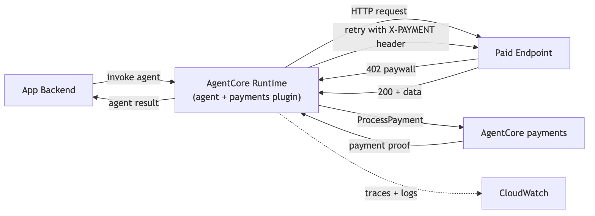
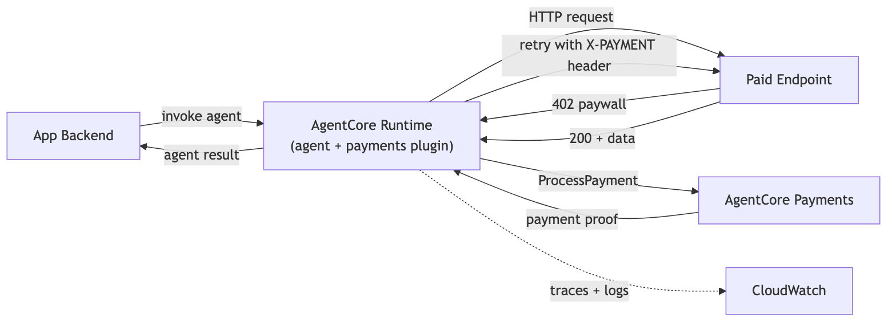
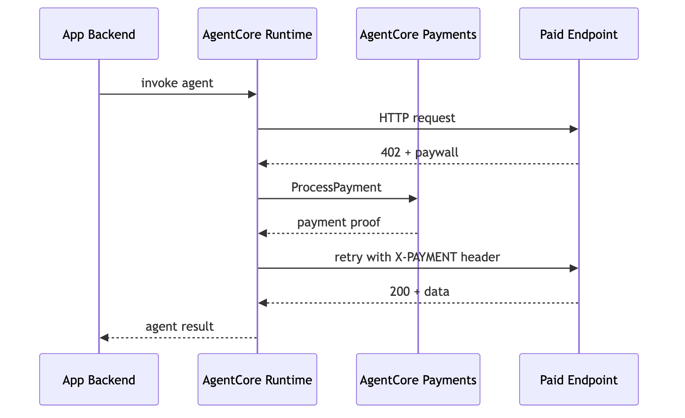
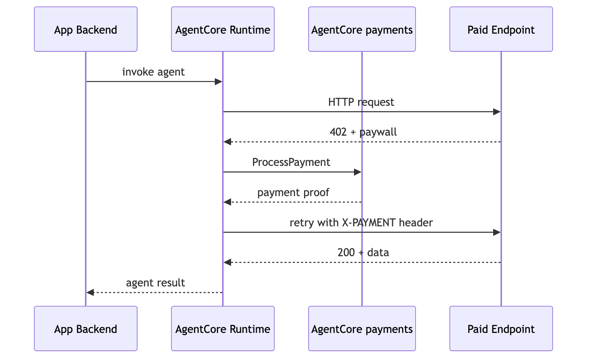

# Tutorial 02 — Deploy Payment Agent to AgentCore runtime

| Information         | Details                                                            |
|:--------------------|:-------------------------------------------------------------------|
| Tutorial type       | runtime deployment                                                 |
| Agent type          | Single, payment-enabled                                            |
| Agentic Framework   | Strands Agents                                                     |
| LLM model           | Anthropic Claude Sonnet 4.6                                        |
| Tutorial components | AgentCore runtime, AgentCorePaymentsPlugin, ProcessPaymentRole     |
| Example complexity  | Intermediate                                                       |

## Overview

Tutorial 01 ran a payment-enabled agent locally. This tutorial deploys the same agent to **AgentCore runtime** so it can be invoked over HTTPS with SigV4 auth from any AWS-authenticated client.

The deployed agent runs under a dedicated execution role. The `AgentCorePaymentsPlugin` handles 402 responses automatically — the LLM never calls payment APIs directly. All payment context (manager ARN, session, instrument) arrives in the invocation payload, keeping the agent stateless.

## Architecture





```
App Backend                          AgentCore runtime
  │                                   ┌──────────────────────────┐
  │ create_session(budget=$0.50)      │  Payment Agent            │
  │                                   │  (execution role)         │
  │── invoke(session, instrument) ──►│  Plugin: ProcessPayment   │
  │                                   │  Cannot: CreateSession    │
  │◄── weather data + cost ─────────│  Cannot: Override budget   │
  │                                   └──────────────────────────┘
  │ get_session(check spend)
```





### How the Agent Code Works (`payment_agent.py`)

1. **`BedrockAgentCoreApp` + `@app.entrypoint`** — the standard AgentCore runtime service contract
2. **Payload-driven config** — ALL payment context comes from the invocation payload. The agent does not read payment config from environment variables. This keeps the agent stateless.
3. **`AgentCorePaymentsPlugin`** — intercepts HTTP 402 responses and calls `ProcessPayment` automatically within the session budget

## Prerequisites

- Tutorial 00 completed (`.env` with payment manager, instrument, etc.)
- Tutorial 01 completed (understand the local agent + plugin flow)
- Wallet funded with testnet USDC from [faucet.circle.com](https://faucet.circle.com/)
- Python 3.10+
- Node.js 20+ and the AgentCore CLI: `npm install -g @aws/agentcore`
- AWS CDK: `npm install -g aws-cdk`
- AWS CLI configured

## CLI Commands

```bash
# Install AgentCore CLI
npm install -g @aws/agentcore

# Install Python dependencies
pip install -r requirements.txt
```

```bash
# Test locally before deploying
python payment_agent.py
# In another terminal: curl -s http://localhost:8080/ping
```

```bash
# Scaffold the AgentCore project
agentcore create --name PaymentAgent --framework Strands --protocol HTTP --model-provider Bedrock --memory none
```

```bash
# Deploy to AgentCore runtime (~2-3 minutes first time)
cd PaymentAgent
agentcore deploy -y
```

```bash
# Check deployment status
agentcore status
```

```bash
# Invoke the deployed agent (create a session first — see deploy_payment_agent.py)
agentcore invoke '{"prompt": "Access https://x402-test.genesisblock.ai/api/weather and report the data", "payment_manager_arn": "<ARN>", "user_id": "test-user-001", "payment_session_id": "<SESSION_ID>", "payment_instrument_id": "<INSTRUMENT_ID>"}'
```

```bash
# Stream logs
agentcore logs
```

```bash
# Clean up all deployed resources
agentcore remove all -y
```

Or run the full automated script:

```bash
python deploy_payment_agent.py
```

## Running the Python Scripts

```bash
pip install -r requirements.txt
```

```bash
# Automated deploy + invoke script
python deploy_payment_agent.py

# Start agent locally for testing
python payment_agent.py
```

## Key Concepts

**Stateless agent** — `payment_agent.py` reads all payment context from the invocation payload, not from environment variables. This means the same agent binary can serve different users with different budgets — the app backend controls what each user can spend by creating a session with the appropriate budget before invoking.

**ProcessPaymentRole** — The execution role the agent runs under. It has `ProcessPayment` permission and explicit denies on `CreatePaymentSession`, `CreatePaymentInstrument`, and all control-plane operations. The agent cannot create sessions, override budgets, or provision wallets.

**Payload-driven sessions** — The app backend creates a fresh session with a budget before every invocation, then passes the `payment_session_id` in the payload. The agent cannot reuse sessions from previous invocations or extend their expiry.

## Troubleshooting

### agentcore create fails with "command not found"

Install Node.js 20+ and the AgentCore CLI:
```bash
npm install -g @aws/agentcore
agentcore --version
```

### Deploy fails with CDK bootstrap error

Bootstrap CDK in your account/region first:
```bash
cdk bootstrap aws://<account-id>/<region>
```

### Agent returns "Missing required fields in payload"

The invocation payload must include `payment_manager_arn`, `user_id`, `payment_session_id`, and `payment_instrument_id`. All four come from the app backend — not from `.env`. Check that the session was created and its ID was passed in the payload.

### Payment permissions error after deploy

The agentcore CLI creates an execution role with Bedrock + CloudWatch permissions. Add payment data-plane permissions manually or let `deploy_payment_agent.py` do it automatically via `iam.put_role_policy`.

## Clean Up

> **Warning:** Cleanup is irreversible.

```bash
cd PaymentAgent
agentcore remove all -y
```

This deletes the AgentCore runtime deployment and associated AWS resources (CDK stack, CloudWatch logs). Payment sessions expire automatically.

To also delete payment resources (Manager, Connector, Instrument), run the cleanup cell in Tutorial 00.

## Next Steps

- **Tutorial 03** — `../03-user-onboarding-wallet-funding/` — Wallet lifecycle, funding, delegation, balance checks
- **Tutorial 04** — `../04-agent-with-coinbase-bazaar-via-gateway/` — Discover paid MCP tools via AgentCore gateway
