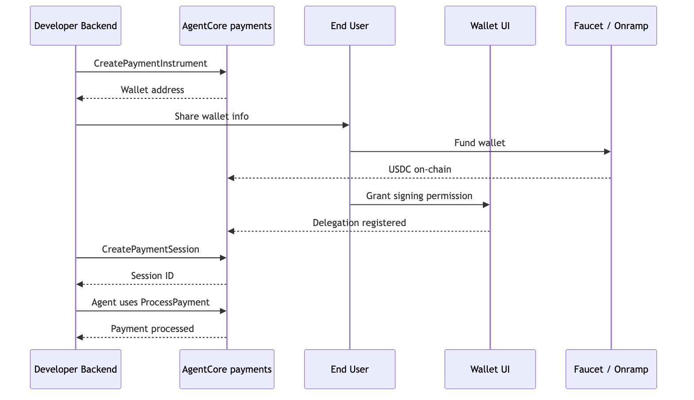
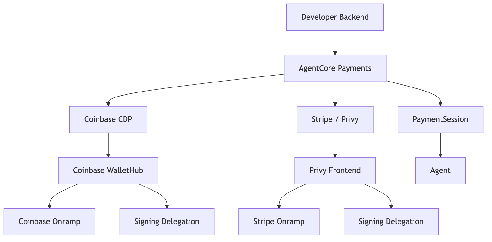
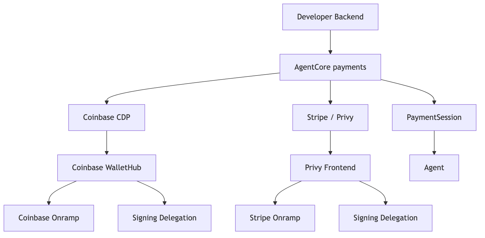
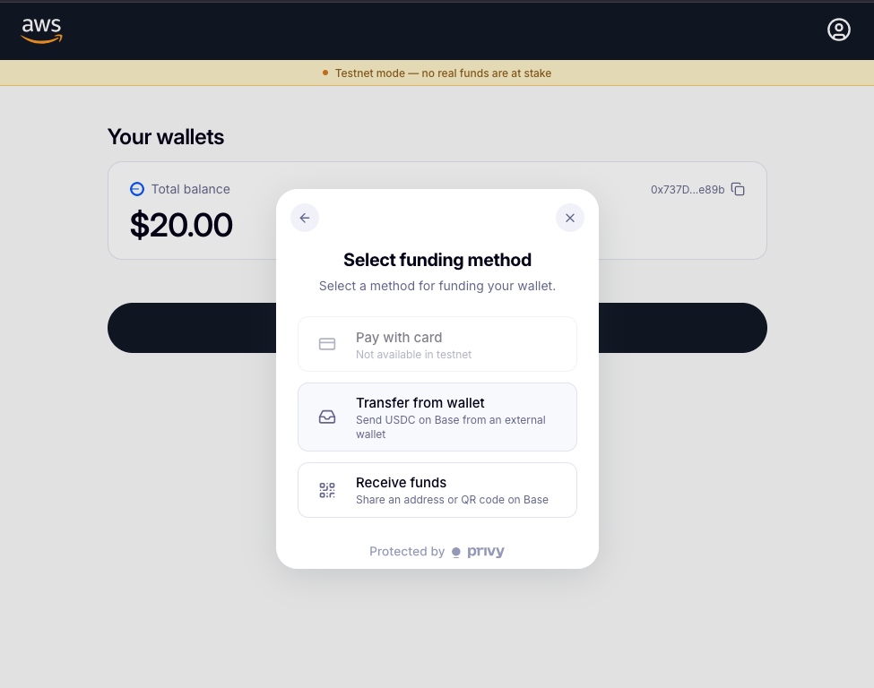

# Tutorial 03 — User Onboarding and Backend Wallet Operations

| Information         | Details                                                          |
|:--------------------|:-----------------------------------------------------------------|
| Tutorial type       | Operations / lifecycle                                           |
| Tutorial components | PaymentInstrument, PaymentSession, balance checks, multi-network |
| Wallet providers    | Coinbase CDP and Stripe (Privy)                                  |
| Networks            | ETHEREUM (Base Sepolia), SOLANA (Solana Devnet)                  |
| SDK used            | bedrock-agentcore, boto3                                         |
| Example complexity  | Intermediate                                                     |

## Overview

Tutorial 00 created one wallet for the developer. In production, every end user of your application gets their own embedded wallet, and your backend manages the session budgets that govern what the agent spends on their behalf.

This tutorial has two parts:

- **Part 1 — Onboarding (per end user):** create the wallet, fund it, delegate signing, and optionally provision wallets on additional chains.
- **Part 2 — Backend operations:** balance checks, session creation with budgets, instrument listing, and remaining-budget queries.

The same flow works for both wallet providers — Coinbase CDP and Stripe (Privy) — with provider-specific steps called out where they differ.

## Two Personas

| Persona | Who | What they do |
|---------|-----|-------------|
| **Application backend** | You (developer / backend code) | Provisions wallets, checks balances, creates sessions |
| **End user** | User of your app | Funds the wallet, grants consent via WalletHub or Privy reference frontend |

For simplicity, the tutorial reuses the developer's `LINKED_EMAIL` as the end-user identity. In production each user has their own email and their own wallet.

## Onboarding Flow



```
Backend                     End User UI (WalletHub / Privy frontend)
  │                                │
  ├─ CreatePaymentInstrument ──►   │
  │   (wallet provisioned)          │
  │                                ├─ Fund wallet (faucet / onramp)
  │                                ├─ Grant signing (Connect agent)
  │                                │
  ├─ GetPaymentInstrumentBalance ─ │ (verify funded)
  ├─ CreatePaymentSession ──────── │ (set budget)
  └─ ListPaymentInstruments ─────  │ (account dashboard)
```

## Session Patterns

| Pattern | Budget | Expiry | Use case |
|---------|--------|--------|----------|
| Quick lookup | $0.10 | 15 min | Single API call |
| Research task | $1.00 | 60 min | Multi-endpoint research |
| Deep analysis | $5.00 | 480 min | Extended workflow |
| No budget cap | omit `limits` | 60 min | Trusted internal agents |

## Wallet Providers





## Delegation: Grant Signing Permission

Before the agent can sign transactions, the end user grants permission. This is a one-time step per wallet.

| | Coinbase CDP | Stripe (Privy) |
|---|---|---|
| **Mechanism** | Project-level delegated signing | Authorization key as an additional signer on the wallet |
| **Setup** | CDP Portal → Wallets → Embedded Wallet → Policies → enable | Privy reference frontend `addSigners()` call |
| **User action** | Grant consent via WalletHub `redirectUrl` | Log in at `http://localhost:3000`, choose **Connect agent → Give access** |
| **Scope** | All wallets under the project | Per-wallet |
| **Without it** | ProcessPayment fails with signing error | ProcessPayment fails |

## Funding Options

| Method | Use case | Provider |
|--------|----------|----------|
| Circle faucet | Testnet (free) | Both |
| Direct USDC transfer | User sends from external wallet | Both |
| Coinbase Onramp URL | Fiat → crypto (credit card, bank) | Coinbase |
| Stripe Onramp | Fiat → crypto (credit card, bank, Apple Pay) | Privy |
| Coinbase WalletHub | Fund + delegate in one UI (managed by Coinbase) | Coinbase |
| Privy reference frontend | Fund + delegate via your app's UI (self-hosted in prod) | Privy |



### Fiat-to-Crypto Onramp Glossary

**Fiat** means traditional currency (USD, EUR) paid via credit card, bank transfer, Apple Pay, or Google Pay. An **onramp** converts fiat into stablecoin (USDC) and deposits it into the embedded wallet. Tutorial runs use testnet USDC from the faucet and never touch real money.

| Provider | Onramp |
|----------|--------|
| Coinbase | [Coinbase Onramp](https://docs.cdp.coinbase.com/onramp/coinbase-hosted-onramp/generating-onramp-url) — fiat → crypto via credit card, bank transfer, Apple Pay, Google Pay |
| Stripe (Privy) | [Stripe Onramp](https://docs.stripe.com/crypto/onramp) — fiat → crypto via credit card, bank, Apple Pay |

## Supported Networks

| Network setting | Chain | CAIP-2 | Faucet |
|----------------|-------|--------|--------|
| `ETHEREUM` | Base Sepolia | `eip155:84532` | faucet.circle.com → Base Sepolia |
| `SOLANA` | Solana Devnet | `solana:EtWTRABZaYq6iMfeYKouRu166VU2xqa1` | faucet.circle.com → Solana Devnet |

## Prerequisites

- Tutorial 00 completed (`.env` with `PAYMENT_MANAGER_ARN`, `PAYMENT_CONNECTOR_ID`, `LINKED_EMAIL`)
- Testnet USDC from [faucet.circle.com](https://faucet.circle.com/)

## Running the Python Scripts

```bash
pip install -r requirements.txt
```

```bash
python user_onboarding.py
```

## Key Concepts

**Embedded wallet** — A crypto wallet provisioned by the wallet provider (Coinbase CDP or Privy) on behalf of the end user. The user never sees a private key. The wallet is linked to the user's email via `linkedAccounts`.

**Delegated signing** — One-time user consent for the agent to sign transactions. For Coinbase CDP: enabled at the project level in CDP Portal. For Stripe/Privy: end user clicks "Connect agent" in the Privy reference frontend or your production equivalent.

**Session-wallet independence** — `CreatePaymentSession` does not take an instrument ID. Sessions are wallet-blind. At `ProcessPayment` time the service picks the user's instrument whose network matches the merchant's x402 challenge. One session can spend across the user's Ethereum and Solana wallets.

**`GetPaymentInstrumentBalance`** — Not exposed in the `bedrock_agentcore.payments` SDK; call via boto3 directly.

**Multi-network** — One user, one manager, one connector, multiple instruments. Call `create_payment_instrument` with `ETHEREUM` and again with `SOLANA` — the user gets two wallet addresses, one per chain.

## Troubleshooting

### Wallet balance shows 0

Fund the wallet at [faucet.circle.com](https://faucet.circle.com/). Select the network matching `NETWORK` in `.env` (Base Sepolia for ETHEREUM, Solana Devnet for SOLANA). Paste the wallet address printed by Section 1.

### ProcessPayment fails with signing error (when running Tutorial 01 later)

Delegation was not completed. For Coinbase CDP: check CDP Portal → Wallets → Embedded Wallet → Policies. For Privy: ensure the end user completed "Connect agent → Give access" in the Privy reference frontend.

### `list_payment_instruments` returns empty list

Pass the correct `payment_connector_id`. Instruments are scoped to a specific connector under the manager. Use `CONNECTOR_ID` from `.env`.

## Clean Up

Sessions created in this tutorial expire automatically. To delete instruments and the payment manager, run the cleanup section in Tutorial 00.

## Next Steps

- **Tutorial 04** — `../04-agent-with-coinbase-bazaar-via-gateway/` — Discover and call paid MCP tools on Coinbase Bazaar through AgentCore gateway
- **Tutorial 05** — `../05-agent-with-browser-tool-pay-for-content/` — Browser + paywall payment pattern
- **Tutorial 06** — `../06-multi-agent-payment-orchestrator/` — Multi-agent orchestration with per-agent budgets
