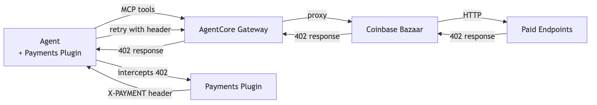
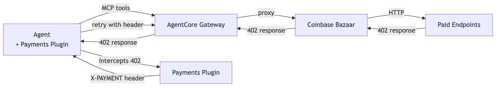
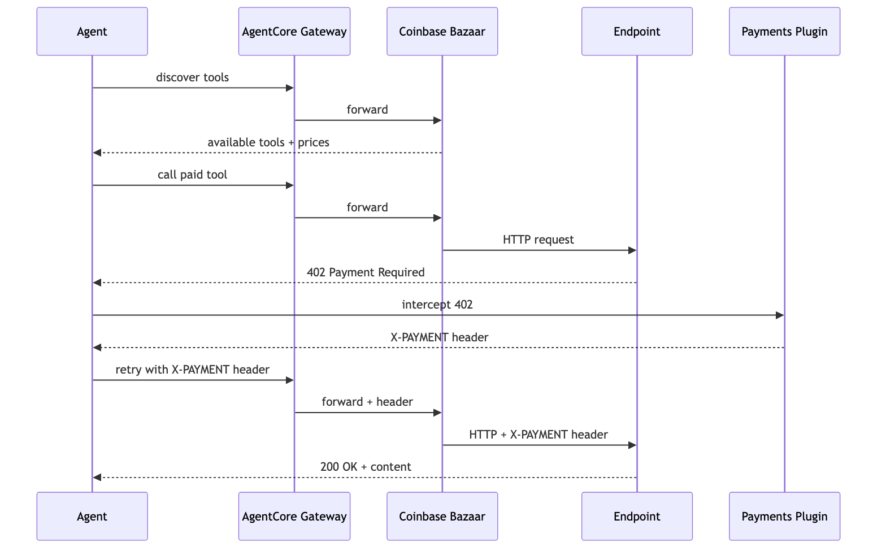
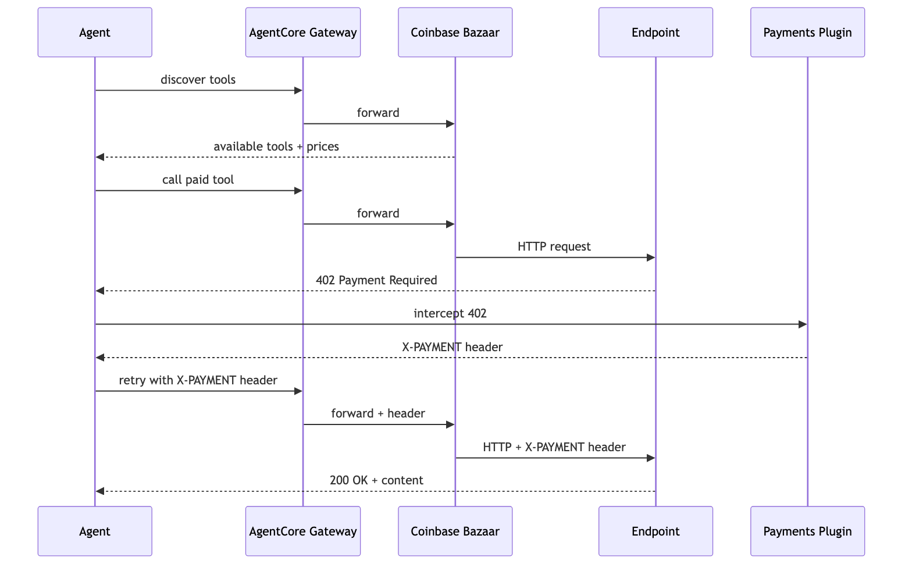

# Tutorial 04 — Agent with Coinbase Bazaar via AgentCore gateway

| Information         | Details                                                              |
|:--------------------|:---------------------------------------------------------------------|
| Tutorial type       | Feature integration                                                  |
| Agent type          | Single, discovery-driven                                             |
| Agentic Framework   | Strands Agents                                                       |
| LLM model           | Anthropic Claude Sonnet 4.6                                          |
| Tutorial components | AgentCore gateway, Coinbase x402 Bazaar, AgentCorePaymentsPlugin     |
| Example complexity  | Intermediate                                                         |

## Overview

The **Coinbase x402 Bazaar** is an MCP marketplace where paid tools are listed with semantic descriptions, pricing, and input/output schemas. Agents discover tools via `search_resources` and call them via `proxy_tool_call` — the Bazaar handles 402 detection and payment routing.

This tutorial connects the Bazaar to an **AgentCore gateway** as a native MCP target, then builds a Strands agent that discovers and calls paid tools with automatic payment handling.

The key difference from Tutorial 01: the agent doesn't know which URLs to call. It discovers tools at runtime via `search_resources`, then pays and calls them via `proxy_tool_call`. The developer doesn't pre-configure which tools exist — the agent finds them at runtime.

## Architecture









```
Developer Code
  Strands Agent
  + AgentCorePaymentsPlugin
  + MCPClient (streamable HTTP)
       │ MCP protocol
  AgentCore gateway
  Target: Coinbase x402 Bazaar
       │
  Coinbase x402 Bazaar
  search_resources → discover
  proxy_tool_call  → call + pay
       │ HTTP 402 → pay → retry
  AgentCore payments
  PaymentManager → ProcessPayment (sign + proof)
```

## Wallet-Agnostic by Design

The agent code is the same whether you configured Coinbase CDP or Stripe (Privy) in Tutorial 00. The `AgentCorePaymentsPlugin` receives a `payment_instrument_id` — AgentCore payments knows which wallet provider backs that instrument based on the PaymentConnector. The same code, same gateway, same Bazaar tools — only the `.env` values differ.

## Prerequisites

- Tutorial 00 completed (`.env` with payment manager, instrument, session)
- Wallet funded with testnet USDC from [faucet.circle.com](https://faucet.circle.com/)
- AgentCore gateway created with Coinbase x402 Bazaar as a target (see Step 1 below)
- `GATEWAY_URL` set in `.env` (from gateway creation)
- AgentCore CLI (for CLI method): `npm install -g @aws/agentcore`

## gateway Setup (Step 1 — Manual)

Create an AgentCore gateway with the Coinbase x402 Bazaar as a target using one of these methods:

### Option A: AgentCore Console

1. Open the [Amazon Bedrock AgentCore console](https://console.aws.amazon.com/bedrock-agentcore/)
2. Navigate to gateway → Create gateway → Add Target
3. Target type: **Integrations**
4. Select **Coinbase x402 Bazaar**
5. No outbound auth needed

### Option B: AgentCore CLI

```bash
agentcore create --name BazaarAgent --defaults
agentcore add gateway --name BazaarGateway
agentcore add gateway-target \
  --name CoinbaseBazaar \
  --type mcp-server \
  --endpoint https://api.cdp.coinbase.com/platform/v2/x402/discovery/mcp \
  --gateway BazaarGateway
agentcore deploy -y
agentcore fetch access --name BazaarGateway --type gateway
```

After creating the gateway, add its URL to `.env`:

```
GATEWAY_URL=https://<gateway-id>.gateway.bedrock-agentcore.<region>.amazonaws.com/mcp
```

For CUSTOM_JWT auth, also add `CLIENT_ID`, `CLIENT_SECRET`, `TOKEN_URL` from `agentcore fetch access` output.

## Running the Python Scripts

```bash
pip install -r requirements.txt
```

```bash
python bazaar_gateway_agent.py
```

## What the Agent Does

1. **Discovers tools** — Calls `search_resources` with queries like "market news", "weather data" to find available paid tools on the Bazaar
2. **Compares prices** — Lists tools across categories with their costs before deciding
3. **Makes budget-aware decisions** — Checks remaining session budget before selecting an expensive tool
4. **Calls multiple tools in sequence** — Tracks cumulative spend across multiple Bazaar calls within one session

## Key Concepts

**Endpoint discoverability** — The Bazaar exposes 10,000+ pay-per-use x402 endpoints. The agent doesn't need to know endpoint URLs at build time — it searches and discovers at runtime.

**`search_resources`** — MCP tool exposed by the Bazaar. Accepts a `query` string and `network` parameter. Returns a list of paid tools with descriptions, pricing, and call schemas.

**`proxy_tool_call`** — MCP tool exposed by the Bazaar. Calls a discovered tool by name, passing arguments. If the tool returns a 402, the Bazaar detects it and the `AgentCorePaymentsPlugin` handles payment automatically.

**MCPClient with streamable HTTP** — Connects the Strands agent to the AgentCore gateway using the MCP streamable HTTP transport. The `with mcp_client:` context manager maintains the connection.

**gateway auth** — If your gateway uses CUSTOM_JWT auth, set `CLIENT_ID`, `CLIENT_SECRET`, `TOKEN_URL` in `.env`. If NONE auth (default), leave them unset. The script detects which auth to use automatically.

## Troubleshooting

### GATEWAY_URL not set

Create the gateway as described in Step 1 above, then add `GATEWAY_URL=<url>` to your `.env` file. The URL format is `https://<gateway-id>.gateway.bedrock-agentcore.<region>.amazonaws.com/mcp`.

### MCP connection fails

Verify the gateway was deployed successfully with `agentcore status`. Check that your AWS credentials have gateway invoke permissions. If using CUSTOM_JWT auth, verify `CLIENT_ID`, `CLIENT_SECRET`, `TOKEN_URL` are set in `.env`.

### search_resources returns no results

The Bazaar indexes new tools periodically. Try broader search terms like "market" or "weather". The Bazaar endpoint must be reachable from the gateway — verify the target configuration in the console.

### Payment fails on proxy_tool_call

Verify the wallet has USDC (Tutorial 03 Section 4) and delegated signing is configured (Tutorial 00 Step 7b or Tutorial 03 Section 3).

## Summary

| AgentCore payments feature | What this tutorial demonstrates |
|---------------------------|-------------------------------|
| Endpoint discoverability | Agent connects to one gateway URL and discovers tools across multiple categories at runtime |
| Payment processing | `AgentCorePaymentsPlugin` handles 402 → sign → retry for every Bazaar tool call with no developer payment code |
| Payment limits | Session budget tracks cumulative spend across multiple paid tool calls from different merchants |
| Wallet integration | Same code works with Coinbase CDP or Stripe (Privy) — only `.env` values from Tutorial 00 differ |

## Role Separation for Deployed Agents

This tutorial runs locally under your AWS credentials. When deployed, the runtime process runs under **ProcessPaymentRole** — the plugin calls `ProcessPayment` on behalf of the agent within the budget set by the app backend. The runtime cannot create sessions, modify limits, or provision wallets. The agent (LLM) never calls `ProcessPayment` directly.

To test role separation locally, pass an assumed-role session to the SDK client:

```python
from utils import assume_role
import boto3

# App backend (ManagementRole) creates the session
manager = PaymentManager(payment_manager_arn=ARN, region_name=REGION)
session = manager.create_payment_session(user_id=USER_ID, ...)

# Agent runs under ProcessPaymentRole — can only ProcessPayment
agent_session = assume_role(boto3.Session(), PROCESS_PAYMENT_ROLE_ARN, 'agent')
agent_manager = PaymentManager(payment_manager_arn=ARN, boto3_session=agent_session)
# Pass agent_manager to the plugin — restricted credentials
```

See Tutorial 02 for the full role separation implementation.

## Clean Up

Sessions expire automatically. To remove the gateway:

```bash
# Keep payment resources — only remove the gateway
agentcore remove gateway --name BazaarGateway -y

# Or remove all AgentCore project resources
agentcore remove all -y
```

Payment resources (Manager, Connector, Instrument): run the cleanup section in Tutorial 00.

## Next Steps

- **Tutorial 05** — `../05-agent-with-browser-tool-pay-for-content/` — Browser + paywall payment pattern
- **Tutorial 06** — `../06-multi-agent-payment-orchestrator/` — Multi-agent orchestration with per-agent budgets
