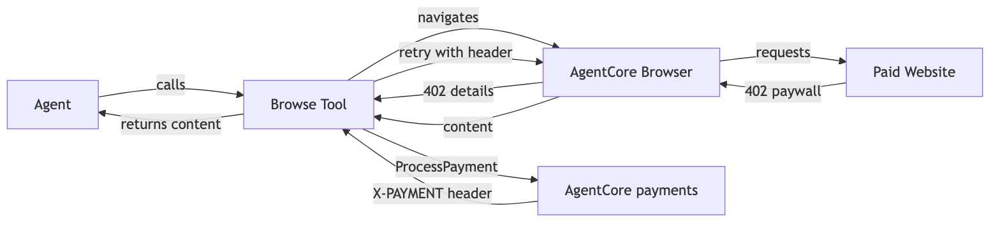
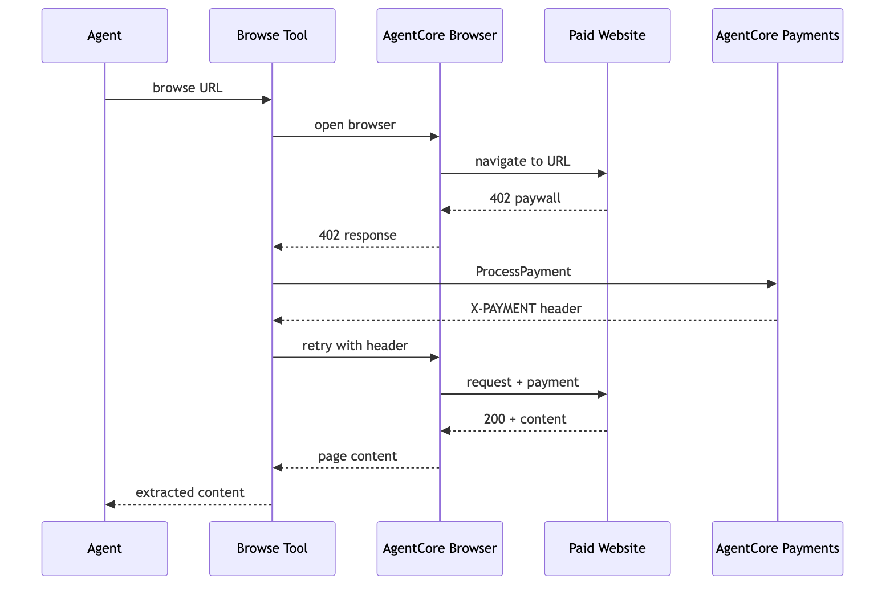
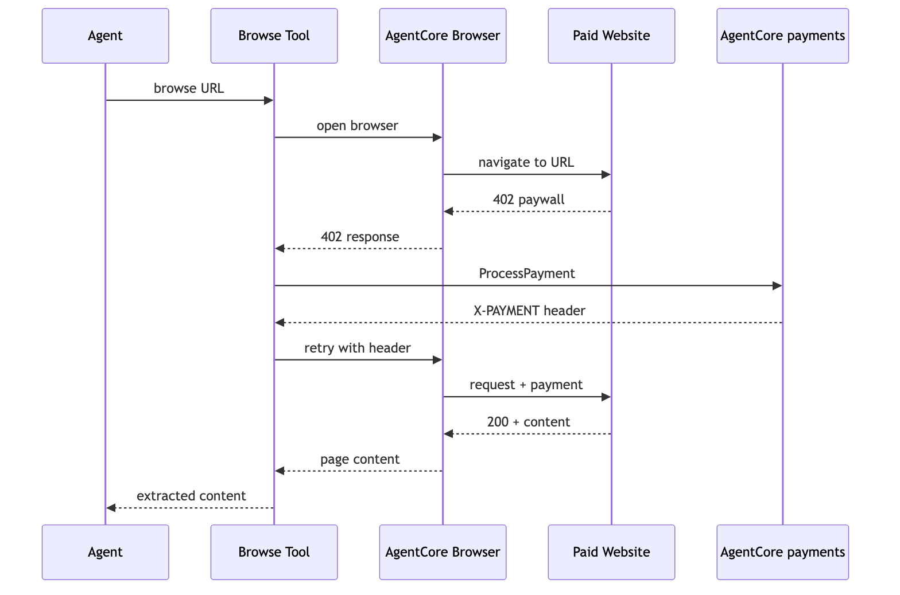

# Tutorial 05 — Strands Agent with Browser Tool Accesses Paid Content

| Information         | Details                                                                |
|:--------------------|:-----------------------------------------------------------------------|
| Tutorial type       | Task-based                                                             |
| Agent type          | Single                                                                 |
| Agentic Framework   | Strands Agents                                                         |
| LLM model           | Anthropic Claude Sonnet 4.6                                            |
| Tutorial components | AgentCore Browser, Playwright, PaymentManager, x402                    |
| SDK used            | bedrock-agentcore (BrowserClient + PaymentManager), Strands, Playwright |
| Example complexity  | Intermediate                                                           |

## Overview

In Tutorial 01, the `AgentCorePaymentsPlugin` handled x402 payments at the tool output level — working for API endpoints where the plugin can intercept and retry. For **browser-rendered content** (paywalled articles, content sites), the agent needs to detect the 402 inside the browser session, pay, and retry with proof headers — all within the same Playwright session.

This tutorial builds a custom `browse_with_payment` tool that uses:
- **AgentCore Browser** (`BrowserClient`) for managed cloud Chromium
- **Playwright** as the browser automation library (connects to AgentCore Browser via WebSocket)
- **AgentCore payments** (`PaymentManager.generate_payment_header()`) for x402 signing

> **Note:** This pattern requires an x402-enabled endpoint returning HTTP 402. A future use case sample will provide a deployable x402 paywall server for full end-to-end testing.

## Architecture







```
Strands Agent
  └── browse_with_payment tool
        │
        ├── 1. BrowserClient.start() → managed cloud Chromium
        ├── 2. Playwright connects to AgentCore Browser (WebSocket)
        ├── 3. page.goto(url) → response interceptor detects 402
        ├── 4. Extract x402 requirements from response
        ├── 5. PaymentManager.generate_payment_header() → signed proof
        ├── 6. page.route() injects proof header
        ├── 7. page.goto(url) retries → 200 + content
        └── 8. Return content to agent
```

## Two Payment Patterns Compared

| Pattern | Tool | Payment handling | Best for |
|---------|------|-----------------|----------|
| **Plugin (Tutorial 01)** | `http_request` | Plugin intercepts tool output, retries externally | API endpoints, MCP tools |
| **Browser (this tutorial)** | Custom `browse_with_payment` | Tool handles 402 internally, retries in same session | Browser-rendered content, paywalls |

Use the plugin pattern for API calls. Use the browser pattern when you need to maintain session state (cookies, auth tokens, DOM context) across the payment retry.

## Role Separation for Deployed Agents

This tutorial runs locally under your AWS credentials. When deployed to AgentCore runtime, the runtime process runs under **ProcessPaymentRole** — the tool calls `generate_payment_header()` within the budget set by the app backend. The runtime cannot create sessions, modify limits, or provision wallets.

The app backend passes all payment context (`payment_manager_arn`, `user_id`, `payment_instrument_id`, `payment_session_id`) via the invocation payload — the agent is stateless and wallet-agnostic.

To test role separation locally, pass an assumed-role session:

```python
from utils import assume_role
import boto3

# App backend creates the session
manager = PaymentManager(payment_manager_arn=ARN, region_name=REGION)
session = manager.create_payment_session(user_id=USER_ID, ...)

# Tool runs under ProcessPaymentRole
agent_session = assume_role(boto3.Session(), PROCESS_PAYMENT_ROLE_ARN, 'agent')
agent_manager = PaymentManager(payment_manager_arn=ARN, boto3_session=agent_session)
# Pass agent_manager to generate_payment_header() — restricted credentials
```

See Tutorial 02 for the full deployed implementation.

## Prerequisites

- Tutorials 00 and 01 completed (`.env` exists with payment manager, instrument)
- Wallet funded with testnet USDC
- Python 3.10+
- Playwright Chromium installed:
  ```bash
  python -m playwright install chromium
  ```

## Running the Python Scripts

```bash
pip install -r requirements.txt
python -m playwright install chromium
```

```bash
python browser_paywall_payments.py
```

## Key Concepts

**AgentCore Browser (`BrowserClient`)** — Managed cloud Chromium service. Provides a WebSocket endpoint that Playwright connects to via `connect_over_cdp()`. Handles browser lifecycle, scaling, and cleanup automatically.

**Why the payment logic is inside the tool** — The `AgentCorePaymentsPlugin` from Tutorial 01 handles 402 at the tool output level. But for browser sessions, the browser state (cookies, auth tokens, opened tabs) must persist between the initial request and the payment retry. The tool must remain in control of the browser session throughout.

**`page.route()` for header injection** — Playwright's route interception injects the payment proof header only on navigation requests. Sub-resources (images, CSS, analytics) don't receive the payment header, preventing credential leakage to third-party origins.

**`generate_payment_header()`** — Unlike the plugin's `ProcessPayment` call (which handles the full retry), `generate_payment_header()` just returns the signed header. The tool then uses Playwright to inject it and retry in the same browser session.

## Troubleshooting

### Playwright Chromium not installed

Run `python -m playwright install chromium`. This downloads the Chromium binary needed for `connect_over_cdp()`.

### BrowserClient connection timeout

AgentCore Browser requires the managed browser service to be available. Check that your AWS region supports AgentCore Browser. Verify the `REGION` in `.env` matches a supported region.

### 402 not detected (endpoint returns 200 without payment)

The target URL must return HTTP 402 with an x402 payment payload to trigger the payment flow. The Coinbase discovery endpoint used in this tutorial may return 200 — in that case `paid=False` in the result, which is expected.

### Payment proof rejected (HTTP 402 on retry)

The wallet may be unfunded or delegated signing is not configured. Verify the wallet has USDC (Tutorial 03 Section 4) and delegation is set up (Tutorial 00 Step 7b).

## Clean Up

Browser sessions expire automatically. Payment sessions expire after their configured `expiryTimeInMinutes`. No manual cleanup needed for this tutorial.

For full payment resource cleanup, run the cleanup section in Tutorial 00.

## Next Steps

- **Tutorial 06** — `../06-multi-agent-payment-orchestrator/` — Multi-agent orchestration with per-agent budgets and provider-separated wallets
- **Use case: Browser paywall** — `../../02-use-cases/pay-for-content-browser-use/` — End-to-end use case with a deployable x402 paywall server on AgentCore runtime
