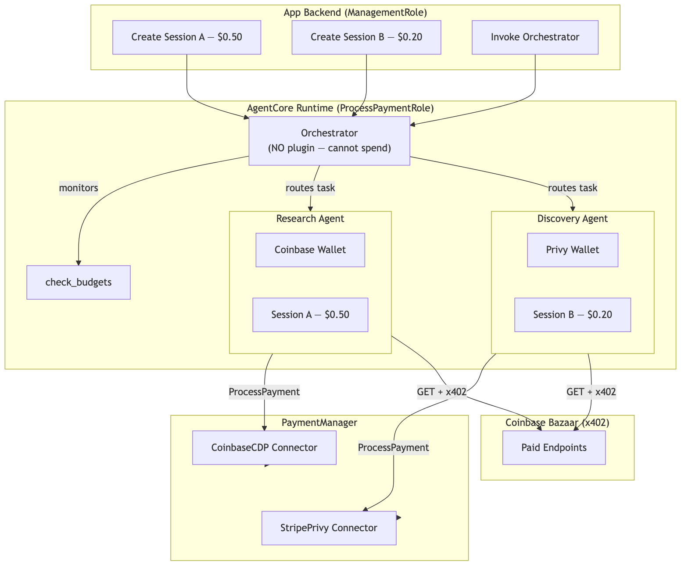
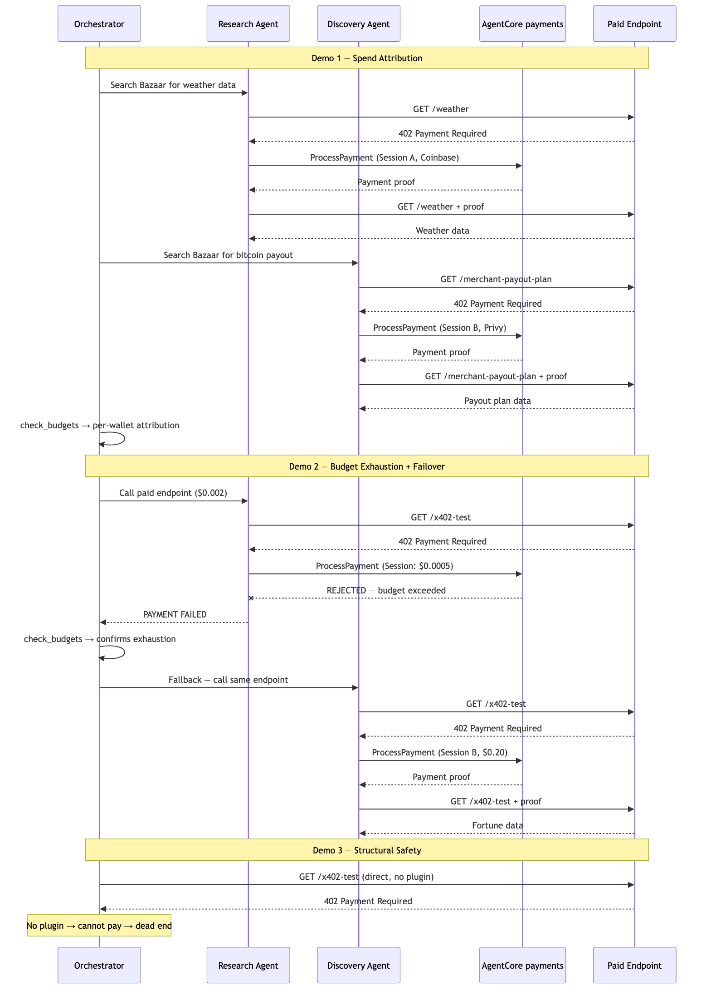

# Tutorial 06 — Multi-Agent Payment Orchestrator

| Information         | Details                                                              |
|:--------------------|:---------------------------------------------------------------------|
| Tutorial type       | Task-based, advanced                                                 |
| Agent type          | Multi-agent (orchestrator + 2 specialists)                           |
| Agentic Framework   | Strands Agents (agents-as-tools pattern)                             |
| LLM model           | Anthropic Claude Sonnet 4.6                                          |
| Tutorial components | AgentCore payments (multi-session), AgentCore runtime, AgentCore CLI |
| Example complexity  | Advanced                                                             |

## Overview

Build a multi-agent system with per-agent budgets, multi-wallet support, and full spend attribution — then demonstrate intelligent failover when a budget is exhausted.

### Three Demos

| Demo | Pattern | What it proves |
|------|---------|---------------|
| **Demo 1** | Spend Attribution | Two wallets, two budgets, full per-agent cost tracking |
| **Demo 2** | Budget Exhaustion + Failover | Orchestrator detects payment rejection, reroutes to healthy agent |
| **Demo 3** | Structural Safety | Orchestrator literally cannot spend — even with http_request |

### Key Concepts

| Concept | How it works |
|---------|-------------|
| **Multi-wallet** | One PaymentManager, two connectors (Coinbase + Privy), two instruments |
| **Per-agent budgets** | Separate sessions with independent spend limits |
| **Orchestrator decoupling** | Orchestrator has NO plugin — cannot spend, only routes |
| **Budget exhaustion + failover** | When one agent's budget is rejected, orchestrator reroutes to the other |
| **Role enforcement** | ProcessPaymentRole on runtime — deterministic code processes payments |

## Architecture





```
PaymentManager
  ├── CoinbaseCDP Connector → Research Agent (Session A, $0.50)
  └── StripePrivy Connector → Discovery Agent (Session B, $0.20)

Orchestrator
  ├── research_agent.as_tool() → Research Agent (Coinbase plugin)
  ├── discovery_agent.as_tool() → Discovery Agent (Privy plugin)
  └── check_budgets → monitors both sessions
  [NO PAYMENT PLUGIN — structural safety]
```

## Who Does What

| Who | Does What | Role |
|-----|----------|------|
| App backend | Creates sessions, allocates budgets, invokes orchestrator | ManagementRole |
| Orchestrator | Routes tasks, monitors budgets | NONE (no plugin) |
| Research Agent | Calls paid endpoints, spends from Session A | ProcessPaymentRole (Coinbase) |
| Discovery Agent | Calls paid endpoints, spends from Session B | ProcessPaymentRole (Privy) |

## Prerequisites

- Tutorial 00b (`multi_provider_setup.py`) completed — `.env` has both Coinbase + Privy instruments
- Both wallets funded with testnet USDC from [faucet.circle.com](https://faucet.circle.com/)
- Python 3.10+
- Node.js 20+ and AgentCore CLI for runtime deployment: `npm install -g @aws/agentcore`

## Running the Python Scripts

```bash
pip install -r requirements.txt
```

```bash
# Local execution — all three demos
python multi_agent_payments.py

# Start agent locally for testing
python payment_orchestrator.py
```

## CLI Commands (runtime Deployment)

```bash
# Install AgentCore CLI
npm install -g @aws/agentcore

# Create and deploy
agentcore create --name PaymentOrchestrator --defaults
cd PaymentOrchestrator
agentcore deploy -y

# Add online evaluation
agentcore add online-eval \
  --name PaymentMonitor \
  --runtime PaymentOrchestrator \
  --evaluator Builtin.GoalSuccessRate Builtin.ToolSelectionAccuracy Builtin.Helpfulness \
  --sampling-rate 100 \
  --enable-on-create
agentcore deploy -y

# Invoke
agentcore invoke '{"prompt": "Search Bazaar and call endpoints...", "user_id": "test-user-001", "research_session_id": "<ID>", "research_instrument_id": "<ID>", "discovery_session_id": "<ID>", "discovery_instrument_id": "<ID>"}'

# View traces
agentcore traces list --limit 20

# View logs
agentcore logs

# Clean up
agentcore remove all -y
```

## Online evaluation

AgentCore evaluations provides built-in evaluators that score every invocation automatically. For a payment orchestrator, the most relevant are:

| Evaluator | Level | What it checks |
|-----------|-------|---------------|
| `Builtin.GoalSuccessRate` | Session | Did the orchestrator complete both research and discovery tasks? |
| `Builtin.ToolSelectionAccuracy` | Tool | Did it route to the right specialist for each task? |
| `Builtin.Helpfulness` | Trace | Was the spend report clear and useful? |

```bash
# Add online eval with built-in evaluators — evaluate 100% of invocations
agentcore add online-eval \
  --name PaymentMonitor \
  --runtime PaymentOrchestrator \
  --evaluator Builtin.GoalSuccessRate Builtin.ToolSelectionAccuracy Builtin.Helpfulness \
  --sampling-rate 100 \
  --enable-on-create
agentcore deploy -y
```

## Optional: Route Agents Through AgentCore gateway

If you completed Tutorial 04 and have a gateway with the Coinbase Bazaar target, you can swap `http_request` for MCP tools. The agents get `search_resources` and `proxy_tool_call` — the payment infrastructure stays the same, only the tool layer changes.

```python
from datetime import timedelta
from mcp.client.streamable_http import streamablehttp_client
from strands.tools.mcp.mcp_client import MCPClient

GATEWAY_URL = os.environ['GATEWAY_URL']  # From Tutorial 04

mcp_client = MCPClient(lambda: streamablehttp_client(
    GATEWAY_URL, timeout=timedelta(seconds=120),
))
mcp_client.__enter__()
bazaar_tools = mcp_client.list_tools_sync()

# Replace http_request with MCP tools — everything else (plugin, session, wallet) stays the same
research_agent = Agent(
    model=model,
    tools=bazaar_tools,          # search_resources + proxy_tool_call
    plugins=[research_plugin],   # Same plugin, same session, same wallet
    system_prompt='...',
)
```

Both agents share the same gateway connection but have separate payment plugins with independent budgets and wallets.

## Troubleshooting

### ValueError: multi_provider config required

Run `multi_provider_setup.py` first. This creates one PaymentManager with two connectors (Coinbase + Privy) and writes `COINBASE_INSTRUMENT_ID`, `PRIVY_INSTRUMENT_ID`, `COINBASE_CONNECTOR_ID`, `PRIVY_CONNECTOR_ID` to `.env`.

### Instrument not ACTIVE

Both wallets must be funded and have delegated signing enabled before the first payment. Fund at [faucet.circle.com](https://faucet.circle.com/) — Base Sepolia for ETHEREUM. For Privy: open localhost:3000, log in as LINKED_EMAIL, choose Connect agent. For Coinbase: enable Delegated Signing in CDP Portal.

### Demo 2 failover doesn't trigger

The $0.0005 budget must be smaller than the API cost. If the Bazaar endpoint costs less than $0.0005, increase the cost by testing against a more expensive endpoint. The demo uses `https://x402-test.genesisblock.ai/api/market-news` which costs ~$0.002.

### Orchestrator pays in Demo 3

This should not happen — the orchestrator has no `AgentCorePaymentsPlugin`. If you see spend, check that `unsafe_orchestrator` was not accidentally given a plugin. The 402 response has no handler without the plugin.

## Clean Up

Sessions expire automatically. For full payment resource cleanup:

```bash
# Remove runtime deployment
cd PaymentOrchestrator && agentcore remove all -y

# Remove payment resources — uncomment cleanup in setup_agentcore_payments.py
```

## Next Steps

- **Use case: Browser paywall** — `../../02-use-cases/pay-for-content-browser-use/` — End-to-end use case deployed on AgentCore runtime with a CDK content-provider stack
